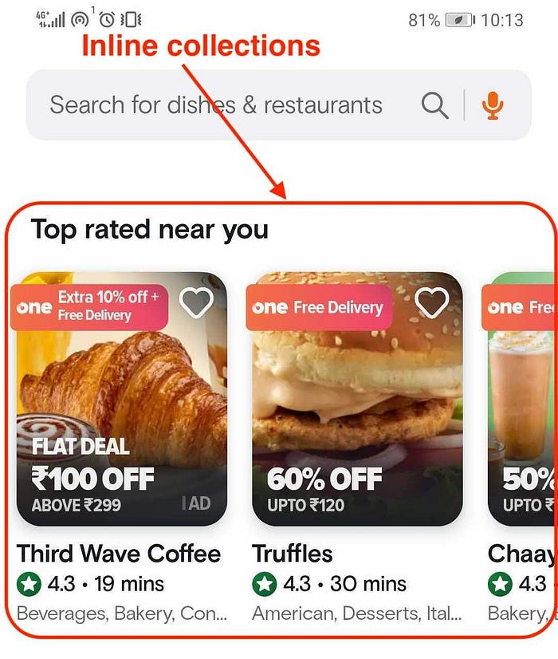
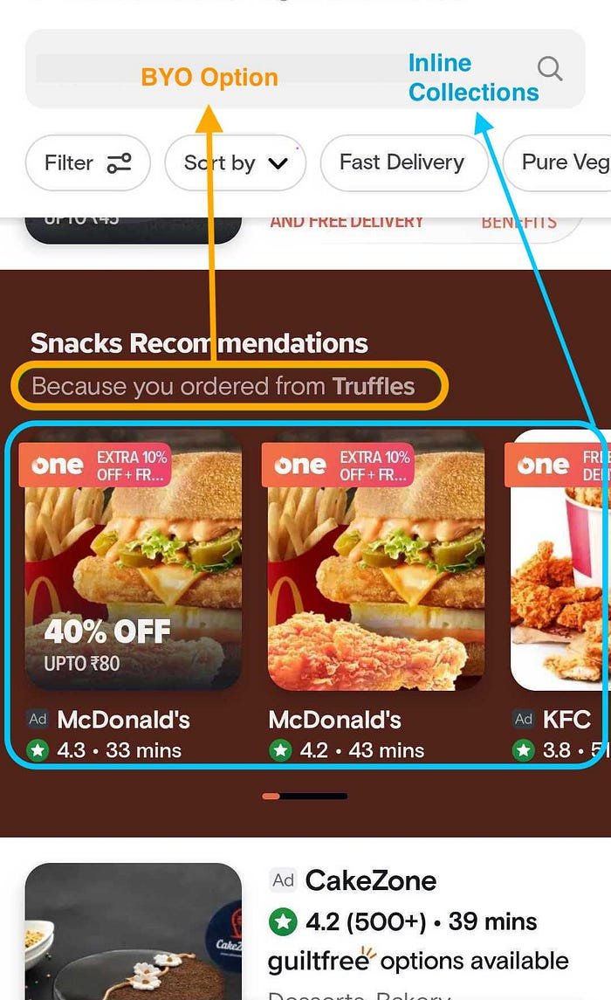
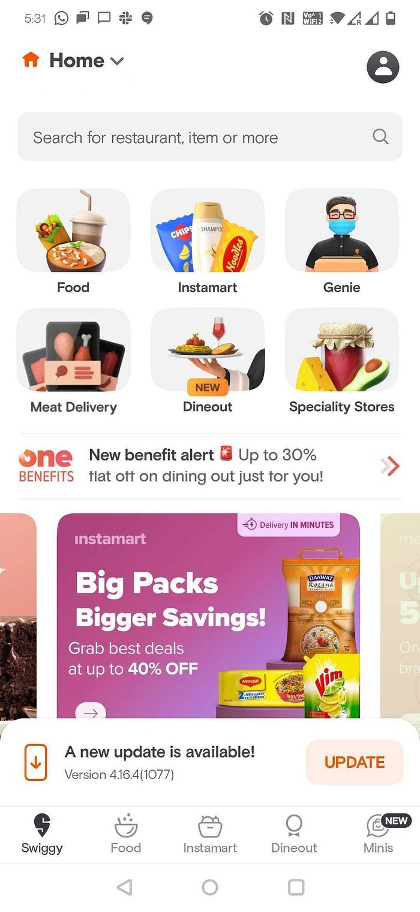

# #BehindTheBug — The Invisible Mistake: An Overlooked Backend Payload and its Impact on Ad Revenue


Welcome back to our latest blog. We hope that you have been enjoying the blogs of our **#BehindTheBug** Series in the past six months. We encourage you to share any suggestions on how we can make this blog more interactive by leaving your comments. In this article, we will discuss an incident where an ad event was missed on the front end and the impact it had on our Ads revenue over the course of a week. We will delve into the difficulties we encountered and the approaches we used to address this problem. Additionally, we will highlight the key takeaways from this incident.

It was an ordinary day for our dedicated ads analytics team, diligently monitoring the performance of our ads campaigns. However, on that particular day, an unexpected alert flashed on our business dashboard, grabbing our attention instantly. The alert revealed a significant decline in the** **[**_cost-per-click_**](https://sproutsocial.com/glossary/cost-per-click/#:~:text=Cost%20per%20click%20(CPC)%20is,media%20platforms%20and%20other%20publishers.)**_ _**(CPC) impressions on our ads, diverging from the norm we had set. Following this, the analytics team escalated the issue with the Ads team considering it as an Ads issue, however on exploring further the ads and business team found that the issue is observed in the Android App with a specific version v1075, and the issue got escalated to the Apps team.

Before we move forward, let me give you a basic overview of how the flow of events happens from customers to the backend.

> When a user interacts with the app by clicking on a restaurant or when a restaurant appears on the mobile viewport, we use an internal stack called [**Swiggylytics**](https://bytes.swiggy.com/swiggylytics-5046978965dc) to send these activities as events from the client to our Data platform’s collector endpoint. As part of these events, we also send the ad tracking id within the payloads.Once these events are received, the Ads team processes them in various ways. Certain events are directly consumed from the response and populated at the backend to present options to customers, such as “BYO (Because you ordered),” “Top Offers,” “Get it Quickly” etc. On the other hand, some events are constructed on the front end to showcase inline collections of restaurants on the Food page in the Swiggy App. This helps us not only provide the best customer experience but also helps in showing the ads of the restaurant to the users.


*Fig 1.1: Inline Collections*


*Fig 1.2: Because You Ordered (BYO) Option*

_Now It’s time to dive into the crux of the issue and examine it more closely._

The Android apps team upon receiving the communication started looking into the past deployments and found out that a release with the same version i.e. v1075 was made a week back to add a favourite icon(Heart shaped icon) so that users can mark a restaurant as a favourite on the food page. This change involved the addition of the favourite value along with the analytics events payload and this involved making changes for different widgets (“BYO,” “_Top Offers_,” “_Get it Quickly_”) on the app to introduce the new field in the event payload.

The changes made to Inline collections resulted broke the ads integration for some inline collections on the food page. Additionally, the Because You Ordered option, which relies on the same business logic class, was also impacted by these changes.

Let’s understand How did it break the inline collection?

As explained above, the payload for the inline collections is constructed by the client. The event payload before the code change looked like:

```
adTrackingId~t=<collectionTheme>~collid=<collectionId>
```

and Post the feature addition of the favourite icon, it was supposed to look like :

```
adTrackingId~t=<collectionTheme>~collid=<collectionId>~favourite=<true/false>
```

But ended up looking like this:

```
 t=<collectionTheme>~collid=<collectionId>~favourite=<true/false>
```

**But Why?**

The root cause was the call to include the adTrackingId was missed from the payload. Initially, the ad tracking id was added in the base class, but it was overridden in the child class. The Analytics team had a requirement to include the latest favourite state in the payload context. To fulfill this, the function responsible for adding the latest favourite state was overridden in the child class. However, this override caused the click source and impression source ad tracking ids from the base class not to be included, resulting in a broken ad payload population. The test cases that were created only covered the functionality of the base class and not the behavior of the child class. Additionally, the fields holding the data were not declared private because certain child implementations needed to modify the event payload.

In the case of Because You Ordered option, The analytics payload of BYO comes from the same base class and the client simply forwards to the analytics based on impression and click response.

The BYO payload for this kind of event looks like this:

```
{"adTrackingId": "cid=xxxx~p=0~eid=yyyy~wn=adsOnlyBecauseYouOrderedRestaurantWidget ", "tid":" zzzz"}
```

And after the change, it looked like:

```
adTrackingId~t=<collectionTheme>~collid=<collectionId>~favourite=<true/false>
```

We incorrectly appended the favourite value, causing a JSON format error. As a result, the analytics team was unable to process the payload. Unfortunately, we overlooked the call to consume data from the backend during this process. Both the developer and QA team tested the changes for the release, but we missed testing the ad event test cases. Instead of maintaining the JSON format, we appended the favourites value ad thereof the analytics team could not consume it.

### Mitigation

After identifying the root cause, the team examined all widgets having an ad footprint. They reviewed the code integration of these widgets and fixed any errors that were found. To confirm that the improvements were working properly, extensive end-to-end testing was carried out. On the same day, a hotfix comprising the app updates (v1077) was given to Google to expedite the distribution and foster rapid adoption. After Google approved the changes, the updated app was made available to all users the following day.

In the case of mobile updates, the adoption of the new app version usually occurs gradually. However, to accelerate the adoption process, an in-app update feature was enabled. As a result, within three days, approximately 70% of users had successfully adopted the fixed app version.


*Fig 1.3: In-app updates*

Post the release, The team initiated the Reconciliation process by leveraging clickstream events (Events of user interactions and actions taken on the application) from the ads event table, aiming to recover the lost Ads revenue. As the new version of the app gained more traction among customers, there was a collective sigh of relief among all those involved in the incident, witnessing a decline in the loss of ads revenue.

While a sigh of relief spread among the team, lingering questions arose in hindsight.

How did we overlook the essential ad events test case for such a significant change? Furthermore,

How did this issue go undetected for an entire week?

_Let’s Find it out_

**How did we overlook the essential ad events test case for such a significant change?**

**Ans**: We found that the End-to-End testing for the new feature (favourite icon) had been executed, but** the necessary changes were implemented as a hotfix to expedite the rollout & increase adoption**. In order to facilitate a faster deployment, we typically bypass the E2E regression test suite during hotfixes. Consequently, when we released the favourites icon, despite it being a new feature, it was treated as a hotfix, leading to the omission of executing ad test cases which was a major miss.

**How this issue was not detected for a week?**

**Ans:** Typically, it takes time for consumers to adopt a new app release. Moreover, for the first few days, there was no corresponding decrease in impression per session for cost per click (CPC), as this metric composed data from different app versions. Once the adoption rate of the new app versions increased, an alert was triggered due to the significant drop in CPC, which exceeded the predefined threshold value set by the team. Consequently, the team began investigating the issue.

With a comprehensive overview of the incident now presented, we can to apply the 5 why analysis technique, aiming to uncover the underlying root cause responsible for the occurrence.

### 5 Whys Analysis:

**Why 1: Why there was a drop in Ads Revenue?  
**The drop in ad revenue can be attributed to a decrease in cost per click (CPC) for both the click source and impression source. This drop occurred because incomplete payloads were pushed for a few inline collections on the food page. As a result, these events were not accurately reflected in the Ads event table.

**Why 3: Why were the events not reflected in the Ads Event table?**AdTrackingId was missing in the payload of the events being fired from the customers for restaurants in some of the inline collections and BYO restaurants on the food page.

**Why 2: Why were events not flowing with the correct payload?  
**The integration of the ad payload population broke during the release of changes for the favourite icon. There was a requirement from the Analytics team to send the latest favourite state in the payload context, for which the function was overridden and the click source and impression source ad tracking ids were not getting attached from the base class.

**Why 4: Why was this not caught during testing before the app release or the ad test suite was not executed?  
**Although we run the test suite for every release, we did not execute the ads test suite for this release. As mentioned earlier, the new feature was introduced as part of a hotfix, and we do not conduct a full regression cycle specifically for hotfixes. Moreover, the areas of impact were not clearly identified.

**Why 5: Why were the impact areas not identified?  
**The information regarding the touch points of ads within the app, including events, triggers, payload, pipeline, and UI, was not adequately documented, creating a challenge for new developers and testers to identify the areas where these touchpoints could potentially have an impact. This lack of crucial artifacts made it challenging to understand how the ads interacted with the app’s various components. Furthermore, the absence of sufficient guardrails contributed to these issues, as preventative measures were not in place to mitigate potential problems from the outset.

### Key Learnings:

- Effective checks and balances play a vital role in ensuring the smooth deployment of hot fixes. Precisely pinpointing the affected areas is of utmost importance, making it crucial to establish a framework that is both efficient and reliable for evaluating and granting approval to potential app hotfixes.
- Alerts need to be cascaded to relevant teams as soon as possible. For something which is revenue sensitive it is worth it to investigate as many systems as soon as each day of delay results in an opportunity cost.
- Tech Simplification is the key. Removing complex hierarchy in code and working with other teams to simplify how monetization events flow within the system.
- Make it a habit to consistently engage in knowledge sharing within medium to large teams, ensuring that every contributor is intuitively mindful of the broader consequences of their modifications.

---
**Tags:** Behind The Bug · Learning · Analytics · Ad Tracking · App Analytics
