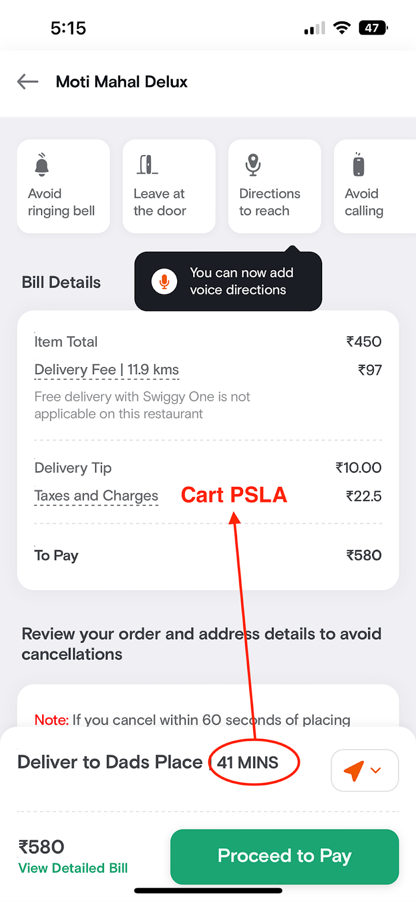
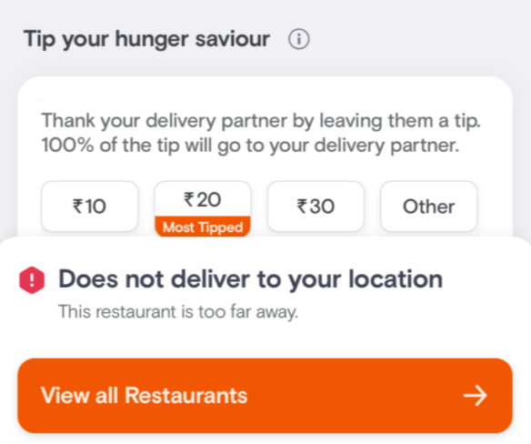

# #BehindTheBug — Cart Carnage: Unpacking the Effects of Negative PSLA Predictions on Serviceability

Before we delve into this blog, I wonder if you’ve had the chance to read our previous blog. If not, I highly recommend checking it out [here](./behindthebug-indexing-gone-wrong-6b4d682fd805.md)!

_Now, let’s circle back to the incident!_

Have you ever wondered about the methods used to predict the delivery time for your order in the fast-paced world of quick commerce? In this blog, we’ll take you behind the scenes to explore a situation where we experienced unserviceable issues in multiple cities for a prolonged period of time and the steps we took to resolve the issue and restore the service.

At the heart of every prediction made by Swiggy lies a sophisticated machine learning model, meticulously sifting through vast amounts of data to deliver the optimal solution for any given task. One such model, GBT (Gradient Boost Trees), played a crucial role in determining the cart PSLA (predictive SLA). For those unfamiliar with the term cart PSLA, the following image offers a clear explanation.

*Fig 1.1 Cart PSLA*

Here is a sneak peek at what a GBT model is :  
Gradient Boosting is a popular machine-learning technique used for both regression and classification problems. It is an ensemble method that combines multiple weak learners, often decision trees, to produce a powerful prediction model. In Gradient Boosting, the model learns iteratively by adding new decision trees that aim to correct the errors made by the previous trees. Gradient Boosted Trees can be prone to overfitting, so it’s important to use regularization techniques like early stopping, shrinkage, and subsampling to avoid this issue.

_BUT!_

As we all know, change is an inevitable part of life, the same applies to our models too. Before March 2021, PSLA was delivered via the GBT model. However, starting around June 2021, we decided to use a new artificial neural network known as a deep net model. Unlike traditional neural networks, this model has multiple hidden layers between the input and output layers. The idea behind deep neural networks is that they can learn to represent complex relationships between the input data and the output prediction by progressively building up more abstract representations in the hidden layers.

After conducting a thorough training, evaluation, and analysis, we found out that our new model outperforms the GBT model across all distance and time buckets. Therefore, we made the decision to replace it with a new and improved model that was capable of delivering superior performance and it was enabled across India. However, within about six hours of enabling the model, the serviceability team received an email, indicating a potential issue that required immediate attention.

_Sub: **Urgent** Re: Application issue || showing location unserviceable in Cart || Sri Ganganagar, stating cart was becoming unserviceable frequently in this city._

The sudden unusability of a particular city had everyone perplexed and wondering about the root cause. In order to investigate, the Data Science and Serviceability teams immediately began debugging the model data. While doing so the team received escalations from an additional 10 cities in 10 minutes, indicating that the issue was more widespread than initially thought! Figure 1.2 depicts how it shows in the applications.

*Fig 1.2 Location unserviceable*

Within an hour, on-calls started running to the war room. The team quickly retrieved the data and on analyzing the data further, We found that SLA was showing the default 999 min.

**So, What does it mean?   
**In relation to our then deep net model, (2021), it is crucial to understand that inputs falling outside the designated operational ranges can lead to outcomes that deviate from expectations. Specifically, if the distance between the customer and the restaurant exceeds 50 KM, the model may generate unacceptable output values (negative in our case). To address this scenario, we have implemented a fallback mechanism where negative outputs are assigned a default value of 999 minutes, indicating that the location is deemed unserviceable.

After spending 2 hours to pinpoint the exact root cause, it proved to be a challenging task due to the complexity of our deep neural networks and combined model architecture. Precisely attributing the negative outputs to a specific input distribution proved elusive. Our best hypothesis is that on-ground changes in input behavior were not effectively captured by our model during the training phase, which led to inaccurate negative predictions. Unfortunately, relying on our hypothesis alone did not yield a solution. However, luck was in our favor that day. We follow a best practice of regularly retraining our Deep Learning model using recent data, and just the day before, the same Deep Learning model was retrained with the on-ground data. When we encountered the issue, we were able to quickly switch back to this model, which allowed us to restore service to all cities within 3 hours of the problem arising.

**RCA Process**

Let us now apply 5 why analysis in our RCA process to get to the root cause:

**Why 1: Why did multiple cities become unserviceable?  
Ans:** We replaced our GBT model with a new Deep Net model and the new model started producing negative outputs shortly after being enabled, rendering cities unserviceable.

**Why 2: Why were the predictions from were model negative?  
Ans:** Deep neural network (DNN) models can have non-linear activations (Leaky ReLU in our case) and multiple layers, which may cause them to generate outputs outside of the operational boundaries (negative in this case). The non-linear activation functions and the complex interactions between layers allow DNN models to learn intricate patterns and relationships in the data. However, this flexibility can also lead to outputs that exceed the defined operational ranges or produce negative values. On the other hand, Gradient Boosting Trees (GBT) typically have more constrained outputs, as they work by combining a set of weak learners (decision trees) in an additive manner, which limits the output range.

**Why 3: Why we did not observe negative predictions while testing in the non-production environment?   
Ans:** Until now negative outputs were observed for inputs outside the operational range, for example, distance 50 km, item count 999, etc. This was the first occurrence of negative predictions for valid inputs. This is also the first occurrence of the DL model going stale. GBT used to go bad within operational ranges.

**Why 4: Why did we not detect the issue right after the model deployment?  
Ans:** We did not have alerts for negative predictions and assumed that such occurrences are very unlikely for valid inputs. Additionally, we missed having a fallback mechanism that would prevent the incident right away by falling back to either the DL model with old training data or GBT.

**Why 5: Why are there no fallbacks for negative predictions for valid requests?  
Ans: **Negative Predictions were considered as outlier cases and we used to make SLA 999 to make the Restaurant Unserviceable. Hence we did not have any fallback in place during the time of the incident.

### Key learnings

- It’s important to have a fallback model in place when deploying models to ensure that customers can still use the service in case the model encounters any issues. During the incident, we did not have a fallback model for -ve predictions, thus as an action item, we introduced a fallback model in case of negative predictions.
- Set up alerts in multiple areas to detect the issue as early as possible. For e.g., we could have had alerts based on the impact on cities or for the DL model giving values outside permissible limits.

When reflecting on the incident that occurred nearly two years ago, it brings us great satisfaction to acknowledge the remarkable progress made by our Data Science team over the past couple of years. They have invested tremendous effort in enhancing the PSLA and have shared their insights through numerous blog posts on [_https://bytes.swiggy.com/tagged/swiggy-data-science_](https://bytes.swiggy.com/tagged/swiggy-data-science)_._

I highly recommend exploring the following list of blogs:

- [_Where is my order? Part-1_](https://medium.com/swiggy-bytes/how-ml-powers-when-is-my-order-coming-part-i-4ef24eae70da)
- [_Where is my order? Part-2_](./how-ml-powers-when-is-my-order-coming-part-ii-eae83575e3a9.md)
- [_Assignment & Routing Optimization for Swiggy Instamart Delivery (Part-1)_](./assignment-routing-optimization-for-swiggy-instamart-delivery-part-i-2e8fb3115463.md)
- [_Assignment & Routing Optimization for Swiggy Instamart Delivery (Part-2)_](./assignment-routing-optimization-for-swiggy-instamart-delivery-part-ii-844341bd6f00.md)

---
**Tags:** Behind The Bug · Swiggy Data Science · Predictions · Deep Neural Networks · Learning
