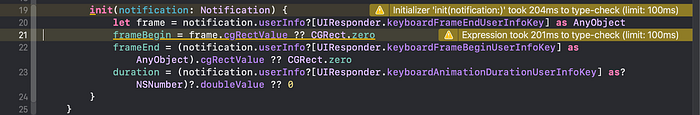
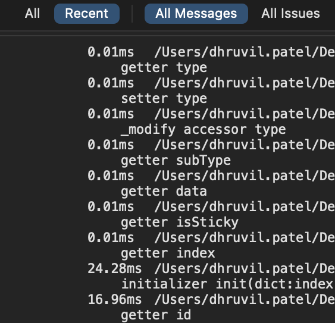
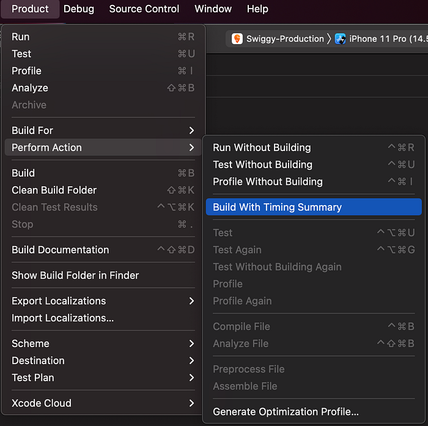
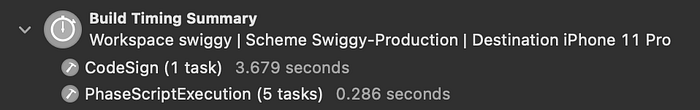
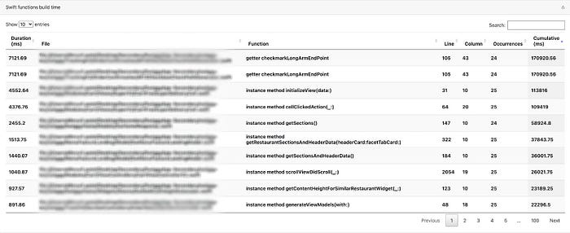
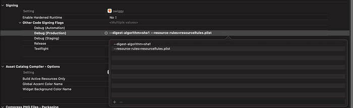

# Build Time Optimizations (Xcode)


As an iOS developer, we have encountered this problem frequently whereby, after starting the build, it takes a long time to get compiled and built which in turn tends to distract us from our focus zone and reduces productivity.


*Courtesy @ios_memes*

So we drilled down to identify and tackle the core cause.  
After doing a bunch of optimizations, we reduced our build time by **~21%**.

So let’s get started.

## How did we analyse slow build time?

### 1. Measured total build time:

of the project by executing the below-mentioned command in the terminal:

```
defaults write com.apple.dt.Xcode ShowBuildOperationDuration YES
```

post that after closing and reopening the Xcode again and building the project we’ll be able to see the total build time.


Note:

> Before measuring the build time, it’s recommended to clean the project(i.e `⌘+⌥+K`) and delete project’s derived data as well. Below is the command to do the same:`rm -rf ~/Library/Developer/Xcode/DerivedData`

### 2. Identified slow compiled code:

by adding below mentioned flags in `"Other Swift Flags”`section under Build settings:

```
-Xfrontend -warn-long-function-bodies=100
-Xfrontend -warn-long-expression-type-checking=100
```


*Slow compiled code snippet*

### Purpose of these flags:

- `warn-long-function-boides=100`: Help’s to show the functions which took more than 100ms of time to compile
- `warn-long-expression-type-checking=100`: Help’s to show the specific expression which took more than 100ms of time to compile.

Also to debug it further, we have added the below-mentioned flag under `"Other Swift Flags”`section as well:

```
-Xfrontend -debug-time-function-bodies
```

this will in turn show the list of compilation times of each function.


*Report Navigator section*

### 3. Enabled Build time summary:

This will help us provide a summary of time spent on each task, allowing us to pinpoint the exact task we need to focus in order to optimize our build time.


*Steps to trigger Build time summary*


*Build time summary report*

Note: Above shared summary is from an _incremental build_ and we can observe that without doing any changes CodeSign took a good amount of time which somehow could have been avoided. Later in the article, we have mentioned ways to optimize that.

> **Clean build:** To clean and rebuild whole project from scratch.  
> **Incremental build**: To rebuild a project after some code changes.

### 4. Third-party tool XCLogParser:

It is a log parser tool for Xcode-generated xcactivitylog and gives a lot of insights in regards to build/compilation times, warning, slowest targets etc. for every module and file in our project.

To generate the report, run the below-mentioned command in the terminal:

```
xclogparser parse --workspace <project-name>.xcworkspace --reporter html
```


*XCLogParser Report snapshot*

and with the help of this report, we jotted top functions that were taking up a lot of compilation time.


---

Now that we have analyzed the reason behind the slow build time, let’s deep dive into ways to optimize it.

## Code Optimizations guidelines:

### 1. Use “let” whenever possible:

- It is recommended to use let when no modifications are required post the initialization i.e will behave as immutable variables.

### 2. Declare classes as final if possible:

- If a class has no subclass and is **not** explicitly marked as final, the compiler has to look for subclasses in every other file which in turn adds overhead search time for the compiler.
- Also if a class is defined as final it means it can’t be inherited so it uses the direct/static dispatch method instead of dynamic dispatch.

### 3. Explicit type declaration:

- It’s best to specify the type to reduce the compiler’s work.
- Also, avoid explicitly calling `.init` because the compiler needs to spend more time determining the type of init, so it’s preferable to declare the type instead.

### 4. Extension as private access modifiers:

- It’s advisable to mark extensions as private if it’s not being accessed outside the class.
- Pro tip: If we want to group all the private functions and avoid adding private to each of the functions, we can move all those functions under private extension. All code under this extension will now become private.

### 5. Avoid shorthand enums:

- By specifically mentioning the type of case, it helped us to reduce a lot of compilation time.

### 6. Break complex expression into pieces:

- Avoid long calculations in a single line & make it less complex
- If a large amount of logic is handled in a single expression, the compiler’s effort is significantly increased.

### 7. Avoid unnecessary casting:

- For example, the values were already Double and some parentheses were redundant.

### 8. Avoid nil judgment using the nil coalescing operator:

- The compiler takes more time when solving the nil judgment using the ?? operator.
- Rather than that, we should prefer `if let` condition check provided it won’t look complex in terms of user readability.


---

## Other improvements which can be implemented:

### 1. Removal of unused code via Periphery tool

### 2. Removal of unused assets with the help of

- FengNiao tool or

- LSUnusedResources (fyi: it’s no longer maintained but worth a try)


---

## Pod’s dependency flag modification:

- Added below-mentioned flags for pods in the post-install pod script which reduced our build time further for debug builds.
- Around **~40s improvement** seen with this change.

### 1. ONLY_ACTIVE_ARCH:

- if enabled, Xcode creates a binary for the active architecture only.
- In the development stage, we build the project either on a device or a simulator. So if set to **YES** then Xcode will detect the device that is connected, and determine the architecture, and build on _just that architecture_ alone.
- Note: Release build should contain all supported architectures because one is shipped via App Store to all variety of user devices.
- So for Debug it’s set to **Yes** and for Release **No**.

### 2. SWIFT_OPTIMIZATION_LEVEL:

- The Optimization Level setting defines the way we’d like to optimize the build.
- Code optimizations result in an increase in build times because of the extra work involved in the optimization process.
- **Debug builds** should be configured with **No Optimization**(i.e `'-O'`)since we need a fast compile time. For** Release builds**, it can be set to **Optimize for Speed**.

### 3. SWIFT_COMPILATION_MODE:

- It defines how the Swift files are rebuilt within a module.
- Should set it to Incremental for Debug configuration(i.e `'singleFile'`)
- Should use the whole module for release build to rebuild all Swift source files in the module


---

## Xcode Build settings changes:

Though most of the below-mentioned build settings are by default set by Xcode but for older projects, some of these may not yet be set or may be overridden by other values so it’s always good to take a look and verify the same.

### 1. BUILD ACTIVE ARCHITECTURE ONLY

Debug: Yes  
Release: No

### 2. COMPILATION MODE

Debug: Incremental  
Release: Whole Module

### 3. OPTIMIZATION LEVEL

Debug: No Optimization [-Onone]  
Release: Optimize for Speed [-O]

### 4. DEBUG INFORMATION FORMAT (DWARF)

Debug: DWARF  
Release: DWARF with DSYM File


---

## Code Signing Changes:

Code signing was consuming much time even if there were no code changes, so we debugged and resolved it for **debug builds**

- Got incremental build reduced by **~50%** by changing the hash algorithm that code signing uses only for debug builds
- We replaced hashing algorithm with SHA-1, which is faster than the default SHA-256, by adding`--digest-algorithm=sha1` to _“Other Code Signing Flags”_ in the Xcode build settings
- Also reduced the amount of stuff we have to hash in the first place by creating empty **resourceRules.plist** file

> Resource rules are rules given in a plist, telling codesign what to sign and what not to


*Project target -> Build settings -> Other code Signing flags*

### resourceRules.plist file:

```
<?xml version="1.0" encoding="UTF-8"?>
<!DOCTYPE plist PUBLIC "-//Apple//DTD PLIST 1.0//EN" "http://www.apple.com/DTDs/PropertyList-1.0.dtd">
<plist version="1.0">
<dict>
       <key>rules</key>
       <dict>
               <key>.*</key>
               <false/>
       </dict>
</dict>
</plist>
```

Before:


*Code signing time before optimization*

After:


*Reduced code signing time after optimization*


---

## Outcome:

### Overall build time reduced by 21% 🎉


---

## Conclusion:

Longer build times slow down the development process and productivity, resulting in more waiting time. As a result, it’s necessary to revisit the Xcode build time now and then to ensure that everything is under control.

Even a few seconds of improvement does have an impact on the entire development process and saves a significant amount of dev’s precious time 😉.

> Thanks to [Agam Mahajan](https://medium.com/u/ede4f93130a7?source=post_page---user_mention--911c9c3ac8ff---------------------------------------), [Shreyas Bangera](https://medium.com/u/3440272993fe?source=post_page---user_mention--911c9c3ac8ff---------------------------------------) &[Garima Bothra](https://medium.com/u/8954ff43cd93?source=post_page---user_mention--911c9c3ac8ff---------------------------------------) for their support.

---
**Tags:** IOS · Xcode · Swiggy Engineering · Swiggy Mobile · Mobile App Development
