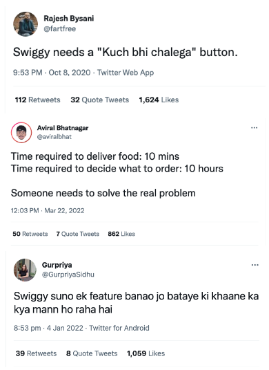
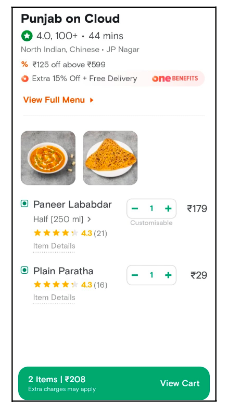
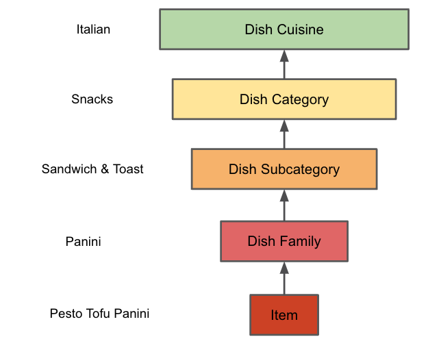
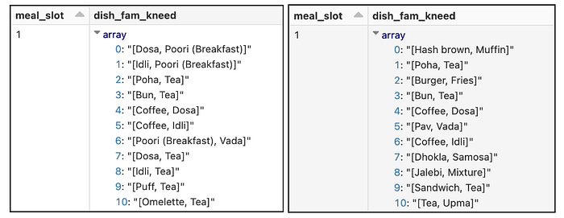
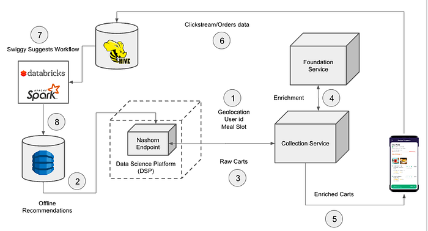
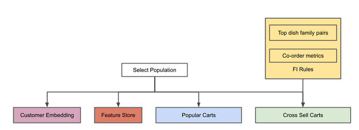
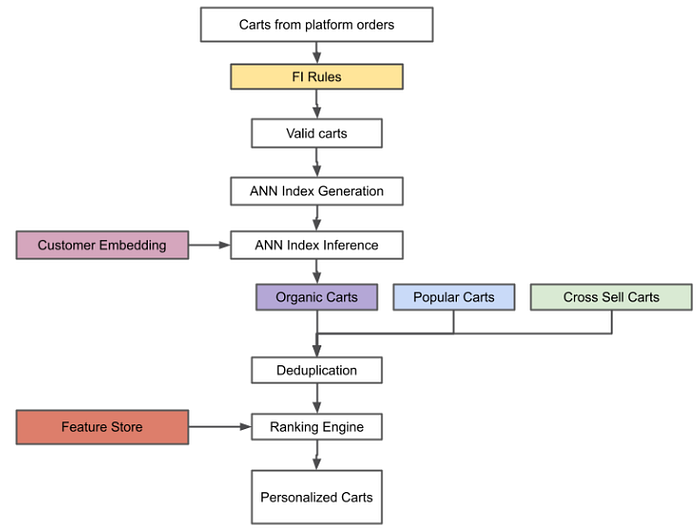

# Building a mind reader at Swiggy using Data Science

Do you sometimes feel that e-commerce apps make it harder for customers to arrive at a decision on what to shop for? Have you ever spent countless hours scrolling through restaurant menus on Swiggy only to end up ordering the same _Biryani_ a 128th time?

If so, then you’re not alone! We noticed that a significant chunk of our users tend to browse restaurant menus for a long time and not end up ordering at all.

American psychologist Barry Schwartz in his book ‘**_The Paradox of Choice — Why More Is Less_**’ talks about this dramatic explosion in choice for shoppers which paradoxically becomes a problem instead of a solution. **An obsession with choice encourages users to seek that which makes them feel worse off. Hence restricting the choice sometimes could be a way to make customers decide quickly and also have a feel good factor to the overall experience.**

This belief was further reinforced by multiple callouts from Twitterati to solve for ‘what to order?’ given the plethora of choices we offer at Swiggy.

*Twitter callouts for item level recommendations*

## Problem at hand

A typical customer journey on the app involves choosing a delivery address, deciding on the cuisine, scrolling through a seemingly infinite list of serviceable restaurants followed by more scrolling through menus of each of the restaurants. All this in the hope of arriving at a decision on what to order in a reasonable amount of time. This journey is tedious and time consuming where an abundance of options ends up benefiting neither the customer nor the platform.

In order to make life easier for choice-fatigued or time-pressed customers, we want to recommend a limited set of ‘carts’ consisting of one or more items from various restaurants which are serviceable to them at each meal-slot. If we are successful in predicting what the customer is in the mood for, then we could dramatically improve customer experience.

*An example of a candidate cart*

But wait, why hasn’t someone built a personalised item level recommendation engine already?!

## The myriad of challenges

While restaurant recommendation is like bread & butter for most food delivery platforms across the world, recommending items that are personalised to customer preferences presents an all new level of difficulty.

**Scale & subjectivity**

- The sheer number of items that we could recommend to customers is an order of magnitude higher than the number of restaurants. On top of this, if we want to recommend a combination of items, the number of possibilities i.e ∑(nCk) could blow up easily. Here ’n’ is the total number of items on a restaurant’s menu and ‘k’ is the number of items to recommend. But most of these combinations would be incoherent & unserviceable to most customers.
- Also, what constitutes a complimentary pair of items (combo) itself could be subjective in the first place. For example, a South Indian customer might consider Pulav and Dosa to be a valid breakfast combo but a North Indian customer might find it absurd.

**Item Availability**

- While a restaurant itself might be serviceable throughout the day, items on its menu could go out of stock for a certain time period. Hence we need to ensure that we remove carts which have unavailable items & have some level of redundancy in terms of the number of carts recommended to each customer.

**Freshness & seasonality**

- Our recommendations need to be fresh i.e change every day while staying relevant to customers.
- We need to take into account the seasonality aspect of food. For example customers might prefer ordering ice-cream or mango related items more during summers and hot soups & _pakoras_ during winters.

**Micro-Personalisation**

- To serve personalised recommendations, the system needs to be aware of the customer’s preferences at an item level. For instance, recommending a Chinese restaurant is much easier than recommending ‘Manchow soup’ to a customer as they might love Chinese but hate Manchow soup.
- Additionally, we also need to take extra caution about dietary preferences of customers since recommending non-vegetarian items to a pure vegetarian customer has a much worse customer experience than recommending a restaurant which serves both vegetarian and non-vegetarian options.

The points highlighted above make the task of recommending personalised carts to customers challenging to say the least.

## Design choices

In order to build a version which would address some of the challenges highlighted in the previous section, we made a bunch of design choices:

- **Two item carts:** We restrict the set of candidate carts to a maximum of two distinct items to keep the scale in check. Given that a sizable chunk of the orders on the platform are two-item orders, this constraint on the number of items within a candidate cart shrinks the target audience by a very insignificant amount.
- **Generate carts from platform orders:** One of the ways to generate two-item carts from a given restaurant is to take different combinations of items on the menu. But this could lead to an explosion of combinations and most of which would be incoherent pairs. Instead, we consider two-item carts ordered on Swiggy as the universe of candidate carts instead of taking a generative approach.
- **Identifying incoherent carts using **[**Food Intelligence**](./decoding-food-intelligence-at-swiggy-5011e21dbc86.md)** (FI): **We observed that many of the two-item carts ordered by customers form incoherent pairs. For example, a customer might order something like a curry and a starter because they have rice or roti at home. But, we would not like to recommend such a pair for a meal and instead recommend a roti and curry. Manually constructing ‘coherent’ pairs of dishes or designing rules through food connoisseurs to filter out incoherent pairs is a non-scalable proposition. Hence we need some way of generating these rules in an algorithmic fashion. Luckily for us, we have an in-house Food Intelligence engine, which provides a hierarchical classification of each item into various levels such as dish family, dish category etc. An example of such a classification is shown below. We leveraged the FI engine to generate rules for filtering incoherent carts. We discuss the details of this methodology in the next section.

*Food Intelligence Taxonomy for an item*

- **Candidate set augmentation via cross-sell model: **In order to ensure some level of familiarity among the options shown to a customer, we generate candidate carts from the customer’s own order history. For that, we use the already built cross-sell model (by [Shivam Shah](https://www.linkedin.com/in/shivam-shah-0168a823?miniProfileUrn=urn%3Ali%3Afs_miniProfile%3AACoAAATv8BIB2zODzptfhrHqNffo_h62pc6mzzM&lipi=urn%3Ali%3Apage%3Ad_flagship3_search_srp_all%3BkVo0MjnkRKqM00Od5qNgAQ%3D%3D)) which predicts complimentary items for every item on a restaurant’s menu. To give an example, if a customer has ordered ‘_Veg Biryani_’ from ‘_Behrouz’_ in the past, we create a candidate cart containing the same _Biryani_ and a cross sell recommendation, say ‘_Gulab Jamoon’_ to create a combo of _Biryani_ and _Gulab Jamoon_.
- **Addressing micro-personalisation through vegness score:** While food choices are very personal, we try to address the challenge of micro-personalisation to some extent by introducing a methodology for imputing ‘vegness score’ for customers at a mealslot & geohash level. This ensures that we don’t end up recommending non-vegetarian options to pure vegetarian customers or even recommending vegetarian items from primarily non-vegetarian outlets to such customers.

## The ‘how’ of it

Our goal is to recommend personalised carts to customers at a mealsot-geohash level while ensuring diversity and freshness.

We approached this task by breaking down the problem statement into two parts:

- Rule generation for determining valid carts
- Retrieval & Ranking of candidate carts

**Rule generation for determining valid carts**

For generating the rules for determining valid carts, we consider the dish families of items as provided by the FI engine. From historic orders, we look at top dish family pairs that are ordered on the platform at a city, mealslot level. The assumption is that food preferences remain homogenous across a city and vary drastically across cities. For example,_ Idli and coffee_ could be the top dish family pair in all of Bangalore and _Jalebi and Fafda _in Ahmedabad.

Apart from top-dish family pairs, we also look at co-order metrics and ratings of individual items that constitute a cart. We only consider those item pairs that have been ordered at least a few times in the last 3–6 months & which have a good item rating. This ensures that we don’t recommend items which are barely ordered.

*Top dish family pairs for Bangalore and Mumbai respectively for breakfast slot on a particular week*

**Retrieval of candidate carts**

We generate candidate carts for a customer from 2 sources:

1. Overall Platform orders
2. Customer’s own order history

For generating carts from platform orders, we look at all the 1 & 2 item orders placed in the last 30 Days which constitute a sizable chunk of the orders. We filter these orders using the dish family rules & co-order metrics generated previously to filter out incoherent carts.

Post this, we compute the cart embedding as a weighted sum of [item embeddings ](./find-my-food-semantic-embeddings-for-food-search-using-siamese-networks-abb55be0b639.md)constituting it, with the weights being the menu price of the item. The logic here is that if a cart contains say _Biryani _and_ _a_ Raita_, we want the cart embedding to be closer to _Biryani_ than _Raita_ since the former is the main dish and the latter is an accompaniment and the main dish tends to have a higher price.

In the second step, we construct an Approximate Nearest Neighbour (ANN) index out of the candidate cart embeddings for every geohash5.

Finally, we query the index of candidate carts with the customer embedding created as an inverse recency weighted average of the embedding of the items ordered historically by the customer to retrieve top-k nearest neighbor carts.

We build separate indexes for each geohash5 since constructing a single index would mean that during inference, many of the nearest neighbor carts being fetched for a customer might be close-by in the embedding space but far off in the geographical space (distance between customer & restaurant location), thus not being serviceable to the customer.

Post retrieval of carts from the nearest neighbor index (organic carts), we augment the set with carts generated from customer’s own order history and the set of carts popular in their location (geohash5). A union of these three sets constitutes what is fed to the ranking layer. Please refer to the diagram for Workflow 2 for more clarity.

**Ranking candidate carts**

We did not have labeled data at a cart level to begin with to be able to build a supervised model for ranking. Therefore, we decided to have a simple logic for the ranking layer. This logic sorts the carts using a score computed as a weighted average of the following features:

1. Similarity score of the cart with the customer embedding
2. Absolute difference between customer’s median GMV and that of the restaurant
3. Absolute difference between the customer’s & restaurant’s** **vegness score
4. The geographical distance between the customer and the restaurant

These factors capture the customer’s taste profile, budget & delivery time which are some of the major factors determining the willingness of the customer to order a particular cart and the weights for them are tuned manually.

**Production Setup**

In this section, we give an overview of the production set up for the personalised cart recommendation system. Figure below gives the schematic diagram which highlights the flow of calls for serving recommendations on the app during a session. The [Data Science Platform](https://bytes.swiggy.com/enabling-data-science-at-scale-at-swiggy-the-dsp-story-208c2d85faf9) (DSP) is one of the core capabilities at Swiggy which powers model deployment and real-time inference at scale. In this use case, the candidate set generation and ranking is not done via real time inference. Instead, the recommendations at a customer-geohash-mealslot level are pre-computed in offline jobs and are stored in a fast-access database such as DynamoDB. During real time serving, these cart recommendations are accessed via a Nashorn model endpoint and returned to the calling service which is then rendered via the presentation layer post enrichments such as image and price associated with the cart.

*System Design of ‘Swiggy Suggests’*

**Swiggy Suggests Workflow**

Generating personalised cart recommendations at customer-geohash-mealslot and pushing these recommendations to fast-access databases such as DynamoDB involves many intermediate steps and needs well-orchestrated cron jobs. Among these, some of the components change at slower time scale than others, allowing us to split the overall compute processes into two workflows:

**Workflow 1**

1. Generate FI rules
2. Build customer embeddings
3. Compute features to capture customer vegness and premiumness
4. Construct candidate carts from order history for each customer using cross sell

Workflow 1 can run at a lower frequency (say once a week) since the components within them don’t change on a daily basis. A weekly frequency ensures that we don’t miss out on capturing seasonal trends while ensuring that we don’t end up incurring unnecessary compute costs.

*Block diagram of Workflow 1*

**Workflow 2**

1. Fetch carts that have been ordered on the platform
2. Build Approximate Nearest neighbor (ANN) indexes using Spotify’s Annoy library
3. Fetch approximate nearest neighbor carts at a customer-geohash-meal slot level
4. Aggregate carts from customer’s own order history, those obtained from annoy index & popular carts at the customer’s geohash
5. Remove repetitive dish-family pairs & multiple carts from same restaurant (De-duplicate)
6. Rank candidate carts using various parameters from the feature store

Workflow 2 needs to run at a daily level to ensure that there’s freshness among organic carts being considered for ranking via the ANN index based retrieval.

Since Spotify’s ANNOY doesn’t have a spark implementation, we wrote our own custom wrappers to parallelize building of indexes and inferring from them. Credits to [P Shyam Sunder ](https://www.linkedin.com/in/shyam-sunder-007?miniProfileUrn=urn%3Ali%3Afs_miniProfile%3AACoAABrRH-oB9Ccf8Gf-BdWBDgc4wOZIvrbNC0s&lipi=urn%3Ali%3Apage%3Ad_flagship3_search_srp_all%3B9WhkDCIJSOm4VtPr7tnFRA%3D%3D)for helping with this.

*Block diagram of Workflow 2*

## Showtime

With the DS part of the puzzle built, coupled with some amazing frontend, backend, UX & product marketing folks, we launched an A/B test across multiple cities. The early readouts show promising signs & a significant decrease in ‘time to order’ indicating that _Swiggy Suggests_ is actually addressing the _Paradox of choice_. Here’s a quick demo video for all the unfortunate folks who weren’t part of the A/B 😛

*Demo of Swiggy Suggests*

### Improvements to the current approach

While the current version got us off the ground, there could be significant improvements made to the overall architecture:

1. Currently the recommendations for all customers are computed every day and pushed to a database. But it can happen that only a fraction of the customers see the recommendations for a particular meal slot. Hence, making the nearest neighbor fetch online followed by a real time scorer would be a natural improvement to the approach which could save significant storage and compute costs
2. We could enhance the feature store with clickstream information of a customer’s historical interaction with different carts which could help improve the ranking side of things
3. Additionally, there could be enhancements brought about for constructing customer embeddings & approximate nearest neighbor algorithm which could improve the retrieval set
4. An online learning approach which adapts to customer feedback in real time could be tried out using Multi-Armed Bandits for ranking

In the coming versions, we plan to incorporate many of these & hopefully change the way people order food forever!

Until then, Swiggy karo fir jo chahe karo 😀

**Acknowledgements**

_Credits to _[_Ashay Tamhane_](https://www.linkedin.com/in/ashaytamhane?miniProfileUrn=urn%3Ali%3Afs_miniProfile%3AACoAAALx9_MBiM1Ucam-AuhuJJB0ihSuL_IAPXQ&lipi=urn%3Ali%3Apage%3Ad_flagship3_search_srp_all%3BhX8SciNVQlyWGMCghwnt7A%3D%3D)_ & _[_Jairaj Sathyanarayana_](https://www.linkedin.com/in/jairajs?miniProfileUrn=urn%3Ali%3Afs_miniProfile%3AACoAAAARup8BfeGB_A8Ns7LF2TmnX9mB0XBk5KQ&lipi=urn%3Ali%3Apage%3Ad_flagship3_search_srp_all%3Bh%2Fd6HtB7Q3GD6oz8QuWWbQ%3D%3D)_ for providing inputs in building the ML pipeline and to _[_Shubha Shedthikere_](https://www.linkedin.com/in/shubha-shedthikere-233a3814?miniProfileUrn=urn%3Ali%3Afs_miniProfile%3AACoAAAMAIkcB93mZ53LBRsBs_Gid7t5sfTdkp6I&lipi=urn%3Ali%3Apage%3Ad_flagship3_search_srp_all%3BiYnK7kNiSjaFZURMNx4rOQ%3D%3D)_ for extensively reviewing the the blog._

---
**Tags:** Machine Learning · Data Engineering · Recommendation System · Food Delivery · Swiggy Data Science
