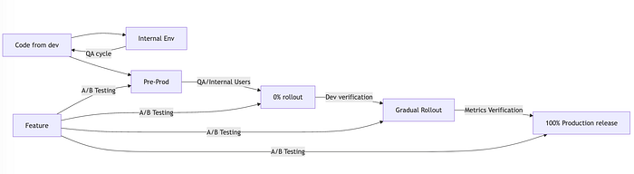
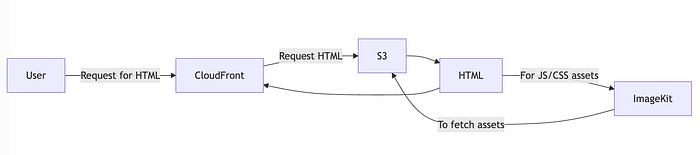
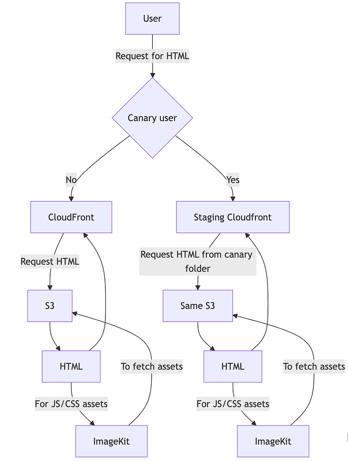
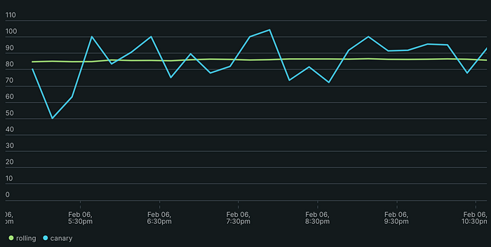
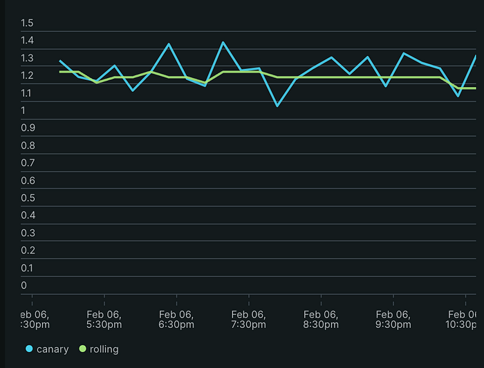

# Building a Robust Controlled Rollout System for Frontend at Scale

## Problem

When you’re operating at the scale of a company like Swiggy, implementing a **controlled rollout system** is not just a nice-to-have — it’s a mandatory cog in the machine. Without this, a single bad release could result in a breaking change reaching 100% of your end users, leading to outages, frustrated customers, and increased churn. At Swiggy, where our customers are already **Hangry**, we simply cannot afford to take that risk.

Normally, deployments work like this:

1. Write code, test it, and release it to 100% of users.
2. If it works, great! If it doesn’t, everyone suffers.

This works fine for small projects, but at Swiggy’s scale, a single bad release could break the experience for millions of users. For example, if your app crashes right when you’re hungry, that’s not just bad — it’s war! ⚔️

We needed a **controlled rollout system** to:

1. Roll-out changes slowly.
2. Catch issues early.
3. Avoid disruptions for the majority of users.

A recent example of how a non-canary rollout can break the world is the CrowdStrike outage which affected a lot of end users. If the rollout had been done through a more controlled canary rollout, the impact area would have been much smaller, and contained.

Canary helps us mitigate this by rolling out changes only to a percentage of the end-user base.

### The Sub-Requirement: Internal Validation

Before any rollout to real users, we needed a way to verify changes internally. There are several strategies to achieve this:

1. **Preproduction Environment**  
This approach allows us to run a preproduction system exclusively for internal users. Changes are tested here over time and rolled out to end users only after passing internal validation.
2. **A/B Testing for Controlled Rollouts**  
A/B testing is another common strategy, especially for UI/UX changes at the product layer. However, for full-scale deployments and backend updates, relying on A/B testing often leads to an explosion of feature flags and configuration switches — making the process difficult to manage for every release.

To address this, we needed to build a reliable system for rolling out changes gradually, catching issues early, and ensuring that only verified updates reach our users. In our frontend ecosystem, we support **two types of deployment environments** that demand different canary systems:

### 1. EC2/Kubernetes-Based Systems

These systems are responsible for serving **Server-Side Rendered (SSR)** pages and are hosted behind a reverse proxy layer (Nginx, HaProxy, etc.). This setup provides more control and flexibility, making it relatively easier to implement a canary (gradual rollout)release strategy using traditional traffic-splitting techniques at the reverse proxy level.

We can route traffic incrementally — starting with 1% of traffic, monitoring key metrics (latency, error rates, etc.), and gradually scaling up to 100% after ensuring stability.

### 2. S3 + CloudFront for Static Pages

For performance-critical static assets and pages, we serve content directly from **S3 through CloudFront**, bypassing any reverse proxy. This approach significantly reduced our **Time to First Byte (TTFB)** from 300ms to just 30ms. Given this massive performance gain, introducing an additional reverse proxy layer for controlled rollouts was out of the question.

The challenge here was to implement a controlled rollout system **without sacrificing performance**, ensuring we could still serve our static pages from the CDN while testing changes with internal users first.

In our case, **a hybrid strategy** was the best approach:

- We first test all our service changes on a pre-production system that’s a replica of production, for our internal users. This is a part of our QA test cycle before anything goes to Canary.
- We use **canary releases with step rollout for server-side systems**, enabling us to monitor and control traffic progressively. We have instances where we have done canary for 2–3 days if it’s a significant enough change. This allows better metrics and more traffic landing on Canary.
- For **static assets (HTML, JSON, etc.)**, we implemented internal validation mechanisms and selective rollouts first via a** different CloudFront**, allowing internal users to test changes before they’re visible to end users. Next, we roll it out to 10% of users for testing, and after validating the metrics, we roll it out to 100% of end users.
- We rely on experimentation for product-side changes or any groundbreaking technical experiments that we run that need metrics over a longer time interval.

## Systems in Place

### EC2/Kubernetes for Server-Side Rendered (SSR) Systems

We host our **SSR systems** on **EC2 and Kubernetes**, serving them through **Kong (**[https://konghq.com/](https://konghq.com/)**) **as the API gateway and Haproxy as the reverse proxy layer. Kong makes it straightforward to implement **percentage-based rollouts**, allowing us to split traffic and gradually increase exposure from 1% to 100% — all while monitoring key metrics like latency, error rates, and system health. This ensures that any potential issue can be caught early without affecting all users.

### AWS S3 + CloudFront for Static Pages

For static pages, we follow a different architecture altogether. We host static **HTML, JavaScript, CSS, and other frontend assets** on **AWS S3**, serving them to end users through **CloudFront** as our CDN layer. This setup not only simplifies integration but also ensures **low latency** and fast load times.

### ImageKit: An Important Layer

While S3 and CloudFront handle static pages, **ImageKit** plays a crucial role in serving all other assets — such as images, videos, and optimized media files. Initially, we thought ImageKit would just be a simple add-on to manage media, but it turned out to be **integral to achieving our goals**. By using ImageKit’s optimization capabilities and caching mechanisms, we ensured that all non-HTML assets were delivered efficiently, improving performance and enhancing the user experience across the board.

## Solution

CloudFront’s Continuous Deployment feature enables us to test changes incrementally. By creating a dedicated canary environment, we can validate new versions of our S3-powered pages with a small percentage of traffic before a full-scale release.

[https://docs.aws.amazon.com/AmazonCloudFront/latest/DeveloperGuide/continuous-deployment.html](https://docs.aws.amazon.com/AmazonCloudFront/latest/DeveloperGuide/continuous-deployment.html)

### Step-by-Step Approach

1. **Setting Up the Canary Environment**  
We create a subfolder named `/canary` in the same S3 bucket hosting the static pages. This folder contains the updated files for testing.
2. **Creating a Dedicated CloudFront Distribution**  
A separate CloudFront distribution is configured to serve the content from the `/canary` subfolder. This distribution is used for internal testing to ensure the changes work as expected.
3. **Staging the Deployment**  
Once the internal validation is complete, we configure the primary CloudFront distribution for a staged rollout using the Continuous Deployment feature. Initially, we direct 10% of the traffic to the `/canary` subfolder.
4. **Monitoring and Validation**  
During the canary stage, we monitor key metrics such as response times, error rates, and user feedback. If everything looks good, we gradually increase the traffic percentage until the new version is fully deployed.

## Serving Assets

As we scaled our platform, we encountered a critical issue — CloudFront had no way of identifying which S3 folder contained a requested asset. We manage assets in two S3 folders: the primary folder for stable assets and a `/canary` folder for newer versions. This setup allows us to test and deploy updates gradually. However, CloudFront cannot check multiple origins for a single request to decide if the file is in the `/canary` folder or in production which can lead to 404 later.

As a result, requests for assets often returned 404s because CloudFront could not determine whether to look in the primary folder or `/canary`. The missing assets created broken user experiences and high error rates.

**Enter ImageKit**  
ImageKit became a game-changer for our asset delivery. Its multi-origin support allowed us to define multiple S3 locations for the same route. This meant we could configure ImageKit to:

1. First, check for assets in the primary folder.
2. If the asset isn’t found, fall back to the `/canary` folder.

This simple yet powerful configuration effectively eliminated 404 errors. Assets that previously resulted in errors were now served seamlessly, regardless of whether they resided in the primary or `/canary` folder.

**Outcome**  
With ImageKit in place, we solved the problem without complex CloudFront rules or custom code. We now have a robust setup that allows smooth rollouts and fallback options for assets, ensuring a consistent and reliable experience for our users.

## Metrics & Analytics

Understanding user behavior is crucial for optimizing user experience, but relying solely on CloudFront access logs isn’t enough. To truly gauge the impact of changes and deployments, we needed deeper insights into how different versions of our deployments were performing in production versus in our canary deployment.

**The Solution: Swiggy’s Build Pipeline and New Relic Integration**  
Swiggy’s build pipeline plays a pivotal role in how we track performance across different environments. By using distinct environment variables during asset uploads to the `/canary` folder and production, we can monitor and compare the performance impact of the two.

These environment variables are forwarded to all our New Relic metrics, enabling us to apply a simple **FACET** clause on the backend. This allows us to easily differentiate between canary and production traffic and assess their impact separately.

**The Outcome**  
By serving traffic through the canary environment, we can efficiently monitor and evaluate the performance during every deployment. This integration with New Relic ensures we are continuously optimizing the user experience while maintaining the ability to roll back or adjust as needed, all with clear visibility into performance variations.

### Business metrics

We took a goal alongside this to think about what kind of metrics are important from a user perspective for us to monitor when doing any kind of deployment. The general approach is to just look at the API metrics at an overall level. However, given the complexity and varied requirements we serve, this just wasn’t enough. We added metrics, like how many people saw a specific element (for example, add a new card), and how many users were able to pay from a specific payment method, etc.

We generally rely on the percentage of traffic for metrics, so as to normalize the data between canary vs non-canary traffic. Otherwise, the canary metric count would be much smaller, which can lead to misses in impact analysis.

*Success percentage for order placement, canary vs production*

*API response time metrics*

## Instances where this helped us

1. **UTF-8 Header Issue in Downstream Services**  
During our canary deployments, we identified an issue with a newly introduced header that wasn’t encoded in UTF-8 format when calling downstream services. Thanks to the monitoring in place, we detected this issue with just 10% of traffic and quickly reverted the change, pushing out a fix to avoid widespread impact.
2. **Environment Variable Issue during Next.js 13 to 14 Migration**  
During a recent migration from Next.js 13 to 14, we encountered an issue where an environment variable wasn’t being set correctly. The root cause was a change in the underlying dependency of the `dotenv-expand` library. This was caught early during internal user testing, ensuring that the migration went smoothly without impacting production.
3. **ErrorBoundary Increase Due to External Library Issues**  
We also detected an increase in error rates captured by our ErrorBoundary, which was a result of build issues between CommonJS and ESM in external libraries. The canary deployment setup allowed us to catch them early and address the problem before it reached a wider user base.

## Limitations

1. A maximum of 15% of traffic can go to staging distribution from CloudFront.
2. 15% of the traffic is shared across all origins of AWS CloudFront, so if you are hosting multiple origins, you will need to run Canary for a longer duration.

## Why This Matters

By rolling out changes progressively, we:

1. Minimize user impact from bugs.
2. Catch issues that might not appear in internal testing.
3. Deploy with confidence while maintaining fast, reliable performance.

It’s not just about preventing disasters. It’s about building trust — with our users, developers, and even ourselves — knowing that we can adapt quickly and grow without breaking things.

External references:

1. [https://docs.aws.amazon.com/AmazonCloudFront/latest/DeveloperGuide/continuous-deployment.html](https://docs.aws.amazon.com/AmazonCloudFront/latest/DeveloperGuide/continuous-deployment.html)
2. [https://aws.amazon.com/s3/](https://aws.amazon.com/s3/)
3. [https://aws.amazon.com/cloudfront/](https://aws.amazon.com/cloudfront/)
4. [https://imagekit.io/](https://imagekit.io/)

Thanks to [Mukesh Kabra](https://medium.com/u/6716e26f20d1?source=post_page---user_mention--91cabeea2898---------------------------------------), [Vaibhav Gupta](https://medium.com/u/2f88e7f467dc?source=post_page---user_mention--91cabeea2898---------------------------------------), [Rahul Dhawani](https://medium.com/u/a432091a1f67?source=post_page---user_mention--91cabeea2898---------------------------------------), [Tushar Tayal](https://medium.com/u/400467f4ffab?source=post_page---user_mention--91cabeea2898---------------------------------------), and my team for helping to take this live end to end.

---
**Tags:** Programming · Software Development · Front End Development
