# Building an in-house automatic speech recognition pipeline to unlock insights from code-mixed audio

Co-authored with [Aniket Joshi](https://www.linkedin.com/in/aniket-joshi-339466134/), [Krishna Medikonda](https://www.linkedin.com/in/krishnamedikonda/), [Jairaj Sathyanarayana](https://www.linkedin.com/in/jairajs/), [Bhavuk Singhal](https://www.linkedin.com/in/bhavuk0909/) & [Pranjal Sahu](https://www.linkedin.com/in/sahupranjal/)

**Introduction**

In recent years there has been an explosion of progress in the field of automatic speech recognition (ASR). Models like Wav2Vec2.0, OpenAI’s Whisper, Nvidia’s NEMO and lighter Conformer architectures have been at the forefront of this. Outputs from ASR systems enable at-scale understanding of millions of calls leading to intelligence like sentiment analysis, extracting customer pain points, identifying lapses in processes and repeated patterns that can be used to inform new product development ideas, insights for coaching customer-service agents, fixing loopholes to name a few. While most of the above-mentioned models work out of the box for single/ code-mixed Western languages in relatively less noisy environments, there is a dearth of openly available research on adapting these for Indian languages and environments. As a company that operates in the hyperlocal convenience-delivery space in India, a majority of our calls occur in code-mixed Indian and English languages in highly noisy environments like traffic-congested roads, spoken while wearing a helmet, in the presence of a variety of background noises, varying levels of call clarity, etc. These conditions often result in conversations being muffled, mixed with cross-talk and/or ambient noise from natural (like rain, wind, kids, etc.) and artificial sources (like traffic, TV, etc.). This is especially the case with calls that occur between our delivery partners (DP) and customers. The intents behind these calls largely fall into three, equi-distributed categories– from 1) confirming directions (‘should I take a left turn on the 4th Main?’) or asking for directions to reach the exact customer location after reaching the address (say, an apartment within a large apartment complex with intricate layouts and road-use rules) to 2) asking for how to deliver the order (‘should I leave the order with the Security at Gate B of Tower 4?’) to 3) simply checking if the customer would be available at the specified address. The first two categories are somewhat unique to India (and possibly other non- Western markets) due to non-standard address and location systems. There are also scenarios where DPs potentially make calls (sometimes an excessive number of them) with an intent to defraud the customer or the platform and/or other deviations from protocols. In all of the above cases, several key customer-experience metrics are breached. As a result, it is imperative to understand what’s being said in these calls and use that information to build products and processes to improve existing systems. ASR systems are central to enabling this when dealing with millions of calls on any given day. In this blog, we describe our journey and lessons learned in building an end to end ASR system for calls with code-mixing between English and Hindi (also called Hinglish), with high levels of background noise. We start with the off-the-shelf Wav2Vec2.0 fine-tuned using an hour of our data, as the baseline with a word-error rate (WER) of 85.30%. We then describe a suite of experiments ranging from data augmentation to denoising to decoder choices to chunk sizes to language models to reduce the WER to 31.17% for a 54.13pp improvement.

**Overview of data Training data for ASR**

On a given day, well over 1.5 million calls happen on our platform between the various entities (namely, customer, DP, restaurant, customer-care (CC) agent), with a majority happening between the customer and the CC agent and the customer and the DP. Most of these calls are highly code mixed and typically happen in noisy environments such as in traffic, with the TV on, kids screaming in the background, etc. Most off- the-shelf SOTA ASR systems cannot be directly used to get the transcripts from these calls as these audio samples are recorded in a very different environment when compared to the audio data using which the SOTA models were trained. Hence, there is no single pretrained ASR which works for our use cases and thus there was a need to train our own ASR model using the audio data from our context. To do this, we required labeled data (audio files and its corresponding transcriptions) which is typically a time-consuming and cumbersome task. We engaged with an external vendor to annotate a sample of calls provided by us. The annotation was made more difficult by the fact that we store calls in mono format and it is not easy (or sometimes even impossible) to disambiguate who is speaking when. Through this process we got ∼180 hours of labeled speech data featuring calls in Hindi, English and Hinglish (Hindi and English code-mixed). The annotated dataset was divided into two subsets, ∼170 hours for training (Dataset A) and ∼5 hours for validation (Dataset B). We also procured an out-of-time, out-of-sample labeled data of ∼5 hours for testing (Dataset C) which is used to report all final metrics.

We augmented this in-house data with labeled data sourced from the AI4Bharat group at IIT Madras. We call this dataset the IITM Dataset and is ∼21 hours. This dataset differs from our domain in the sense that it is almost entirely noise-free and each call is about a single speaker (male or female) speaking in a single Indian language. There is also the nuance of a native speaker of one language speaking in another language (for example, native Hindi speaker speaking in English).

**Developing the ASR system**

**Wav2vec2.0: **Wav2vec2.0 has the potential to yield better ASR systems for many languages and domains using a relatively smaller amount of annotated data by leveraging self-supervised learning. It can be finetuned using a few hours of domain-specific, labeled data to solve a particular use case for a specific language or a set of languages. For some languages, even the un-annotated data is limited and therefore the authors pre-trained the model on multiple languages in a combined manner which resulted in better pretrained representations for low-resource languages.

**Model Architecture: **The architecture of Wav2vec 2.0 mainly consists of three parts: (1) a feature encoder that encodes raw audio input into a sequence of T latent representations. It is a multilayered CNN that takes raw audio signal as input and outputs a sequence of frames Z = z1, z2, . . . , zT where T is the number of timesteps and zi ∈ R d ., (2) a transformer-based context network that takes the output generated by the feature encoder as an input and computes a contextualized representation for each of the T units in the input as C = c1, c2, . . . , cT , where ci is the contextual representation for the i-th input (i.e., zi), and (3) a quantizer which takes Z as input and discretizes it to a finite set of representations using product quantization which helps in setting the target for self-supervised learning. The output of the quantizer is a sequence of representations Q = q1, q2, . . . , qT where qi is the quantized representation for the i-th input (i.e., zi). Schematic representation of the wave2vec2 architecture is given in Figure 1.

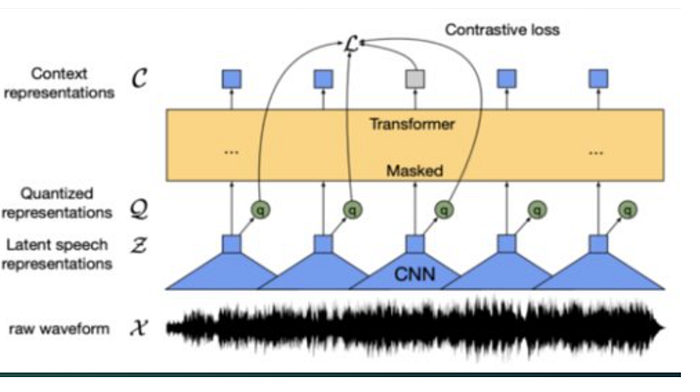

Figure 1: Architecture of wave2vec2 model (adapted from original wave2vec2 paper by Baevski et al)

We use the LARGE version of the Wav2Vec2.0 model (pretrained on ∼53K hours of unlabeled data) as the base for our experiments. This model contains 24 transformer blocks with a model dimension of 1024, inner dimension of 4096, and 16 attention heads.

**Fine-tuning Wav2vec 2.0: **To finetune the model for our use-case, we add a randomly initialized output layer on top of the transformer-based context network which maps each d dimensional output of the context network into a C dimensional output where C is the size of the vocabulary (97 in our case). The softmax function is then used to compute the distribution over the characters. The model was fine-tuned using standard CTC loss function. The training data (Dataset A + IITM Dataset) was augmented using a modified version of SpecAugment. We set the masking probability to 0.05 and LayerDrop rate to 0.1 for the augmentation strategy. We used the Adam optimizer with a learning rate of 1e-4 with regularization handled by setting the dropout rate to 0.1 for both hidden and attention units. For the other hyper-parameters, default values were retained.

Since it is generally difficult and time-consuming to get labeled training data for ASR tasks, especially for Indian languages, we wanted to achieve the best model performance with as little training data as possible. Our choice of Wav2Vec2.0 is primarily driven by this promise of needing very little training data. We experimented with different amounts of training data for fine-tuning the Wav2Vec2.0 model starting from 1 hour of data from Dataset A (this serves as our baseline). It can be seen that WER improves dramatically with increase in the amount of data in the beginning but plateaus out at around 100 hours (Table 1). As expected, the lowest WER occurs when fine-tuned on the full 170 hours of data. The experiments were conducted on GPUs ranging from g4.dn.xlarge (for 1 hour of data) to g4.dn.12xlarge (for 170 hours of data).

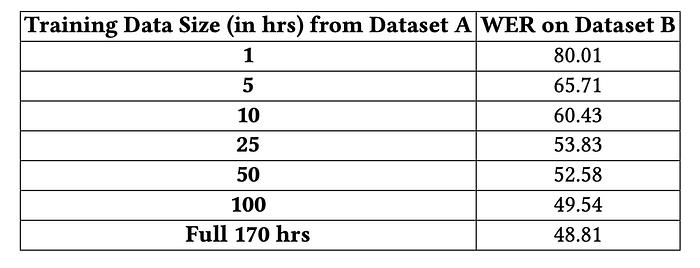

**Table 1. **Impact of training data size on WER.

While this was good progress, a WER of 48+ is not acceptable for user-facing applications. Since the WER plateaued out with in-house data, we experimented with adding out-of-domain data. We did this by the IITM Dataset to Dataset A resulting in ∼191 hours (say, Dataset D). However, this only led to a modest 0.78pp improvement in WER from 48.81 to 48.03, indicating that more data was not necessarily helping. This (i.e., inferencing the best model so far) translated to a WER of 50.84 on the holdout Dataset C.

**Conversion dictionary: **To inform our next set of experiments (using Dataset D for training), we did a sample-level error analysis to understand where the model was failing and what kind of words were being deleted or substituted. For example, were the words being deleted really important ones or could we afford to skip them without loss of interpretability? Or were the substituted words primarily of a particular type? We discovered that most of the substituted / deleted words were fairly short but commonly occurring Hindi words like‘nahi’(नही),‘hai’(ह),‘aap’(आप),‘toh’(तो),etc. Additionally,a lot of the substitution was also due to the way we were converting the code-mixed output from the ASR into the English transcript (in Latin script). For example, our code converted the Hindi word नहीं to ‘nahin’, whereas in the ground- truth annotations it was written as ‘nahi’. This is a common issue when phonetic Indian languages are transliterated in English and does not really constitute an error in the real-world sense.

We solved this by introducing a dictionary we call the conversion dictionary (see Table 2 below) that maps the most frequently occurring variants (and hence the errors) of Hindi words to their correctly-assigned (as in ground-truth compliant) spellings. Applying this dictionary to remove the spelling ‘mistakes’ helped improve the WER from 48.03 to 42.22. This translated to a WER of 41.95 on the holdout Dataset C.

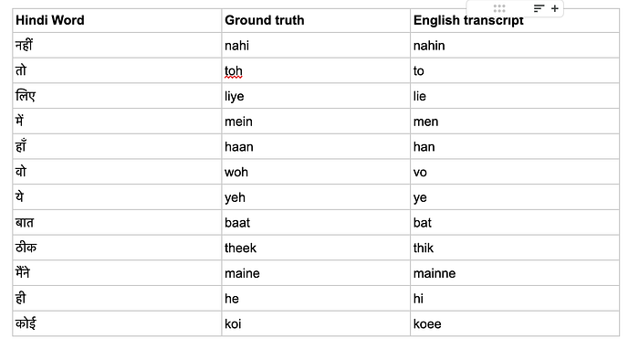

**Table 2. **Samples from conversion dictionary to map english transcripts to their ground truth

**Training with less noisy data: **As mentioned in the previous sections, our call data is fairly noisy and we observed that the model was not able to transcribe such calls well. This led us to experiment with denoising using a variety of off-the-shelf libraries like _Facebook Denoiser, Noise Reduce, Speech Enhancement, DLTN and NSNet2_. While we qualitatively observed that Facebook Denoiser achieved better noise reduction, it did not translate to improvement in WER. Upon investigation we found that while the denoiser was able to fully remove background noise, since our data is mono-aural, the amplitude was being compressed for one of the speakers while data was being lost for the other speaker(s). As a result, the model was not able to retrieve all of the words being spoken in a call resulting in WER loss. Figure 2 shows the impact of denoising on a sample of speech data. The recordings are mono-aural where the data of both speakers are captured in a single channel. It can be seen from the denoised plot below that although denoiser removed a lot of ‘noise’, data from the speaker is also removed (visualized a reduction in the red hotspots from the spectrogram in the bottom right). This is typically the case when speaker 1 who is the delivery agent is speaking in a mostly noisy environment (like road traffic), whereas the second speaker (customer) is usually speaker from his/her home where the ambient noise is a lot quieter than that for the delivery agent. Adding the denoiser results in removal of some segments of speech data for the second speaker in addition to removal of background noise. We propose developing a diarization model as a future direction and implement denoising in each channel separately.

**Original time series and spectrogram**

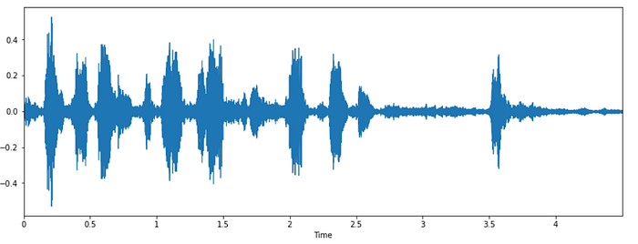

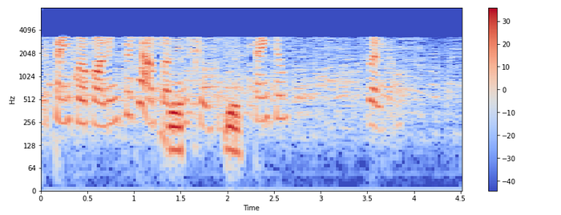

**De-noised time series and spectrogram**

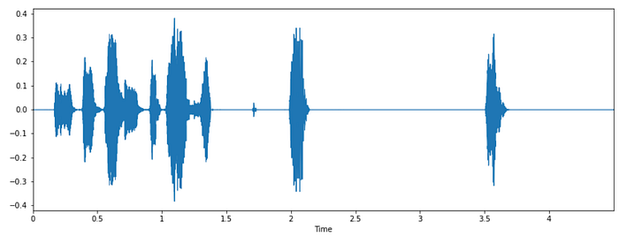

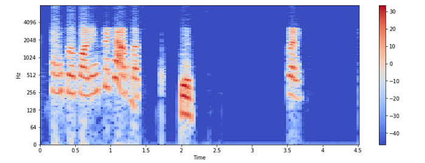

**Figure 2:** Results depicting the impact of denoising on speech data

Since denoising was too important to be abandoned, we experimented with an alternative method to obtain less noisy data. We did this by inferencing the best model so far (the one with 42.22 WER) on Dataset A and computing the WER for each call in this training set. We subsetted this data into all calls with a WER of 40 or less (an empirical threshold given the performance thus far) resulting in a dataset of 134 hours (say, Dataset A’). We appended the IITM Dataset (21 hours) to Dataset A’ to construct a new training set of 155 hours. We call this Dataset D’ and it was used for all subsequent experiments. Repeating the full cycle of train and test on this dataset resulted in WER reducing from 42.22 to 41.85. Note that this does not constitute peeking because the holdout set Dataset C is untouched and translated to a WER of 41.47 on it.

**Decoding: **It is empirically understood that the choice of decoder could have a bearing on the WER. Following this track, we experimented with using the PyCTC decoder instead of the default Wav2vec2.0 decoder. After iterations we found the beam width of 100 to be optimal while retaining default values for all other hyperparameters of this decoder. This experiment gave us roughly 1pp improvement in WER bringing it down from 41.85 to 40.89. This translated to a WER of 40.53 on the holdout Dataset C.

**Inference-chunk size: **The experiments described so far were with a chunk size of 100,000 which corresponds to about 6.2 seconds of audio given our sampling rate of 16KHz. However since the real world datasets could have audio clips of longer (or any) duration, we hypothesized that the chunk size of input data could impact the WER. We experimented with dividing the audio into different chunk lengths before passing it through the model. The transcripts generated from all of these chunks were concatenated to get the final transcript.

We observed that increasing chunk size lowers the WER and the model generates better transcripts with lesser spelling mistakes and word joins. For example, doubling the chunk size to 200,000 with no other changes improved the WER to 36.9 from 40.89. The gain was maximal at a chunk size of 900,000 yielding a WER of 33.94 as shown in Fig 3. Beyond this, the results plateaued and the ROI was not justified in terms of increased computing cost. Table 3 shows a comparison of predictions (on Dataset B) made by models with 100,000 and 900,000 chunk sizes. The results clearly show that using a bigger chunk size helped the model to predict more accurately. Using the ‘winning’ chunk size of 900,000 translated to a WER of 35.57 on the holdout Dataset C.

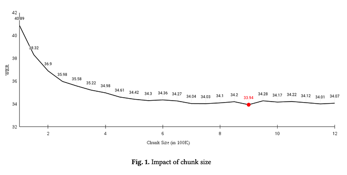

**Fig. 3. **Impact of chunk size

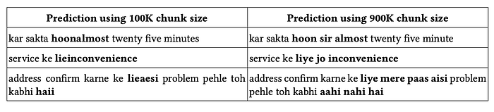

**Table 3. **Impact of chunk size on quality of predictions

**Language model (LM): **In this experiment, instead of directly decoding the output using the PyCTC-based decoder using the maximum logit at each timestamp, we use a beam search-based decoding combined with an LM. In this way, we take the probabilities of all possible characters into account and apply a beam search while also leveraging the probabilities of next characters in the sequence as emitted by an n-gram based LM. We chose an n-gram based LM over the transformer based model due to significantly lower computational costs (the n-gram based LM queries a lookup table for retrieving the next word given the previous (n-1) words whereas a transformer based LM would require a full forward pass to get the next word probabilities).

We chose KenLM library for building our n-gram based language model for its speed, efficiency, and simplicity. We experimented with multiple values of n and observed that the 3-gram based LM performed the best (on Dataset B), moving the WER from 33.94 to 30.54. This translated to a WER of 31.5 on the holdout Dataset C.

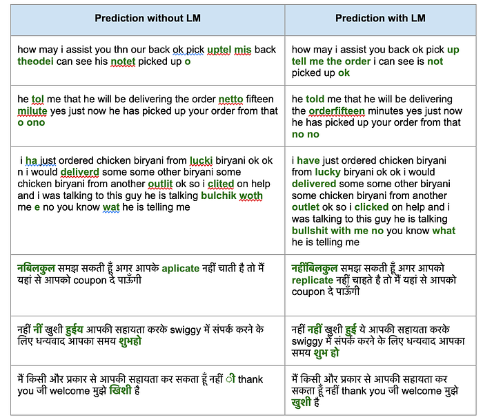

**Table 4. **Impact of LM on quality of predictions

A sample of transcripts predicted with and without the above LM is shown in Table 4. We can see that the LM is able to correct spelling mistakes which most likely happened due to the background noise suppressing the acoustic input.

**Probabilistic splitting: **This final experiment was motivated by the observation that many of the words were being incorrectly joined while transcribing. For example, ‘biryaniokay’, ‘arrivedat’ etc. We handled these by Introducing Heuristics Like 1) splitting the word at the junction of the Hindi and English characters, 2) probabilistic splitting where we find the correct split by finding the subword with maximal occurrence in the training data. Applying these post-processing helped reduce WER from 30.54 to 29.85. This translated to a WER of 31.17 on the holdout Dataset C. Table 5 below shows a sample of results obtained from probabilistic splitting.

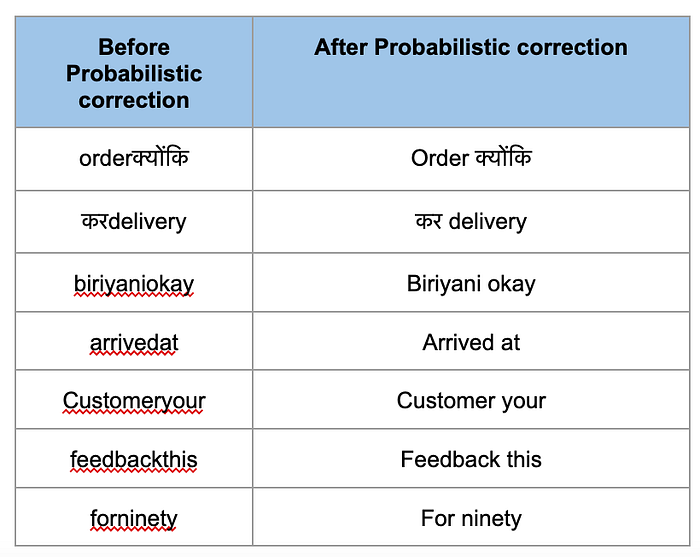

**Table 5. **Impact of probabilistic splitting

To summarize, our experiments improved the WER from an initial 80+ to less than 30 by systematically hypothesizing and analyzing the data and the outputs from each step of the ASR process. A summary of the progressive improvement made in WER is given in Table 6.

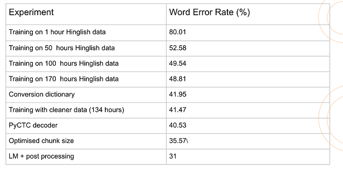

**Table 6.** Iterative experiments to improve ASR word error rate

**Final Inferencing flow for ASR**

The final inference flow after all the experiments is shown in Figure 4. Audio is given as an input to the best model. The emissions from the last layer are decoded by a word-level 3-gram KenLM language model (trained on our text data) along with the PyCTC decoder with a beam width of 100. The outputs are post-processed via a conversion dictionary and probabilistic-splitting heuristics to produce the final transcripts.

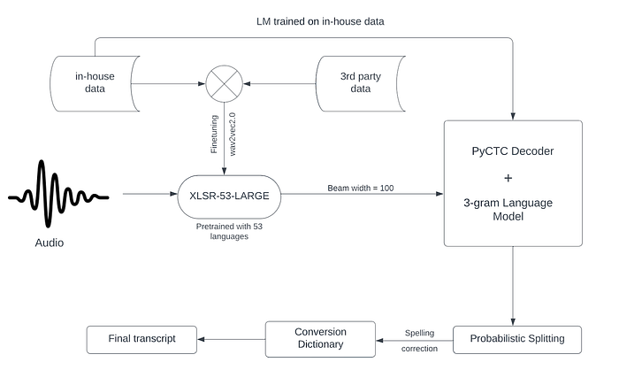

**Fig. 4. **The ASR pipeline

Having obtained reasonably-accurate transcription of calls, the next steps are to extract useful intelligence from this textual data.

**Evaluation of use cases for ASR:**

Word error rate of 30% (or accuracy of 70%) was a good enough metric to stop further improvement of the model and instead focus on potential use cases of ASR within Swiggy. We wanted to see whether the transcripts generated from ASR had enough information to build use cases. Several calls were sampled from the corpus of calls between delivery partner and the customer while the partner is out for delivery of the order. Table 7 gives a sampling of 3 separate calls and their word error rates, where the agent is potentially having difficulty reaching the customer location either due to inaccuracies in the location selected by the customer and/or due to insufficient details provided in the address text. The ASR generated transcripts are color coded to indicate the degree of accuracy of the transcripts with respect to the ground truth transcripts.The highlighted text in these transcripts where the DP uses words like ‘galat ghar’, ‘address change”,”address confirm”,”location nahin” etc indicates the intent behind these calls.

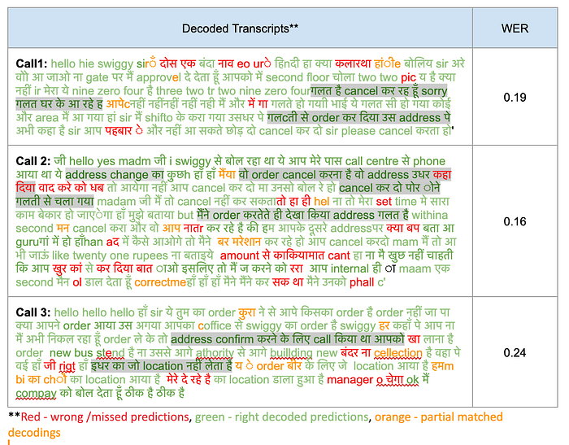

**Table 7:** Decoded transcripts and their corresponding word error rates where the delivery agent is calling the customer regarding clarity on customer address/location.

Another interesting scenario is depicted in Table 8, where the DP calls the customer with a specific intent to commit fraud (as confirmed by Swiggy’s risk management team). Two separate calls are highlighted where several keywords like cancel, refund, bike problem, phone number etc are mentioned. There are strong checks within Swiggy to scan these calls and take action on the abusive DP’s and ensure that such scenarios don’t repeat. These results have given us confidence to continue to develop use case specific models built on top of the ASR generated transcripts.

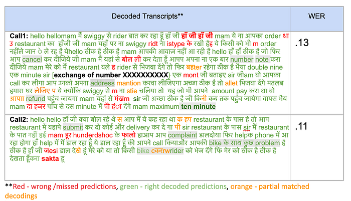

**Table 8:** Decoded transcripts and their corresponding word error rates where the delivery agent is demonstrating intent to do fraud.

In the part 2 of the blog we will be deep diving on inaccurate address/location use case (highlighted in Table 7) from location intelligence charter at Swiggy, where we used the ASR model and built an insight generation pipeline to identify and act on the intents generated from calls between delivery agent and customer. Stay Tuned.

**Key References**

1. Ai4bharat group. [https://ai4bharat.org/](https://ai4bharat.org/)
2. Alexei Baevski, Yuhao Zhou, Abdelrahman Mohamed, and Michael Auli. wav2vec 2.0: A framework for self-supervised learning of speech representations. _Advances in Neural Information Processing Systems_, 33:12449–12460,2020.
3. Alexandre Défossez, Nicolas Usunier, Léon Bottou, and Francis Bach. Music source separation in the waveform domain. _arXiv preprint arXiv:1911.13254_, 2019.
4. Kenneth Heafield. Kenlm. [https://github.com/kpu/kenlm,](https://github.com/kpu/kenlm,) 2021.
5. Oleksii Kuchaiev, Jason Li, Huyen Nguyen, Oleksii Hrinchuk, Ryan Leary, Boris Ginsburg, Samuel Kriman, Stanislav Beliaev, Vitaly Lavrukhin, Jack Cook, et al. Nemo: a toolkit for building ai applications using neural modules. _arXiv preprint arXiv:1909.09577_, 2019.
6. Kensho Technologies. Pyctc decoder. [https://github.com/kensho-technologies/pyctcdecode,](https://github.com/kensho-technologies/pyctcdecode,) 2021.
7. Zhengkun Tian, Jiangyan Yi, Ye Bai, Jianhua Tao, Shuai Zhang, and Zhengqi Wen. Synchronous transformers for end-to-end speech recognition. In _ICASSP 2020–2020 IEEE International Conference on Acoustics, Speech and Signal Processing (ICASSP)_, pages 7884–7888. IEEE, 2020.
8. Yongqiang Wang, Abdelrahman Mohamed, Due Le, Chunxi Liu, Alex Xiao, Jay Mahadeokar, Hongzhao Huang, Andros Tjandra, Xiaohui Zhang, Frank Zhang, et al. Transformer-based acoustic modeling for hybrid speech recognition. In _ICASSP 2020–2020 IEEE International Conference on Acoustics, Speech and Signal Processing (ICASSP)_, pages 6874–6878. IEEE, 2020.

---
**Tags:** Speech Recognition Ai · Wave2vec2 · Denoising · Language Model · Swiggy Data Science
