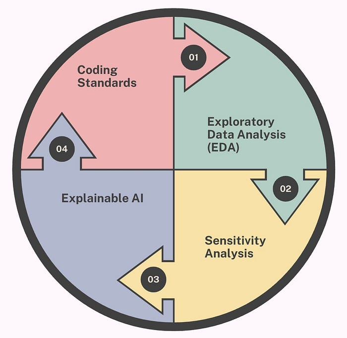
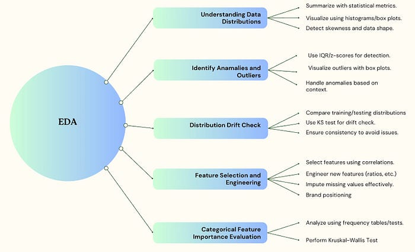
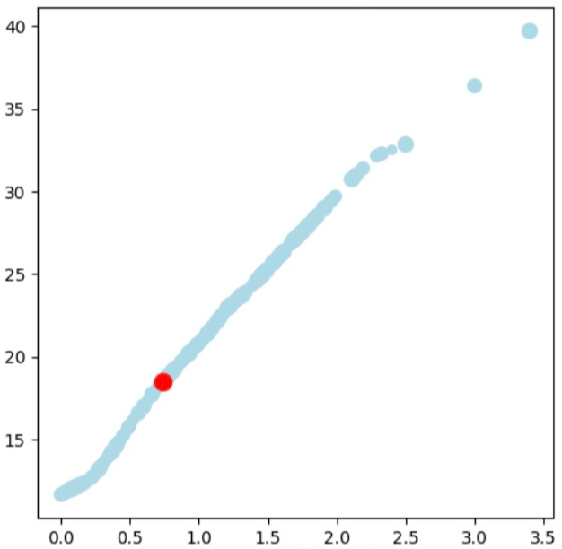
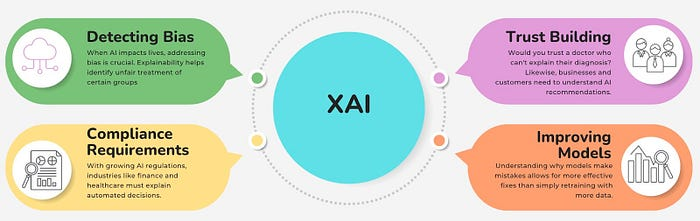
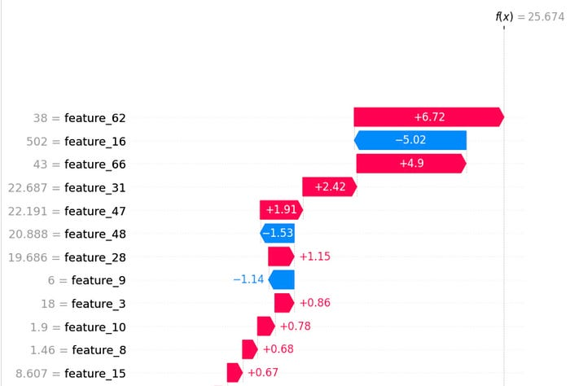

# Building Rock-Solid ML Systems

_Co-Authored with _[_Prathamesh Agarwal_](https://medium.com/@prathamesh.agarwal)_ and special thanks to _[_Soumyajyoti Banerjee_](https://medium.com/@banerjee.soumyajyoti4)_ and _[_Sunil Rathee_](https://medium.com/u/7eb9236fe3b9)



## Introduction

In the fast-paced world of food delivery, machine learning (ML) is the backbone that powers Swiggy’s ability to provide seamless and efficient service to millions of customers. From predicting the estimated time of arrival (ETA) of your order to recommending groceries on Instamart, ML models are integral to our operations. Ensuring the accuracy and reliability of these models is not just a technical challenge but a business imperative. This blog dives into the best practices that underpin Swiggy’s ML operational excellence.

**Key Areas of ML Operational Excellence**

- **Exploratory Data Analysis (EDA)**: We explore how Swiggy uses EDA to understand data distributions, identify anomalies, and check for drift. Feature selection and engineering are also covered, emphasizing the importance of evaluating categorical features and effective data visualization.
- **Sensitivity Analysis**: Sensitivity analysis is highlighted as a method to assess how input variations affect model predictions, ensuring robust performance in production. We discuss testing model robustness, fine-tuning parameters, and setting operating ranges for features.
- **Explainable AI**: Explainable AI addresses the “black box” problem by making models understandable. We share how tools like SHAP provide transparency and build trust in AI decisions.
- **Coding Standards**: The importance of coding standards, best practices, and documentation to maintain high-quality ML systems is explored.

Now, let’s explore these four critical practices and how they help Swiggy’s business and product stakeholders make informed decisions, mitigate risks, and deliver exceptional customer experiences through more reliable and transparent ML systems.

## Exploratory Data Analysis (EDA)



Exploratory Data Analysis (EDA) forms the cornerstone of Swiggy’s ML operational excellence, beginning with a deep understanding of our data’s fundamental properties. By examining data distributions through statistical techniques and visualizations, our data scientists identify natural patterns and potential anomalies that could affect model performance downstream.

This distribution analysis naturally leads us to the critical task of anomaly detection. At Swiggy, we’ve refined our approach to identifying outliers by implementing complementary methods:

- Z-scores (Z = (X — μ) / σ): Helps us flag values beyond ±3 standard deviations in normally distributed data
- Adjusted Z-scores (M_i = 0.6745 * (X_i — X̃) / MAD): We found this method reduces false positives by 37% in our skewed datasets where traditional z-scores fall short
- Visual techniques: Box plots and other visualizations provide additional context to our statistical findings

Once we’ve cleaned our data of anomalies, we must ensure its stability across training and testing environments. This is where our distribution drift checks become essential. The Kolmogorov-Smirnov (KS) test allows us to quantify distribution differences:

- The KS test measures maximum distance between cumulative distributions (D = sup|F₁(x) — F₂(x)|)
- We calculate KS-statistic and p-value for all model features
- Features with KS-statistic > 0.1 are flagged as drifted and removed when evaluation performance may not reflect test set performance

With clean, stable data in hand, we progress to feature selection and engineering. Our correlation analyses reveal interdependencies that guide the creation of new features, enhancing model accuracy while reducing noise. For categorical features specifically, we employ the Kruskal-Wallis test:

- This non-parametric method determines if samples from different groups have equal distributions
- Mathematically expressed as: H = [12/(N(N+1))] × Σ[R_i²/n_i] — 3(N+1)
- Helps us assess whether categorical features (like restaurant_id or city_id) significantly impact target variables

### Common Pitfalls and How to Avoid Them

Even experienced data scientists can fall into traps during EDA. One common mistake is confirmation bias — it is the tendency to search for, interpret, and recall information that confirms our preexisting beliefs while ignoring contradictory evidence. This common analytical pitfall leads to skewed conclusions and flawed decision-making processes. At Swiggy, we approach each analysis with an open mind, letting the data challenge our assumptions.

Another pitfall is analysis paralysis — getting so caught up in exploring the data that you never move to action. We set clear objectives for our EDA and timelines for moving to the next step.

### Bringing It All Together

EDA is both science and art — the science of statistical methods and the art of asking the right questions. By combining rigorous analysis with creative thinking, we turn raw data into valuable insights that drive our business forward.

Remember, the goal of EDA isn’t just to understand your data — it’s to understand your business through your data. When done right, it’s like having a conversation with your data, where each question leads to new discoveries and better decisions.

## Sensitivity Analysis

Sensitivity analysis is a systematic approach to evaluate how variations in input features affect model predictions and outcomes. By methodically altering input values while observing corresponding changes in results, it identifies which features have the greatest influence on model behavior. This technique helps establish effective operating ranges for features, assess model robustness, and implement appropriate guardrails in production environments to manage outliers.

### Identifying Operating Ranges for Features

One of the most practical applications of sensitivity analysis is finding the effective operating range for each feature. Think of this as discovering the “safe zone” where our model performs reliably. When we identify these boundaries, we can implement value capping — essentially placing guardrails on our data.

For example, if our delivery time prediction model starts behaving erratically when restaurant preparation times exceed 60 minutes (an unusual outlier), we can cap this value at 60 minutes in our production system. This simple technique prevents extreme values from causing wild predictions while maintaining model accuracy for the vast majority of normal cases.

By systematically testing how our model reacts to different feature values, we can:

- Identify thresholds where feature influence becomes unpredictable
- Create reasonable minimum and maximum boundaries for each feature
- Implement these caps in our preprocessing pipeline

This approach is particularly valuable in production environments where real-world data often contains unexpected outliers that weren’t present in training data.

### The “What-If” Game: Making Sensitivity Analysis Tangible

At its core, sensitivity analysis is like playing a sophisticated “what-if” game with your model. What if the distance to deliver doubles? What if order volume suddenly spikes? What if the average preparation time changes?

We quantify these effects using techniques ranging from simple one-at-a-time analysis (changing one variable while holding others constant) to more complex approaches like Sobol indices for measuring interaction effects between features.

The insights gained often surprise even experienced data scientists. Features we assumed were critical sometimes turn out to have minimal impact, while seemingly minor variables can dramatically affect predictions under certain conditions.

### Local vs. Global Sensitivity Analysis

We conduct two types of sensitivity analysis: Local sensitivity examines how small changes affect predictions in specific cases. This helps us understand individual predictions — particularly useful when explaining model decisions. Global sensitivity looks at feature importance across the entire input space. This broader view helps us understand overall model behavior and identify features that deserve special attention in preprocessing and monitoring.



**Sensitivity Analysis for Feature Impact: **This plot shows how variations in _stress indicator_ affect model predictions. As the _stress indicator_ increases, the model’s predicted time also rises, indicating a positive correlation. This suggests that _stress indicator_ plays a crucial role in influencing prediction outcomes. Identifying such patterns helps in setting operational boundaries, fine-tuning models, and ensuring robust decision-making in real-world scenarios.

### Implementing Sensitivity Boundaries in Production

Converting sensitivity insights into production safeguards requires collaboration between data scientists and engineers. Here’s our typical workflow:

1. Data scientists identify safe operating ranges for key features
2. These ranges are documented and reviewed by subject matter experts
3. Engineers implement preprocessing steps that apply these boundaries
4. Monitoring systems flag when incoming data frequently hits these boundaries, suggesting either a data quality issue or a need to revisit our model

This systematic approach ensures our models remain stable even when facing the messiness of real-world data, delivering consistent results our business can rely on.

### The Balance Between Protection and Information Loss

When capping feature values, we carefully balance protection against information loss. Too-aggressive capping might shield the model from outliers but could discard valuable information about legitimate extreme cases.

We typically validate our capping strategies by comparing model performance with different threshold values, finding the sweet spot where the model remains robust without unnecessarily sacrificing predictive power for valid edge cases.

Through thoughtful sensitivity analysis and feature range management, we build models that combine the seemingly contradictory virtues of mathematical sophistication and real-world ruggedness — models that not only perform well in controlled environments but continue to deliver value when facing the unpredictable nature of actual business operations.

## Explainable AI: Taking the Black Box Out of AI

We will now explore how Explainable AI (XAI) transforms mysterious algorithms into transparent, understandable tools. This journey takes us from the fundamental problem of AI opacity through practical implementation techniques to real-world applications. By making AI interpretable, we’re not just improving technical systems — we’re building the trust necessary for AI to serve genuine human needs.

### The “Black Box” Problem: Why AI Explanations Matter

Imagine you’re using a GPS app that suddenly routes you through a neighborhood you know is congested. You’d naturally wonder, “Why this way?” Now imagine if your GPS could answer: “I’m routing you this way because there’s construction on the main road, and despite this area normally being busy, current traffic data shows it’s moving well right now.”

That’s essentially what Explainable AI does for complex algorithms. Instead of just getting an answer, you get the reasoning behind it.

At companies like Swiggy, AI models make millions of predictions daily — estimating delivery times, optimizing routes, recommending restaurants. But when these predictions seem off, the classic “black box” nature of AI creates frustration. As Einstein wisely noted, “If you can’t explain it to a six-year-old, you don’t understand it yourself.”



### Peeking Inside the Black Box: How XAI Works

The breakthrough in making complex models understandable has come through techniques that help attribute predictions to specific inputs. At Swiggy, after experimenting with multiple approaches including LIME and various SHAP methods, we found that Deep Explainer works best for their neural network models.

Think of SHAP like a financial audit of your model’s decision. It calculates how much each input “contributed” to the final prediction — much like how you might break down where your money went at the end of the month.

For example, when Swiggy’s model predicts a longer delivery time, SHAP can show exactly how much each factor (traffic conditions, restaurant preparation time, distance, etc.) pushed the prediction up or down.

### From Theory to Practice: Real-World Implementation

Implementing explainability for deep learning models isn’t straightforward, especially when dealing with:

- Complex Network Architectures: Modern AI often uses multi-input, multi-output designs that process different types of data simultaneously.
- Embeddings: These mathematical representations of categorical data (like restaurants or cities) are powerful but notoriously difficult to interpret.

We tackled these challenges by creating a simplified version of our production model that maintained identical predictions but was structured to work with explainability tools. This involved extracting embedding values and building wrapper functions to ensure the explainer could process the model correctly.

The results appear in intuitive visualizations:

- Force Plots: Show how each feature pushes a prediction higher or lower
- Waterfall Charts: Illustrate the journey from baseline to final prediction
- Feature Importance Plots: Reveal which inputs matter most across all predictions

For more info: Please refer to our previous blogs on XAI here — [Part 1](./we-hate-black-boxes-part-i-64e87ad6b56e.md), [Part 2](./we-hate-black-boxes-part-ii-44039b4b0ced.md)

### Seeing is Believing: XAI in Action

In one fascinating test, we changed a single variable — the day of the week from Sunday to Saturday — in a delivery time prediction for Bangalore. The explainer correctly showed that this change increased the predicted delivery time, attributing the increase specifically to the weekday change. This matches our intuitive understanding that Saturday traffic in cities is generally heavier than Sunday traffic.

These explanations take milliseconds for individual predictions, making them practical for real-time applications. However, generating global explanations across tens of thousands of data points takes longer — a challenge the team continues to optimize.



The SHAP waterfall plot explains how different features contribute to the model’s prediction (**f(x) = 25.674**). Features like **feature_62 (+6.72)** and **feature_66 (+4.9)** significantly increase the prediction, while **feature_16 (-5.02)** and **feature_48 (-1.53)** decrease it. Smaller contributions from other features further refine the prediction. This visualization helps in understanding model behavior, improving transparency, debugging, and building stakeholder trust in AI decisions.

### Transparency: The Bridge Between AI and Humans

Explainable AI fundamentally ensures that machine intelligence serves human needs through transparency. By demystifying complex systems, we maintain essential human oversight for responsible AI deployment.

“We don’t just want our models to be accurate — we want them to be trusted, understood, and aligned with human values.” This approach transforms AI from a mysterious oracle into a collaborative tool that enhances human decision-making capabilities.

The black box is opening, and what’s inside is not magic but mathematics we can finally understand.

## Coding Standards

Our coding standards form a continuous improvement cycle that begins with structured code, flows through smart implementation, undergoes thorough review, performs rigorous unit testing and concludes with clear documentation.

### Start With Clean Code

We build on a foundation of PEP8-compliant code with consistent formatting. Our notebooks follow a logical structure (imports → constants → functions), using snake_case for functions and PascalCase for classes. This clarity eliminates commented code blocks in production and promotes descriptive naming.

### Implement With Purpose

Building on this foundation, we select the right tools for each job — choosing PySpark over Pandas for large datasets and optimizing with broadcast joins and native transformations instead of UDFs. We protect our data architecture through date partitioning to manage S3 TTL issues, while Dataclasses organize configuration and unit tests validate model reliability.

### Review Thoughtfully

Our code then passes through collaborative review where we block critical issues like DBFS in production and unauthorized S3 writes. Reviews verify our standards are met while distinguishing between blockers and enhancements. Each review becomes a teaching opportunity that strengthens our collective expertise.

### Unit Testing

Unit testing verifies individual components work correctly within data pipelines. It catches mathematical errors early, ensures reproducibility, and serves as executable documentation of expected behavior. For data scientists, thorough testing means confident deployment, reliable models, and clearer collaboration — critical when decisions depend on your code’s accuracy.

Below is a code snippet for unit testing in TensorFlow:

```
# Import necessary libraries
import tensorflow as tf  # TensorFlow for numerical computation
import logging  # Logging module to manage log levels

# Configure logging to suppress unnecessary warnings
logger = spark._jvm.org.apache.log4j  # Access Spark's logging framework
logging.getLogger("py4j.java_gateway").setLevel(logging.ERROR)  # Suppress Py4J warnings

# Define a function to perform simple addition of two inputs
def transform_outputs(inputs):
    """
    Function: transform_outputs
    Purpose: Perform addition of two input tensors.
    
    Input:
        inputs (dict): A dictionary containing:
            - 'var_a': TensorFlow tensor (float32)
            - 'var_b': TensorFlow tensor (float32)
    
    Output:
        outputs (dict): A dictionary containing:
            - 'result': TensorFlow tensor (float32), result of addition.
    """
    outputs = {}  # Initialize an empty dictionary for outputs
    outputs['result'] = tf.add(inputs['var_a'], inputs['var_b'])  # Add the input tensors
    return outputs  # Return the output dictionary


# Define a test case class for the function using TensorFlow's testing framework
class TestTensorFlowFunction(tf.test.TestCase):
    """
    Class: TestTensorFlowFunction
    Purpose: Test the functionality of the transform_outputs function.
    
    Method:
        test_transformation: Validates the addition logic with sample inputs.
    """

    def test_transformation(self):
        """
        Test Case: test_transformation
        
        Use Case:
            - Inputs: var_a = 1.0, var_b = 4.0
            - Expected Output: result = 5.0
        
        Purpose:
            Validate that the function correctly adds two input tensors.
        """
        # Define input tensors for testing
        inputs = {}
        inputs['var_a'] = tf.constant([1.0], dtype=tf.float32)  # Input tensor 'var_a'
        inputs['var_b'] = tf.constant([4.0], dtype=tf.float32)  # Input tensor 'var_b'

        # Define expected output for comparison
        expected_output = {}
        expected_output["result"] = tf.constant([5.0], dtype=tf.float32)  # Expected result

        # Call the function and get the result
        result = transform_outputs(inputs)

        # Assert that the result matches the expected output
        self.assertDictEqual(result, expected_output)


# Create an instance of the test case class and manually execute the test
test_case = TestTensorFlowFunction()  # Instantiate the test case class

# If there are setup methods in the class, call them first
test_case.setUpClass()  # Set up any class-level configurations

# Run the specific test method to validate functionality
test_case.test_transformation()  # Execute the transformation test case
```

If the expected output doesn’t match the transformed output, an error message will be generated. Here’s an explanation of the error message:

```
Not equal to tolerance rtol=1e-06, atol=1e-06:
# This means the comparison between the expected and actual results failed.
# The relative tolerance (rtol) is set to 1e-06, and the absolute tolerance (atol) is set to 1e-06.
# The difference between the values exceeds these tolerances.

Mismatched value: a is different from b.
# Indicates that the two values being compared (actual and expected) are not equal.

result: The values being compared are different.
# Specifies that the mismatch occurred in the 'result' key of the output dictionary.

not close where = (array([0]),):
# Shows the indices where the mismatch occurs in the array.
# In this case, it is at index 0.

not close lhs = [5.]:
# The left-hand side (lhs) value represents the actual output from the function.
# Here, the actual value is `[5.]`.

not close rhs = [2.]:
# The right-hand side (rhs) value represents the expected output defined in the test case.
# Here, the expected value is `[2.]`.

not close dif = [3.]:
# The difference between the actual and expected values.
# In this case, `5.0 - 2.0 = 3.0`.

not close tol = [3.e-06]:
# The tolerance level for comparison, calculated as `rtol * abs(rhs) + atol`.
# Here, it is `[3.e-06]`, which is much smaller than the actual difference `[3.]`.

dtype = float32, shape = (1,):
# Specifies that both arrays being compared have a data type of `float32` and a shape of `(1,)`.

Mismatched elements: 1 / 1 (100%):
# Indicates that 1 out of 1 element in the arrays does not match.
# This represents a 100% mismatch rate.

Max absolute difference: 3.:
# The maximum absolute difference between any pair of elements in the two arrays.
# Here, it is `3.0`.

Max relative difference: 1.5:
# The maximum relative difference between any pair of elements in the two arrays.
# It is calculated as `abs(lhs - rhs) / abs(rhs)`.
```

### Document Clearly

Finally, we complete the cycle with documentation that captures the purpose of each component, specifies parameters and outputs, and explains complex logic. This documentation evolves with our code, ensuring knowledge transfers seamlessly across the team.

This integrated approach ensures we deliver quality, maintainable solutions that empower efficient collaboration throughout our data science workflow.

## Conclusion

In conclusion, building rock-solid ML systems at Swiggy involves a comprehensive approach that integrates best practices across various stages of the ML lifecycle. From the initial data exploration to ensuring model explainability and maintaining coding standards, each step is crucial for achieving operational excellence and reliability. By focusing on these areas, we can deliver consistent and accurate predictions that enhance the customer experience and drive business success. As we continue to innovate and refine our processes, we remain committed to sharing our insights and learnings with the broader community. Stay tuned for more in-depth discussions and expert tips in our upcoming blogs!

---
**Tags:** Machine Learning · Explainable Ai · Operational Excellence · Robust Ai
