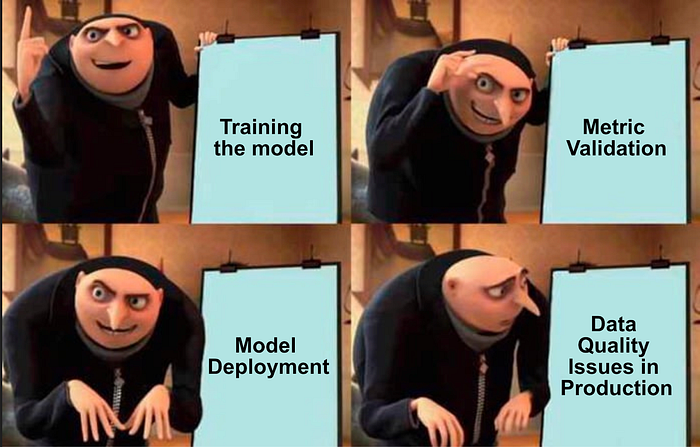
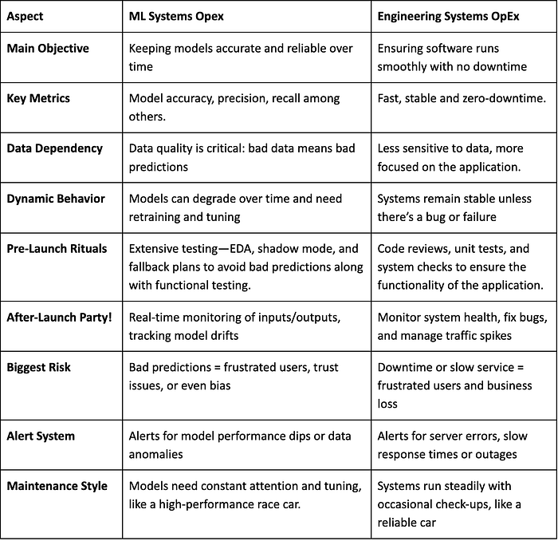
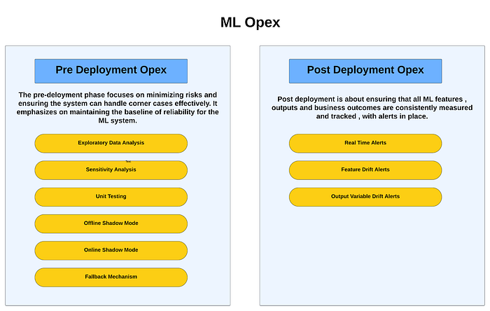

# Building Rock-Solid ML Systems

> Best Practices for Operational Excellence and Reliability

At Swiggy, machine learning drives a lot of critical applications that millions of customers depend on daily from Instamart grocery recommendations to the estimated time of arrival (ETA) of your order from your favorite restaurant. These ML models enable Swiggy to run like a well oiled machine and are pivotal for our broader vision of providing unparalleled convenience to our customers. The accuracy and reliability of these predictions are not just important but they are **business** **critical**. Any system failure or erroneous prediction could have significant consequences for our customers, restaurants or delivery executives. This makes ML Opex i.e. operational excellence in machine learning not just a goal, but **an absolute necessity**. In this blog, we’ll explore how Swiggy ensures ML reliability at scale by focusing on best practices that deliver consistent performance across our systems.

## Why do we need ML Opex?

Typically, Machine Learning systems are not “set and forget”. There is a clear need of constant monitoring and updates. There have been multiple instances at Swiggy and across the industry as well where the need for best ML Opex practices has been established.

Let us talk about two such examples at Swiggy:

- _Here is an illustrative example: _[**_Estimated Time of Arrival (ETA)_**](./predicting-food-delivery-time-at-cart-cda23a84ba63.md)**_ predictions _**_are key for customer experience as it gives the user a sense of assurance. It is a Machine Learning algorithm with a mix of hyper-local, temporal and real-time features, all of which are computed on the logs cutting across multiple engineering services. One of our upstream services inadvertently provided data in milliseconds instead of microseconds. In the absence of the right measures the model would have produced erroneous ETA predictions, however, with safeguards like input-clipping and real time observability we solve for this. More on these safeguards later._
- **_Swiggy Bolt_**_ is a service offering 10-minute delivery, currently available at select restaurants for their fast-prep items. On the similar lines, _**_Swiggy XL_**_ offers orders for large, party-sized deliveries, enabled through our brand new three-wheeler fleet. With any new product capability, the obvious changes are implemented in downstream systems and models. However, underlying shifts in data distribution and second-order implications on the model features often arise. These shifts can result in suboptimal predictions, hindering our ability to deliver _**_unparalleled convenience_**_ to our customers._

These examples tell us the **absolute necessity** of having comprehensive Machine Learning reliability measures and monitoring systems, where the smallest of data discrepancies or a new product capability can lead to significant inefficiencies in our operations.

Updates to engineering systems and products are inevitable and at Swiggy, they happen quite frequently! This keeps us constantly focused on enhancing the reliability and resilience of our ML models, ensuring they perform seamlessly in a dynamic environment.

### Understanding the Difference from Engineering System Opex

At the heart of it, Engineering System Opex is very different from ML Opex. Traditionally, Engg Systems is about keeping services fast and stable whereas for ML systems there are a multitude of other performance metrics that one needs to track. The key differences are as follows:

The additional metrics that one needs to track for machine learning systems is purely a result of the probabilistic nature of ML systems as opposed to deterministic wrt Engineering Systems.

## Brief Introduction of ML OpEx at Swiggy

To ensure that machine learning systems provide reliable and effective results, we need to focus on two key phases: **pre-deployment** and **post-deployment. **Both of these are critical to ensure model performance is seamless in production.

### Pre-deployment:

> **_Exploratory Data Analysis (EDA):_**

_“EDA is like cleaning your room. You start by picking up the obvious trash!”_

This** **is key for any machine learning model, it provides the data scientist with a clear understanding of the underlying distribution and potential anomalies in the data. It enables the data scientist to

1. Remove the noise to build a more effective model.
2. Identify any shift in distribution between train and validation data.
3. Have a clearer picture of the potential risks associated with model performance
4. Make an informed decision with respect to feature creation and model building.

> **_Sensitivity Analysis:_**

_“It’s like tuning a musical instrument. Your model either sounds like a masterpiece… or an alien trying to communicate.”_

Before deploying the model, it’s essential to understand how sensitive the model is to different values for each variable.

- Identify model weaknesses and non-intuitive behavior by evaluating sensitivity to variable changes.
- Determine each feature’s “operating range” where the model maintains confidence.

> **_Unit Testing:_**

_“Where every line of code is a villain and unit tests are the only hero.”_

Pretty similar to what we do in traditional software development, we need to pass our model pipeline through thorough unit testing.

- Perform unit testing across the pipeline, covering data preprocessing, feature generation, and serving.
- Validate data quality between offline training data and real-time/historical feature jobs, and test input-output transformations in TensorFlow Serving.

> **_Offline Shadow Mode:_**

_“Test in peace, knowing full well that when the model hits production, chaos will reign.”_

This is a strategy to assess the model’s ability to predict on a historical dataset specifically on an out of time data set.

- This will establish if the model generalizes well and shows similar metrics on an out of time dataset.
- This technique allows us to fine-tune the model without impacting downstream services

> **_Online Shadow Mode:_**

_“Not taking credit for it… . yet.”_

This is a strategy to assess a model’s ability to predict under real-world data.

- The model predicts on live production-grade data, but predictions are stored separately without being consumed.
- Comparing predictions to known outcomes estimates real-world performance.
- Offline shadow testing provides a controlled environment; it cannot fully capture the nuances of production-grade streaming data, which can exhibit temporal patterns, distribution shifts, or unseen edge cases.

> **_Fallback Mechanism:_**

_“When your model goes haywire, it’s time for the big red button.”_

What happens if the model fails and is providing wildly erroneous predictions? Depending on the product we can have multiple kinds of fallbacks.

**Biz Critical Real-Time Model with high features and variability**

These models usually are critical and very difficult to build fail-safes around. The typical approach we follow is

- **Input Clipping:** Restrict inputs beyond the defined operating range to its max/min values to maintain reasonable outputs.
- **Output Clipping:** Set output limits to handle unusual results for specific feature value combinations.

The goal of any machine learning algorithm is to be able to predict on “unseen” data and for the model to extrapolate well. The thought behind clipping isn’t to limit this ability but to avoid obvious errors. Defining the right operating ranges allows us to find the right tradeoff between risk-aversion and model extrapolation.

**Real Time Model with limited features and variability**

For these kinds of models, one can have simple heuristic fallbacks which can act as a placeholder until the issues with the primary model are fixed.

**Non-critical real-time model**

For non-business-critical models, we can automatically disable the model when its predictions become unreliable. Once its reliability improves, the model can be reactivated.

**Non Real time model**

For these models, one can create the aforementioned fallbacks or depending on the feasibility and criticality we can even engage human oversight.

> **_Error Codes:_**

_“The model can’t decide, might be right… might be wrong. Send help!!!”_

Error codes are an essential part of any engineering system, in a ML system it can be used as a proxy for confidence in the output. Based on the specific use case, the service consuming the model output can then determine how to handle the model’s predictions for downstream applications. Error codes could be of the form

- Clean prediction without any imputation.
- Input Clipped
- Output Clipped
- Fallback to previous version/ heuristic prediction

Based on this, we can choose BCP (**Business Continuity Plan**) & get buffer time to fix the error without getting impacted heavily.

### Post-deployment:

We divide monitoring and alerting into 3 specific groups

- **Real-Time Alerts:** Immediate P0 alerts for potential inaccuracies in features or predictions, requiring urgent attention from Engineering and Data Science teams.
- **Feature Drift Alerts:** Highlight shifts in feature distributions, signaling the need for investigation into long-term efficacy.
- **Output Variable Drift Alerts:** Indicate drifts in actual values, prompting data scientists to assess models for re-training or intervention.

## Conclusion

Both the pre-deployment and post-deployment phases are critical to the success of any machine learning system. The pre-deployment phase lays the foundation for a robust and reliable model, while continuous monitoring ensures resilience in real-world scenarios. Together, these steps form the backbone of a high-performing ML system.

In this blog, we’ve primarily focused on the **_why_** and **_what_** behind ML OPEX, giving you a solid understanding of the key processes involved. But this is just the beginning! In our upcoming blogs, we will dive into the **_how_** — unpacking each phase with detailed insights, best practices, and loads of Swiggy anecdotes to illustrate the nuances of ML deployment. Get ready for more in-depth discussions, expert tips, and exciting stories that will help you take your ML systems to the next level! Stay tuned!

### Author

[Vamsi Krishna](mailto:vamsi.p@swiggy.in)

### Guide

[Goda Doreswamy Ramkumar](mailto:goda.doreswamy@swiggy.in)

### Reviewer

[Nishant Agrawal](mailto:nishant.agrawal@swiggy.in) [Sunil Rathee](mailto:sunil.rathee@swiggy.in) [Soumyajyoti Banerjee](mailto:soumyajyoti.banerjee@swiggy.in)

---
**Tags:** Mlops · Machine Learning · Artificial Intelligence · Data Science · Operational Excellence
