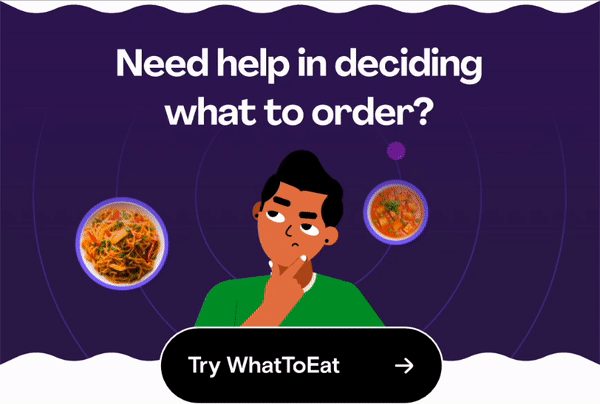
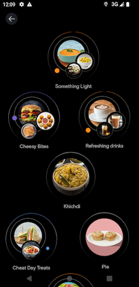
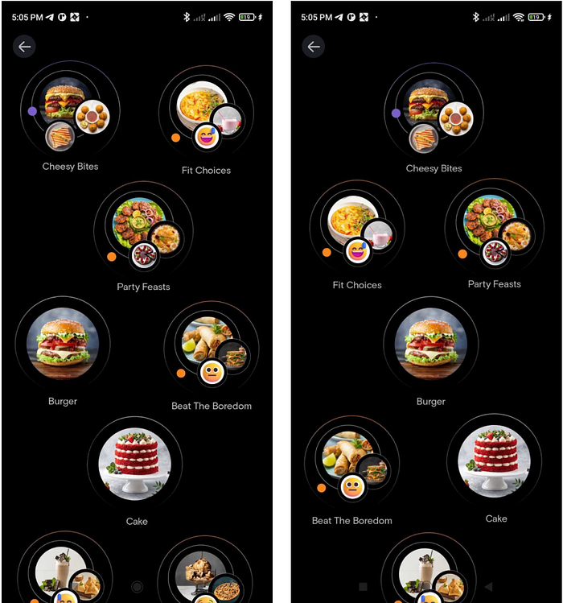

# Building the WhatToEat Experience on Android

> Part 1 — Creating the Bubble’s Layout



**What to Eat?**

It’s a question I have found myself pondering a lot of times. Well, I don’t have to anymore. Why?

Introducing Swiggy’s WhatToEat, a feature that enhances the traditional food-ordering journey by adding the crucial element of discovering food through emotions.

**Goal**

The goal of “**WhatToEat**” is to help users overcome decision fatigue while ordering food. The feature aims to simplify the decision-making process by allowing users to indicate their current mood or specific cuisine preferences through bubbles.

In this multi-part series, I will explain how we used** Jetpack Compose** to create the **WhatToEat** feature.

- In the part 1 of our series, we’ll focus on recreating the eye-catching bubble layout that you see in this feature.
- In the next part of the series, I will explain how we animated each of the bubbles.

**Creating the Bubble’s Layout**


*Bubbles layout*

1. The layout consists of a list of bubbles.
2. The bubbles are following a 1–2–1–2–1… and so on pattern.
3. Every bubble’s position is randomly moved in both horizontal (X) and vertical (Y) directions.

Our bubble’s UI is very simple. Its just a image with text underneath it.   
In compose, this is how we implemented it.

```
@Composable
fun Bubble(imageUrl: String,
           subtitle: String,
           modifier: Modifier = Modifier,
           contentDescription: String? = null) {
    Column(modifier) {
        AsyncImage(model = imageUrl, contentDescription = contentDescription)
        Text(text = subtitle)
    }
}
```

Now let’s focus on creating the 1–2–1 pattern.   
A naive approach to build this would be to create this layout using column with multiple rows inside it. For eg

```
@Composable
fun NaiveLayout(bubbles: List<Bubble>){
    Column(modifier = Modifier.fillMaxWidth().padding(top = 86.dp)) {
        Row(modifier = Modifier.fillMaxWidth(),
            horizontalArrangement = Arrangement.Center) {
           Bubble()
        }
        Row(modifier = Modifier.fillMaxWidth(),
            horizontalArrangement = Arrangement.SpaceAround) {
            Bubble()
            Bubble()
        }
        Row(modifier = Modifier.fillMaxWidth(),
            horizontalArrangement = Arrangement.Center) {
            Bubble()
        }
        Row(modifier = Modifier.fillMaxWidth(),
            horizontalArrangement = Arrangement.SpaceAround) {
            Bubble()
            Bubble()
        } 
        ... and so on
    }
}
```

**Why is this approach naive?**

1. This layout will not scale if we decide to add more patterns. We will need to add new layouts for each pattern.
2. This layout does not support animating the bubbles individually.
3. The columns and rows approach is too restrictive. We are dependent on the arrangment property for the bubble’s position. We cannot place the bubble anywhere.
4. Earlier we saw that each bubble was randomly moved in the X and Y direction. We cannot do this in this approach (We can do it by using translationY and padding but i feel like that would just be a hackish way to do this).

So what will be a better approach to make this?

The answer is **Custom Layout.**

Custom layout gives us the capability to control each composable’s position on a pixel level and is also very simple to use.

To create a custom layout, compose has a composable called **Layout.**

Layout composable accepts a list of composable and a measurePolicy(this is a way to measure and position the composables).

Before going to the layout’s code, let’s create an interface for placing the bubbles.  
The interface will have 2 methods

1. place — This method will return us the x and y coordinates for the bubble at position index.
2. getLayoutHeight — This will accept the number of bubbles, the bubble’s height and return us the total height the bubbles will take.

```
interface BubblePlacer{

    /** This function calculates the x and y poisiton for the bubble at any index.
     *  [maxWidth] and [widthOfBubble] is used to help decide the x position of the bubble
     *  [density] is used to convert dp to px
     *  [heightOfBubble] is used to calculate the y position
     *  [topPadding] is the padding from top of the screen
     */
    fun place(
        index: Int,
        maxWidth: Int,
        heightOfBubble: Int,
        widthOfBubble: Int,
        topPadding: Int,
        density: Float
    ): IntOffset // this has getters for getting the x and y position.

    /** This function is used to calculate the height of the layout.
     *  [heightOfBubble] and [numberOfBubbles] is used to calculate the y position
     *  [topPadding] is the padding from top of the screen
     */
    fun getLayoutHeight(
        numberOfBubbles: Int,
        heightOfBubble: Int,
        topPadding: Int,
        density: Float
    ): Int
}
```

- You can see the implementation here for the 1–2-1 bubble pattern: [https://shorturl.at/akS46](https://shorturl.at/akS46)
- Detailed Explanation for the same can be found at [https://shorturl.at/rAHX1](https://shorturl.at/rAHX1)

Now that we have that capability to get the x and y position for each bubble and also the total height of the bubbles, we just have to use them in our custom layout.

```
@Composable
fun BubbleLayout(bubblePlacer: BubblePlacer, bubbles: List<Bubble>, topPadding: Int, modifier: Modifier = Modifier) {
    Layout(modifier = modifier, content = {
        repeat(bubbles.size) {

            Bubble(
                imageUrl = bubbles[it].imageUrl,
                subtitle = bubbles[it].title,
            )

        }
    }) { measurables, constraints ->
        val bubbles = measurables.map {
            it.measure(constraints)
        }
        val topPaddingPx = (topPadding * density).roundToInt()
        val bubbleHeight =
            bubbles[0].height // use the first bubble's height for reference to calculate layout height
        val layoutHeight = bubblePlacer.getLayoutHeight(
            bubbles.size,
            bubbleHeight,
            topPaddingPx,
            density,
        ) // calculate the layout height
        layout(constraints.maxWidth, layoutHeight) { 
            bubbles.forEachIndexed { index, bubble ->
                val position = bubblePlacer.place(
                    index,
                    constraints.maxWidth,
                    bubbleHeight,
                    bubbles[index].width,
                    topPadding = topPaddingPx,
                    density
                ) // find the position
                bubble.place(position.x, position.y) // place it

            }
        }
    }
```

and we are done.

Creating an interface for placing the bubbles and calculating the layout’s height offers us several advantages:

1. Separation of UI and Logic: The interface encourages a clear separation between the user interface and the underlying logic. This separation enhances maintainability and allows for the development of reusable layout-related components.
2. Scalability: The interface makes it possible to add new bubble patterns in the future without affecting the UI Part of code. For example we have if we want to implement a 2–1–2 pattern, we will just need to a create a new bubble placer and pass it to our custom layout.


*Example showing 2 different type of layout patterns.*

**Final Product **🚀


Credits — [Arun Sharma](https://medium.com/u/62d308161754?source=post_page---user_mention--8ecf7d010ca8---------------------------------------) [Raj Gohil](https://medium.com/u/1bf9bdb89775?source=post_page---user_mention--8ecf7d010ca8---------------------------------------) Thank you for helping and guiding while working on this project.

### Resources

[https://developer.android.com/jetpack/compose/layouts/custom](https://developer.android.com/jetpack/compose/layouts/custom)

---
**Tags:** Swiggy Engineering · Swiggy Mobile · User Experience · Jetpack Compose · Custom Layout
