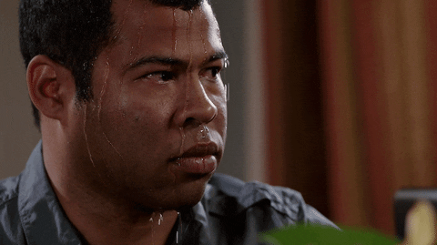
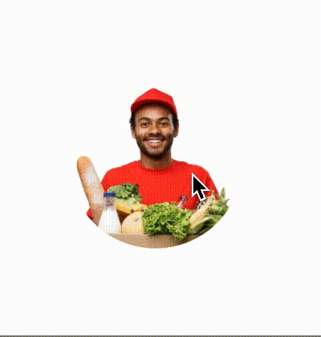
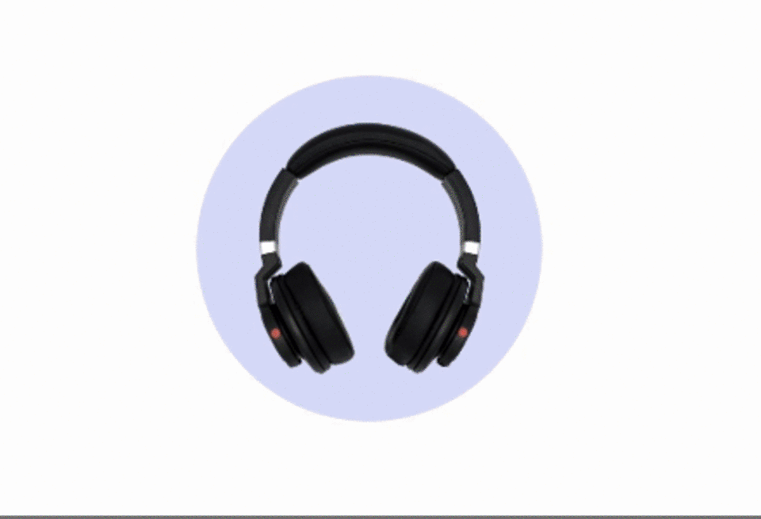
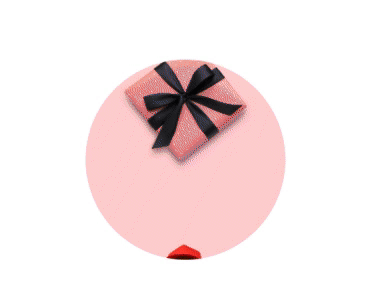
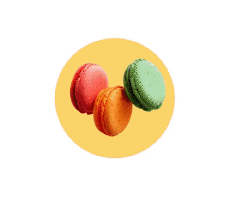

# CA Animation, which took away my fear of Animations

This article focuses on the usage of CA Animations in iOS to make smooth animations.

During my initial days with iOS, one thing I used to fear was whenever a designer comes up and says he/she wants an animation in the app.

*Shiiiiiiit*

In my mind, I used to think, it's very easy to come up with the design of animation but to implement is a very difficult task.  
I used to take the help of Google/StackOverflow/Peers for the implementation.   
I had a phobia using animations and have always tried to avoid it, but this soon changed.

At one instance, I had to animate a sequence of images in a view.  
So what would have been my first step? Obviously, StackOverflow!  
The first link got the code.

Easy peasy right? Well, if it were that simple, I wouldn’t be writing this article :P

This is the actual requirement.

*End Goal*

As it may be clear by now, I was nowhere close to it. In fact, I was stuck. ‘How would I be able to do so many customizations in animation and sync all of them?’

Then my friend told me to try CA Animation(Core Animation). I read about the same and tried on a sample project. To my amazement, it was so easy and powerful to use.

Core Animation provides high frame rates and smooth animations without burdening the CPU and slowing down your app. Most of the work required to draw each frame of an animation is done for you. You configure animation parameters such as the start and endpoints, and Core Animation does the rest, handing off most of the work to dedicated graphics hardware, to accelerate rendering

In a few hours, I was able to do a basic implementation.

*CA Basic Animation*

For this implementation, I used **CABasicAnimation**.

**CABasicAnimation** class animates a layer property between two values, a starting, and an ending value. To move a layer from one point to another in its containing window. For example, we can create a basic animation using the keypath position. We give the animation a start value and an ending value and add the animation to the layer. The animation begins immediately in the next run loop.  
You can use CA Basic Animation for animating many things like background color, opacity, position, scale.  
More details: [https://developer.apple.com/documentation/quartzcore/cabasicanimation](https://developer.apple.com/documentation/quartzcore/cabasicanimation)

**Now, back to our problem**.   
How did I go about implementing this? I took two image views and added two separate images to them. Then, I kept on animating them one after the other using CA animation.  
Full Code implementation: [https://gist.github.com/agammahajan1/e9b550f0275418459982246d1ee905d5](https://gist.github.com/agammahajan1/e9b550f0275418459982246d1ee905d5)

If you carefully see my last implementation gif, you will notice that something off. Before the first image goes out of the view, for example, the gift box gets immediately changed to headphones and then it goes up.

Why it is happening?

> Because as soon we are adding the animation to the image view, we are adding the next image to that view. (line number 5 and 6)

This is the issue of how to sync both image animations. But there always a solution with CA Animation.

**CA Transactions  
**CATransaction is an often overlooked class by most developers. The job of CATransaction is to group multiple animation-related actions together. It ensures that the desired animation changes are committed to Core Animation at the same time.

You start by writing CATransaction.begin(). Then write all your animations which you want to do in sync. Then call CATransaction.commit() which will start the animation in the block.  
Also, you can give a completion block to your animations.

Let's see how our animation looks now.

One last thing was to add the Spring effect in the animation. Thankfully, CA Animation had a solution for it too.

**CA Spring Animation  
**You would typically use a spring animation to animate a layer’s position so that it appears to be pulled towards a target by a spring. The further the layer is from the target, the greater the acceleration towards it is.

It allows control over physically-based attributes such as the spring's damping and stiffness.  
Let's implement it then.

*Voila*

My work is done here.

To **Conclude**, here are some advantages of using CA Animations  
- Easy to use and implement  
- A lot of customizations available  
- Can sync multiple animations  
- Almost 0 CPU usage

These are just a few of the advantages. The possibilities are endless.

Now, whenever requirements come for animation, I feel confident to implement the same.   
And I hope you also feel the same way after reading this.  
Feel free to give any suggestions or feedback.

---
**Tags:** IOS · Caanimation · Swift · Swiggy Mobile · Swiggy Engineering
