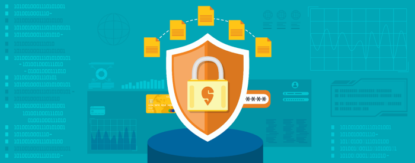
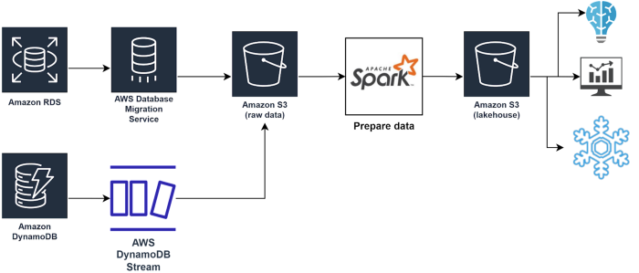

# Can’t lose what you don’t have

Co-authored with [Fasih](https://medium.com/u/a2ccba5740f2?source=post_page---user_mention--5e153211d5c1---------------------------------------)

At Swiggy, we believe in Data Democratization — people across the org have easy access to data, enabling us to make data-driven decisions and build customer experiences powered by data. We also care deeply about our customers’ privacy, easy access to data does not translate to access to customers’ sensitive information. To better understand the controls we have built, here is a very brief overview of the design of our data lake.

Our data lake is built on a [change data capture (CDC)](./introduction-to-cdc-system-an-efficient-way-to-replicate-transactional-data-into-data-lake-c10f99c7a3fd.md) pipeline; raw data from our transactional databases are written to an S3 using [AWS DMS](https://docs.aws.amazon.com/dms/latest/userguide/CHAP_Target.S3.html) and lambda functions on the DynamoDB stream. This raw data is then processed with Spark for the creation of [fact tables](https://en.wikipedia.org/wiki/Fact_table), compaction, quality checks and deduplication and finally rewritten to our data lake built on another S3. Finally, this data lake powers various data insights, dashboards and ML use cases.

Instead of building controls and measures in the lakehouse to ensure the privacy of the data, we simply remove all **personally identifiable information** (PII) from the data before it enters the widely accessible lakehouse and warehouse. This blog dives into the design and the learnings from the implementation of data masking in our data lake.

## Migration challenges

The biggest issue with the rollout of data masking was to identify the various business workflows that were dependent on PII data being present in the data lake and then migrate them to safer solutions. Before we started removing the PII data, we enabled [dynamic data masking](https://docs.snowflake.com/en/user-guide/security-column-ddm-use.html) in our warehouse, this enabled us to selectively and reversibly remove access from a majority of the users. It also bought us time to understand the use cases more deeply and develop solutions to address them while we were able to have restricted access to the most sensitive data. In the process, we built Dataship, a platform to ship data outside Swiggy with data protection policies including data retention, approvals and contract reviews built in as automation or enforced processes. Once we migrated all the use cases to these solutions, we were ready to start the removal of PII data from the data lake completely.

## Simplicity is the ultimate sophistication

Our initial design was to build DLP on data classification engines like [Google DLP](https://cloud.google.com/dlp/docs/inspecting-storage) or [AWS Macie](https://aws.amazon.com/macie/) for data classification and use that result to redact the sensitive data. To handle the addition of a new column, the CDC pipeline would pause till it got the classification result from the data classifier. Data classification engines, designed for asynchronous batch processing, resulted in complex coordination between the CDC and data classification pipeline for handling common data concerns like schema evolution, new table onboarding, false positive handling and so on. A significantly simplified design that we finally agreed on was an online classifier that we would train on our data and integrate into the CDC pipeline as a transformation step. The design allows us to use a regex-based classifier for fixed format PII fields (e.g emails and phone numbers) and ML for more heuristic attributes (e.g. names)

## How to train your classifier

The classifier producing a false negative (identifying a PII field as a non-PII) would result in a PII data leak in the lakehouse, and a false positive (identifying a non-PII field as a PII) would result in masking of a field required in a downstream job resulting in incorrect analysis. Either case would require expensive data purging or a rerun of the main as well as the dependent jobs that would have consumed an affected table. A typical metric for model performance when there is a high cost of false positives and false negatives is using [FScore](https://en.wikipedia.org/wiki/F-score). We test and monitor our classification model performance with production data to ensure that the probability of false positives and negatives is significantly reduced.

The classifier classifies columns as PII or not based on a confidence score, defined as the percentage of rows it can classify as a PII or non-PII in the column. In the testing phase, we manually tune the classifier against a large production dataset till we get a confidence score of higher than 95% (i.e. more than 95% of rows for a column tagged as PII are identified as PII or less than 5% of rows for a column tagged as non-PII are identified as PII).

In production, we use 80% as the confidence level for the classification. We also set up alerts if the confidence score falls below 90% as a signal for us to either look at the column as an exception (e.g. a column containing delivery instructions has a lot of people entering their phone numbers) or tune the classifier (e.g. new phone number series starting with 5 launched). We also set up continuous performance monitoring by running the classifier probabilistically 10% of the time and generating an alert if there is a change in classification result.

Removing sensitive information from the data lake has helped us protect our consumers’ data without complex authorisation rules. Complex authorization rules cannot prevent people with data access from unwittingly creating derived tables that leak the PII data. Starting from the complex authorization rules, we iterated to zero down on a simple yet scalable solution that works at the Swiggy scale and protects our crown jewel — our consumer’s data privacy.

---
**Tags:** Data Privacy · Swiggy Engineering · Security · Big Data · Masking
