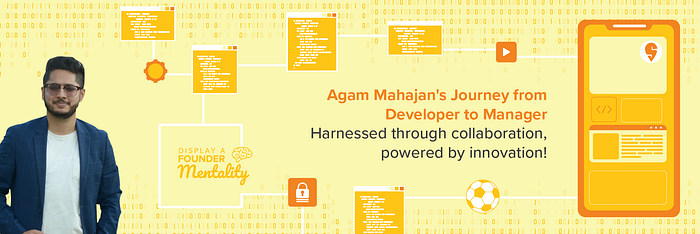
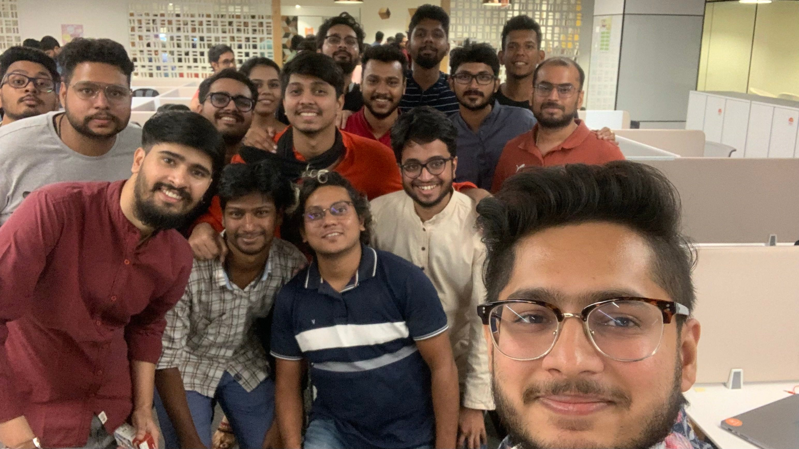
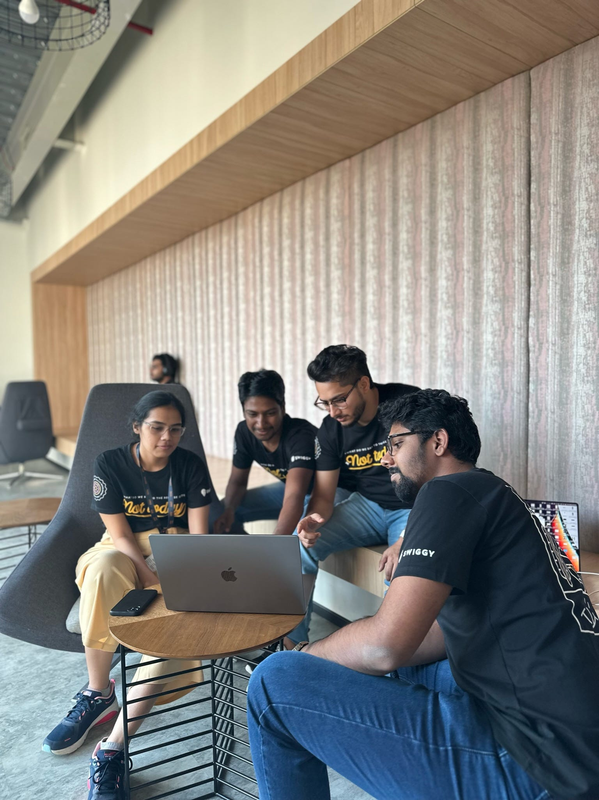

# Coding Solutions at Swiggy

A Coder turned Engineering Manager shares his journey at Swiggy.

In his four-and-a-half year long journey with Swiggy, Agam Mahajan has been instrumental in enhancing many of Swiggy’s features. His passion for technology and continuous learning has enabled him to grow as an outstanding professional and to deliver impactful projects at Swiggy. Progressing from an Executive Coder to an Engineering Manager, he draws genuine fulfillment from his achievements.

Agam takes a moment to share his exciting experience with Swiggy. Here’s a look at his journey so far.

**Could you give us a glimpse into your academic and personal interests?**

I’m a computer science engineering graduate from NIT Jalandhar. During my studies, I became fascinated by the potential of software applications. I believe they solve problems, can deliver experiences, and perform functions to enrich people’s lives. I am keen on exploring new horizons in the field of mobile development and user experience. And this led me to Swiggy.

When I’m not coding, you’ll find me indulging in my love for football. I enjoy it as an avid player and also as a spectator, with an unwavering allegiance to Real Madrid.

**What’s it like solving tech problems at Swiggy? How challenging can it get?**

One of the most exciting parts of working in Swiggy’s tech team is getting the opportunity to crack complex challenges that directly impact the company’s operations and the customer experience.

Being part of a dynamic and fast-paced environment, I get to work with the latest technologies and collaborate with talented individuals to develop innovative solutions. And when our work gets positive feedback from the end user, it is highly rewarding and fulfilling.

**Considering how passionate you are about technology, how has your journey with Swiggy been so far?**

I have been with Swiggy for almost four and a half years now. As Swiggy expanded from 50 cities to 500 and from food delivery to now also grocery and dining, I also grew with the company.

My journey here involved cross-functional collaborations with engineers, product managers, and designers. Together, we’ve developed and enhanced Swiggy’s features and capabilities. It has been an enriching experience collaborating with these people, and I have learnt a lot from them.

Having such a role, I have encountered a variety of challenges; from scaling the platform to handling high order volumes, to stream-lining user experiences across different devices, and many more. But it has been these challenges that have provided me with immense learnings and a chance to make a significant impact as a contributor.

Overall, my Swiggy journey is likely to be characterized as continuous learning, collaboration, innovation, and giving my best to serve the company and the end user.

**Collaboration is an essential part of your work. How would you describe your team and the work you’ve been doing together?**

I belong to the **Consumer App iOS Mobile** **Team** at Swiggy. We are responsible for developing and maintaining the Swiggy app on the iOS platform. We leverage the latest iOS technologies, industry best practices, and user-centered design principles to create a smooth and efficient user experience.

_Our work involves a range of tasks, such as:_

**iOS App Development:** We build and continuously update the iOS app to optimise its stability, performance, and usability. We are also responsible for developing new features, improving existing functionalities, and implementing UI/UX designs to ensure a seamless ordering experience for iOS users.

**Technical Innovation:** We explore new technologies, frameworks, and tools in the iOS ecosystem to improve our app’s performance, efficiency, and maintainability. We experiment with iOS’ features and the codebase industry best practices to deliver a high-quality app.

**Collaboration:** As mentioned, our team is in constant communication with product managers, designers, backend engineers, and quality assurance teams. All of us engage in discussions, exchange insights, and work together to align product requirements with technical feasibility.

Overall, the iOS Mobile team at Swiggy helps deliver a robust and user-friendly app experience to iOS users.

**You’ve been with Swiggy for more than four years. Could you tell us how your work life changed from day one to now?**

Oh, my work life has been through a considerable change in these years. I joined Swiggy as an SDE-2. Initially, as a software developer, I was responsible for writing code, developing features, and solving technical challenges. I gained expertise in iOS Mobile technologies and contributed to the overall development of Swiggy’s Consumer app.

Now, as an Engineering Manager, my work expands beyond individual coding tasks. I am now responsible for overseeing the technical aspects of multiple projects, coordinating teams, and aligning engineering efforts with business goals. My focus now is on managing people, processes, and projects while ensuring quality deliverables.

**It is clear that technology is a big part of your life. Could you tell us what technology means to you, and why did you decide to make a career in it?**

In my opinion, technology is any kind of innovation that solves a problem. This encompasses everything from computers and software to digital systems, communication networks, and advanced technologies, like artificial intelligence and robotics.   
I decided to make a career in it because of two factors;

**Impact and Contribution:** Technology has the potential to make a significant impact on society and people’s lives. By working in the field of technology, I could develop solutions to address real-world problems, improve efficiency, and enhance user experiences. Making a positive difference in the world through technology is a motivating factor for me.

**Continuous Growth and Evolution:** Technology is ever-evolving, and as there is always something new to learn, the field offers abundant opportunities for professional as well as personal growth. This growth and the chance to stay at the forefront of innovation is an appealing factor behind me choosing technology as my career stream.

**Could you enlighten us on what life is like for an Engineering Manager at Swiggy?**

At Swiggy, the Engineering Manager’s life is fast, dynamic, challenging, and rewarding.

A significant part of this role is leading and managing a team of engineers, along with overseeing multiple projects and supporting the professional growth of the team. An EM also needs to drive continuous improvement within his team and across the organization. The person in this role encourages innovation, explores new technologies and industry trends, and promotes a culture of learning and growth.

Overall, life as an Engineering Manager at Swiggy involves leading a team of talented engineers, driving technical excellence, collaborating with stakeholders, and contributing to Swiggy’s growth and success

**In over four years with Swiggy, was there a project which has been particularly special to you?**

Though I have worked on so many great features and projects, two are very special to me.

[**Accessibility:**](./designing-the-swiggy-app-to-be-truly-accessible-episode-3-ec7256401c6d.md) Making the Swiggy app accessible for differently abled people was an important initiative that enhanced inclusivity and ensured equal access to the Swiggy app’s services. We aimed to alleviate their problem of not being able to place an order without another person’s help. This feature was highly appreciated by the differently abled community and received warm feedback.

[**Live Activities:**](https://medium.com/swiggydesign/designing-with-constraints-live-activity-and-dynamic-island-71271c454bcb) Apple recently launched a feature called Live Activities where a user can see live updates without even opening the app. We, as a tech-first company, quickly adopted and integrated our food order tracking system into this feature. And we became one of the first ones to roll out this functionality in India. The feature has been a huge success with iOS users praising its functionality and ease of use.

**One of the benefits Swiggy provides its employees is a Learning Wallet, where you are given a certain budget to take on personal and professional development activities. How did you use your wallet in 2022?**

The Learning and Development wallet has been really useful to me in 2022, especially because I got a Kindle, which has served as a convenient way to collect and read books on leadership and some technical topics. I also used the wallet for a personal fitness trainer who accelerated my personal development and improved my overall health and wellness.

**Could you tell us about your experience with Swiggy’s Remote-First/Hybrid ‘Future of Work’ policy?**

Swiggy’s [Remote-First policy](https://blog.swiggy.com/2022/03/25/what-work-looks-like-at-swiggy/?utm_source=Swiggy&utm_medium=Blog&utm_campaign=Future+of+work) has been a blessing for me. After covid, while other companies started calling employees back to office, Swiggy took an employee first approach and gave us the flexibility to work from home permanently. This benefit hugely reduced my stress of commuting 17 km one way. As a result, it’s also improved my productivity.

**Based on your experience so far, what advice would you like to give to aspiring engineers?**

One piece of advice I would like to give to aspiring engineers is to embrace a lifelong learning mindset. Technology and engineering are constantly evolving fields, so staying curious and continuously expanding your knowledge and skills is crucial to your success. Seek out new challenges, be open to learning from others, never settle on your achievements or failures, and keep exploring and pushing the boundaries of what you can achieve. Learning is a journey, and the more you invest in it, the more you’ll grow, both personally and professionally. This is one of many invaluable lessons I learned from my manager Tushar Tayal.

**Which Swiggy value do you connect with the most?**

The Swiggy value I connect with the most is [Display a Founder Mentality](https://blog.swiggy.com/2022/12/21/here-are-swiggys-values/). My team and role are majorly on the mobile application side but I love to take ownership of the entire project end to end which includes working with the product and designer in the brainstorming, giving suggestions to other teams to develop scalable solutions, and working with other stakeholders for getting quality deliverables.

**And lastly, how would you describe Swiggy as a workplace for aspiring Swiggsters?**

One thing which never gives me second thoughts about continuing working with Swiggy is the great work culture where there is no micromanaging and employees take full ownership of their projects.

With a technologically advanced environment, collaborative teams, and a focus on continuous learning, Swiggy provides a dynamic platform for growth, creativity, and the chance to make an impact in people’s life.

Along with that, employee-friendly policies like working from home, moonlighting, and learning wallets are icing on the cake.

---
**Tags:** Swiggy Life · IOS · Career Development · Indian Startups · Employee Stories
