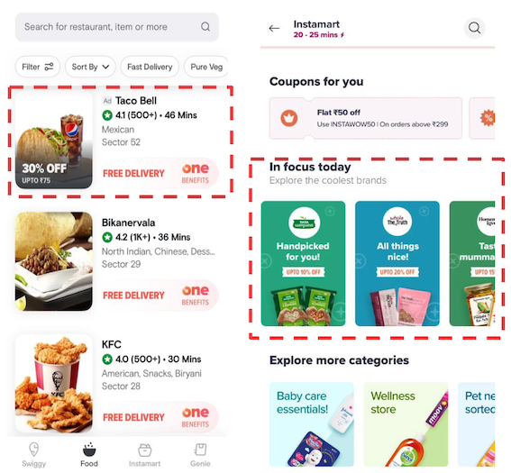
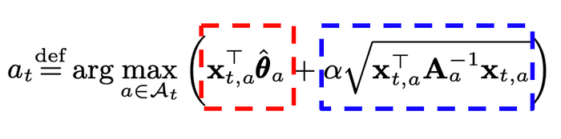
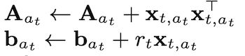
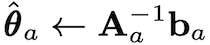
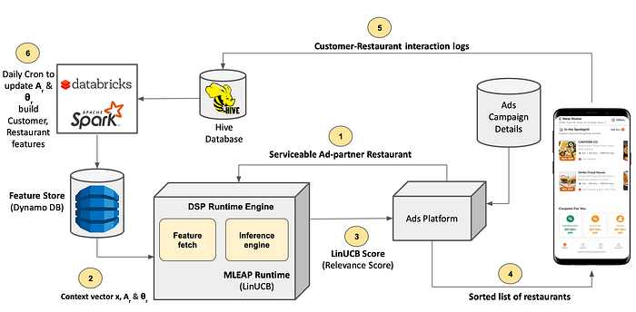
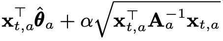
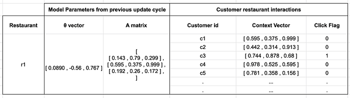

# Contextual Bandits for Ads Recommendations

Coauthored with [Shubha Shedthikere](https://www.linkedin.com/in/shubha-shedthikere-233a3814/) and [Shyam Sunder](https://www.linkedin.com/in/shyam-sunder-007/)

### 1. Introduction

Swiggy Ads platform supports ads of restaurant partners and various FMCG/non-FMCG brand partners across its different business verticals (Food, Instamart, Meat). With millions of customers interacting with the app each day pan-India, it provides an opportunity for our ad partners to reach large-scale audiences across various geographies. The Ads recommendation systems are powered by Data Science driven relevance and ranking algorithms and provide personalized recommendations. This helps the customers discover the relevant restaurants/brands and vice-versa helps the ad partners target the appropriate audience. These ranking algorithms have typically been machine learning models which are trained on historic customer interaction/transaction data and optimize for the click-through-rates.

*Figure 1 — Promoted restaurant on Swiggy Food Page and Promoted Brands on Instamart Page*

These recommender systems generally tend to do well in recommending ad partners that the customer has either interacted with earlier or those which are similar to such partners. But they do not _typically_ tend to promote the discovery of new partners, which is one of the primary tenets of any advertising platform. When this interaction data is in turn used for re-training the ML models, it will tend to reinforce similar recommendations due to the presentation bias. One of the ways to break this vicious circle of bias and understand customers’ unexplored preferences is via unbiased data collection through randomized recommendations. But this can lead to poor customer experience among the cohort of customers who are exposed to these random recommendations.

On the other hand, Multi-Armed Bandit (MAB) Algorithms, also known as K-Armed Bandit algorithms, provide a principled way to trade-off between exploration (understanding user preferences through new recommendations) and exploitation (recommending based on historic preferences). In simple terms, the MAB algorithm is presented with K different options (also known as arms) to choose from and each option is associated with a _reward_ which is unknown to the algorithm and is revealed to the algorithm after choosing the arm. More specifically, in our case, the MAB-based recommender would recommend a particular ad partner to a given customer. Once the impression is made, the algorithm observes the reward, possibly getting a click would be the reward. Suppose the customer clicks on the impression, then when the customer logs into the app the next time, should the algorithm choose the same ad partner because the customer had clicked earlier (exploit) or should the algorithm try a new ad partner(explore) to gain new information? MAB algorithms make this trade-off in such a way that it tries to learn the (nearly-)best choice to make while spending minimum trials exploring the options.

In the basic version of a MAB algorithm, the arms chosen each time are based purely on the historic rewards that were received for the arms. But in many of the applications, there may be additional information or context that is available before making the choice. For instance, in our case, we would have information about some of the customer’s taste profiles, price point preferences, etc. Contextual MABs algorithms use this additional information and historic rewards to choose the best arm.

In this work, we discuss how we enabled Contextual MABs for ads recommendation of restaurant ad partners. This framework is applicable to other recommendations as well.

The following were some of the primary challenges in enabling contextual bandit algorithms in production:

- **Real-Time scoring:** When a customer logs into the app, the ranking algorithm provides a ‘relevance score’ for each of the ad partners which are serviceable to the customer. These relevance scores are then used to rank the restaurants. If the relevance scores were to be computed through a batch inference for all the customer-restaurant pairs and served to the recommendation system through a table look-up, then many of the off-the-shelf bandit algorithms libraries, such as Vowpal Wabbit, could have been used. But the challenge here is that with millions of customers and tens of thousands of restaurant partners running ads every day (which leads to scoring hundreds of serviceable partners per customer), the number of customer-restaurant pairs that need to be scored blows up resulting in massive storage costs. In order to overcome this, we need a system which is capable of doing real-time inference. Unlike ML models, which once trained and deployed, will be used for inference, MABs are online learning models, which update the model parameters continuously based on the rewards received. **Hence setting up the instrumentation for MABs in production for real-time scoring is not ****_as_**** straightforward. **Also, ads recommendation being a low latency system, we need to design our solution such that we are able to do a real-time scoring using MAB algorithms while meeting these latency constraints.
- **Need for new custom data transformers:**_ _The data transformers, such as those related to matrix operations, which are essential to support real-time scoring using MAB algorithms and which are in line with our current production system, did not exist. Hence we needed to build new data transformers to support the matrix operations.

In the rest of the blog, we give a brief overview of the Contextual MABs and LinUCB algorithm and then deep dive into how we designed the solution, built custom data transformers and set up the LinUCB framework in the production environment which is capable of performing real-time inference at Swiggy Scale.

### 2. Contextual MAB setup

As pointed out in the introduction, Contextual MAB algorithms make use of the side information or the _context_ that is available to choose the best action/arm in each trial. The reward in each trial ‘t’ is a function of the context and the chosen arm. The goal of the algorithm is to maximize the expected cumulative rewards in the T rounds/trials.

One of the simpler versions of the contextual setting is where we assume a linear relationship between the expected value of the reward and context. Such contextual bandits are called Linear Bandits.

In our use case, we formulate the ad restaurant recommendation on the Food page of the Swiggy app as a Linear Bandit problem. The context is information about the user: their previously ordered restaurants on the platform, cuisine preferences, veg/non-veg affinity, device information, average order values etc. An action is a choice of the serviceable ad restaurant partner to be rendered. The user feedback in terms of click/no click serves as the reward. For this use case, we consider binary reward: 0 if there is no click, 1 if there is a click. The objective here is to maximize the total number of clicks accrued over the trials.

We formally define the Contextual MAB setting for our use case as below:

1. **Trial:** Each user session on the app where the user sees an ad restaurant will be a trial.
2. **Arm: **At each trial, we have a set of serviceable ad partner restaurants to select and display. Each serviceable ad partner restaurant is an Arm
3. **Context: **At each Trial(customer session), a context vector is defined for each Arm(restaurant), which summarizes information from both_ _the user and the arm
4. **Action: **Choosing to display a restaurant(arm) to the user
5. **Reward:** We define reward based on user feedback; Reward is defined as +1 when a user clicks on a restaurant and 0 if the restaurant made an impression and did not receive a click
6. **Objective:** Maximize the total number of clicks in the long_ _run

### 2.1 The LinUCB Algorithm

Upper confidence bound (UCB) is a non-contextual bandit algorithm which changes its exploration-exploitation balance as it gathers more knowledge of the environment. At each trial, the UCB score is computed as a sum of two terms:

1. The empirical estimate of the mean reward(exploit) and
2. A term which is inversely proportional to the number of times an arm has been played (explore)

Check out our [previous blog](./multi-armed-bandits-at-swiggy-part-2-ec6c4f7e7e29.md) for more details on the Upper confidence bound and other non-contextual MAB algorithms. LinUCB is a way to apply the Upper Confidence Bound bandit algorithm to the linear contextual bandits setting. We won’t dwell too much on the mathematics and derivations of LinUCB but will focus on 2 things —

1. how each arm is scored in a trial and
2. how model parameters are updated based on the customer feedback(rewards)

For complete details on the LinUCB algorithm check out the paper — [“A Contextual-Bandit Approach to Personalized News Article Recommendation”](https://arxiv.org/abs/1003.0146)

### 2.1.1 Scoring Arms

At each trial _t_, LinUCB scores every arm and selects the one which maximizes the score. At the crux of the algorithm, we wish to find the arm with the highest UCB score at time t.

Eq. 1 shows this score which is represented by the sum of -

1. The mean reward estimate of each arm (red box) and
2. The corresponding standard deviation (blue box), where α is a hyperparameter

The higher α is, the wider the confidence bounds(standard deviation) becomes. Thus it results in a higher emphasis placed on exploration instead of exploitation

*Eq. 1 — LinUCB Arm selection strategy*

where,  
x (vector) is the Context,  
θ(vector) and A(matrix) are model parameters learned for each arm,  
α(scalar) is a hyper-parameter which controls the level of exploration

### 2.1.2 Updating Model Parameters

After each trial, we receive feedback for each restaurant that made an impression. The feedback(reward) as defined earlier is +1 for a restaurant that is clicked and 0 for the others.

LinUCB updates the model parameters — _θ _and _A_, for each Arm according to the below equations –

*Eq. 2 — Update equations for LinUCB*

Where _x_ is the context and _r_ is the reward (1 or 0). The updated model parameters, θ and _A_ are now used to score restaurants in the subsequent trials.

### 3. Production Setup

In this section, we discuss the architecture of the production system for Ads recommendation and discuss how we designed our solution to enable the LinUCB algorithm which is in line with the current production system. Figure 2 gives the schematic diagram of the Ads recommendation system and also highlights the flow of calls of one real-time inference.

*Figure 2 — solution architecture*

### 3.1 Ads Recommendation System Architecture

The key components of the Ads recommendation system at Swiggy are given below:

**Ads Platform:** The Ads Platform encapsulates capabilities to support the ad's lifecycle end-to-end. Its **_pre-serving layer _**enables campaign creation and storage of the campaign details. The **_ads serving layer _**is at the heart of the ads recommendation engine. During each customer session, it fetches the list of serviceable restaurants that have an active campaign and enriches this list with some of the real-time signals such as estimated delivery time for the order, etc. It then calls the inference engine within the Data Science Platform(DSP) to get the ranking (or relevance) score for each of the restaurants for the given customer. The ads serving layer returns the sorted list of restaurants based on the relevance score to the presentation layer, which renders these ad impressions on the app. The Ads platform also enables logging of these ad impressions and click events, which can then be processed in the **_post-serving layer_** for billing purposes. These logged events are also used for building features and training the ranking models.

[**Data Science Platform (DSP):**](https://bytes.swiggy.com/enabling-data-science-at-scale-at-swiggy-the-dsp-story-208c2d85faf9) Data Science Platform is one of the [core](https://bytes.swiggy.com/enabling-data-science-at-scale-at-swiggy-the-dsp-story-208c2d85faf9) capabilities at Swiggy which powers model deployment and real-time inference at scale. The ML models are trained in the Spark environment and the model pipelines are serialized into the required format. The serialized pipelines (typically zip files) are uploaded and registered with DSP via a _data-scientist-friendly_ interface. In order to be compatible with our Spark heavy ML stack, DSP supports [MLeap](https://github.com/combust/mleap) serialization/deserialization format. These ML models are then deployed on appropriate production clusters where they are deserialized into MLeap objects, which run in the MLeap runtime during inference. Whenever an inference request is made to DSP from the client (in this case the ads serving layer) via the model endpoint, the DSP runtime engine retrieves the necessary features from the Feature Store, and gives these features as input to the MLeap model pipeline, runs the model, and returns the output to the caller.

**Feature Store: **The features required for real-time inference of the ML models are processed via cron jobs (typically Pyspark jobs) and pushed to fast access databases such as Redis/DynamoDB. These features include various customer attributes, restaurant attributes and customer-restaurant relationship attributes which are prepared based on the customer interaction and transaction data logs. During inference, these features are fetched from the feature store using the DSP’s Feature Fetch service and input to the MLeap model object.

### 3.2 Enabling LinUCB in Production

As discussed in the earlier section, during each trial ‘t’ ( user session), the arm selection policy/algorithm is presented with a set of arms (restaurants) and associated context vectors. For each arm, we compute the LinUCB score (which is as given in the equation below) and rank the arms based on this score. In other words, for each of the serviceable ad partners, when Ads Platform calls the LinUCB model endpoint in DSP, the model should essentially be able to compute the LinUCB score and return it to the Ads Platform. The ads serving layer in the Ads Platform sort the restaurants based on this score and returns the sorted list to the presentation layer for rendering.

*Eq. 3 LinUCB score — Equation to calculate the score for each restaurant*

In order to enable computation of LinUCB score in the above production environment, we need the following:

- **_Model Parameters Fetch _**capability to make the model parameters available during scoring.
- **_Context Vectors Fetch_ **capability to make the context vectors, which could be a combination of historic features and real-time signals, available for scoring.
- **_LinUCB Score Computation:_** an MLeap Pipeline to compute LinUCB score in realtime
- **_Update Model Parameters:_** Mechanism to update the parameters of each of the arms based on the rewards.

### 3.2.1 Model Parameters Fetch

The model parameters, **θ** and **A inverse**, for each of the ad partner restaurants, are updated using a Spark Cron job and stored in the Feature store. During inference, these model parameters are fetched using the Fetch fetch service of DSP. Note that this is unlike the case of a trained and serialized ML model, where the model parameters would have been part of the MLeap object deployed on the cluster. In the case of MABs, which are continuously adapting the scoring strategy based on the rewards, the model parameters are continuously updated (the cadence of which is discussed in the next section) and stored in the Feature Store.

### 3.2.2 Context Vector Fetch

The context vector _x_ summarizes information of both the user and the arm. This vector includes signals based on historic customer interaction/transactions such as customer’s cuisine preferences, veg/non-veg affinity, order values etc. The context vector could also include real-time signals such as expected delivery time from the restaurant etc.

The historic signals for each of the customers and the restaurants are computed and stored in the Feature Store. The real-time signals are passed to DSP from the Ads Platform. During inference, the historic features are fetched from the Feature store and then combined with the real-time signals to obtain the final context vector.

### 3.2.3 MLeap Pipeline to compute LinUCB score

The LinUCB score computation essentially involves matrix multiplication, dot product, square root operation, scalar multiplication and addition. The MLeap library has several data transformations and could support all the required operations to compute the LinUCB score except the matrix multiplication. Hence we built a **custom MLeap Matrix Multiplication transformer** that receives two matrices as its input and returns their product as output. The custom transformer built can be serialized along with other transformers in the pipeline and thereby can be used in real-time inference in runtime after deserializing it. More details on onboarding new transformers to MLEAP can be found at — [Custom Transformers — combust/mleap-docs · GitHub](https://github.com/combust/mleap-docs/blob/master/mleap-runtime/custom-transformer.md)

We will also be open-sourcing the developed transformer to the MLEAP repository.

With all the necessary MLeap transformers/operators now in place, we built the MLeap LinUCB pipeline which does the following:

1. **Assemble the context vector:** As discussed above, the historic signals and real-time signals, which constitute the context vector, have to be concatenated and normalized to obtain the final context vector. The MLeap pipeline includes transformers to concatenate and assemble the context vector.
2. **Compute the LinUCB score:_ _**Having enabled the Matrix multiplications in MLeap, we are able to generate the score using the _context_, _θ_ and _A inverse _and return the same to the Ads Platform.

### 3.2.4 Model Parameters Update

The model parameters **θ** and **A** are updated daily, according to equation(2), based on the feedback received from customer-restaurant interactions the previous day. Note that, unlike the theoretical MAB setting where the parameters are updated after each trial, we do a batched update where the parameters are updated after aggregating the rewards for a day. The cadence of this update can be changed as per the use case. Updating after each trial (user session) or more frequently was not suitable or feasible for our use case given we have millions of user sessions daily.

The parameters are updated for each restaurant that made an impression on the previous day. We process the customer-restaurant interactions logged in Hive using a Spark pipeline, which can parallelly update the parameters of restaurants using the parameter from the previous update cycle, the context vectors and rewards of the impressions of the previous day.

The table below illustrates how the data has been set up to enable parallel parameter updates for all the restaurants in Spark. The example below assumes the context vector of size 3.

*Fig. 2 Shows the data setup to update model parameters for a single restaurant. The parameters shown are random numbers used for illustration only.*

Below we summarize the steps involved in the parameter update process, which is performed in the (daily) Spark cron:

1. Retrieve the latest _θ_ vector and _A_ matrix for each restaurant from Hive. If the restaurant has never made an impression, _θ_ is initialized as a null vector and A as an identity matrix
2. Retrieve all the customer interactions with a restaurant on the previous day and their respective context vectors + rewards
3. Using each customer-restaurant interaction update _θ_ and A for the restaurant using the LinUCB update equations mentioned earlier (Eq. 2)
4. Save the final updated parameters in Feature Store(DynamoDB), which will be used to score restaurants in real-time for sessions the next day and in Hive, which will be used for parameter updates.

Additionally, we save the inverse of the A matrix in the Feature Store rather than the original matrix. This is because while scoring we only require **_A inverse_**. We avoid an additional computation of calculating an inverse of a matrix in real-time, which helps in reducing latency.

### 4. Conclusion

In this post, we discussed the system architecture, the new Mleap transformers that we built and the pipelines that we have set up to enable contextual MABs using the LinUCB algorithm for restaurant ad partner recommendations. This solution is aligned with our current production system and is able to provide real-time inference ensuring that it meets the required latency profiles. With this instrumentation in place, we are now exploring how we can enable other online learning models which can provide better discovery and diversity in our recommendations. As immediate next steps, we will also be open-sourcing the Mleap Matrix Multiplication Transformers.

### 5. Relevant Resources

1. [Multi-Armed Bandits at Swiggy: Part 1](./multi-armed-bandits-at-swiggy-5b1a4b1c2724.md)
2. [Multi-Armed Bandits at Swiggy: Part 2](./multi-armed-bandits-at-swiggy-part-2-ec6c4f7e7e29.md)
3. [Swiggy Data Science Platform](https://bytes.swiggy.com/enabling-data-science-at-scale-at-swiggy-the-dsp-story-208c2d85faf9)
4. A Contextual-Bandit Approach to Personalized News Article Recommendation (LinUCB Paper) — [https://arxiv.org/pdf/1003.0146.pdf](https://arxiv.org/pdf/1003.0146.pdf)
5. Blog post on Disjoint LinUCB — [https://kfoofw.github.io/contextual-bandits-linear-ucb-disjoint/](https://kfoofw.github.io/contextual-bandits-linear-ucb-disjoint/)

---
**Tags:** Machine Learning · Multi Arm Bandits · Contextual Bandit · Recommendation System · Swiggy Data Science
