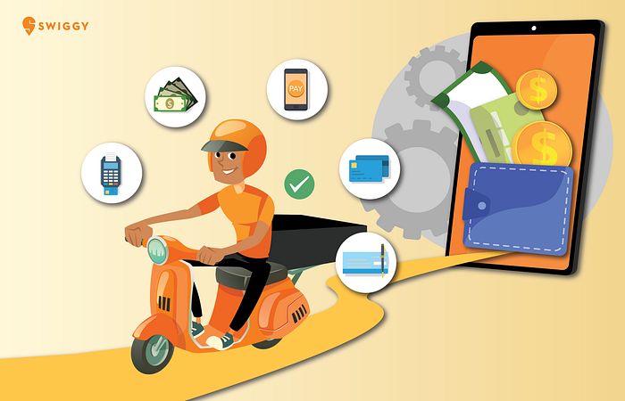
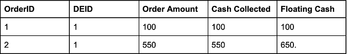
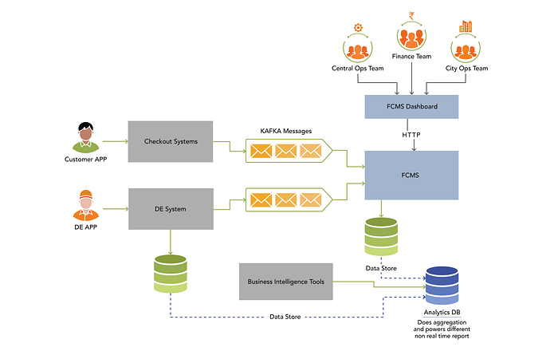
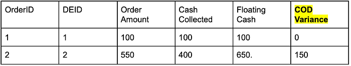
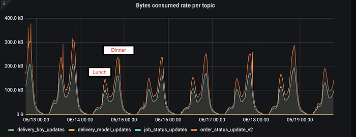
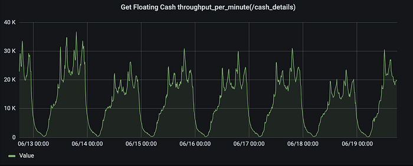
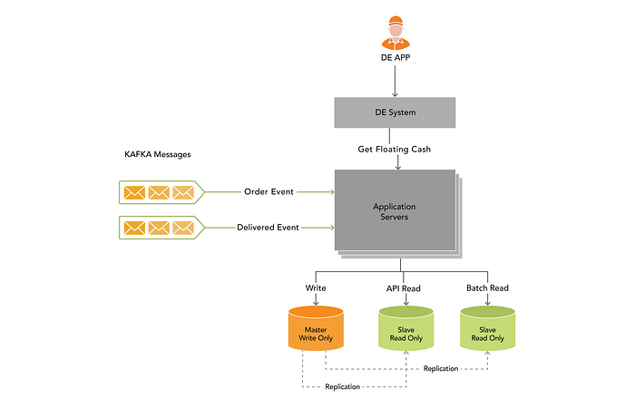
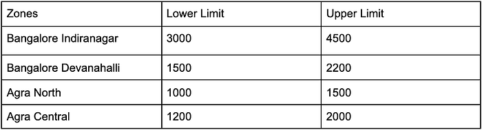
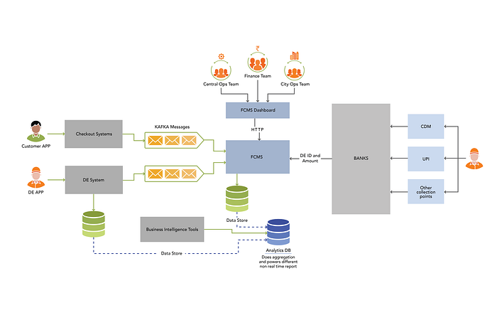

# Curbing COD Loss With Technology

_Over the past decade, ‘cashless’ has been one of the most prominent catchphrases in the Indian economy. While the power of digitisation has been pervasive, transacting via physical cash is a tradition that has not completely shaken off; and proof of that is the number of transactions we witness in the hyperlocal e-commerce space. In a 3-way Marketplace, such as that of Swiggy’s, where orders are real-time and the quantum of transactions are exponential, Cash on Delivery [COD] becomes a behemoth of a challenge. So how can we ensure that managing and tracking cash transactions are done in a watertight manner? How can technology drastically reduce instances of leaks and frauds within this non- digitised mode of payment? Read ahead to see what we have been up to…_

In a marketplace business, COD (cash on delivery) is a great way to attract the interest of new customers. Extremely popular among tier-2 & tier-3 cities, and also among non tech savvy customers, CoD is a go-to option for those who are apprehensive about putting their credit card on the records or using internet banking. While UPI has blitz scaling penetration of online payments, given our large, diverse population, and Swiggy’s scale of operations, COD continues to hold the pole position as one of the largest payment methods (20% order volume)** **that our customers gravitate to.

As of writing this blog, Swiggy is delivering convenience in over 500 cities across the nation. So, you can imagine the scale of the challenge we encounter in tracking and bringing cash collected from these cities back into a Swiggy system, that too without any losses. For that, we have a dedicated Finance Engineering Team responsible for solving all cash-related conundrums — money movement, payout calculation, commission, payment gateway reconciliation, credit score for restaurant, building multi-tenant ledger etc. Here are some of the key problems we are solving with respect to COD orders:

- _How do we ensure DEs (Delivery Executives) are motivated to deposit cash into the Swiggy account without delays?_
- _How do we ensure that the loss is minimized, in the event of cash not being deposited by a Delivery Partner?_
- _How do we continuously keep track of the volume and age of cash?_
- _How do we keep an active track of DEs who have left Swiggy without depositing COD collections, and how do we manage closures in the event of them joining Swiggy back at a later time frame?_

We understand that Deliver Partners might have their own set of challenges in ensuring that their COD transactions achieve a closure. And for that, we believe that they can be assisted by addressing two main problems. As you can see, the goal is to reduce cash loss and the time it takes to bring cash back into the system. If these problems sound interesting, then let’s deep dive into it.

To address cash loss, we started building a Floating Cash Management System (FCMS). FCMS is meant to do this:

## Be a single source of truth that can provide real-time and consistent view of all COD orders, cash collected and floating cash at DE level.

Floating cash (FC) is the cash that DEs have collected from the customers, on behalf of Swiggy, but not deposited. This system ingests and stores all order data for COD orders and all cash deposits done by DE’s. When a new COD order gets delivered, this system will get an event and it will update the floating cash for a DEs. This system exposes an API which can give a real time view of how much cash is with the DE and waiting to be collected. This system tags order ID, order amount and DE ID.

*FCMS architecture*

When DE clicks the ‘**DELIVERED**’ icon on his app, he has the option to enter the amount that customer has paid for COD order. Most of the time the order amount in our system and amount entered by DE should match. But this is not always the case. When it doesn’t match we call this as ‘**COD Variance**’ and the system keeps a track of all unsettled transactions. COD Variance amount is the difference between collectable cash and actually collected. This is also where instances of fraud can occur, if there comes a situation when a DE decides to pilfer the system.

There are multiple reasons COD Variance occurs. For instance, if a customer has placed COD orders for Pizza (Rs 400) and Garlic (Rs 150) bread and for some reason if the restaurant doesn’t include garlic bread along with Pizza, then the customer would pay Rs 400 (not paying 150 for garlic bread) to DE when he delivers the order. Or a customer is unhappy because of a slippage or packaging issue and he won’t pay any amount. What would DE do in this case? He would mark the item delivered and put this comment on what happened or he may also call our customer service. There can also be cases where DE has collected 650 from customers, but he entered 500 in his APP, hoping to keep 150 in his pocket (FRAUD case). We mark this as **COD Variance** which becomes part of floating cash. In genuine cases, DE reaches our ops team and we do necessary correction. **Given our scale and peaks (e.g weekend dinner, IPL match) ops team becomes a bottleneck to handle all the queries.**

We continue to brainstorm on how to remove the manual ops team interaction to make this fully automated. One way is to build fraud detection models so that the system can make right decisions based on various signals received from customers, DE and Vendors. For e.g, if a ‘Good’ DE marks a deposit lesser amount against a ‘BAD’ customer, then we would not mark it as COD Variance to reduce operations overhead.

Below table gives a view of a situation where the cash collection is less than order amount and COD variance is tagged to the order ID.

FCMS provides a real-time view of aggregate cash that DE has collected on behalf of Swiggy and not deposited. This system also maintains ledger at DE ID and Order ID level. Since it also has order level data, the Operations team can drill down from the FCMS dashboard to gain different insight’s and also get a real-time report at DE level.

If we take the sum of all floating cash, then it’s the total amount that we need to recover from thousands of DE’s across India. This system also pushes data to our analytics system to run different analytics. For e.g which city has maximum cash, which are the DE’s not depositing the cash on time, what is the ageing factor etc.

We have multiple _Kafka_ consumers subscribing to events from _Kafka_ clusters. These events are published by checkout and DE system. DE systems are responsible for DE partner Apps, Driver Life Cycle Management, Serviceability and other features related to order fulfilment. You can refer to [re-architecting-swiggys-logistics-systems](./re-architecting-swiggys-logistics-systems-ddf301a29fa0.md) and [architecture-and-design-principles-behind-the-swiggys-delivery-partners-app](https://bytes.swiggy.com/architecture-and-design-principles-behind-the-swiggys-delivery-partners-app-4db1d87a048a) which talks about some of the interesting problems that DE system solves. When food is delivered, DE System sends delivered events which are consumed by FCMS. FCMS runs business logic, updates floating cash ledger and creates new DE floating cash value based on net payable amount in the event.

From the operation point of view, it is important FCMS is accurate and provides real time and consistent view of floating cash data. FCMS consumes real time events from checkout systems (order placed event) and DE systems (order delivered event). FCMS gets high traffic during our lunch and dinner peaks. This system has to ensure that it is able to consume events and process the event at the same rate. It has to keep the floating cash ledger updated at real time as it also receives GET calls from thousands of DE’s wanting to check their floating cash after doing COD orders. Below graph shows events consumed and GET API calls received by FCMS for one week period. Peaks you see in the graph below are lunch and dinner peaks. Usually lunch peaks are smaller than dinner.

*Events Consumes*

*Get Floating Cash API per minute*

As seen from the above graph, our backend data store has to be write efficient to insert new order data and read efficient to provide accurate floating cash during the GET calls during peak hours. For this specific use case, we use mysql as a data store to store COD Transaction and Ledger for floating cash. We use MySQL master slave replication technique to ensure all writes go to master node and all read requests are served from slave. We also have two slave databases to further distribute queries based on read patterns. All API reads queries are served by one slave and all read queries related to batch jobs are served by another slave. This segregation is to ensure batch applications doesn’t impact performance of real time API’s.

*Get Floating Cash API Called from DE APP*

On the application side, we use AWS auto scaling group to upscale and downscale ec2 instances as needed.

Failure to process events leads to cash loss and processing more than once leads to incorrect floating cash values which leads to escalations by DE’s and high call volumes to our ops team. FCMS also has to ensure that it consumes and provides guarantee of exactly once processing. If we are not able to process an event because of any error (e.g DB timeout), after retrying for 3 times we put the message in the retry queue to ensure that we are able to process the event after the specific issue is resolved . This system also exposes API which are used by different services related to Swiggy genies and swiggy stores business (more on this later..).

We use a unique identifier (e.g orderId) for idempotency checks which ensures exactly once processing.

## Capability to maintain a lower and upper cash limit by zone

Once we had a better handling of the data, we started providing capabilities to the city team and business team to configure the floating cash limit. Floating cash limit is to ensure we minimise cash loss if DE decides that he doesn’t want to deposit the cash. These limits are configured at Zone level based on order volumes in that zone. For example, below Lower limit and Upper limit configured Bangalore and Agra city. Likewise we have divided each city into zones and configured these limits based on order volumes at each zone.

We use floating cash calculated in point 1 above and the lower limit and upper limit to send different signals to DE System. DE systems are responsible for order assignment to DE, Driver Life cycle management (DLM), DE app among many other things. One signal can be if floating cash is more lower limit and less 120% of upper limit, then stop assigning new COD orders, but we can continue to assign prepaid orders. Or send notification to DE app that he has crossed the floating cash limit and nudge DE to deposit the cash to continue receiving the COD orders. Similarly on crossing the 120% of the upper limit we send signals to stop assigning all orders to DE or forcefully logging off till DE Partner deposits the cash. There are also cases where a DE does a large order of say 6000 rupees as cash, and it’s a peak hour. So it’s unreasonable to ask DE to deposit the cash at that same moment. There are configurations which can be tuned based on demand supply to ensure DE’s are not logged off during their peak hour, but that’s a topic of another discussion.

## Increase cash deposit Channels

DE’s used to wait to collect enough cash (e.g 4000) before going to swiggy collection points where they can pay the cash to our operations team. While this is straightforward, it also means it takes longer for swiggy to get the cash in the bank amount. It also has a higher risk of DE’s not depositing the cash. This is also hassle for DE’s to manage and carry the cash.

To make it convenient for DE’s to deposit cash, we started integrating with various cash collection centers ,cash deposit machines (CDM) and UPI.

So DE’s can now go to CDM’s or use UPI to transfer money to swiggy’s account. Our banking partners make calls to our API whenever DE deposits the cash. These are critical API’s which need high availability as we cannot 100% rely on banks to do retries in case of failures and do fault tolerance. We use similar techniques as described above to ensure we do exactly once processing for the deposit as well.

We have often run into issues where DE complains that he is not able to login even after depositing the cash. This usually occurs when there are issues on banks or on NPCI which owns UPI. This is resolved on a case by case basis and most often it means we get an RRN number (Unique reference number for UPI transfer) and FCMS make a call to the bank which in turn makes a call to NPCI to get transaction details. Once the lookup is successful we update floating cash and send green signal to DE system which can take appropriate action (e.g allow DE login)

On receiving API calls, we create entries in our system and adjust DE floating cash. So in above cash if DE deposits 500 rupees, his floating cash becomes 150 (since earlier FC was 650).

We have Terabytes of data in FCMS and we query this data to power different views. DE are gig workers and it’s normal for them to leave our platform and also join back later on. We have to ensure our system is capable of querying data older than a few years to ensure DE deposits the cash if he has collected, but not deposited before exiting the service.

## Launch of Swiggy Genie and Swiggy Stores

Things started becoming more interesting after we launched Swiggy Genie and Swiggy stores. For those who don’t know, Swiggy Genie is used by our customers to order items which are not listed on Swiggy. For instance, one can book Swiggy Genie to buy their favourite sweet even if the sweet shop is not listed on Swiggy. Since we don’t know exactly the price of the item or if the item is available at the shop, the normal process is DE will visit the shop after successful booking, he will check the price of the items and call you to confirm. So if you have decided to order 1KG of laddu for INR 350, DE would enter the amount in the app and you would get a nudge to pay this amount.After successful payment by customer, we would transfer this amount to DE bank account details and DE would then pay to the sweet shop to buy your favourite laddu. But what if DE has done a COD order of INR 500 just before your order. Then floating cash comes into the picture. Before transferring to the DE bank account, our internal system will make a call to FCMS API’s. FCMS will check if DE has floating cash and if DE can use cash already available for the order. In the example above, we would not transfer any amount to DE since his floating cash balance is 500 and the system would notify DE to use floating cash to pay at the sweet shop. On completion his floating cash would be adjusted and new floating cash would be 150 (500 minus 350). As we scale Genie, FCMS plays an important role in ensuring we utilise the cash collected for food delivery in other lines of business. FCMS also becomes very critical as any failure or latency increase would mean DE is not able to complete the order in the SLA’s that swiggy promised before the booking. In some extreme cases, DE has to wait at stores as he may not have cash in his pocket to pay at the store.

So in summary, FCMS solves three major problems

1. Giving Insights to COD orders and powers data which can report floating cash based on multiple dimensions (city, age, zone etc).
2. Capability to configure dynamic limit based on zones/city and send signals to other systems which can change end user interaction based on floating cash balance.
3. Provide convenience to Delivery Partners to deposit cash faster via integration with UPI, Cash Deposit Machine, Airtel Payment Bank etc.

We continue to look forward to making our Customer and Delivery Partner experience as smooth as possible and also enable them to onboard to digital platforms. Few of the areas being explored are

1. Pay During Tracking — Provide options for users to pay from order tracking screens.
2. Pay During Delivery — Provide QR Code on the receipt which customers can scan and pay when the delivery partner delivers the food.

Both of the above features will bring down friction that delivery partners face when exchanging cash with customers. This will also significantly reduce the cash that delivery Partners have to handle and deposit post delivery.

---
**Tags:** Cash On Delivery · Swiggy Engineering · Cod · Finance · Transactions
