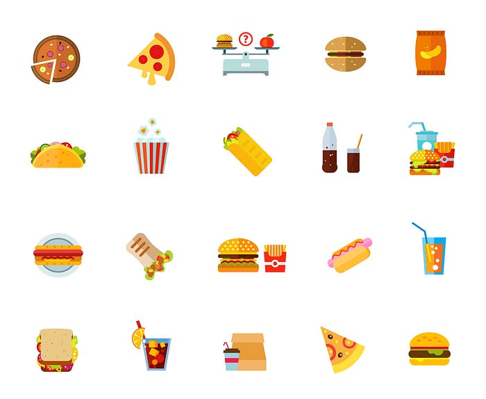
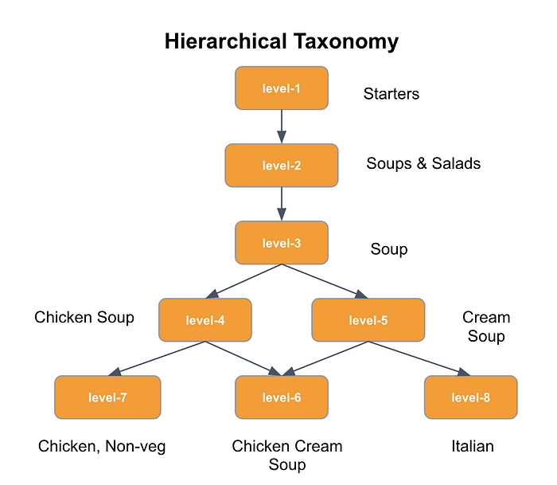
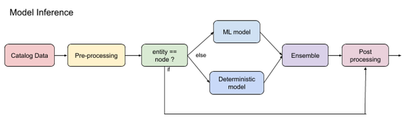
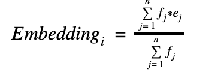
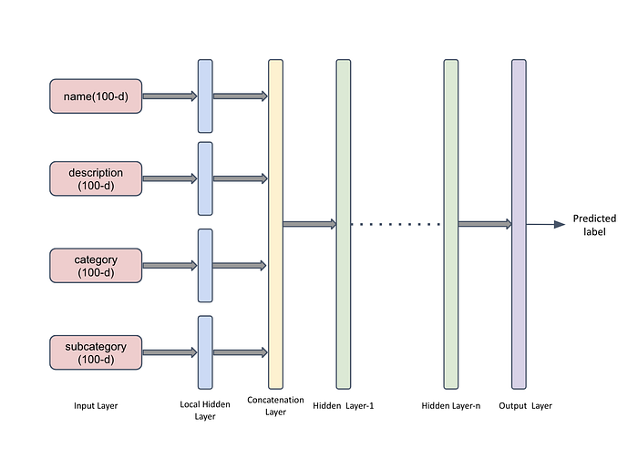
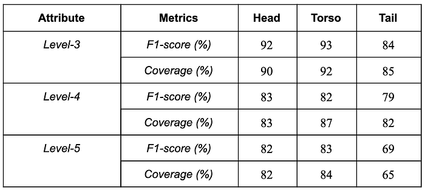

# Decoding Food Intelligence at Swiggy

*Image credits: Food vector created by katemangostar*

_Co-authored by _[_Krishna Medikonda_](https://www.linkedin.com/in/krishnamedikonda/)_, Aditya Bhakta, and Mohammed Safique.   
Special thanks to _[_Jairaj Sathyanarayana_](https://www.linkedin.com/in/jairajs/)_, _[_Shubha N_](https://www.linkedin.com/in/shubhan/)_, Mayank Sinha and _[_Sufiyan VS_](https://www.linkedin.com/in/mohammed-sufiyan-v-s-b4689a1b8)_ for inputs and guidance._

Swiggy has been developing Food Intelligence (FI) to better understand our catalog, relevant to our consumers. This article focuses on the basic, building blocks of FI — the_ taxonomy_ and_ item classification_ — that have helped unlock richer insights on search and personalization.

## A brief history of our Food Intelligence journey

With a pan-India penetration, the current Swiggy menu catalog offers a spread of millions of food items/dishes from thousands of restaurants around the country. Given the unique, personalized, and intimate nature of food, — each item (represented by an item ID), unique to a given restaurant in terms of its preparation style, portion size, serving technique, ingredient mix, spice level, local variation, price, etc. — we treat item IDs as the most atomic element of our catalog. However, from a customer experience POV, it makes more sense to provide and operate at a certain level of abstraction. For instance, in search and recommendations, it is easier to navigate if we organized items at, say, a cuisine level (Mughlai vs. Hyderabadi biryani), or by preparation styles (_handi_ vs. regular), or by course of the meal (starters vs. main-course), etc. To do this, we need to meaningfully understand the contents and attributes of each and every dish and organize this data in a standardized structure.

When we started, we came across a variety of approaches taken by other organizations and labs in this space. _Recipe1M_, for example, offers a compilation of over a million web-scraped recipes and images, each classified to standardized food categories and metadata provided in a structured form. ML models can be trained on these to power applications like image captioning, recipe retrieval, etc. Another approach is to create a Food Knowledge Graph (FKG) as undertaken by the _Foodome_ project. All these however over-index on Western dishes and have limited applicability to an Indian food catalog — the likes of what Swiggy deals with. So, we decided to take a ground-up approach to this problem.

## The Food Taxonomy

The first step towards understanding a large catalog is to identify a standardized lexicon — the organization of food. A restaurant’s menu already provides a hierarchical, skeletal taxonomy. For instance, a menu is typically split into categories (like starters, main-course; or breakfast, lunch, dinner, etc.) and subcategories (like rice, breads, etc.). Our idea is to standardize and build on this.

To map this, here is an example from e-commerce. Consider a top-level category ‘_Beauty’_ (Level-1) which has (among others) two subcategories (Level-2) ‘_Hair Care’ _and ‘_Fragrance’_. ‘_Hair Care’ _has further subcategories (Level-3) like ‘_Shampoo’_, ‘_Conditioners’,_ and ‘_Hair Colors’_. These six entities would be the _nodes_ of the taxonomy; and when any product in the catalog is assigned relevant nodes, the levels are called _attributes_ of this product.

Knowledge from food experts, consultants, chefs and others was required to finalize the granularity of these _nodes_ and _attributes_. To map, say, a dish called _‘pesara pappu payasam_‘ one needs the domain knowledge that ‘_pesara pappu_’ (Telugu for ‘_moong dal_’) is an ingredient. Attributes that were identified as necessary to describe a dish, like cuisine, preparation style, ingredients were included. Nodes were added to the taxonomy by codifying the knowledge of experts into rules. As an example (Figure-1), nodes ∈ Level-4 could be created based on the key ingredient that identified a dish.

To better scale this and to ensure objectivity, we set up and evolved an SOP for taxonomy level-creation and annotation. In summary, the FI Ops team takes _stratified samples_ of catalog items (stratified because we want to ensure we cover ‘head’ items that account for a large percentage of sales before dipping into the long-tail of our catalog). Then creates/refines dish nodes in the taxonomy at each attribute level. This is followed by a moderation step to review with chefs and domain experts to address any questions. Currently, we have tens of thousands of dish nodes distributed across various hierarchical attribute levels in the taxonomy. For the sake of simplicity, let’s denote our base dish attributes as _Level-3, Level-4, Level-5, and Level-6 _(we have more intriguing names internally). The below image shows a snippet of the hierarchical taxonomy.

*Figure 1. Snippet of the Taxonomy (illustrative only)*

Our objective is to have _all_ the items in our catalog _placed_ into this taxonomy. We use a combination of heuristics and ML models for achieving this. We pose this as a multi-label, multi-class classification problem. We train on the annotated data created by the FI Ops team. The models assign taxonomy nodes to all items with a confidence value. Low confidence predictions are mapped to an ‘_others’_ class. Because the taxonomy is never quite complete, we hope to re-classify these during ongoing iterations.

## Mapping catalog items to the taxonomy

The modeling pipeline to predict labels for a given item consists of several sub-modules.

*Figure 2. Inferencing pipeline*

### Pre-processing

All items in the catalog have a name, a lot of them have a description and metadata like category (breakfast, main course, desserts, etc.) and subcategory (rice, bread, shakes, etc.). These text fields are usually short texts, on an average of five words in length. These serve as input features. As this textual data is noisy, the first step is preprocessing. Outside of the usual methods (casing, spaces, etc.), we highlight two components below.

Many food items go by different names in various parts of our country. For example, _‘Chicken biryani’_ is _‘kodi biryani’_ in Andhra/Telangana, _‘kozhi biryani’_ in Tamil Nadu/Kerala and _‘murgh biryani’_ in Hindi speaking states. To capture this regional variation in names we used a corpus of synonyms and typos. In addition to manual seeding, we used **Word2Vec models** trained on name and descriptions to harvest synonyms (top k nearest words) and typos (with a two edit-distance constraint). These were manually screened for high precision. For example, _‘vegg’_ should not be considered a typo for _‘egg’_.

Secondly, special processing to handle _‘combo’_ items was required. For instance, a combo of _‘Chicken dum biryani + mutton kebab’_ with a description _‘freshly prepared biryani in basmati rice served with mint raita and mirchi ka salan’_, contains mentions of multiple Level-3 nodes. We used regular expressions to extract relevant _‘entities’_ from such text and pass each entity for training/gaining inferences.

The next step is to convert preprocessed text fields for entities into vectorial input features for the model.

### Embeddings

The initial step to training embeddings is to build the corpus intelligently. Consider that for an item we choose text features — name (_t1_), description (_t2_), category (_t3_), sub-category (_t4_). A single training document _t1+t2+t3+t4 _can be used to train embeddings. But we observed that such a combined document had limited capacity to capture relationships between words from features like _t1&t3_ or _t1&t4_. Based on experimentation, we landed on documents of the form_ t1+t2, t1+t3, t1+t4, t1+t2+t3+t4_ as features for each item.

We then train a skip-gram based FastText model and obtain embeddings for _each_ feature as follows. If _(e1, e2, e3, ……, en) ∈ E_ are the embeddings of the words _(w1, w2, w3,….., wn) ∈ W_ in the feature _i _with frequencies of words _(f1, f2, f3, ……, fn) ∈ F_, then the feature embedding is calculated as follows:

At the end of this step, we have each of the input features as 100-dimensional dense vectors.

### Models (ML and deterministic)

After experimenting with a few architectures, we landed on a shallow NN with four inputs (each 100-d), fully-connected hidden layers and an output layer with softmax activation. We found that _not_ collapsing the four 100-d input vectors into a single 100-d vector (by averaging or otherwise) led to an 11% improvement in F1-score.

*Figure 3. Neural network architecture*

To further improve model performance metrics, we also used hierarchical information as a post-processing step. This helps if any of the models are not able to produce high-quality predictions. For example, if the Level-3 model predictions (say, soup, _Figure-1_) are with a low probability (say, 0.4) and the Level-4 model predictions (say, chicken soup, Figure-1) with a high probability (say, 0.9) then using the hierarchy where Level-4 is a granular level to level-3, we can assign the Level-3 with higher confidence.

For a few attributes, we learn a single model to predict the least possible sub-attribute for an item. If Taxonomy attribute Level-8 has ‘x’ nodes, its sub-attribute B (level-9) has ‘y’ nodes and B’s sub-attribute (level-10) has ‘z’ nodes, then we trained a single ML model for ‘x+y+z’ classes, using training samples with the target as the most granular level. For example in Figure-1, the item ‘_chicken cream soup’_ which maps as a ‘_non-veg’_ with the ‘_poultry’_ component being ‘_chicken’_, we learn a model to predict ‘_chicken’_ as the target class.

Lastly, for long-tail classes, we typically don’t have enough annotated data in the initial iterations of sampling. In such scenarios, we use _deterministic rules_. This works on a greedy fuzzy word match in the features passed to the model. For example, for an item _‘wheat cheese crackers’_, the outputs are — _‘crackers’_, _‘cheese crackers’_, _‘wheat crackers’_, _‘wheat cheese crackers’_, _‘wheat, cheese’_.

The final inference is based on an ensemble of deterministic rules and ML models.

## Metrics

We use coverage (how many items get a non-_others_ prediction) and weighted F1-score to measure the goodness of models. Since the distribution of classes is not uniform and since many of our downstream applications demand high precision, we use the (sample) weighted F1-score.

The table below shows a representative snapshot of F1-score metrics at the head/torso/tail level grouping of items. This grouping is based on the contribution of items to sales on the platform.

*Table 1. A sample snapshot of model metrics*

## Future work — What’s under the cloche

We continue to explore approaches like NER, multi-task learning and graph embeddings to improve classification performance while adding more nodes and relationships to the taxonomy. Concurrently, we are also working on using the existing data and relationships to power a Food Knowledge Graph that can power a variety of downstream use-cases.

---
**Tags:** Swiggy Data Science · Machine Learning · Intelligence · Foodtech · Taxonomy
