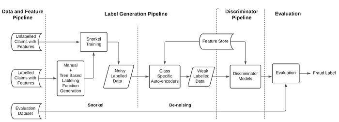
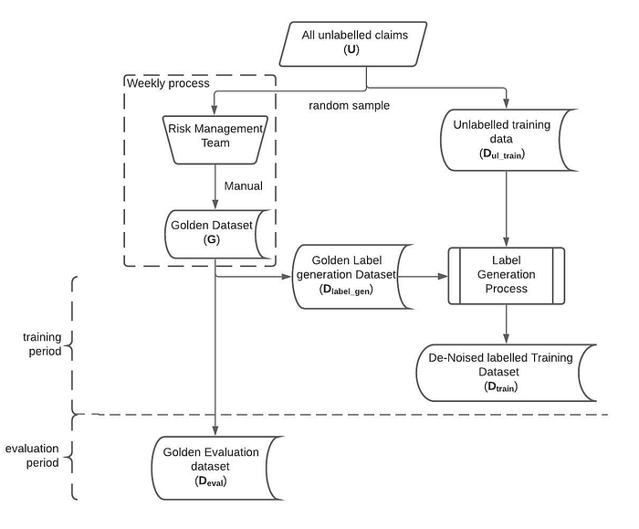
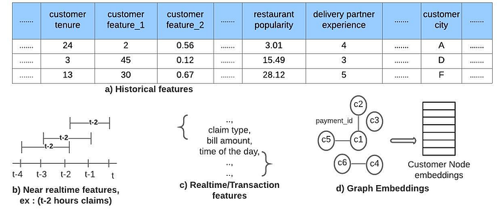
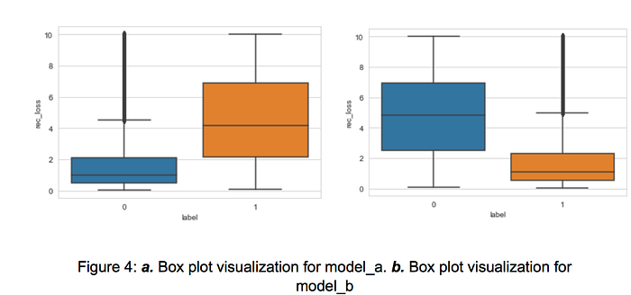
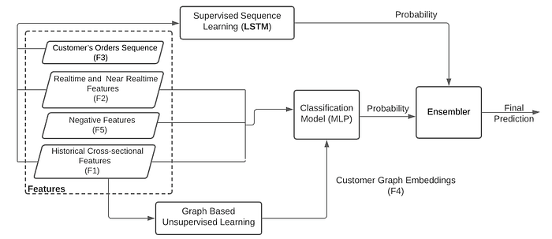
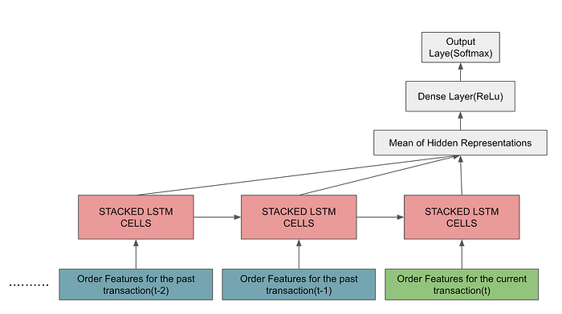
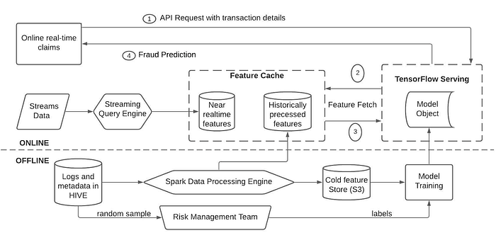
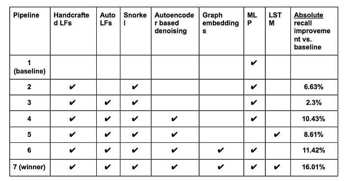
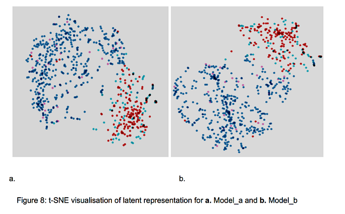

# DeFraudNet: An End-to-End Weak Supervision Framework to Detect Fraud in Online Food Delivery

Co-authored with [Meghana Negi](https://www.linkedin.com/in/meghana-negi/), [Rutvik Vijjali](https://www.linkedin.com/in/rutvik-vijjali-338410155/), [Jairaj Sathyanarayana](https://linkedin.com/in/jairajs)

## Introduction

At hyperlocal online food delivery platforms, the prevalence of fraud and abuse necessitates strong prevention systems that can identify and alert other systems and humans. Since most online food ordering platforms are three-sided marketplaces, abuse can originate from customers, delivery partners, restaurants and collusion between any combination of these entities.

Typically, a combination of online and offline ML models is at play in most fraud detection systems. When a claim is made against a delivered order, real-time models kick in and offer fraud decisioning which is, in turn, used by a customer-service agent or a bot to make the final decision. Supervised models rely on labels and signals harvested from transactions from the past. While there is, typically, plenty of data available on the signals’ side, generating labels is a time-consuming and expensive process. However, to achieve reasonable coverage over fraud modus operandi (MOs), the training data needs to be exhaustive, requiring a broad set of labels. Given that fraud is ever-evolving and dynamic, it makes it even more difficult to rely solely on manual labeling. Hence the need to complement human labeling with label generation at scale using other ML methods.

Our baseline is an MLP based discriminator model built on a limited set of ‘strongly’ labeled data from human experts. In this work, we start with insights and intuitions from the way human experts label transactions and convert them to ‘labeling functions’ (LFs). These LFs label a data point as either fraud or non-fraud or abstain from assigning any label. These labels (and features) are then fed to a Snorkel generative model which synthesizes a single weak label for each data point. Snorkel is a data programming approach developed by Stanford AI lab, that uses an ensemble of weak heuristics and rules based on domain knowledge to create a generative algorithm and apply it to an unlabelled dataset. We then introduce a class-specific autoencoder based method to further ‘denoise’ these weak labels. Lastly, we fit a discriminator model (ensemble of a shallow MLP and an LSTM) to produce the final fraud score. In addition to the usual set of cross-sectional and longitudinal features, we also use embeddings harvested from a **Graph Convolution Network (GCN) built on a customer-customer relationship graph**. This helps us encapsulate connectedness and collusive behavior.

The final, winning pipeline is currently in production and has yielded a 16pp improvement in recall at a given precision level, which is highly significant at our scale. Additionally, this method saved us about 1.5 million person-hours worth of manual labeling effort.

## End-to-end System

Most existing fraud detection research presumes the existence of labeled data and reliability of these labels and emphasizes ML techniques to better predict fraud. To the best of our knowledge, **DeFraudNet **is the first end-to-end system that combines label generation to model serving in a unified framework. Our system consists of 4 stages (Figure 1).

1. **Data & feature pipeline:** This is responsible for building the features that go into the training, validation and ‘golden’ datasets.
2. **Label generation pipeline**: This contains the components to generate weak labels for all data points in the training and validation datasets.
3. **Discriminator pipeline:** This trains the final discriminator models on features and labels from the previous stages.
4. **Evaluation: **This facilitates ongoing evaluation of the fraud detection system by sending a sample of claims to human evaluators and using their judgment to compute precision, recall and related health-check metrics.

Figure 1: DeFraudNet end-to-end Framework

## Data and Feature Processing

**Datasets**

Initially the dataset consists of all unclassified claims U. A small random sample from U is sent to the Risk Management Team (RMT) which manually adjudicates cases to generate ‘strong’ labels. We call this the ‘golden’ dataset G. This dataset is inherently expensive and slow to generate (a few hundred labels per week) and we accumulate this across several months. We further split the human-labeled set G into Dlabel_gen and Deval around an arbitrary date t, to generate a training dataset and an out-of-time evaluation dataset, respectively. Dlabel_gen is used to learn decision tree-based LFs (interchangeably called auto LFs) while Deval (or a random subsample) is used to evaluate all the models.

After isolating G from U, we create Dul_train by sampling a large portion of U. Dul_train and Dlabel_gen are inputs to the label generation pipeline. The output of this pipeline is a denoised, weak-labeled training dataset Dtrain.

Figure 2 shows how these datasets are created.

Figure 2: Datasets

**Feature Engineering**

The features we use can be categorized into 4 types:

a) F1: historical cross-sectional for all entities (i.e., customer, restaurant, delivery-partner, geolocation) involved in the claim (for example, customer tenure, restaurant’s popularity, delivery-partner’s experience level). These help encode medium to longer term behavior of the entities involved.

b) F2: real time & near real time (for example, current order’s details like bill amount, number of claims in the last 15 minutes, time-of-day, claim type). These help capture the here & now information.

c) F3: customer’s orders-sequence related information (cross-sectional and real time features at the time-steps of current and previous k orders). F3 when fed into an LSTM help capture the sequential nature which F1 and F2 do not fully encapsulate.

d) F4: customer graph embeddings. This is motivated by the insight that some fraudsters fly below the radar when looked at in isolation but patterns emerge when analyzed in conjunction with their ‘neighbors’ in some space. We found that shared payment instruments are one of the most common links in fraud rings. We use embeddings from a GCN learned on the customer-payment instrument graph, to capture this connectedness.

e) F5: Additionally, we take a subset of F1 — mainly features focused on the restaurant and the delivery-partner. These help in learning the attribution of ‘responsibility’ to the restaurant and/or delivery-partner in a claim. For example, in a claim about a missing-item in the order, the restaurant may have missed packing the item and/or the delivery-partner may have dropped the item (irrespective of intention). We call these ‘negative features’ since they lead to bad customer experience.

Figure 3: Categories of features

## Label Generation

**Generating noisy labels using LFs**

We generate LFs via two methods: manually and using decision trees. Handcrafted LFs are a direct, best-effort encapsulation of domain expertise and tend to be fairly simple rules based on, typically, 2–3 features. However, hard-coded thresholds on features in these LFs can make them brittle. If the business changes or new fraud patterns emerge, while human evaluators can make mental adjustments to their judgments, the LFs need to be revisited. Decision-tree derived (auto) LFs help alleviate these shortcomings because they learn feature combinations and thresholds from the (human-labeled Dlabel_gen) data. However, also because of this dependency, the extent of patterns they can learn is limited by the patterns covered in human labels. Hence we combine both the approaches resulting in a corpus of 45 handcrafted LFs and 150 auto LFs.

Following is an example of an LF using two features.

@labeling_function()

def Fraud_Rule_1(x):

“”” If (feature1>X and feature2 ==1) then the request is Not-Fraud “””

return NEGATIVE if ((x[feature1]>X) & (x[“feature2”] ==1)) else ABSTAIN

In general, all LFs have the following properties: a) An LF can either assign or abstain from generating a label, b) LF decisions can overlap or conflict with other LFs.

**Snorkel generative model**

Once the LFs are created, we synthesize labels using Snorkel over Dul_train. Internally, the Snorkel generative model creates a label matrix by applying LFs over each data point and formulates label generation as a matrix completion problem to produce noise-aware, confidence-weighted labels with 3 possible values — 0, 1, -1 (abstain). In our case, <1% of labels were of the type abstain and we chose to drop the corresponding data points from further training process. Additionally, Snorkel emits several statistics for LFs, like coverage, conflicts, overlap and accuracy.

We tested the hypothesis of whether more LFs are always better. We experimented by a) pruning LFs at different accuracy thresholds, b) learning a discriminator model over the new labeled dataset (say, D’train), c) testing final performance on Deval. We found that a model using roughly 70% of all LFs had 3.3% better F1-score compared to a model using all the LFs. We hypothesize that this could be due to the dynamic nature of fraud patterns leading to volatility in the effectiveness of LFs and that the full set of LFs may not always be needed.

**Class-specific Autoencoders for denoising**

While Snorkel emits a consolidated label for each sample, our analysis showed that some labels were still noisy. For example, we observed that, among cases which had very similar features, a small minority had opposing labels due to the fact that just one or two minor (in terms of their intuitive contribution towards fraud) features were different. One way to approach cleaning these labels would be to look at individual feature distributions for each class and consider samples with highly deviant features as outliers. However, there may be conflicting samples wherein one feature might be deviant for one class and flipping the label might cause another feature to be deviant for that label’s distribution. This requires generating representations that capture overall distributions of samples belonging to a particular class. We use class-specific autoencoder networks for cleaning the labels. The hypothesis is that, for a given class, the majority of data is correctly labelled by the generative model hence an autoencoder can be learned to reconstruct the correctly-labelled data with low error, and will reconstruct outliers with high error.

Two autoencoder models were trained, let’s call them model_a (trained with samples labeled 0) and model_b (trained with samples labeled 1). Several architectures for autoencoders were explored and verified by examining the separation of reconstruction errors between same-class samples and opposite-class samples against Deval. The architecture that achieved maximum separation in terms of median values of reconstruction errors with early stopping, was an expansive (latent dimension > input dimension) autoencoder with latent dimension (128) being roughly 2X the size of input dimension (54).

We visualize the separation of classes in the validation dataset through box plots (Figure 4).

As seen in Figure 4, the models learn to separate the classes at roughly the 75th percentile boundary (where the two boxes roughly ‘meet’). Based on this, we set two thresholds, threshold_a, the 75th percentile reconstruction error of 0-labeled samples on model_a and threshold_b equivalently for model_b. To achieve denoising we use the following logic: if reconstruction error of a sample on model_a is greater than threshold_a and less than threshold_b, we assign the sample a label of 1 and vice versa. Once the training data is cleaned using this denoising logic, we retrain the autoencoders with cleaned data and all steps are repeated. No new labels were flipped after two iterations.

## Discriminator models

We use Neural Network (NN) based methods as the final discriminator model. All discriminator models detailed below use weak labels of Dtrain and reduce the categorical cross entropy loss. Figure 5 illustrates how combinations of features and models are put together to predict the fraud decision.

Figure 5: Discriminator Pipeline

**Multi Layer Perceptron**

**Vanilla MLP**

The inputs to the MLP include features from F1, F2 and F5. Each feature is transformed depending on how it is originally distributed. For example, normally-distributed features are transformed into z-scores while power-law-distributed features are log-transformed, specifically, ln((1+feature_value)/(1+feature_median)). The final model configuration was a 2-layer MLP with hidden layers of size (25, 3) with ReLu activations. Making the network deeper did not improve the downstream metric of recall.

**MLP with graph embeddings**

Collusion is a common fraud MO but is typically hard to catch using individual actors’ features. To address this, we experimented with augmenting the inputs to the MLP with the graph embeddings (F4). We construct a customer graph g defined as:

_g = (V,E), V= {customer_1, customer_2,…customer_n}, E = customers connected by a common payment instrument._

As is evident, g is a homogenous graph with a single edge-type. Each customer node is decorated with a subset of features from F1. A GCN was learned using the Deep Graph Infomax method on Dtrain (without the labels) and fine-tuned using Dlabel_gen. Customer node embeddings of size 128 are extracted from the final layer of the GCN. These embeddings are concatenated to F1, F2 and F5 and the MLP is retrained. The final MLP-with-graph-embeddings model had 3 layers of size (80,15,3) with ReLu activation.

The ablation study illustrates the lift in recall due to this change.

**The LSTM model**

Literature indicates that learning from activity sequences is more effective in identifying fraud patterns than hand-engineered features. Hence, we develop a sequence prediction model that uses F3 as features (i.e.,customer’s last k orders, their sequence and the (k+1)th (current) order’s transactional features). We arrived at k=20 by evaluating the F1-score for different values of k. We use a multi-layer stacked LSTM and the averaged representation of all hidden states is fed to the final softmax layer. We landed on the final architecture of an LSTM with 4 layers and 128 hidden units each followed by 2 dense layers with 256 and 64 hidden units respectively with ReLU activation using the Xavier initializer.

Figure 6: LSTM Model Architecture

## Deployment and Serving Infrastructure

All streaming logs, fact tables and entity data are available in our Hive based data warehouse. Most historical features are generated by Spark jobs while the near real-time features are generated using SQL-like queries on streaming data using Flink. All features are written to two sinks: to S3 for periodic retraining of models and to Amazon DynamoDB-DAX (DDB-DAX) for online inference of the production model.

At inference time, when a claim is made, the fraud detection microservice calls the model API hosted using Tensorflow Serving (TFS). The request consists of transaction details and real-time features. TFS fetches other feature values from the DDB-DAX cache. The TF model pipeline transforms features using tf.feature_columns, runs model predictions, ensembles and returns the final prediction to the client. We implemented custom transformers to do data transformations not natively available in TFS.

For model training, we used Tensorflow and p2.2xlarge GPU instances on AWS. Model decisions are evaluated on a weekly basis by RMT using a random sample.

Figure 7: Training and Serving Infrastructure

## Ablation experiments

**Setup and Baseline**

Most consumer-facing fraud detection systems are precision-first. Meaning, the downside of calling a ‘good’ customer fraudulent is asymmetrically high compared to the opposite. Hence we designed the ablation study to quantify impact of various pipelines on recall where precision has been fixed at the same, high value for all the variants. Table below shows the various pipelines studied. Our baseline is an MLP trained over Dlabel_gen and is evaluated over Deval.

**Experiments**

In all the non-baseline variants, Snorkel is used to generate labels for Dul_train spanning ~1.5M samples.

Pipeline 2, which uses only the labels from handcrafted LFs generates a recall improvement of 6.63pp vs. baseline. This can be attributed to the training for pipeline 2 happening over a much larger dataset resulting in more patterns being learned.

The auto LF-augmented pipeline 3 performs worse with only a 2.3pp improvement in recall. Auto LFs are limited by decision tree performance as well as the smaller dataset (Dlabel_gen ) they are trained on. We hypothesize that auto LFs are adding more noisy labels and it is not always true that adding more LFs will improve performance. But since the manual curation of LFs is not scalable as fraud patterns frequently drift with time, we keep the auto LFs and add a denoising component resulting in pipeline 4. The results from denoising the weak labels is shown in Figure 8. Here, dark blue colored nodes in Figure 8.a and red coloured in Figure 8.b represent samples originally labelled 0 and 1 respectively, that remained unchanged. Light blue coloured nodes represent the samples that were originally labelled 0 but flipped to 1 and pink coloured nodes represent the samples originally labelled 1 but flipped to 0. This resulted in 8% of label-1 and 11% of label-0 samples being flipped. The MLP discriminator model trained on these ‘cleaned’ labels showed a 10.43pp recall improvement vs. the baseline.

As explained earlier, we experimented with different modeling techniques to improve the performance of the discriminator. We keep the label generation components the same in the subsequent pipelines to measure incremental value of the different modelling techniques or feature generation methods. In pipeline 5, we replace the MLP with an LSTM as the discriminator. With an 8.61pp improvement in recall, LSTM was not able to best the MLP discriminator. However, we should point out that the LSTM only used features from F3 and we couldn’t use features from F1, F2 and F4 due to cost and infrastructural limitations. However, we qualitatively observed that the LSTM performed better than the MLP in cases where the customer’s recent behavior was ‘bursty’.

Pipeline 6 builds on pipeline 4 by adding the graph embeddings. This improves the recall by 11.42pp (and ~1pp over pipeline 4, demonstrating the additional value-add from graph embeddings). Customers that were identified as fraudulent by pipeline 6 and not by pipeline 4 had one or more edges with a fraudulent claim rate that was 3X higher than the median.

Finally, we combine all components into pipeline 7 and ensemble the predictions from the MLP and the LSTM to achieve a 16pp improvement in recall. This winning pipeline is currently deployed in production serving real-time decisions in milliseconds on hundreds of thousands of claims per week.

## Conclusion and Next Steps

This work demonstrated the effectiveness of a pipeline consisting of handcrafted and auto-generated LFs followed by class-specific denoising autoencoders, to build effective supervised models when strongly labeled data is scarce. We show through our experiments how each step in the pipeline improves the evaluation metrics and propose a final multi-stage architecture for fraud detection. Our final model achieved a 16pp improvement in recall when compared to the baseline MLP trained on limited, manually annotated data. This approach can easily scale to additional fraud scenarios and to use-cases where labeled data is sparse.

A sample of future work includes using variational autoencoders to generate synthetic data around pockets where the naturally-occurring data appears to be sparse but is known to be abuse-prone. While we take into account longer term history of the customer, at an aggregate level, the recent bursty behavior can sometimes overwhelm the final prediction. Hence we could focus on extending the LSTM using attention based mechanisms . While we explored connectedness via a homogeneous graph of one edge-type, fraud patterns usually tend to be multi-tenant. Identifying fraud spread through multiple edge types (for example, deviceIDs/wifiIDs) and heterogeneous graphs with restaurant and delivery partners into the mix is an active area of research for us.

Shout-out to Swiggy DS alum [Vikesh Singh Baghel](https://www.linkedin.com/in/vikesh-singh-baghel-28601322/) and [Thejasvee Devaraj](https://www.linkedin.com/in/thejasvee-devaraj-52958273/) who contributed to the model development during their time with Swiggy.

---
**Tags:** Auto Encoders · Fraud Detection · Weak Supervision · Lstm · Swiggy Data Science
