# Delivering a million downloads every week

> Streamlining app releases with code


*Image credit: freepik*

It was not long back that only a few Indians had access to fast, uninterrupted internet and a select few among them permitting automatic updates. But now, with access to highly affordable mobile data connectivity, and high-speed internet, the **dynamics of usage are evolving**.

This presents a scenario where more than half of **Swiggy users update to the latest release within a week**. Gone are the days when we had to think about releases that have been done months back and take into consideration the stability of those old app versions every time we build and release even a small feature. New features can now be shipped quickly to make the lives of Swiggy users a little more convenient each time. Having said that, this** opportunity can quickly turn into a catastrophe** when there are last-minute surprises cropping up — primarily due to lax in following guidelines (logical unit tests, static analysis of code, getting reviews from the feature owners) coupled with a compromise on the quality. This means we end up with **unstable releases and a lot of unhappy users**.

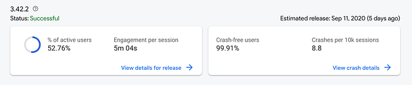
*Adoption of our latest release (52.76% in 5 days)*

A need thus arose to compress our release cycle times with absolutely no compromise on the quality, an incentive to practice the mantra of “_Kings of Convenience”_** **within the team, and an opportunity to explore a different programming paradigm.

Even with millions of active users and hundreds of thousands downloading the Swiggy app every day, we have **successfully maintained high levels of app stability**. This is the story of how the Swiggy Android Team removed the inefficiencies in our release cycle by automating the workflow for Swiggy app updates and releases.

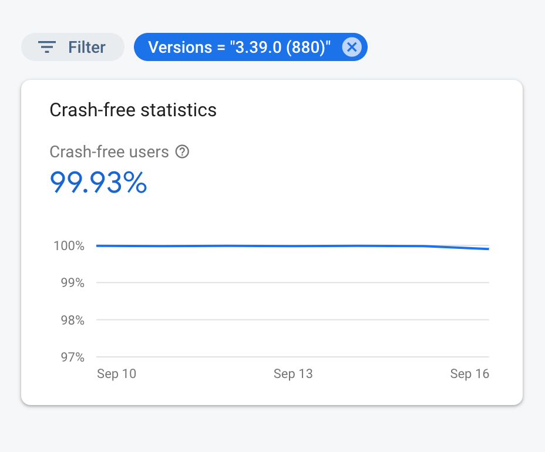

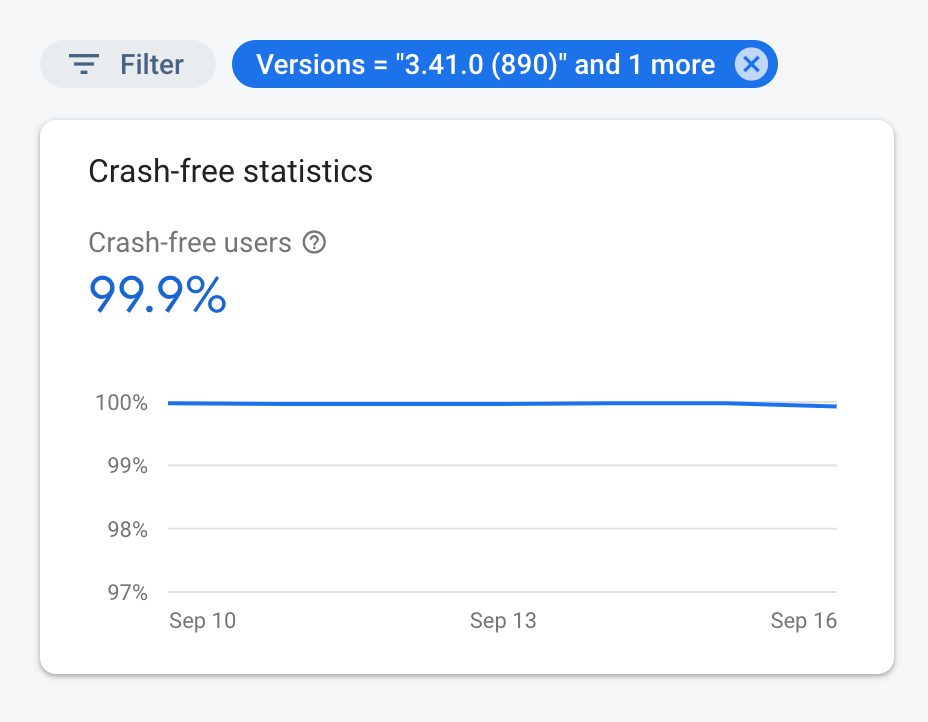

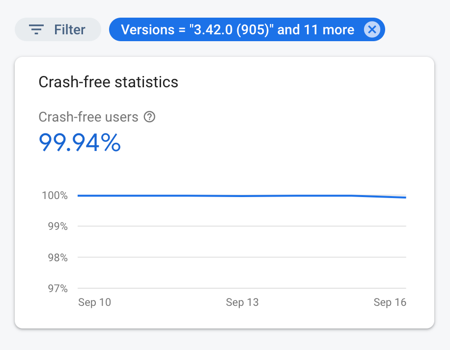
*Stability metrics for our most recent builds*


---

## Demystifying a release cycle

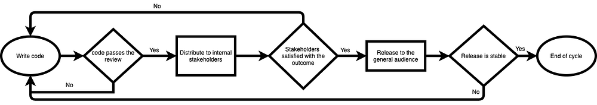
*A normal release cycle*

Looking at the **operational** steps from the perspective of roles gives us greater insight into what goes into an efficient release.

As a **Developer**

- Follow guidelines (lint checks, best coding practices, unit test coverage, getting it reviewed by the respective feature owners, getting at least 2 approvals).
- Distribution of the build to internal stakeholders.

As a **Gatekeeper**

- Ensuring code that will potentially break builds is not accepted.
- Provide pointers of guidelines not being followed to developers.

As a **Release Manager**

- Notifying the wider team of a public release.
- Maintaining an easily accessible history of all the releases made.

As an **Enthusiast**

- Create checks that help mitigate problems introduced by no fault of yours.


*Image credit: freepik*

With that out of the way, let us go over each step in detail and what has been done to make the step easier or in some cases entirely automatic.


---

## Streamlining Guidelines for developers

> Done with code, need to a raise a pull request. How should I describe the changes?Where do I link a feature story? How do I convey the dev tests I’ve done? How do I communicate about the user interface changes?

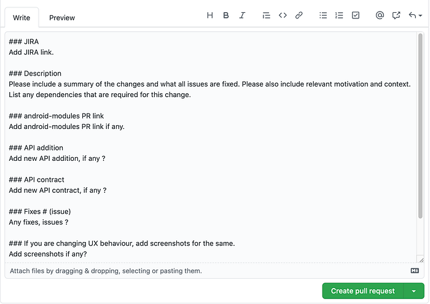
*Github template in action*

This has been streamlined using **Github’s **[**pull request template**](https://docs.github.com/en/github/building-a-strong-community/creating-a-pull-request-template-for-your-repository). The_ ‘open a pull request screen' _for our repository looks like this. This creates a standard in terms of expectations of a pull request. It is as simple as creating a **pull_request_template.md** file in a **.github** folder in your codebase and GitHub takes care of the rest.

> Who do I add as reviewers?

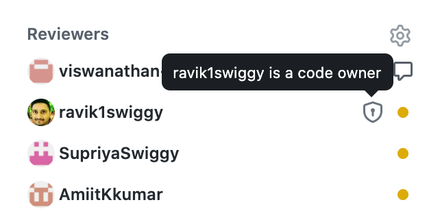
*Github highlighting code owners*

We use the [**code owners feature**](https://docs.github.com/en/github/creating-cloning-and-archiving-repositories/about-code-owners)** of GitHub** to define the feature owners based on the folder in a CODEOWNERS file.

> How do I inform the reviewers that some guidelines are not met or the gatekeeper that this code is not ready to be merged

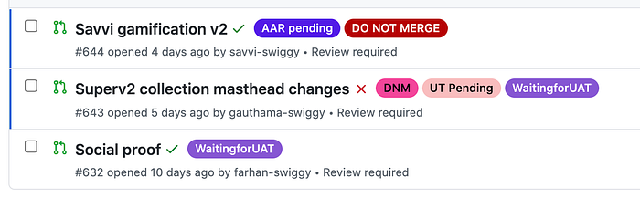
*Labels in Github*

We use [**labels**](https://docs.github.com/en/github/managing-your-work-on-github/about-labels)** to communicate** any expectations which have not been met yet in a pull request so as to not unknowingly get peers to review a pull request.


---

## Distribution of Feature Builds

> The testing team wants an APK pointing to the UAT environment. The product manager wants to have a look with mocked data. The designer wants to suggest some changes for some particular use case. The analyst wants to check an edge case scenario. Oh God! I’ll be wasting an entire day in distributing all these builds…

We have created a [slack app](https://api.slack.com/start) to cater to the requirements expected of the android team. One of the **capabilities of this app is to behave like a bot** and generate builds taking in various parameters and giving the status of the build as well the artifact in a slack thread. All of these builds are delegated to a Jenkins server capable of **running parallel builds** hence saving valuable developer time.

_We have had >100 stakeholders (even non-engineering team members) use this with an average of 10 builds generated every day._

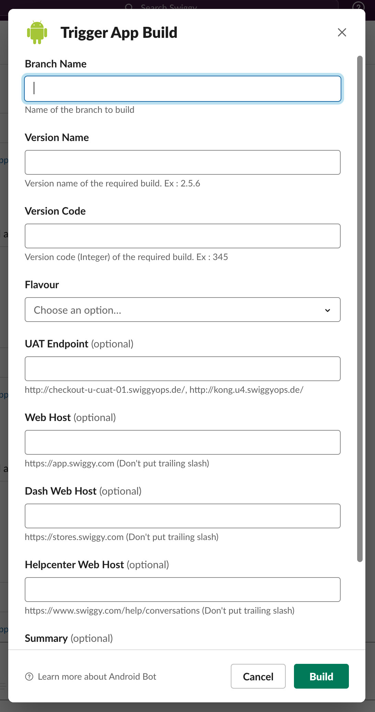

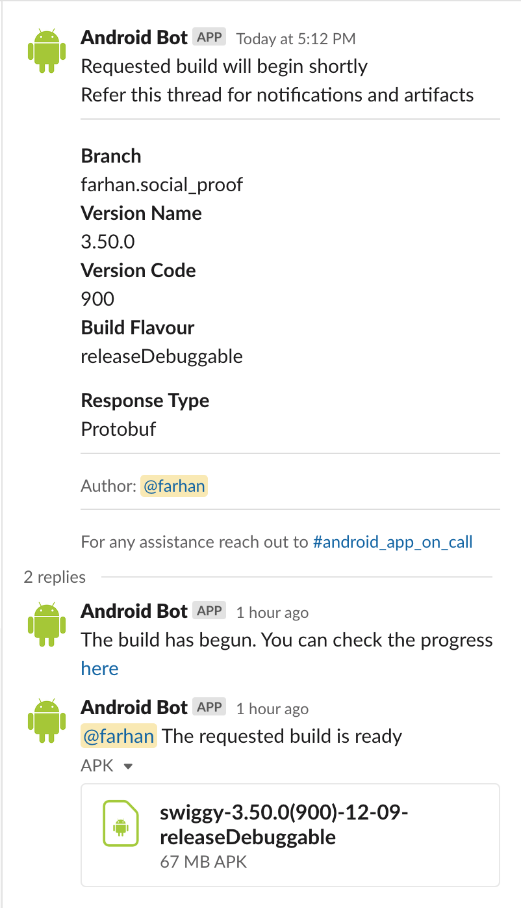
*Left: Slack dialog to generate a build. Right: The build thread*


---

## Preventing potential release-breaking changes

> As a gatekeeper it is not possible for me to ensure that a pull request doesn’t introduce changes which will cause the build to fail or violates important guidelines.

We are using the [**GitHub checks feature**](https://developer.github.com/v3/checks/) to ensure that code that is causing the compilation to fail or is not adhering to guidelines is not allowed to be merged. We have enabled [Github’s pull request](https://developer.github.com/webhooks/event-payloads/#pull_request) webhooks to get notified whenever a pull request has been created and also every new commit that comes after that. The payload of this notification is delegated to our Jenkins server to run different builds after which the results are notified to Github.

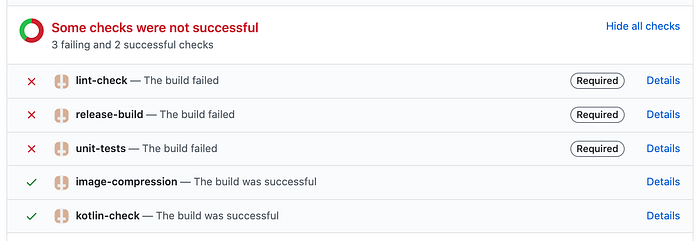
*A failing checks report*

A brief overview of our current checks is

- **Lint-check** — We use [detekt](https://github.com/detekt/detekt) for Kotlin, [checkstyle](https://github.com/checkstyle/checkstyle) for java and [pmd](https://pmd.github.io/) for coding best practices.
- **Release Build **— The universal APK of the build flavor that is going to be used to create a build for the play store.
- **Unit Tests **— A successful run of unit tests combined with a minimum code coverage requirement.
- **Image compression** — Checking whether the image assets in the PR are in the most optimized form. **Creates a webp equivalent of the image** and checks whether the size can be further reduced.
- **Kotlin check** — With google’s push towards kotlin as the de-facto standard for android development, we want to ensure all the new files that we accept in a pull request are written in kotlin.


---

## Pointers of guidelines not being followed

> As a gatekeeper it is difficult and time consuming to point out best practices always. Also developers find it redundant to run something like a lint check in their local repositories.

We are using the [**Github developer API**](https://developer.github.com/v3/pulls/comments/) to automatically create review comments on a pull request. The comments are created exactly at the line where the lint check has been violated. This API is called while we are generating the lint-check as mentioned in the above section and we piggyback on the results of the detekt, checkstyle and PMD plugins to pinpoint the exact line number of the violation.

Apart from the third-party plugins, we have created [**custom lint checks**](https://www.youtube.com/watch?v=jCmJWOkjbM0&vl=en) to ensure an in-house check to aid automation testing.

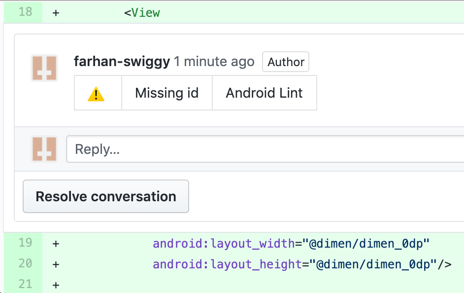

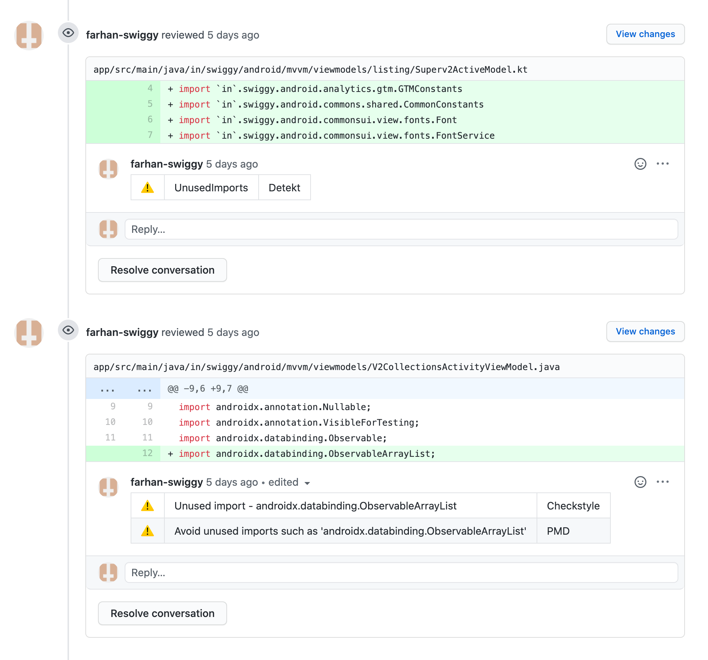
*Left: custom lint checks to ensure an id is present in the view. Right: the output of detekt, checkstyle and pmd plugin*

We use jacoco to generate our test reports. After a successful jacoco unit test suite run, we use [diff-cover](https://github.com/Bachmann1234/diff_cover) to generate a coverage report specific to code changes in the pull request. This points out to the developer and the reviewers if any major flow of logic has been overlooked while writing the tests.

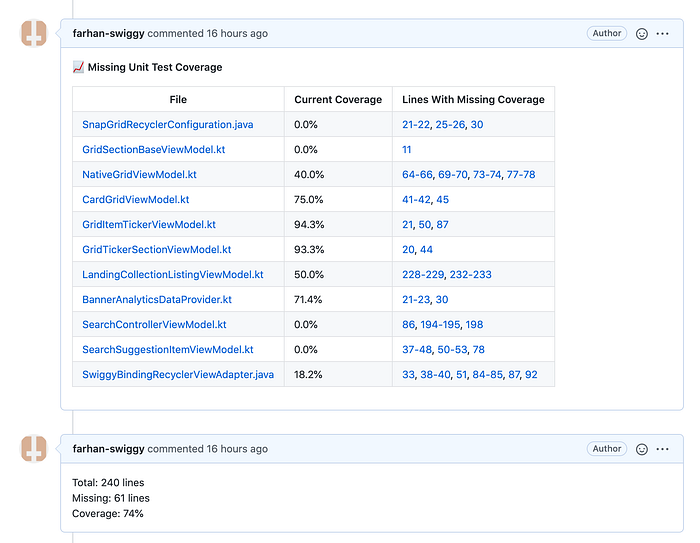
*Comments pointing out the missing unit test coverage and the overall coverage of a pull request*


---

## Notifying the wider team of a public release

We are using the [GitHub release API](https://developer.github.com/v3/repos/releases/#create-a-release) to create a release whenever a build is uploaded to the play store. In addition to this, we use the GitHub slack application. This combination of tools ensures that we achieve two results

- Create a release entry in our GitHub repository.
- Create a notification in a slack channel which notifies the wider team.

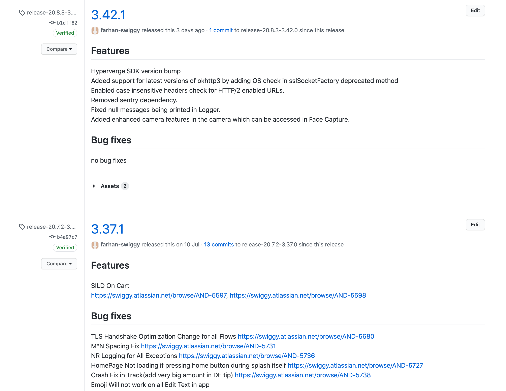

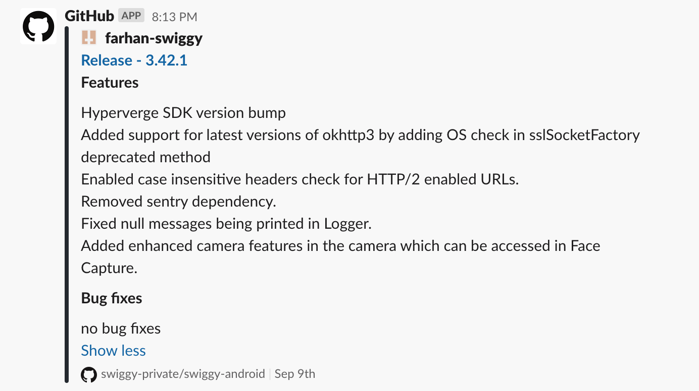
*Left: Release entries on the Github repository. Right: Slack notification of the changelog*


---

## Maintaining an easily accessible history of releases

When creating a release using the API as mentioned in the previous section, a tag is associated with that release. This ensures that GitHub creates a git tag for us. This ensures that in the future even if we move out of GitHub, we will have a release history at a git tag level.  
   
We create a composite tag using the branch, version code, version name and release date so it is visually easy to identify a faulty build and estimate the impact.

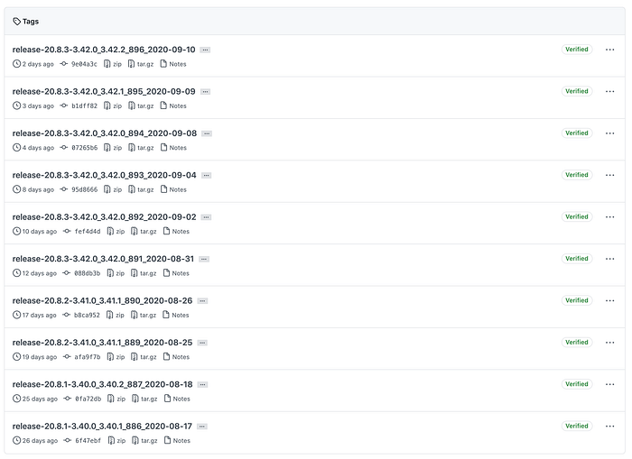
*The list of git tags created with every release*


---

## Auxillary checks

Based on our past experience of different issues that our users have faced, we have created some auxiliary checks that ensure that we never repeat the exact same mistakes again. I will try to explain two instances and the solutions that we have implemented to stop a recurrence.

- One of our apps after being released on the play store to the entire audience was flagged by Kaspersky for malware. This was no mistake of ours but rather a false alarm from Kaspersky. Nonetheless, we had users complaining about this. To mitigate this we have added a malware alert in our nightly check (This nightly check is a collection of build configurations that we run every night on the release candidate before it is given a formal signoff).

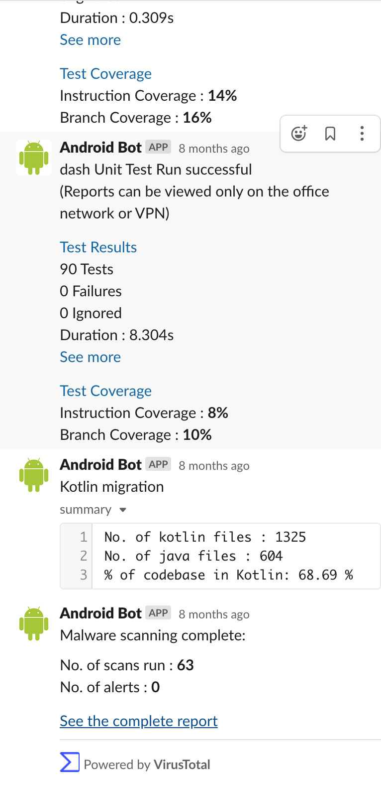

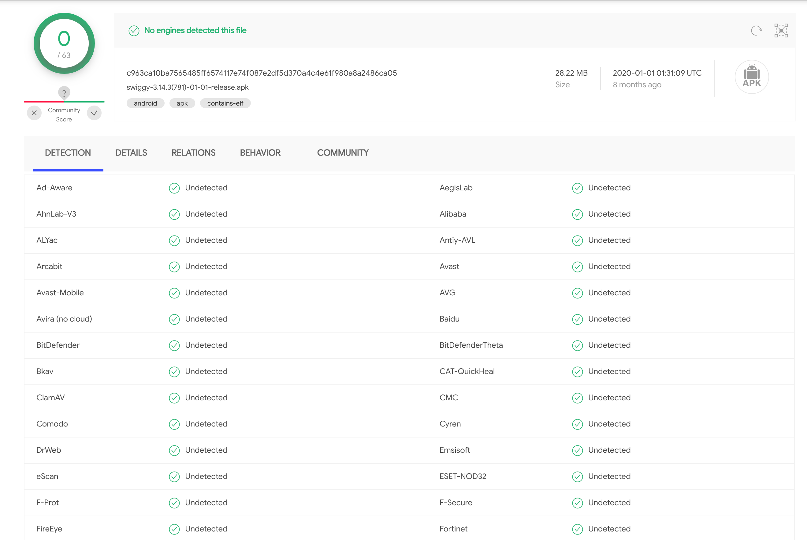
*Left: Malware check at the end of the list. Right: The generated malware report*

- The second instance is related to the APK size. During the development of Swiggy’s Android Wear app, an increased APK size was flagged by some of our alpha users. To mitigate this a feature was added to the bot which delegates the comparison of APKs generated from two different branches and generates a report highlighting the differences between the two builds in decreasing order of size.

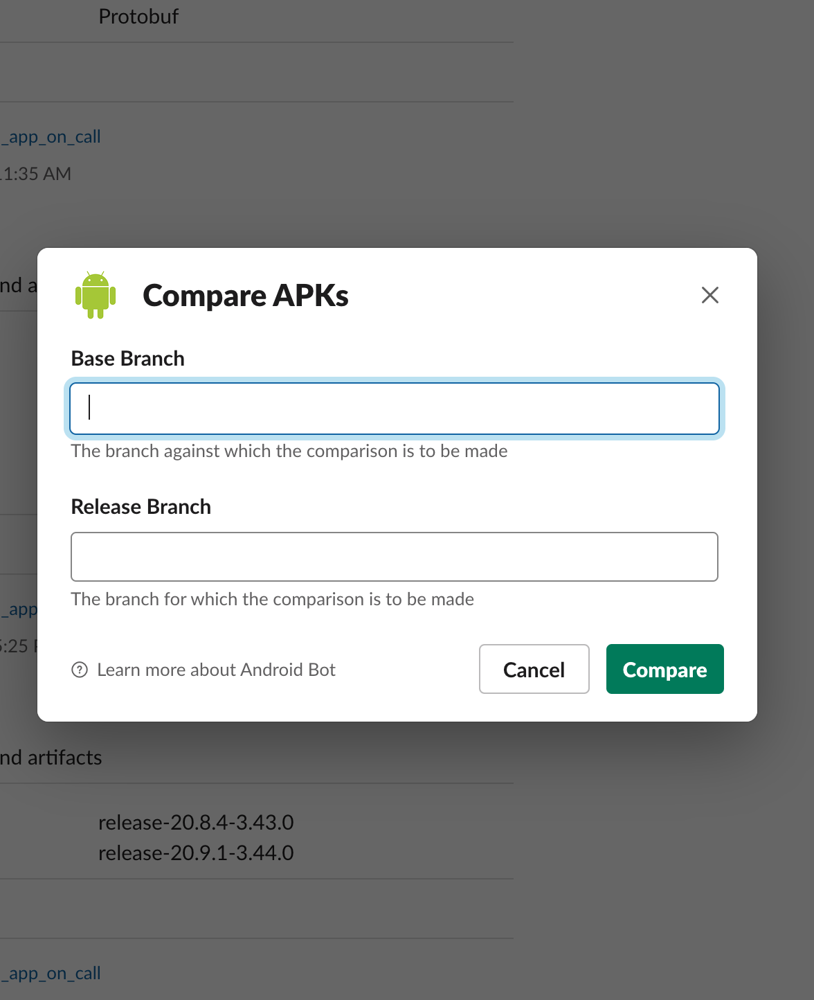

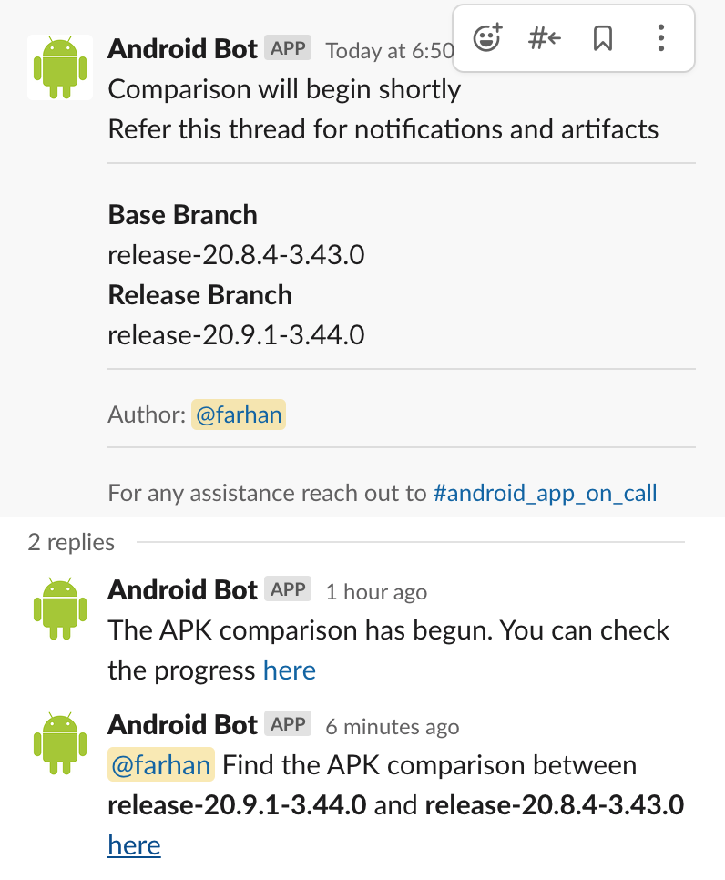

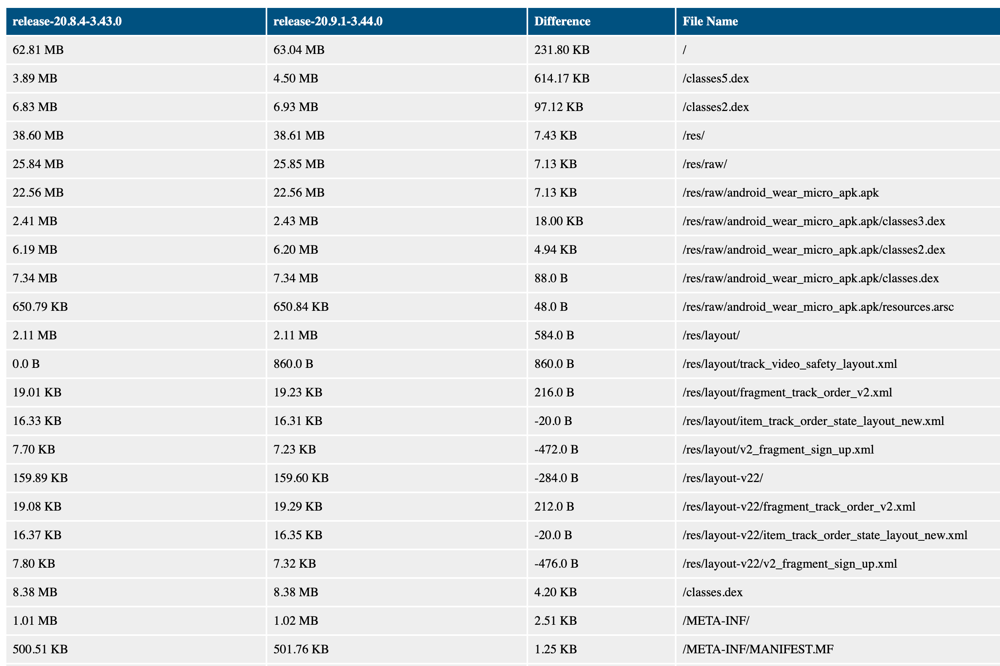
*The apk size comparison dialog, the resulting thread and the comparison report*


---

## Conclusion

I wish there was a way in which I could calculate the time that we have saved or the headaches and the heartbreaks that have been avoided, nonetheless, it is certain that I have learned a great deal when it comes to efficient **maintenance of a mobile application which is used by millions** today and hopefully billions tomorrow.

### Testimonials from my colleagues

```
Easy to use, need not depend on anyone to get builds, anybody across the organization can use this seamlessly
- Poojitha Shetty(Techinical Program Manager)
All developers have different code editor settings in their respective studio and through lint check, indentation problems are nullified.
- Ravi Teja Kasturi(Mobile developer)
Builds can be triggered from a phone or a laptop with the same ease.
- Vishnu Raju(Mobile QA)
With multiple developers raising pull requests, we don't have to worry about fixing compilation breaks caused by someone else's code
- Supriya Saha(Mobile Developer)
```

While I have given a lot of importance to the tools(Github and Slack) while writing this story, be rest assured there is something equivalent in competing products. The major takeaway is to **leverage the tools at your disposal to make your everyday work simpler**.

A big shout-out to folks at [GitHub](https://medium.com/u/8df3bf3c40ae?source=post_page---user_mention--acb7bc5c07ba---------------------------------------) and [Slack API](https://medium.com/u/272cd95a3742?source=post_page---user_mention--acb7bc5c07ba---------------------------------------) who have made such amazing products and using them every day, I realize that I’m merely scratching the surface and there is a lot more to explore.


---

## Acknowledgements

> I am Farhan from the Android Mobile team at Swiggy, I would like to thank my colleagues [Sourabh Gupta](https://medium.com/@sourabhgupta_63169), [Manjunath Chandrashekar](https://bytes.swiggy.com/@manjunath.c23), [Viswanathan K P](https://bytes.swiggy.com/@viswanathan.kp_87326) and Madhu Karudeth for helping me finish this blog.

---
**Tags:** Swiggy Engineering · Swiggy Mobile · Swiggy Life
