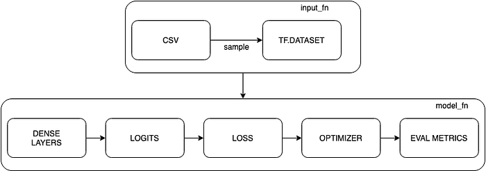
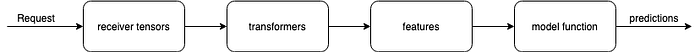
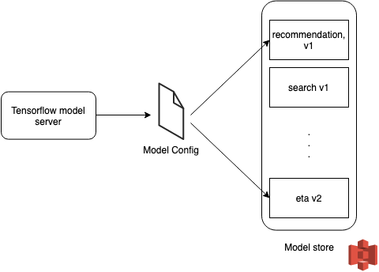
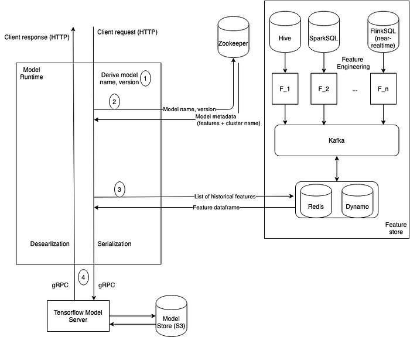

# Deploying deep learning models at scale at Swiggy: Tensorflow Serving on DSP

_Co-authored with _[**_Abhay Chaturvedi_**](https://www.linkedin.com/in/abhay-chaturvedi-0837a48b/)

*Image source: undraw.co*

In a [post](https://bytes.swiggy.com/enabling-data-science-at-scale-at-swiggy-the-dsp-story-208c2d85faf9) from last year, we wrote about our ML deployment platform called Data Science Platform (DSP) and how that’s been enabling us to scale ML at Swiggy. We ended that post with a list of capabilities being developed. We are happy to report that we recently released Tensorflow Serving ([TFS](https://www.tensorflow.org/tfx/serving/architecture)) capability and the first set of online models is currently live. We present some of our learnings in this post.

To recap — up until now DSP primarily supported [MLEAP](https://mleap-docs.combust.ml/) as the serialization/ deserialization/ runtime engine for serving online models. This framework comes with its own set of challenges, some of which are:

1. **Code rewrite**: Most data scientists prefer building their models in Python which necessitates a rewrite in Scala once they decide to take the model to production
2. **Minimal XGBoost support: **Scala-Spark doesn’t provide native support for XGBoost. Due to this, XGBoost models are not deployable in production due to serialization/ deserialization errors that arise during runtime
3. **JVM dependency: **Deep learning models when integrated with MLEAP, run on JVM making the model less performant and adding a dependency. Currently, the only way to deploy DL models is to onboard them as offline cron jobs which emit predictions. These predictions are later stored on Redis/DynamoDB and are fetched during serving time

To address the above challenges, we zeroed in on Tensorflow Serving due to its ease of use, community support, robust C++ binaries and standardized signature definitions. Specifically, we provide support for TF 1.x and 2.x (with eager mode disabled and graph mode enabled) due to a bunch of reasons mentioned [here](https://stackoverflow.com/questions/58441514/why-is-tensorflow-2-much-slower-than-tensorflow-1) and [here](https://github.com/tensorflow/tensorflow/issues/33487#issuecomment-548071133). The eager mode does provide superior debugging capabilities and faster prototyping at the expense of the most practical quality, speed.

In this post, we’ll go over the model flow — training, evaluation, serialization, and deployment. We’ll end with a few niche/custom features we built to ease deployment.

## Training

Most of the base tables from which training data is derived reside on Hive and Tensorflow expects data to be in the form of TFRecords and Tensors. After a lot of thought, we used CSVs as a bridge between these ecosystems and found a [helper](https://www.tensorflow.org/api_docs/python/tf/data/experimental/make_csv_dataset) that converts CSVs into tf.dataset. To avoid loading the entire dataset on RAM, we used an iterator to load data in batches (defined by `batch_size`) and feed them to the model. Next, we use estimators to load data, provide model-level abstraction, handle exceptions, and create checkpoint files (for recovery in case of failures). At its heart, every estimator expects a model function that builds graphs for training, evaluation, and prediction. This is where appropriate layers, loss functions, optimizers, and evaluation metrics have to be defined.

*Figure 1: Internals of Tensorflow Estimator*

Stop condition for training can be defined in one of the following three ways:

1. Input function, which throws a `StopIteration` error after exhausting the input data to be fed
2. `EarlyStopping` callback function, which monitors the loss and stops the training once loss drops below a predefined threshold
3. `max_steps` configuration, which prematurely stops the training once the number of steps crosses the defined threshold

Once the training is stopped, the latest/best checkpoint is taken for evaluation.

## Evaluation

This phase validates accuracies against the hold-out dataset to provide an unbiased evaluation of the model. We use the latest checkpoint from training, define a different input function (on the new data), and feed data into the estimator. A precursor to this would be to initialize relevant evaluation metrics while defining the estimator (in training).

Once the evaluation is completed and the accuracies are validated, we freeze the graph for deployment.

## Serialization

To export an inference graph as a saved model using the latest checkpoint, a serving function has to be initialized. We use the same function to define serving-time transformations (for example, normalization, scalarization, if-else, etc.), thus helping us decouple preprocessing from the model function.

A typical flow of serving function looks like -

*Figure 2: Internal workings of a serving function*

The serving function is passed on to either of the two exporters available -

1. _Latest Exporter:_ we used this. This generates the **latest** checkpoint and garbage-collects stale exports (by providing a way to specify how many exports to keep in disk)
2. _Best Exporter_: This generates checkpoints and exports the **best** model, based on the compare function given (defaults to smallest loss)

The frozen graph (as .pb) and trained variables are used in the next step — deployment.

## Deployment

The deployment phase works with 4 main components: feature store, model store, model control tower, and the runtime engine.

### Feature store

Data scientists are provided with two ways of creating a feature — using a notebook (no language barrier, scheduled on [Qubole](https://qubole.com/)), or with the help of a Spark SQL query (scheduled as a Spark job). Features can have Hive, Snowflake, and Presto as sources and again, Hive, Snowflake, and Redis/DynamoDB as sinks. In the case of online models, features are stored into our fast layer which is later fetched during model execution by our runtime engine. We call this setup the feature store.

### Model store

The frozen graph and trained variables are uploaded to the model store. The deployment of these models is controlled using a model configuration file (more on this below). This file takes the name, version, and S3 path of the model. Each model file can specify multiple models and multiple versions of the same model to be deployed by the Tensorflow model server. At Swiggy, we maintain one configuration file per POD, in other words, all the models belonging to that POD will be deployed on a single cluster.

*Figure 3: Objective of the Model Configuration File*

### Model control tower

Data Scientists use the UI of Model Control Tower to enter metadata like name and version of the model, name, and version of features used by the model, S3 path where the frozen graph and variables reside and a flag to indicate if this is the default version of the model. (Refer to the [previous DSP post](https://bytes.swiggy.com/enabling-data-science-at-scale-at-swiggy-the-dsp-story-208c2d85faf9) for more details on feature/model store and control tower).

### Runtime Engine

*Figure 4: Architecture of the runtime engine*

The powerhouse of DSP, the runtime engine connects the feature store and the model server. When a request comes in, runtime performs the following steps.

1. Derives the model name and version from the REST endpoint
2. Calls Zookeeper with the model name and version to retrieve the list of features the model depends on and route entry to the cluster on which model is deployed
3. Calls the feature store to fetch values corresponding to the features
4. Routes the request to the relevant cluster and makes a gRPC call to the Tensorflow model server with the feature values retrieved in the previous step. We use the SerDe framework to serialize feature values into _TensorProto_ format
5. Once the predictions are retrieved from the model server, we deserialize model output into JSON format and send the response back to the client. Predictions are logged back to Hive through Kafka along with features and model metadata (version used). This is used for downstream analytics and model metrics tracking

Tensorflow Serving inherits all of the scaling and throughput capabilities of DSP. For example, in the case of models that power ETA promises at various stages of order flow (at the cart, first-mile, last-mile, etc.) we fetch ~120 features and can maintain P95 latencies of <15ms at 1000 requests per second. An additional optimization that helps TFS is that we implemented a sidecar design pattern to co-locate the Tensorflow model server alongside the runtime engine.

Lastly, we also ended up developing some niche/specific features that helped speed up some of our development and integration tasks.

1. Tensorflow has a 1-to-1 mapping between estimators and endpoints, which makes sense when a client calls one endpoint to get one model’s output. In scenarios where the client wants to pre-fetch N models’ outputs in one go, it is infeasible to make N different calls to DSP. To address this, we used a variation of multi-task learning to serve multiple models through a single endpoint
2. Keras provides easy to use APIs for data scientists to iterate fast. A way to deploy tf.keras models is provided by converting Keras models to Tensorflow estimators. This functionality will be deprecated once Tensorflow provides native support to Keras ecosystem (which was announced with TF2.0)

## Acknowledgements

We want to thank [Abhinav Litkar](https://www.linkedin.com/in/abhinavlitkar/) for agreeing to have ETA models as POCs as we built this. Also thanks to [Siddhant Srivastava](https://www.linkedin.com/in/siddhant-srivastava-61579675/), [Soumya Simanta](https://www.linkedin.com/in/soumyasimanta/), [Jairaj Sathyanarayana](https://www.linkedin.com/in/jairajs/) for their inputs.

---
**Tags:** TensorFlow · Deep Learning · ML Engineering · Swiggy Data Science · Swiggy Engineering
