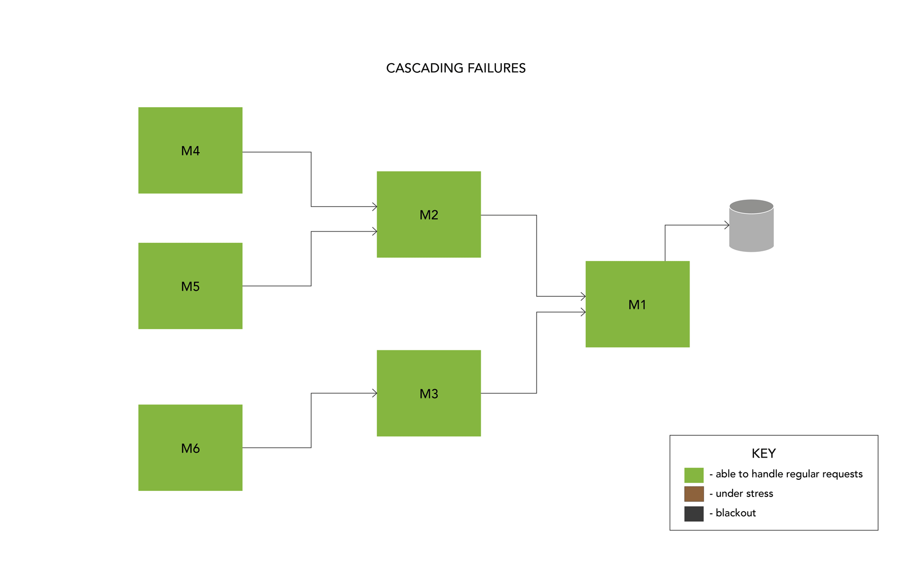
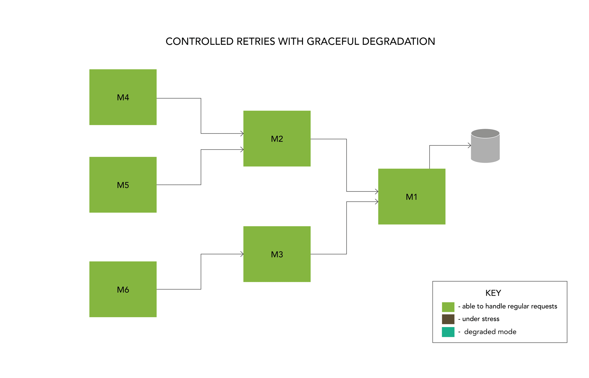
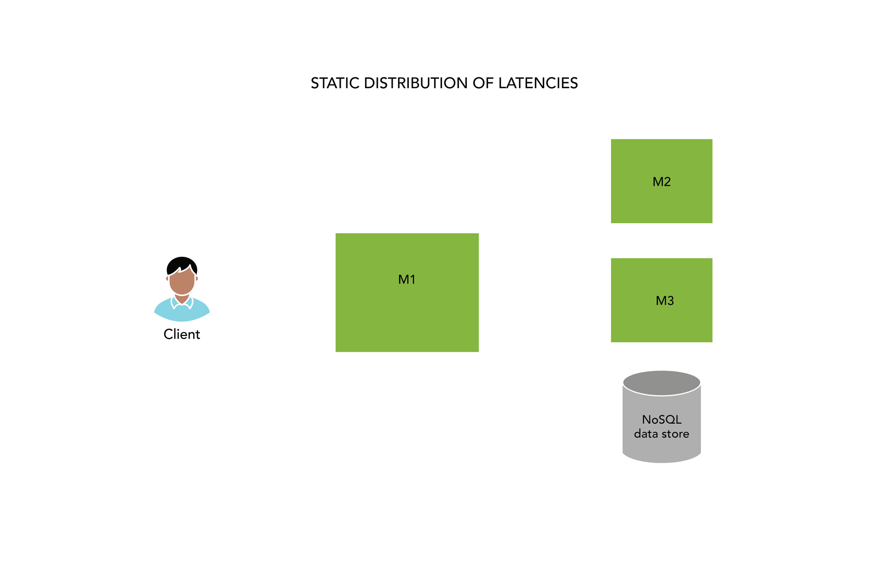
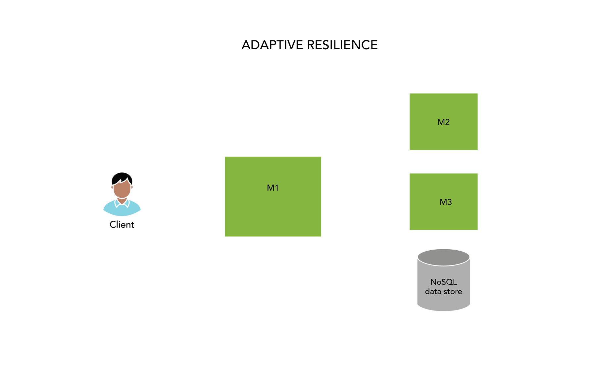

# Designing Resilient Microservices — Part 1

When you open the Swiggy App, the home page load involves a series of computations in our backend infrastructure to provide an _orderable_ set of convenience services that are personalised for you. See [engineering challenges at Swiggy blog](./engineering-challenges-at-swiggy-430dea6c86a3.md) for a description of computational complexity and overview of the problem space. We operate over 400+ microservices in production with over 130+ microservices directly participating in the order fulfilment path (from rendering the home page to food delivered at your doorstep!). How do we ensure that millions of orders everyday are fulfilled to customer expectations despite individual microservices encountering failures? How do we ensure that a brownout in one of the services does not cascade to large scale outage that impacts the entire platform? How can a microservice protect itself from partial and/or complete failures of its dependencies? We will discuss these problem statements and solutions we developed in a series of blogs titled “Designing Resilient Microservices” with specific examples and code snippets for both golang and Java.

## What is Fault Tolerance?

Microservices architecture comes with several benefits — localized, federated ownership of (micro)functionality enabling small teams to develop, test and release new functionality to production. However, this massive distribution does pose some functional and non functional limitations. **Functional limitation includes ability to assert that a Customer facing feature works as expected when their ownership is split across tens of services.** We will be covering this topic in a separate blog series, but for now we will focus on a non-functional limitation. Let us illustrate this with an example -You own a microservice to calculate the price to pay for a given user’s cart. There are several aspects to calculating the final price which include price from the catalog, applicable discounts, taxes, fees just to name a few. Each of these could be owned by multiple different microservices. As the owner of the pricing service, you need to provide a SLA guarantee to your clients. This includes both availability (e.g. 99.99%) as well as latency (e.g. P99 of 100 ms). Fundamentally, building a fault tolerant microservice is about _early_ _detection_ of failure scenarios and _optimal_ handling of the situation. A failure scenario can be caused by either an infrastructure component (e.g. caching layer) or dependent microservice. We will use the term _dependency_ to refer to either of these in the rest of this blog series.

## Detection of Faults

There are two types of faults that can occur in a dependency. A blackout which means that dependency is completely unavailable (100% of the requests fail). This situation, for example, can be triggered by a network partition. A _brownout_ is said to occur when dependency is _partially_ available — meaning either X% (X < 100) of requests succeed or the request succeeds but breaches its latency SLA. A brownout can occur if a dependency is under stress due to a resource limitation and is quite common in distributed systems. Detection of both types of failures can be done by using a circuit breaker pattern for which there is extensive literature (See [here](https://docs.microsoft.com/en-us/previous-versions/msp-n-p/dn589784(v=pandp.10)?redirectedfrom=MSDN) as a reference).

## Handling of faults

The more interesting question is — What do you do when you detect a dependency failure (partial or full). The obvious answer is to return an appropriate HTTP or gRPC error code to your caller, but depending on your business logic/content, you should explore a _graceful_ _degradation_. **For example, if your application is enabling users to track the status of the order, and the exact location of the delivery agent (which is served by a dependency) is unavailable, you could choose to use extrapolation to compute an approximate location.** This is further subject to a timing threshold so that if the dependency recovers, we could pivot back to providing the most recent/accurate response.

Another solution often suggested for handling of faults is retries. While the principle is simple, the more critical question is how many times should I retry and how long should I wait between retries. A misconfigured retry logic can actually take a service under stress (in brownout) to a blackout. Consider, for example, a service that has N callers and each of whom have M callers. If all of them are configured to retry too often and too many times, you could create a retry flood on the stressed microservice thereby causing a self-inflicted denial of service!

*Cascading Failures*

Contrast the above scenario with a more controlled retry logic that allows a faltering dependency to recover (or fall back to graceful degradation). When configured correctly, this can stem a cascading failure, localize it where the fault originated and enable self-healing. This is easier said than done, the following blogs in this series will discuss specific implementation techniques for the same.

*Controlled Retries with Graceful Degradation*

## A Primer into Adaptive Resiliency

This blog series will primarily focus on the concept of adaptive resilience — making a microservice more resilient to transient, sporadic failures that might happen to its dependencies. Let us illustrate this with an example. Say we have a microservice M1 with one Infrastructure component (NoSQL datastore) and two dependent microservices M2 and M3. Microservice M1 fetches results from M2, M3 and NoSQL datastore, applies some business logic and returns results to its caller (A fairly common pattern we see at Swiggy). Say, M1 has promised an SLA of 100 ms at P99 to its caller, the question is — how do we distribute this latency across the three dependencies. A naive approach might be to create a fixed budget — M2, M3 and NoSQL data store each get 30 ms and 10ms for M1's business logic. This approach has several problems — (1) This does not factor in the actual distribution of P99 latencies of its dependencies (2) Even if this formula is factored once correctly, there is no guarantee that this will hold true in production for an extended period of time. Remember in a microservices architecture the fundamental principle is federated ownership, so dependencies can/will get updated continuously.

*Static Distribution of Latencies*

In this scenario, Adaptive resilience is a strategy of being more dynamic about actual, observed latencies of your dependencies and _maximising_ the probability of success for your caller. Unlike the budget based approach, here we are far more generous with the timeouts for individual components but exploit the fact that the probability of two dependencies breaching the P99 threshold in a single call is extremely low. For example, if the dependency M2 takes 35ms (with assumed P99 of 30ms), we let the call succeed since for dependency M3 or NoSQL data store, we might land in their P50 (or even lower) latency profile. However, the top level timer in M1 ensures that if overall threshold of 100ms is breached, the call graph will be cleaned up and error returned to its caller.

*Adaptive Resilience*

In the subsequent blogs, we will illustrate this with code snippets for a gRPC golang application since we believe that use of gRPC deadlines (e.g. to ensure that we never exceed 100ms) along with golang contexts is a powerful combination to implement this approach well. Stay Tuned!

---
**Tags:** Microservices · Resilience · Programming · Swiggy Engineering · Software Development
