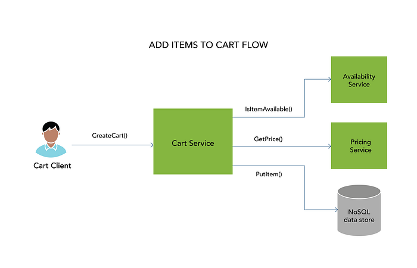

# Designing Resilient Microservices — Part 2

## Introduction

In the first blog on designing resilient microservices — [Part 1](./designing-resilient-microservices-part-1-6a72fe964759.md), we introduced the concept of adaptive resilience. Customer facing properties (e.g. home page) and actions (e.g. add item to Cart) end up invoking tens of microservices with a call chain that could be 5 or even 10 levels deep. In this case, a given microservice might be interacting with 2 or 3 downstream dependencies (other services or infrastructure components) in order to service a top level request. In this blog, we will take a specific scenario (adding items to Cart) and describe adaptive resilience in detail for a gRPC based golang microservice.



Cart Client calls Cart Service which exposes a `CreateCart()` API which then calls three dependencies — (1) An availability server that exposes a `IsItemAvailable()`API, (2) a pricing server that exposes a GetPrice() API and (3) NoSQL data (to persist cart object) via a PutItem() API call. Here are the protobuf files with simple gRPC interfaces for the purposes of illustration.

### Cart Service API

### Availability Service API

### Pricing Service API

## Problem Statement

Now, here is a simple implementation of the Cart service’s CreateCart() API that invokes availability server and pricing server in sequence. (Note: Persisting the Cart Object in DynamoDB is left out for the sake of brevity).

This implementation would work fine and even protect against a high latency call to pricing or availability server since we are passing context.WithTimeout() to each of the downstream gRPC services. This ensures that if the gRPC invocation exceeds this threshold, we would get this error: (See [here](https://grpc.io/blog/deadlines/) for more information on how gRPC deadlines work).

```
2022/04/07 17:54:34 Could not create cart: rpc error: code = DeadlineExceeded desc = context deadline exceeded
```

Now, the problem is how do we decide what the timeout value(cart-simple.go: Line 3, Line 16) should be? You could look at the P50, P90, P95 and P99 latency distribution of the availability and pricing servers and choose an appropriate number. The problem with this approach is that latency distributions of your downstream can(often do) change and hence you will need to keep modifying the cart service implementation. If this has to be done for say 50+ microservices, then there is considerable engineering effort involved in “timeout management” which at best is reactive and error prone.

## Solution

Instead of working backwards from what the dependencies have to offer as a latency profile, we flip this around and ask — “how do I achieve a P99 of X ms for my (Cart) service”? As you see in the code snippet below, effective use of golang contexts can allow for dynamic management of P99 latency.

As you see above, we create one Context with Timeout which matches the SLA(cart-context.go: Line 4) we provide to the upstream client and pass the same context to down both availability and pricing gRPC invocations. Now let’s simulate a high latency (P99.9) for availability service and low latency (e.g sub P50) for the pricing server.

When we execute the CreateCart() API, we get the following message

```
2022/04/07 18:12:16 Response from Cart Service: Cart Created with total price: 1
```

The probability that you will land in the P9*+ latency for both availability _and_ pricing service for the same invocation of CreateCart() is low and even if it happens the context deadline will be exceeded. Further, you could also re-use the context received from the grpc client (cart-context.go: Line 1) which enables the client to specify a timeout when CreateCart() is called.

Finally, while it not in the code snippets above, you would pass the context created in cart-context.go: Line 4 to the DynamoDB (or any other persistence layer) using the [PutItem(ctx, …) ](https://pkg.go.dev/github.com/aws/aws-sdk-go-v2/service/dynamodb#Client.PutItem)calls, thereby extending the same level of dynamism for latency management to the data storage layer as well.

---
**Tags:** Swiggy Engineering · Microservices · Resiliency · Architecture · Golang
