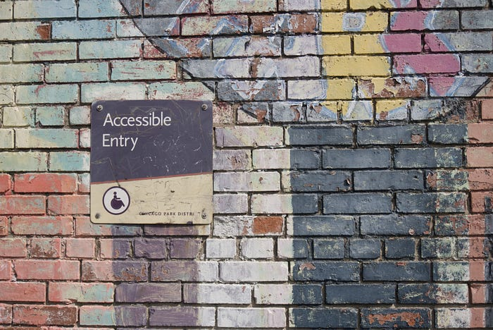
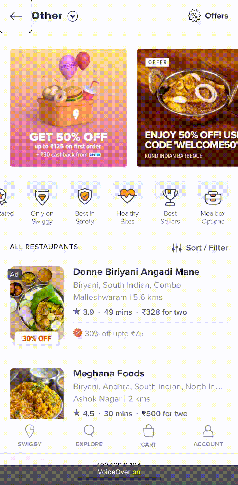
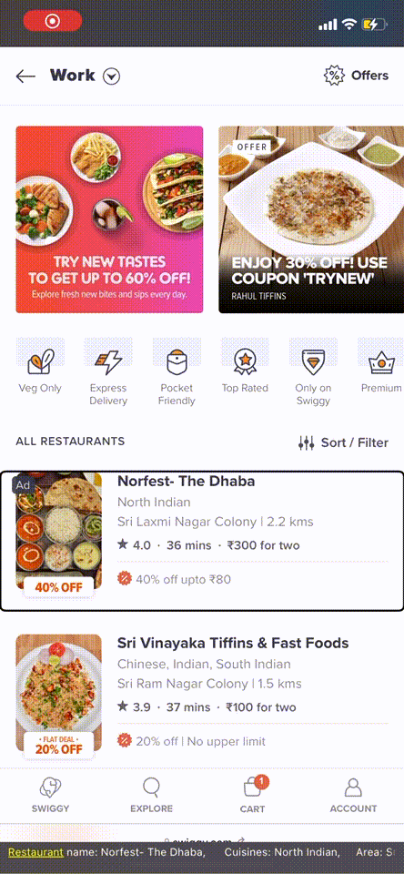
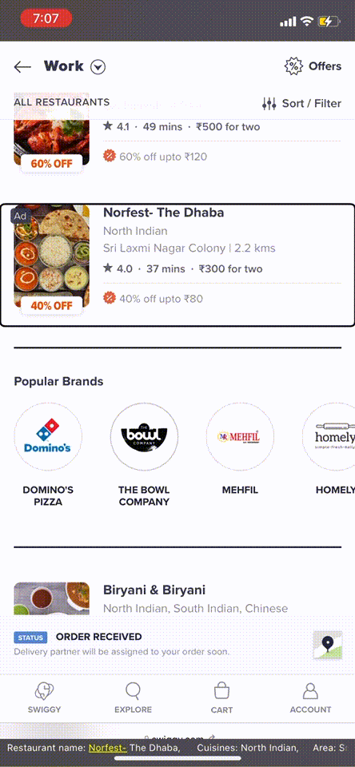
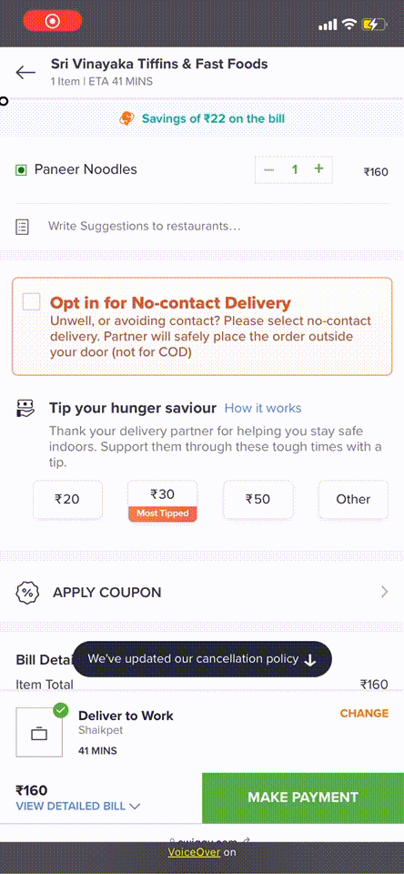
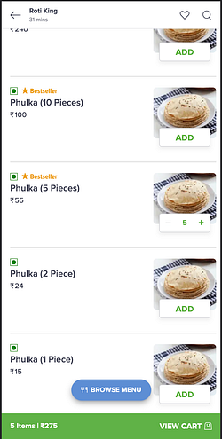
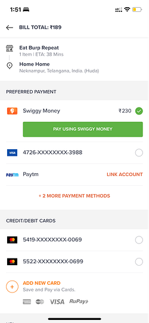
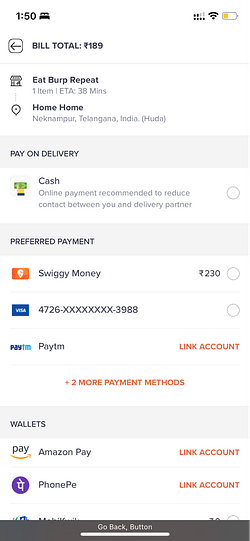

# Designing Swiggy to be truly ‘accessible’ | Episode-4

In our earlier [blog post](./designing-the-swiggy-app-to-be-truly-accessible-episode-1-35ef43e5d4e4.md), we shared how we went about identifying the accessibility gaps in Swiggy and our design philosophy to address those gaps. We have also shared how we implemented the changes in [Android](./designing-the-swiggy-app-to-be-truly-accessible-episode-2-7759d72a5f83.md) and [iOS](./designing-the-swiggy-app-to-be-truly-accessible-episode-3-ec7256401c6d.md) in subsequent blogs. In this one, we will share how we improved accessibility in our mobile web ordering experience.

*Photo by Daniel Ali on Unsplash*

### How we made Swiggy mobile web accessible ?

We started by following the best practices and recommended guidelines from [W3C](https://www.w3.org/TR/WCAG21/) like adding descriptions for non-text content (eg. alt attribute for images ), using semantic HTML, adding descriptive labels for actionable elements etc. During our research, we realised that accessibility is not just about recommendations across the internet. Making your HTML semantic, image alt tags, etc is definitely important, but solving for your custom use case and flow is also required. In the below sections, we’ll discuss how we solved use cases relevant to a hyperlocal app like ours.

### Grouping Content

To understand the need of grouping, first we need to understand how users navigate through apps when Screen reader (Voiceover/Talkback) is enabled. Users have to swipe right or swipe left to navigate forward or backward respectively. Each Swipe gesture navigates the user to the next/previous focusable element (text/image/button/link)

*Screen reader navigation before implementing grouping*

Grouping is important to represent content as one logical unit and reduce the number of navigation by conveying important information to the user in less navigation.

**Use case**

To place an order from Swiggy, the first step is to go through a list of restaurants. To make it more convenient for users to go through the list of restaurants, we have grouped information on restaurant cards. Screen Reader for each restaurant card reads all the information like name, cuisine, rating etc in a single navigation. To do so, we have added aria-label to the topmost container element for the restaurant card.

*Screen reader navigation after implementing grouping*

Aria Label format

> Restaurant Name:<name>, Cuisine:<cuisine>, Area:<area>, <distance in kilo-meter> Away, Ratings: <restaurant rating>, Delivers in: <time in minutes>, Cost for two is: <price in rupees>, Offers Available: <offers string>, Double tap to open restaurant menu.

### Managing Focus

Managing focus is a very important aspect to ensure a comfortable user experience. It includes handling the navigation from one screen to another or when a dialog/popup appears on screen, in order to help users navigate the platform with the swipe gestures

**Use case**

Let’s take a scenario where a user navigates to a restaurant in the restaurant listing page and goes to the menu page by selecting that restaurant and then decides to go back to the restaurant listing page by clicking on the back button. Here we should manually handle the screen reader focus to move it to the previously navigated restaurant. This way, users don’t have to navigate through the list of restaurants again.

*Managing focus of user returning from menu page*

To do this, we use session storage to store the id of the restaurant card when the user clicks on it and once the user comes back from the menu page, we move the focus back to the restaurant card having that particular id.

Code snippets

This was one of the examples, but there can be more use cases in your application where you have to manage focus to ensure a good user experience.

### Handling Focus for Dialogs/Popups

Dialog, Bottom sheet and Popup are part of the core UI components on a web app. When these components appear on screen, it changes the context for the users and it is important to convey this context change information to the user who is using the screen reader.

> We are following w3 recommendations to create accessible dialogs. [https://www.w3.org/WAI/GL/wiki/Using_ARIA_role%3Ddialog_to_implement_a_modal_dialog_box](https://www.w3.org/WAI/GL/wiki/Using_ARIA_role%3Ddialog_to_implement_a_modal_dialog_box)

There are 3 important aspects to consider when creating accessible dialogs

1. Move the focus from the triggering element (link or button) to the dialog (or one of the focusable elements within it)
2. Keep focus within the dialog until the dialog is closed i.e focus should not go on the elements behind the dialog.
3. Move focus back to the triggering element when the user closes the dialog.

**Understanding Focus Trap for mobile web**

Users should be able to only navigate inside the dialog until it is closed/dismissed, and so we need to trap the focus of the user inside the dialog.

Before discussing solutions on how to trap the focus, we should know about aria-hidden attributes.

> Adding `aria-hidden=true` to an element **removes that element and all of its children** from the accessibility tree. In simpler words it hides this from screen readers.

Coming back to the solution of focus trap, we set `aria-hidden=true` for all other elements in the DOM except dialog and then unset it when dialog is dismissed/closed. For this solution to be efficient we need to minimise the number of DOM operations, so we set `aria-hidden=true` to only top level container.

Since we have marked everything as hidden from screen readers except the dialog, now the user will be able to only navigate inside the dialog. Once the dialog is closed/dismissed, we will unset the aria-hidden or mark it as false to enable the user navigate in a normal flow of application.

### Screen Reader only (Invisible content just for screen readers)

There are use cases where content should be made available to screen reader users but hidden from sighted users. In the vast majority cases, content that is available visually should be available to screen reader users, and vice versa. However, there are a few cases where information or meaning is apparent visually but may not be apparent to screen reader users. In these cases, it may be appropriate to cause content to be read by a screen reader, but have the content remain invisible to sighted users.

One of the common use case of using screen reader only content is for adding skip navigation links  
A skip (navigation) link provides a way for users of assistive technology to skip a part of content from a page from navigation and directly go to a particular action. For example, think about having to navigate through the entire cart page every time, before you even reach the _Make Payment_ button or to navigate through a list of all menu items to reach the _Browse Menu_ button. That is the problem that a skip navigation link solves for screen reader users.

To create screen reader only content we are using CSS clip property to hide it from sighted

*Hidden navigation link to skip directly to Make payment*

**Use Case: View Cart Button (Menu Page)**

In the menu page once a user adds an item to cart, we show a fixed bottom CTA (View Cart) to let the user navigate to the cart page (as shown in screenshot below).

As we have learnt in the Grouping Content section about user navigation, when screen readers are enabled users have to navigate from each menu item to reach the `View Cart` CTA which is not a very good experience. To solve this problem, we have added skip navigation links after each menu item (Screen reader only content) to reach the `View cart` CTA. Users can add the item and then directly navigate to `View Cart` CTA if needed.

### Payment Methods Re-ordering

*Default payment methods order*

We have different payment options available on the payment page like Swiggy money, cards, wallets, UPI, Net-banking cash etc. For a user who is using a screen reader, payment options like cards, wallets(if sufficient balance is not there), UPI, Net-banking are complex flows like redirecting to a third party website or app and entering OTP/MPin to make the payment. So for an accessible session, we reordered the payment methods in such a way that users have one-click payment methods on the top and more complex methods in the last. We do not disable any payment method for users. One-click payment methods are Cash on delivery or Swiggy-money (only if sufficient balance is there)

*Accessible payment method order*

### Conclusion

With these changes, we hope that all our interfaces are more accessible to users. The mweb changes have recently been released and we do not have metrics on usage as yet. This initiative is just the start in our journey of accessibility — We will continue to listen to our customers and improve our existing workflows as well as design better flows for our future services. Please write to us if you have any suggestions or comments.

---
**Tags:** Swiggy Engineering · Accessibility · Mobile Web · W3c · Programming
