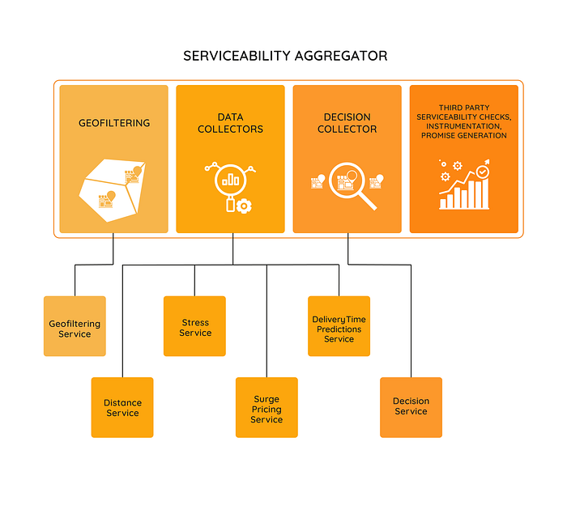
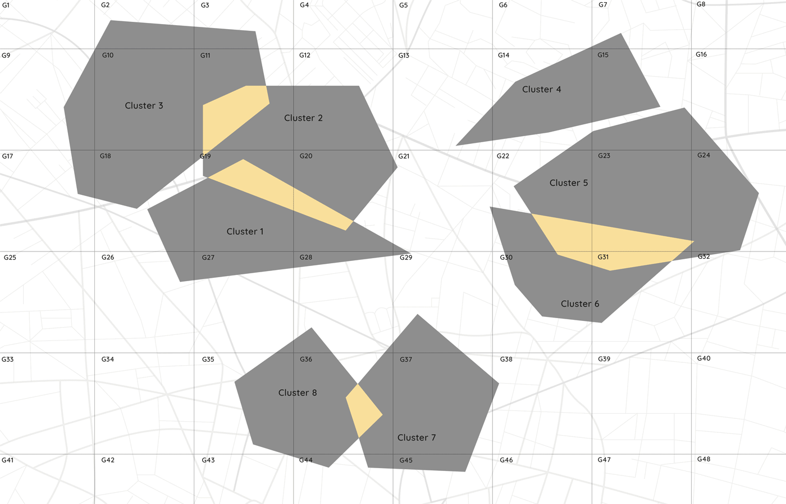
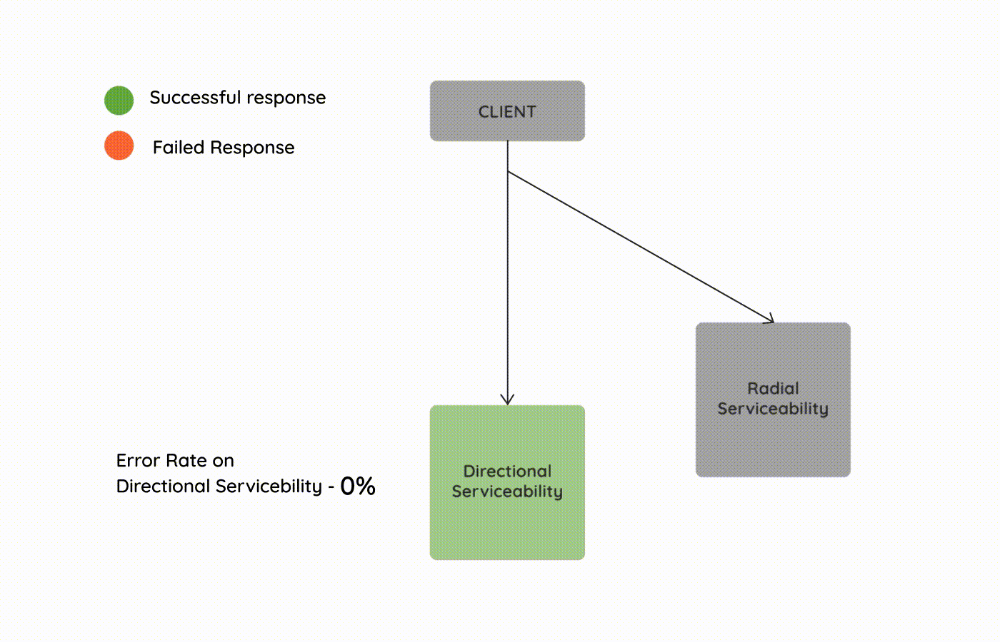
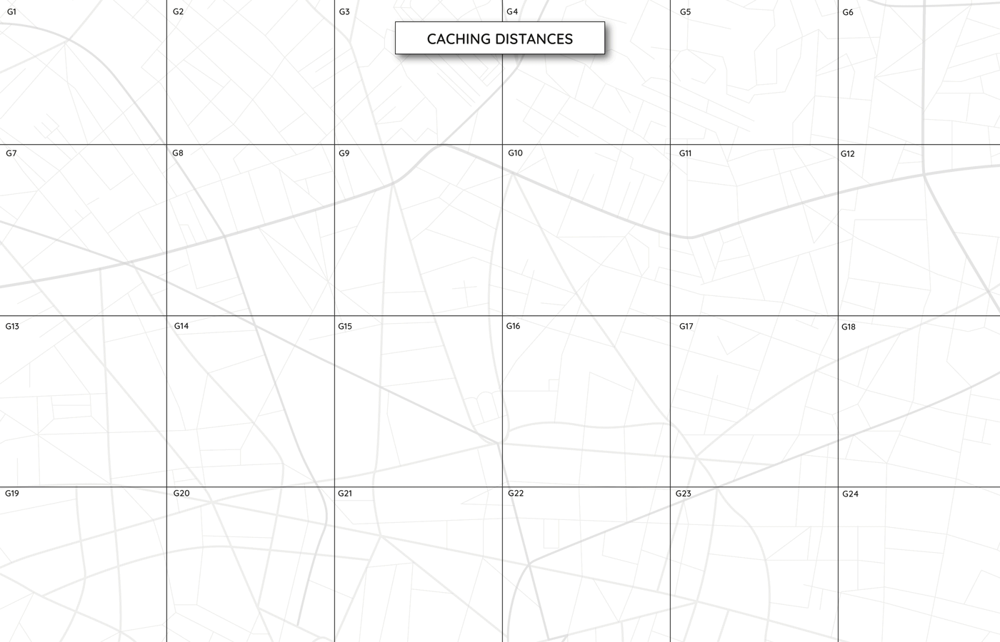
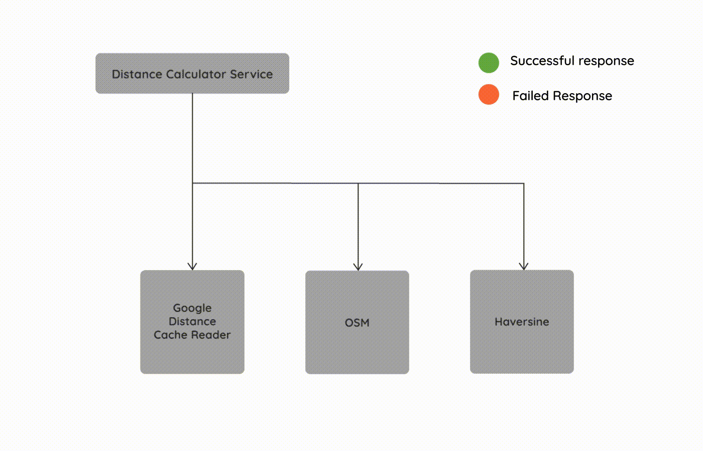
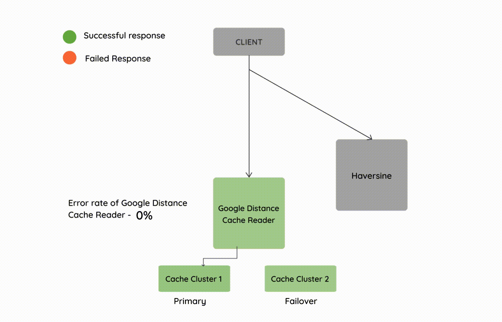

# Designing the Serviceability Platform at Swiggy for High Scale — Part 1

In the last blog on [what serviceability means at Swiggy](./what-serviceability-means-at-swiggy-c94c1aad352a.md), we saw the role of the Serviceability system in the pre-order journey of Swiggy, where it needs to make various complex computations and predictions based on a bunch of real time hyperlocal parameters — to finally arrive at a decision on the acceptance of the order based on its serviceability.

These computations and predictions while evaluating serviceability involve the following steps broadly

1. GeoFiltering of pick up locations (restaurants, Instamart, Genie) based on drop locations (customer location).
2. Distance calculation between pick up and drop locations.
3. Time Predictions of the various legs of the order journey.
4. Stress calculations at a zone and hyperlocal level and Graceful Degradation.
5. Taking a decision on the serviceability status, calculating surge pricing.

The system comprising of the above computations would consist of components and services looking something like this at a high level

*High Level View of the Serviceability Platform*

Now this entire serviceability evaluation needs to happen not just for a pick up-drop off location pair while placing an order, but even while showing the restaurants or stores on the home page of Swiggy, the listings page, search, menu of a restaurant or store, checkout of an order and so on. On the home page, listings and search, this check needs to be done for multiple restaurants and stores. At checkout this check needs to be done for multiple drop addresses. So as we can see, if the Serviceability system fails, Swiggy’s pre-order flow is essentially down and Swiggy is unable to take in new orders. Hence it is critical to ensure maximum availability of this system.

Coming to the amount of traffic that the serviceability system needs to serve, assuming 100k visits to the app per minute during peak demand, this number turns out to be nearly 200 million evaluations per minute if we consider 2000 pick up locations on average in the vicinity of the customer. On the latency front, this complex evaluation needs to be done in a fraction of a second with a P99th of < 200ms to maintain good user experience.

In the subsequent sections, we will see how different components and services in the Serviceability ecosystem scale to handle high amount of traffic, remain highly available during various failure scenarios and also recover from them using built-in fault tolerance, all the while maintaining low latencies within a fraction of a second.

## High Performance GeoFiltering at Scale

The GeoFiltering service is responsible for directionally filtering out the pick up locations like restaurants and stores based on the geographical regions they belong to and if those regions are connected and discoverable from the region in which the customer drop location lies. As mentioned in the [first](./what-serviceability-means-at-swiggy-c94c1aad352a.md) article of this series, we call these pick-up and drop geographical regions as clusters.

One of the key challenges in the GeoFiltering phase is to find the clusters in which the customer drop location is located and subsequently discovering the pick up clusters that are connected to the customer clusters. Further the pick up locations need to be checked if they are located within the nearby pick up clusters discoverable from the customer clusters. This is required as every listing, menu, search or cart request for a pick up- drop off pair that comes to Swiggy has to undergo a geographical filtering through this component.

In order to find the clusters where the customer drop location belongs to, the system needs to do a Point in Polygon (PIP) check. There are thousands of clusters spread across hundreds of cities, and doing a PIP check on each of these clusters at runtime for each request coming to Swiggy will not be very performant.

Hence to achieve very low latencies in this step, the system constructs a [GeoHash](https://en.wikipedia.org/wiki/Geohash) based index of clusters and serves the clusters from memory. The index is built with a certain resolution of a GeoHash as the key. Each cluster is then indexed against the GeoHashes with which the cluster’s area overlaps.

While serving the request for the customer drop location, the system figures out the GeoHash index key that the customer’s location belongs to and fetches a much reduced set of clusters overlapping and associated with that GeoHash key. It then runs a PIP on this reduced candidate set and this turns out to be much more efficient and faster than running a PIP check across all the clusters.

*GeoHash based indexing for faster Point in Polygon (PIP) Search*

In order to find all the eligible pick up location clusters for a customer, the system fetches all the nearby clusters connected to the customer cluster from a fast in-memory local cache. The system then does a PIP operation on these pick up locations to check if they are located within these pick up clusters.

The GeoFiltering service can be replicated with the above GeoHash index and in-memory cache across multiple replica nodes in order to horizontally scale and serve a massive amount of traffic.

## Making GeoFiltering Fault Tolerant

The above GeoFiltering service can undergo multiple fault conditions in practice. For example

- If a customer location does not belong to any of the defined clusters.
- If there is a failure in the GeoHash index and the in-memory cache.

In such cases we fallback to a radial GeoFiltering path, which can work without defined clusters for pick up and drop off locations and connections between those. In radial GeoFiltering an imaginary circle of a certain radius is drawn around the customer drop off location and all the pick up locations located inside that circle are considered to be eligible.

*Fault tolerance during GeoFiltering of pick up and drop off locations*

## Scaling Distance Calculations

The distance service at Swiggy is responsible for calculating and serving the shortest distances between pick up and drop locations (in serviceability these are the filtered pick up and drop location pairs which are outputs of the GeoFiltering phase). This calculation needs to be done in less than a milli-second per source and destination pair and it needs to be done for nearly 200 million source and destination pairs per minute at peak across a large number of cities in India. Hence distance computation is a problem which has not just a large time complexity, but also a large space complexity.

Our primary sources of distances are mainly Google Directions and Open Street Maps. The system chooses between them based on a trade off between accuracy and cost. Hence the system uses a specific source for origin and destination pairs where accuracy is more important than cost while it uses the another where cost is more important than accuracy. This trade-off is done intelligently by the system based on various signals like the past order patterns in that geographical area.

Both Google Directions and Open Street Maps are fairly latent or computationally intensive operations (or both) since Google Directions involves making a remote call to our partner while Open Street Maps runs an A* Bi-Directional Search on a massive graph data structure (representing India’s locations and their route networks) to find the shortest distance path.

Hence, we need to rely on caching of both the above sources in order to serve low latency (lesser time complexity) distances in real time.

One of the key challenges with caching geospatial point to point data is determining the cache key. We cannot use floating point latitude and longitudes in the cache key since they are infinite in number leading to an infinite key space. Hence we need to use a geocoded latitude and longitude representation which forms a discrete set and is limited in number. We use [GeoHashes](https://en.wikipedia.org/wiki/Geohash) for this purpose which can be represented using alphanumeric strings of specific lengths, and hence a good candidate for cache keys.

A GeoHash represents a fixed area of a specific size depending on the resolution of the GeoHash. The higher the resolution of the GeoHash, the larger the length of the alphanumeric string representation, the smaller the area covered by it and hence larger the number of such GeoHashes.

Hence if we are not too careful with choosing the correct resolution of GeoHash, we might end up choosing a very low resolution GeoHash, which might lead to a very large area, leading to larger error in the representation of that point, and hence leading to more inaccurate distances. On the other hand if we choose a very high resolution GeoHash, it might lead to a smaller area with accurate distances due to lower error, but it will lead to a very large number of origin and destination pair keys which leads to a cache explosion.

For our purpose, we found the Level 8 resolution of GeoHash to be of optimal error to get fairly accurate distances. But it is not possible to cache the entire key space of L8 GeoHash source and destination pairs, since it would run into hundreds of billions of keys. On the other hand, we also observed that the Level 7 resolution of GeoHash would give approximate but not that accurate distances with a drastically lesser key space.

We tried to approach the problem of reducing the key space (lesser space complexity), while also ensuring a fair balance with distance accuracy in multiple ways

- We need not cover all the origin and destination pairs in the country in the cache. We only need to do it for pairs which have good order density.
- We can choose a Level 7 vs Level 8 GeoHash resolution for different origin-destination pairs. We can make a trade off between accuracy and number of keys based on the ordering patterns between the origin and destination pairs. If the origin and destination pair does not have dense order patterns, we can choose to have an inaccurate distance by caching it against Level 7 GeoHash, while if it is an important pair based on order patterns, we prefer to have a more accurate distance by caching it against Level 8 GeoHash.

The system automatically tries to implement both the above solutions based on a bunch of signals like the order patterns between geographical areas.

*Reducing the error in Point to Point Distances by progressively caching between higher resolution GeoHashes for high order density location pairs*

While we maintain an optimal key space in the cache, it is also important to ensure that the data expires at certain intervals not just for maintaining the size of the cache, but also to re-calculate the distances, meeting contractual obligations around third party data caching, etc.

We also need to ensure checks of a High Water Mark on the resource usages of the cache, beyond which the data starts getting evicted to ensure a stable highly available cache.

Further we also need to ensure a Stop Write check, which is a point much above the High Water Mark and if the resource usage of the cache has crossed that mark as well, we need to completely stop new key-value pairs being added to the cache.

Since the data set size in the cache is pretty huge, the data needs to be partitioned as well. In order to make this cache highly available, the data partitions need to be replicated across multiple nodes. The cache is horizontally scalable if we want to further increase or decrease the size of the cache by adding more cache nodes.

## Making Distance Calculations Fault Tolerant

While the distance cache described above can efficiently serve distances at high throughput, it is prone to certain failures, some small but frequent, while others rare but large. Few of those failure scenarios are

- Cache miss on the source and destination GeoHash pairs leading to null distances.
- A large scale failure of the cache cluster (eg. cascading failures).

In order to handle such failures, we have fault tolerance built into the distance service which falls back to alternate paths in such scenarios.

If there is a cache miss while fetching data, the system first falls back to a real time A* Bidirectional Search on OpenStreet Maps data to find the shortest distance path. If this fails as well, the system further falls back to a Haversine calculation of distance (a crow-fly distance).

*Fallback paths in case of Cache Miss or OSM calculation failure*

In order to handle scenarios around large scale cache failures (like the entire cluster getting totally annihilated), apart from the fallback path, there is a logically separate secondary failover cache cluster which is a close replica of the primary cache cluster. This secondary cache cluster is used for a quick failover switch during the primary cluster failure, during which this secondary cluster becomes the primary and starts serving cache fetches leading to a faster recovery.

*Fault tolerance while fetching distance from Cache*

In the next blog in this series, we will talk about a few more components and services in the Serviceability Platform Ecosystem like Stress computation, Graceful Degradation, Predictions and Serviceability Aggregation and what went into making them run at high scale with fault tolerance and low latencies.

_(Illustrations by Shivani Barde, co-authored by Sanket Payghan and Somsubhra Bairi)_

Update 1— The second part of this blog (the third article in this series) around [designing the serviceability platform at Swiggy for high scale — Part 2](./designing-the-serviceability-platform-at-swiggy-for-high-scale-part-2-ab20365fbc23.md) is out now!

---
**Tags:** Serviceability · Hyperlocal Delivery · Food Delivery · Swiggy Engineering · Maps
