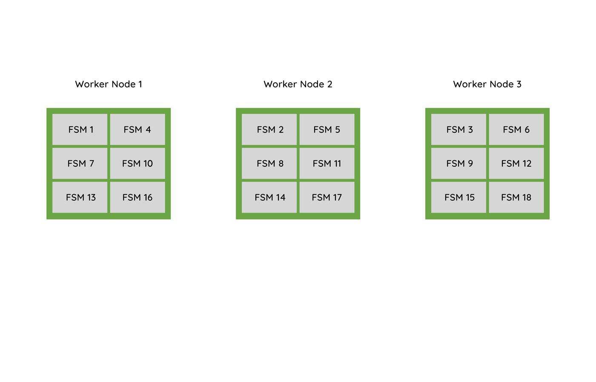
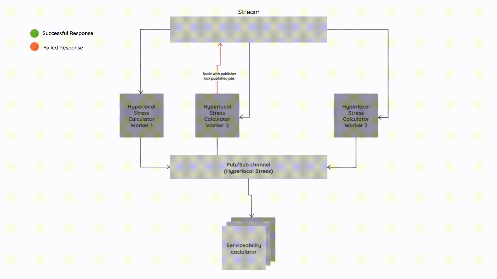
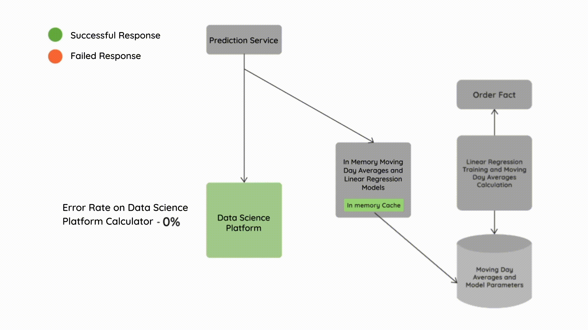
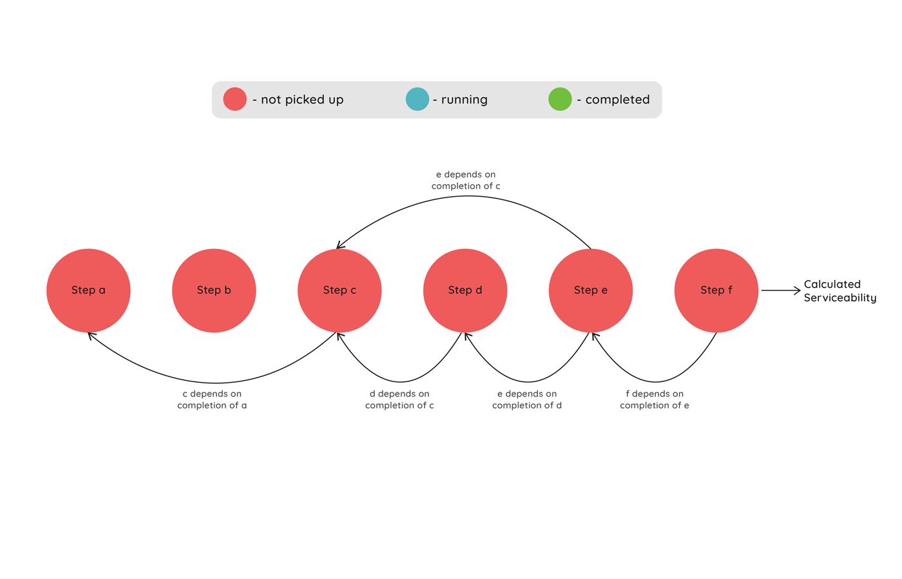
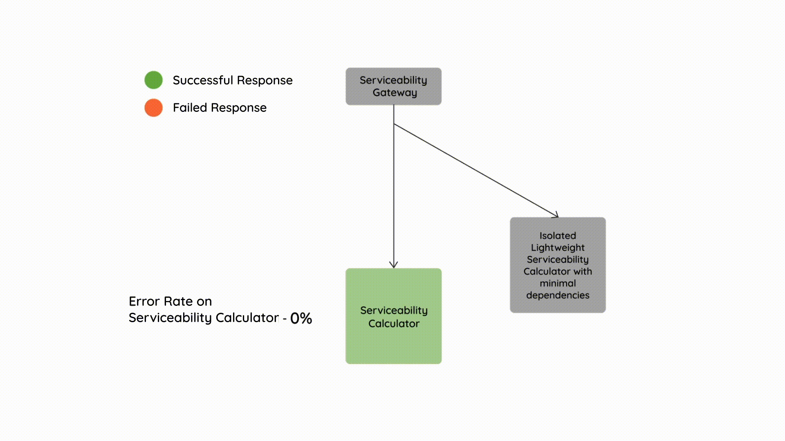

# Designing the Serviceability Platform at Swiggy for High Scale — Part 2

In the [previous article in this series](./designing-the-serviceability-platform-at-swiggy-for-high-scale-part-1-751a631f0379.md) around designing the Serviceability Platform for high scale, we covered the various design choices made in components and services like GeoFiltering and Distance Computation for achieving low latency and highly scalable systems with fault tolerance.

In this article, we will talk about a few more components in the Serviceability Ecosystem like Stress Computation, Graceful Degradation, Predictions and Serviceability Aggregations, and the design choices around them.

## Scaling Stress Calculations and Graceful Degradation

In situations when the number of incoming orders (demand) is much more than the number of available Delivery Partners (supply) in that locality, Swiggy’s delivery fleet is said to be under stress. In times of stress it is not feasible to make restaurants or stores serviceable which are very far away or which might take more time to deliver from, as these cases will worsen the stress further. Also shutting everything off once we realise that the locality is under high stress is also not a good customer experience. Hence the system has a Graceful Degradation mechanism to gradually reduce the serviceability during such times. Once the stress starts easing, the serviceability for that locality can be gradually increased again.

In order to build a Graceful Degradation mechanism for all localities across Swiggy, we have built a system which runs Finite State Machines consisting of states depicting discrete intermediate levels of stress in each locality. This system is responsible for ingesting a bunch of signals associated with that locality and making transitions in states based on certain conditions.

Whenever there is a state change in the Finite State Machine running for each locality, the change needs to be communicated across multiple systems in order to trigger Graceful Degradation in their behaviour. This is done via web-hooks where every system registers their endpoint to subscribe to updates on these states changes of the localities defined across Swiggy. **In order to ensure that there are minimal discrepancies between the various systems subscribed to Graceful Degradation state changes, the web-hook system implements a retry logic in case any system endpoint call fails.**

There are thousands of localities across the operating cities in Swiggy which need to run their Finite State Machine for determining their Graceful Degradation state periodically (every minute). In order to scale this system running thousands of Finite State Machines (FSM) for thousands of localities, the job of running these FSMs is partitioned across multiple nodes. This is achieved by the cluster of nodes running these FSMs deciding amongst themselves on the set of disjoint localities that each healthy FSM worker node is supposed to run. Whenever a new node gets added or removed from the FSM cluster, the localities will get repartitioned and reassigned to the available and healthy FSM worker nodes.

*Multiple Worker Nodes Running Finite State Machines (FSM) jobs repartition when a Worker Node goes down*

While the above mentioned Graceful Degradation approach solves for delivery stress by reducing serviceability for all the pick up locations in that locality, it is sub optimal as it does not consider distribution of available Delivery Partners around individual pick up locations in that locality. Hence we need to have a notion of a much granular hyperlocal stress which considers the distribution of Delivery Partners in the locality around the pick up locations.

In order to determine the Hyperlocal stress near a pick up location, the stress system needs to ingest the distribution and availability of Delivery Partners in a locality in near real time. In case the Delivery Partner distribution and availability is low near a pick up location, then that pick up location will more likely be unserviceable as the time and cost required to reach that location will be high, while in pick up locations where distribution and availability is high, the serviceability will be high as well.

The stress system needs to simultaneously do the above hyperlocal stress calculation based on available Delivery Partner distribution for all the pick up locations in various localities of all cities where Swiggy is operating.

To distribute the above hyperlocal stress calculation for multiple localities, we distribute these jobs horizontally across multiple worker nodes using a stream. These hyperlocal stress calculation workers listen to this stream and execute the stress calculation for all the pick up locations in that locality. This stress calculation is then published to a pub/sub channel.

The service which takes a decision on the final serviceability status of the pick up location directly reads the stress value from the pub/sub channel and caches it locally.

*High Level System Overview of Hyperlocal Stress Calculation*

## Making Predictions Fault Tolerant

The Predictions Component in the Serviceability system is responsible for

1. Time Predictions of the various legs of the potential order at listing, menu and cart. These legs include the Assignment Delay, the First Mile Time to reach the pick up location, the Prep Time of the order, Wait Time of the Delivery Partner at the pick up location, the Last Mile Time to deliver the order.
2. Batching Predictions of the potential order and its impact on the order’s delivery time.

In order to make these predictions, there are various Data Science Models built on the data from the past order fulfillments. These models are served by a very scalable and elastic Data Science Platform layer which provides a runtime for these models.

The predictions component in Serviceability directly integrates to this Data Science Platform layer in order to fetch the predictions corresponding to each serviceability evaluation. In some cases, it also caches the predictions data if it doesn’t change very dynamically within a minute or so.

There are many failure scenarios which can happen in these prediction flows. Some of them are

- The Data Science Platform is degraded or down.
- There are connectivity issues from Serviceability systems to the Data Science Platform layer.
- The models are not able to make predictions for particular serviceability evaluations due to some model error.

In order to handle such scenarios, the system has a fallback path based on light-weight statistical models which can be applied very quickly on the particular serviceability request without any external dependencies.

These light-weight statistical models are mainly built using Moving Day Averages and Linear Regressions on the past orders data at a locality level. They may not be as accurate as the Data Science Deep Learning or the GBT models, but they are good enough to handle fallback scenarios.

The statistical models are re-calculated every day using the past 3 weeks orders data at a locality level and the model output parameters are then persisted to a data store by this particular statistical model generator. The Prediction Service then loads these statistical model parameters in-memory and serves the predictions for the fallback path.

*High Level System Overview of Prediction Flows*

## Making efficient and Fault Tolerant Aggregations

During the course of serviceability calculation, we saw that there needs to be a bunch of computations and predictions along the way, some of which are described in the sections above and in the [previous article](./designing-the-serviceability-platform-at-swiggy-for-high-scale-part-1-751a631f0379.md) in this series. On top of this, Serviceability also depends on a few other external systems for getting customer segments, their favourite and relevant outlets, etc.

All of these components if added up serially would lead to a considerable amount of latency. Also on top of that, any one of these steps failing due to any reason would lead to the entire serviceability request failing.

As a result, the Aggregator which aggregates all the serviceability related data needs to be extremely efficient in terms of scheduling the calls to these data providers to minimise the overall latency, and also be tolerant to a lot of faults which can occur during the calls to these systems.

If we look at all the components in the Serviceability Ecosystem, they need to be invoked with a certain set of input parameters and they produce an output. The input parameters can be derived from the output of some other component call while the output can be used to derive the input parameters to some other component call. Hence each of these component’s executions might be dependent on one or more component’s execution, hence forming a dependency graph.

The aggregator’s job is to execute the Serviceability flow’s dependency graph in the minimum possible time. This is done by starting the execution of a job whenever its dependencies are satisfied (the dependent jobs are executed) at a certain concurrency with other independent jobs.

Also the aggregator introduces fault tolerance for each of the component’s potential failures by implementing their fallback paths.

*Serviceability aggregator’s execution of different jobs in a dependency graph*

## Fault Tolerance right at the top

While the Serviceability Aggregator itself is built to be resilient to failure to any of its external dependencies, there is always a chance that the aggregator itself goes down or becomes degraded in performance due to any unforeseen reason.

As a result, Serviceability being very critical to the uptime of Swiggy has a fault tolerance mechanism right at the top, where in case of a failure of the primary serviceability call, the request is sent to a fallback serviceability service which is a light weight implementation of serviceability. This fallback service is logically very much separated from the rest of the primary serviceability, so as to avoid the same failures as the primary. This lightweight fallback service has very minimal external dependencies and is built to handle a rapid spike in traffic in a short duration using minimal resources.

*Fault tolerance mechanism when primary serviceability calculation is impacted*

In conclusion, whenever we need to design a new feature or add something to the Serviceability system, we always strive to ensure that appropriate fault tolerance mechanisms are in place and fallback paths are well defined at each and every step to remain highly available. Furthermore, a lot of emphasis is put to ensure that every component built in the system is designed to handle a massive amount of scale while serving the requests at high performance and low latencies.

_(Illustrations by Shivani Barde, co-authored by Sanket Payghan and Somsubhra Bairi)_

---
**Tags:** Serviceability · Hyperlocal · Food Delivery · Swiggy Engineering · Logistics
