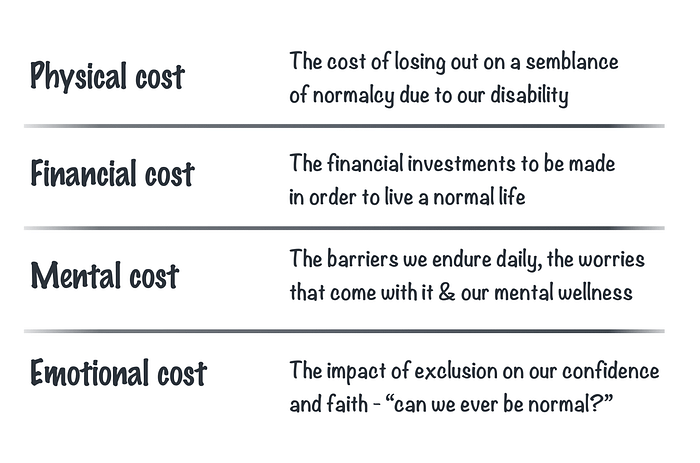
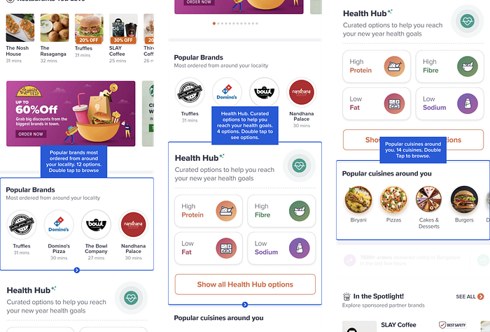
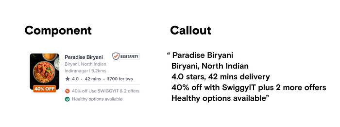
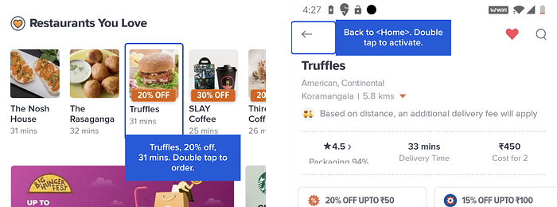
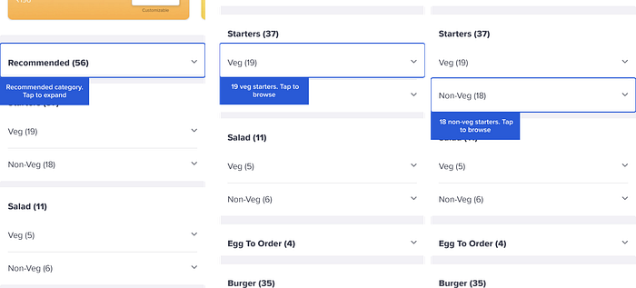
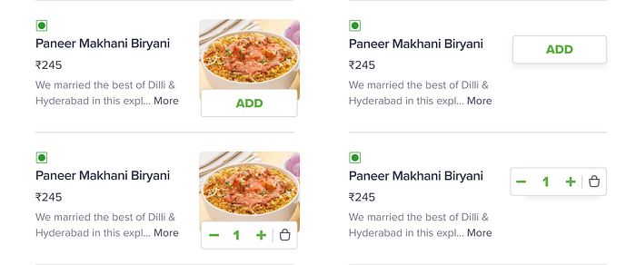
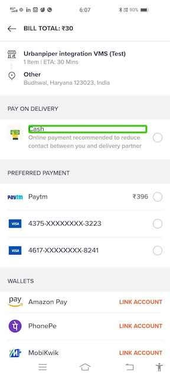
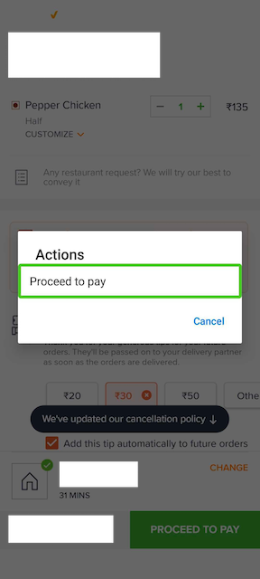
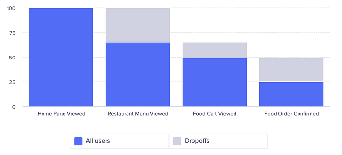
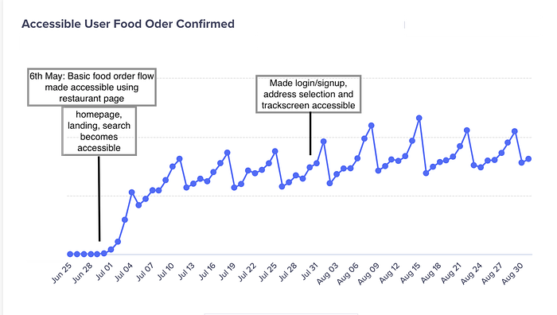

# Designing the Swiggy app to be truly ‘accessible’ | Episode-1

> **_Beta… Where do I click to buy some rosogolla?  
> - _**_Someone’s Daadee [Grandmother]_

So, here is the truth… we were ignorant about the lack of accessibility features on our app and websites for a while. Guilty as found. And with this ignorance, we had excluded customers who were differently abled as they had no means to experience the Swiggy app features to its fullest convenience. For a company that is chasing a vision to deliver unparalleled convenience, we actually made it very difficult for this cohort of consumers. But we took measures to correct our ways — at a very fundamental design and technology level — and in this series, you will join us on our journey to enable accessibility. Here’s where it all started.

### Enabling the missing pieces

There is no doubt that we have created one of the best app experiences for our consumers. The problem was that our app was not designed keeping accessibility for the differently abled in mind. What this means is that people with certain challenges were not able to place orders with ease, and this [petition on Change.org](https://www.change.org/p/swiggy-make-swiggy-accessible-with-screen-readers-in-android-for-visually-challenged-people?redirect=false) only made it more clear to us. So at the start of this year, we set to work and wanted to enable customers who had experienced glitches on the app due to **visual and motor impairments**. Here is how that journey unfolded.

To understand ways to solve these issues better, we first needed to understand our customers a little better. And so, we did what we do best — put ourselves in their shoes. Our designer Prasanna Venkatesh has written elaborately on the ‘true cost of disability’ in [**this post**](https://prazy.substack.com/p/the-true-cost-of-disability) and the kind of difficulties this set of audience face.

*The different costs that every person of disability must contend with throughout their life*

We also took the help of _deoc.in_ to conduct an exhaustive accessibility audit of our app on both iOS and Android. Not only did the excellent folks at _deoc.in_ give us suggestions from the development perspective, they were magnanimous enough to conduct two workshops on accessibility for the benefit of the Swiggy tech and product teams. This was an eye-opening workshop even for Prasanna himself; though he grew up deaf and could understand the challenges people of disability face on a daily basis, the workshops only demonstrated that his understanding of the accessibility space was only just the surface.

To start designing accessible solutions, one must first develop empathy for the users who have an altogether different way of life from you. Here’s [a quote from a designer’s lens that can ](https://prazy.substack.com/p/putting-accessibility-into-practice)help put things into perspective.

> _“As designers, we tend to become more empathetic towards designing for marginalized and disabled users, only if we (or someone we know personally) have encountered these difficulties directly, and could benefit from a solution enabled by technology.”_

The best way to go about this is to start small, by focusing on someone close, immediate and familiar to us — family members, friends or anyone with physical difficulties — and keeping them in mind when you design your workflows. A trick Prasanna has generally followed after reiterating and refining designs and UX copy is thinking…

**_“Will my mother understand this flow and be able to use the app?”_**

**_“Will someone with vision impairment notice this crucial information?”_**

Keeping this hat enables one to simplify design solutions exponentially. And the more scenarios one includes in context to disabilities in future designs — poor vision, one-handed use, voice-driven technology users, and color blinded folks, to name some — the more accessible one can make the solution.

### Design philosophy and approach

When it comes to a food delivery app like Swiggy, Prasanna understood that most accessible approaches implemented in other products might not apply here, mainly due to the number of information elements required to help customers make a decision. As an example — Swiggy customers typically rely on information like cuisine, rating, and delivery time etc to make informed choices on where to order from. This is easy for the larger base of our users, who can quickly scan groups of information and decide whether to order from this restaurant or not.

However, the way the Swiggy app is designed made it a recipe for disaster in accessible mode. There’s no easy way to browse even 20 odd restaurants for users with disabilities in the current format, due to the grouping logic and a very rudimentary support for accessibility.

There are two kinds of support we had to provide:

- **Switch access **— for users with motor issues or missing limbs, a switch access enables them to operate the app with just two buttons. More on switch access [here](https://support.google.com/accessibility/android/answer/6122836?hl=en)
- **Talkback in Android / VoiceOver in iOS **— for people with blindness or poor vision, they rely on these features to read out focused text and content on the screen. Learn about screen readers [here](https://mcmw.abilitynet.org.uk/how-read-screen-aloud-using-talkback-screen-reader-android-10)

When it came to simplifying the accessibility efforts on the existing apps, we decided to make these key calls:

On the home screen : Read out a group of restaurants as a single collection, and then ask the users to press a button to explore individual restaurants or swipe to next group of restaurants.

On the restaurant listing screen : Read out only some critical information about the restaurant to help the user understand if to go to the menu or not — tell only primary cuisines and omit secondary cuisines, omit cost for two, etc.

On navigation : Allow users using either switch access / screen readers to navigate between pages and lists with as less friction as possible.

On the menu : collapse categories by default so that user can go straight to the category with the item they need to order.

On selecting an item : Allow users to go to cart after adding an item without having to scroll all the way to the cart at the bottom of the menu page.

On Payment page: Prioritise one touch payment methods such as wallets and cash on delivery for one touch checkout experience.

On Order tracking: Voice feedback on order status change, nudges users in track screen mode with every important event about the order.

Gestures for quick action: We enabled the talkback menu for handy actions in the menu page, such as _“Go to cart page”_, _“Increment/Decrement Quantity”_, similarly in cart page we got _“go to payment page”_ available at talkback menu.

The entire User journey for food ordering is available here :

**So, how has this impacted the customer experience?**

We have seen improvement in order conversion from accessible sessions in our apps. With more addition of pages and new flows getting accessibility enhancement, the overall adoption and usage has increased.

*Food ordering funnel between different screens in accessible sessions*

*Growth in food orders from accessible session*

### We are all ears, eyes, and more…

While our attempts to truly unlock accessibility has just begun, in the upcoming blogs, we will talk about how we have made changes in our iOS, Android and mweb/desktop web, to take things one step ahead. This journey has been very fulfilling for all of us who have worked on it — it has been beyond just Jira stories and the team really gave their heart and soul to solve this problem. That being said, we are here to hear our consumers and see how we can go beyond to make the Swiggy experience truly convenient and inclusive. So if you have any thoughts, or ideas, don’t hesitate to drop in a line. We are listening!

Shoutout to **Prasanna Venkatesh, Sarangh Somaraj, Fida Tanaaz from Swiggy Design, Rishabh Tripathi, Sanket Shekhar, Sreekant M, Sanchit Goel, Shivam Gautam, Rahul Arora, Agam Mahajan, Raj Gohil, Mitansh Malhotra, Farhan Rasheed, Rahul Dhawani, Gourav Sahni, Shubhank Maheshwari , Jigisha Chhapia, Avantika Tiwari, Sambit Banik, Chandan Kumar, Vishnu Raju, Lalit Jha, Iyrom Gomes and Shikha Mittal from Swiggy Engineering and PMO team **for helping take us one step closer to our consumers.

Last but not the least, shoutout to Rama and Srinivasu from deoc.in for helping us kickstart accessibility for Swiggy.

P.S : We reviewed our changes with the[ change.org](http://change.org/) petitioner and got some[ positive feedback](https://www.change.org/p/swiggy-make-swiggy-accessible-with-screen-readers-in-android-for-visually-challenged-people/u/29212774). The petition has since concluded with[ this update](https://www.change.org/p/swiggy-make-swiggy-accessible-with-screen-readers-in-android-for-visually-challenged-people/u/29614170)

Read Episode 2 here — [https://bytes.swiggy.com/designing-the-swiggy-app-to-be-truly-accessible-episode-2-7759d72a5f83](./designing-the-swiggy-app-to-be-truly-accessible-episode-2-7759d72a5f83.md)

Read Episode 3 here — [https://bytes.swiggy.com/designing-the-swiggy-app-to-be-truly-accessible-episode-3-ec7256401c6d](./designing-the-swiggy-app-to-be-truly-accessible-episode-3-ec7256401c6d.md)

---
**Tags:** Accessibility Design · Swiggy Engineering · Mobile App Development · User Experience · Accessibility
