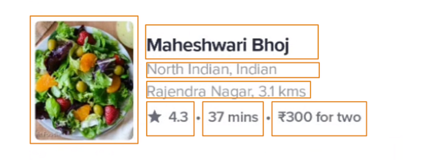
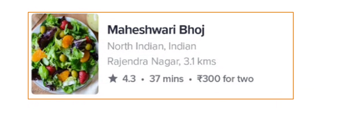
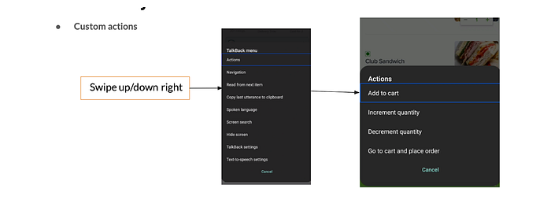

# Designing the Swiggy app to be truly ‘accessible’ | Episode-2

*Image from Pixabay*

In our earlier [blog post](./designing-the-swiggy-app-to-be-truly-accessible-episode-1-35ef43e5d4e4.md), we shared how we went about identifying the accessibility gaps in Swiggy and our design philosophy to address those gaps. In this one, we will share how we made improvements on Android for the food ordering flow.

**Using the POUR Principle**

The **POUR principle** ensures that people with impairments such as impaired vision, colour blindness, impaired hearing, impaired dexterity, cognitive disabilities, etc can use the product easily.

1. **Perceivable**: content is made available to the senses, sight, hearing and/or touch.
2. **Operable**: Interface forms, controls and navigation are operable.
3. **Understandable**: information and operation of the interface must be understandable.
4. **Robust**: robust to work with different assistive technologies.

As we grow older we are at a higher risk of developing some form of disability. More than 46% of older persons, those aged 60 years and over, have disabilities. It is projected that the number of older persons will grow by 56% in 2030, which is about 1.4 billion people.  
So when you do not consider making your applications accessible for everyone, including people with disabilities, you’re also ignoring a potentially large group of your customers.

While solving this problem, we started from basic flow of food ordering to complex one like track screen, onboarding process etc. We also tried not just to make UI components accessible but to make the experience less robotic and more humane.

We are now going to discuss the 9 settings we have worked on to improve accessibility. These are

a) Grouping of views

b) Describing components

c) Assigning a role

d) Meaningful click actions

e) Handling custom actions

f) Screen announcement

g) OTP Timer announcement

h) Accessibility live region

i) Accessibility heading

In the next section, we will go into details of each.

---

## Grouping of views

As many accessibility services function in a linear manner and shift focus from element to the next. If our UI component is not grouped according to functionality, users may have to perform multiple focus shifts to reach the next item / action item.

This problem can be solved by grouping UI components together which logically represent one unit.

*Image 1. Restaurant item not grouped.*

As you can see in the above image, restaurant items are not grouped together so users can’t hear all the information at once. Users need to change focus every time they need to hear another information.

*Image 2. Restaurant item grouped.*

In the above image you see the whole restaurant item is grouped together so the user will hear all the focused information at once without shifting focus multiple times.

> To achieve this, you need to set **focusable=”true” **on parent layout and **focusable=”false”** on each of its child views.

Sometimes when click action is associated with the child view, you need to remove that too from accessibility to remove focus from that view.

## Describing Components

Every component that receives the focus needs to describe itself which is then used by accessibility services.  
Some views describe themselves automatically like textview describes itself by its text. But other components need description to be set for them using

> **android:contentDescription = “describing the component”**

For EditText, **android:hint** attribute serves as the accessibility label. On devices running Android 4.2 (API level 17) or higher, you can have a corresponding View object that describes the content that users should enter within the EditText element. This can be achieved by setting attribute **android:labelFor** of TextView to target EditText’s ID.

To exclude any view or component from accessibility services, set its **contentDescription** set to **@null** or for devices running Android 4.1 (API level 16) or higher set **android:importantForAccessibility** attribute to **“no”.**

You can also use the android**:importantForAccessibility** attribute to **“noHideDescendants” **to make the parent and it’s all child view not accessible.

## Assigning a Role

Every component has some role associated with it. Sometimes we make a text view clickable which act like a button or we make custom views which act like a respective native component. We need to assign roles to a component for better accessibility.

For custom views you can override **getAccessibilityClassName() **method of View class.

For other views, you can override the **onInitializeAccessibilityNodeInfo() method.**

## Meaningful Click Action

Any view that is clickable or has **onClickListener** attached to it, talkback or any other screen reader will announce default “double tap to activate” at the end of description to indicate that this focused item is clickable. Now this sounds a little robotic when action is different like- subscribe, order, explore etc.

We can replace “activate” with our customized word which represents the action better.

You can also change the enabled/disabled state of the button dynamically by setting **isEnabled** property.

To do this you can override the **onInitializeAccessibilityNodeInfo() method.**

## Handling Custom Actions

Sometimes when there are multiple actions to be performed on a single view/component, it is very frustrating to go through every action item to go to the next view/component. To solve this problem, we grouped the item together and then attached custom actions to it.

To add custom actions, you can override the **onInitializeAccessibilityNodeInfo() method.**

*custom actions in swiggy android app*

## Screen announcement

It is important to make announcements that a certain action is completed or something is processing or any request has been successful or failed. If not implemented properly, unnecessary announcements could annoy the user. So, try to use announcements only when needed.

To do this you need to send a **TYPE_ANNOUNCEMENT **event to accessibility services.

_Note: _**_TYPE_ANNOUNCEMENT_**_ is assertive in nature so if any other announcement is going on it will be interrupted by this event._

## OTP Timer Announcement

To announce the timer properly you can monitor the accessibility focus state of the view.  
To do this you can override the **onInitializeAccessibilityEvent() method**

Now using this **isTimerFocused** observable you can announce the timer state if the timer is focused.

You can also use the **view.isAccessibilityFocused **flag if your app target is API ≥ 21.

## Accessibility Live region

A better way to do an announcement is to use the** Accessibility Live Region**. When you set this property to true, any changes to this view will be announced to the user automatically.

For example, you can set this property to a text view in a login screen that displays an incorrect password when the user types an invalid password. Whenever text changes in this text view, it will also be announced to the user.

The nice thing about this is that you can tell the accessibility service to announce the event politely. This means that the accessibility service should wait and not interrupt the current utterance to announce the changes.

We have used this feature to announce updates in cart state, login/signup page and track screen.

> You can do this by using attribute** android:accessibilityLiveRegion=”polite” **on any view.

## Accessibility heading (API >= 28)

You can specify if certain view/component is a heading or not by setting the attribute

> **android:accessibilityHeading=”true”**

This information provides better navigation for users using accessibility services as they can separate screen information in different headings and also navigate by heading only and save a lot of time while navigating.

## Early Results

Since we started improving our Android App for accessibility, we have seen **5x session growth in the last 3 months**. We are hopeful that technology can help serve everyone equally and with such enhancements, we aim to bring convenience services to one and all.

In the next blog, we will talk about the changes made in iOS for accessibility.

---
**Tags:** Android · App Development · Accessibility · Inclusion · Swiggy Engineering
