# Designing the Swiggy app to be truly ‘accessible’ | Episode-3

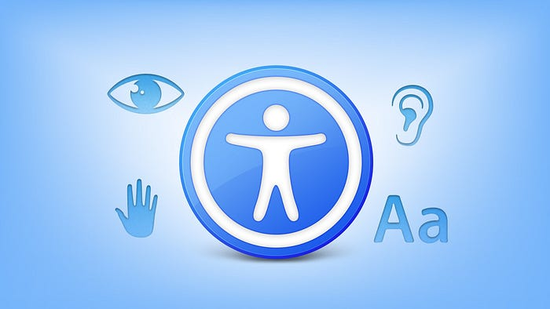
*One app for All*

In our earlier [blog post](./designing-the-swiggy-app-to-be-truly-accessible-episode-1-35ef43e5d4e4.md), we shared how we went about identifying the accessibility gaps in Swiggy and our design philosophy to address those gaps. In this one, we will share how we made improvements on **iOS** for the food ordering flow.

## What did we do?

For our iOS app, we have focussed on making the app compatible with two kinds of disabilities

1. **Vision**: For visually challenged users
2. **Physical and Motor**: For physically challenged users

## How we did it?

Before we get started on the implementation, there are few accessible properties that we have used in iOS

1. **Label**: This property is used to assign the name to our element.
2. **Traits**: These describe the element’s state, behavior, or usage. A button trait might be **is selected**.
3. **Hint**: Describes the action an element completes. eg: **Displays the menu restaurant**.
4. **Frame**: The frame of the element within the screen, in the format of a `CGRect`.
5. **Value**: The value of an element. For example, with a progress bar or a slider, the current value might read **5 out of 100**.
6. **Accessible Element**: View or component for which accessibility is enabled.  
You can set accessibility for a Label/Button or you can make a whole view as one accessible element.
7. **isAccessibilityElement**: This boolean flag is used to enable/disable the accessibility property of any element.  
If it's set to off, OS will not read it.

If you are not familiar with the basic implementation of Accessibility, can go through a starter project on the same. [**_Link_**](https://www.raywenderlich.com/6827616-ios-accessibility-getting-started)

---

## Vision

For people whose vision is impaired, Apple has provided a feature called **VoiceOver**.  
Users can interact and navigate with the app using different hand gestures.

VoiceOver can be enabled in the Accessibility section of Settings.  
Once it's enabled, OS will point to the first accessible element in the screen.

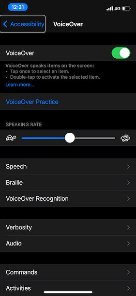

Basic hand gestures used for Voice Over

1. **Swipe right**: It jumps to the next accessible element.
2. **Swipe left**: It jumps to the previously accessible element.
3. **One finger double tap**: Clicks the selected accessible element.

For more commands, you can check the VoiceOver settings in the app.

Following are the different handlings we did in our app to smooth the interaction of Accessible User.

## Grouping the Views

As many accessibility services function in a linear manner and shift focus from one element to the next. If our UI component is not grouped according to functionality, users may have to perform multiple focus shifts to reach the next item/action item.

This problem can be solved by grouping UI components together which logically represent one unit.

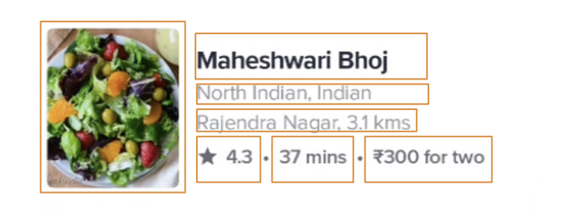
*Image 1. Restaurant entities are not grouped.*

As you can see in the above image, restaurant entities are not grouped together so users can’t hear all the information at once. Users need to change focus every time they need to hear another information.

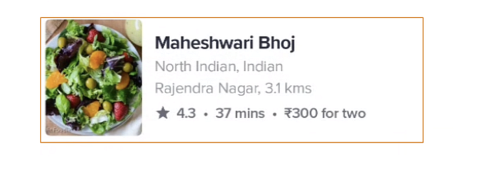
*Image 2. Restaurant entities are grouped.*

In the above image, you see all restaurant entities are grouped together so the user will hear all the focused information at once without shifting focus multiple times.

This can be achieved very easily by making the parent view’s **isAccessibilityElement **property true. OS will treat that view as one property.  
Also assigning the Restaurant Name and its info to the Label property of that view

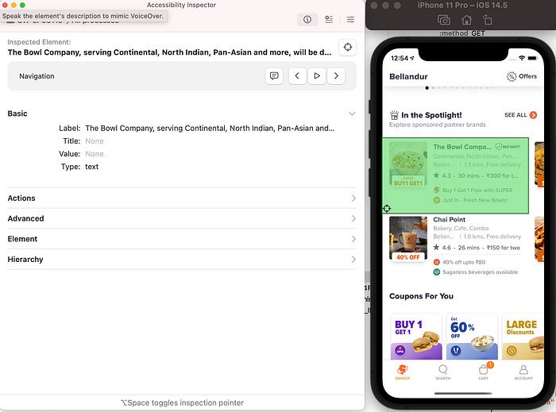

Grouping of the components has been used extensively in our app to make the experience better.

## Accessibility Support for Images/Banners

In the Swiggy app, we have a lot of components that only contain images/banners.  
So assigning a meaningful Name to each image view was challenging.

We came up with a solution where we added an **Alt text **with the image response itself from the backend.  
Then we used that alt text and assigned it to the Accessibility Label.  
This Alt text contains a meaningful description of the image/banner.

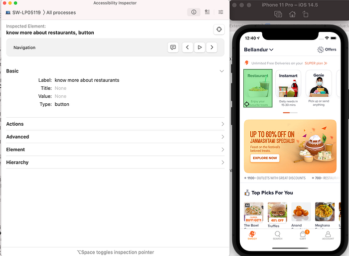

## Announcements

Whenever something is processing or an asynchronous request is completed, we have to inform the same to the user.  
To achieve this we used announcement notifications to let know the user what is happening in the app.

We used these announcement notifications for various use cases  
- App launched with which location  
- Location changed by the user  
- When a screen is loaded (after a successful API call)  
- and many more…

## Custom Actions Handling

If we want to add multiple actions for a particular view component we can do this by using Custom Actions.

For the Swiggy app, we added multiple actions to each food item on the Menu/Cart page. These actions are   
**- Add item  
- Remove item  
- Go to cart**

Note: We added go “Go to cart” action to each item so that the user can easily navigate to the cart as soon as he/she has added the desired item.

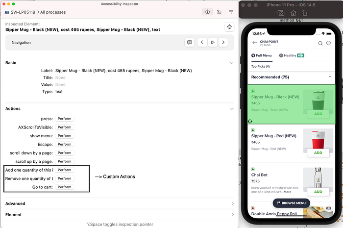

**Modifying Menu Item Cell  
**For the accessible users, we changed the layout of the item cell, so that users can easily navigate to the cart.  
When a user adds a quantity, we added a cart button there itself, which acts as a shortcut to go to Cart Page.

For this, we simply check if it's a voice-over session, we change the layout.

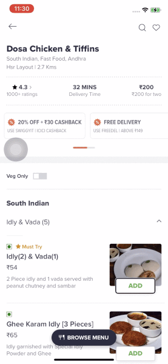

**Implementation Video**:

---

## Physical and Motor

For people who can’t use their hands to operate phones, Apple has provided a feature called **Voice Control**.  
Users can interact and navigate with the app using his/her voice and call different gestures like tap, scroll, swipe

**Voice Control** can be enabled in the Accessibility section of Settings

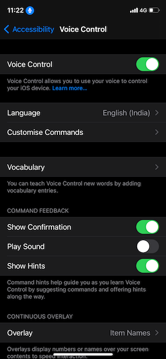

Users can use this Voice Control feature mainly by two types of settings.  
This can be changed inside **Overlay Section**

1. **Item Numbers**: Here OS will determine the accessible elements in the screen and assign numbers to each element.  
The user will say   
- “Tap 1”  
- “Tap 6”  
Then the particular element will be clicked.

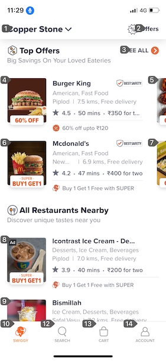

**2. Item Names**: Here OS will determine the accessible elements in the screen and assign names to each element.   
The name will be what we set through code in the **Accessibility Label** property  
The user will say   
- “Tap Burger King”  
- “Tap McDonalds”  
Then the particular element will be clicked.

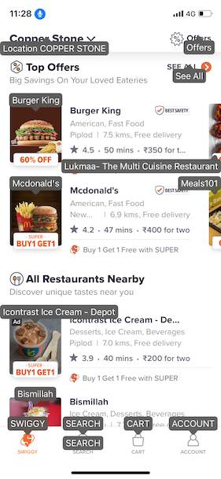

Other commands which users can use are  
- “Scroll down” / “Scroll up”  
- “Go Back”

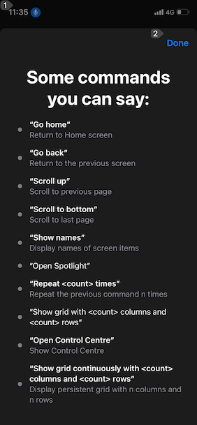

Most of the tasks are achievable using these commands  
For more commands and customization, users can add the same in the Voice Control settings.

**Implementation Video:**

---

## Measure Impact

For every feature implemented, we must add some kind of analytics to measure the impact of that feature.  
**After these features were rolled out, we saw an increased number of orders completed by Accessible users.**

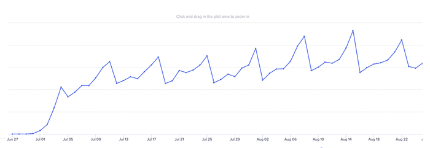

## Where to go from here?

- Now after making our food flow Accessible, we will be focusing on other Swiggy offerings also like Instamart/Genie, etc.
- We are also getting in touch with users and getting feedback on our app and doing changes accordingly so they can get the best possible experience.
- For any new features which we add, we will be supporting accessibility then and there.

> Acknowledging [Sanket Shekhar](https://medium.com/u/33574473afde?source=post_page---user_mention--ec7256401c6d---------------------------------------) and [sreekanth m](https://medium.com/u/fac662e5a2ea?source=post_page---user_mention--ec7256401c6d---------------------------------------) , for helping in this implementation.

---
**Tags:** Mobile App Development · IOS · Accessibility · Swift · Swiggy Engineering
