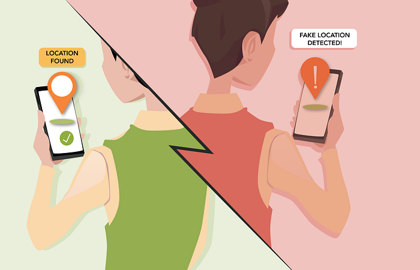
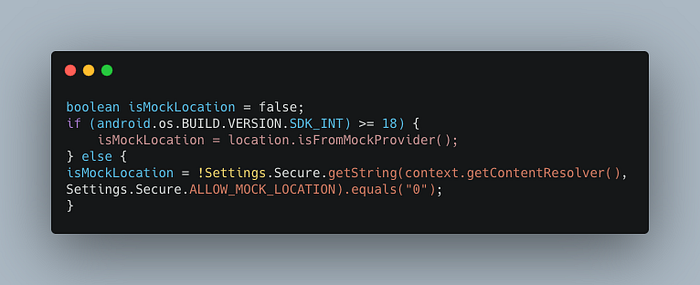
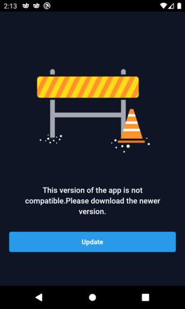
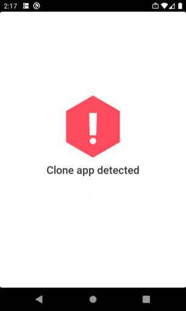
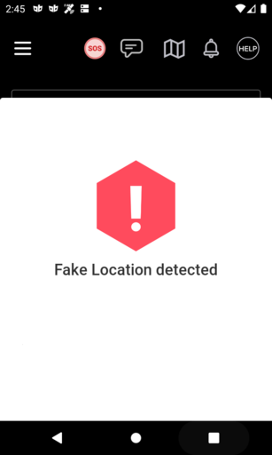
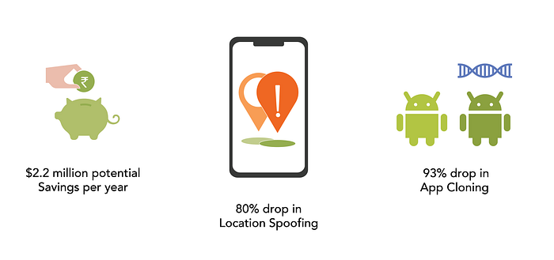

# Detecting App Cloning & Location Spoofing on Android

One of the joys of the food ordering experience is the live tracking feature. You get to see where the driver is, after picking up the order. The happiness of incoming food, the anxiety whether the driver will find your address. This is why [live tracking is a very important system](https://bytes.swiggy.com/making-swiggys-order-tracking-a-magical-experience-37464b878fc7) at Swiggy. Lately, we have seen an uptick in misuse that involves either cloning the app, using location spoofing to change their location, or both. This creates a unique operational challenge for Swiggy and unwanted anxiety for the customers. Here’s how we improved the order tracking experience by building a system that prevents misuse on the Driver app.

## A primer on how cloning and fake locations work

Both iOS and Android created **MockedLocation** as a developer feature years ago. This allowed developers to test location-aware features on their apps and was only enabled using explicit settings on developer-mode or the simulator. Detecting whether a location is mocked is fairly straightforward. For example, here’s a generic code snippet to detect whether a location is mocked using Android’s`isFromMockProvider`API:

On iOS, mocking the location on the go, without having a computer at hand, is close to impossible without jailbreaking the device. However, Android being an open-source operating system, there are many options to do GPS Spoofing, even with applications that can be downloaded straight from the Google Play Store. This combined with app cloning and rooting the device to gain system privileges means that the above check does not give consistent results just by itself, and in turn becomes a serious problem for app-based companies, especially logistic companies like Swiggy.

**App Cloning** allows you to have more than one instance of an app on your phone. Google Play Store has thousands of apps that allow cloning an app, and most of them use one or more of the following techniques.

1. Rename the package slightly to something else — from in.swiggy.app to in.swiggy.app2 as an example.
2. Installing the app under a different path in the storage
3. Sandboxing aka running the app inside a virtual machine

App cloners work very well in conjunction with GPS spoofing. Some cloners even allow marking spoofed locations as original, making it incredibly hard to detect the authenticity of the location pings.

Update: [isFromMockProvider()](https://developer.android.com/reference/android/location/Location#isFromMockProvider()) was deprecated in Android 12 (API Level 31). It is advised to use [isMock()](https://developer.android.com/reference/android/location/Location#isMock()) from Android 12 onwards.

## Size of the problem

The first thing we wanted to do was to gauge the size and scope of the problem. We started a new initiative — Fight Against Fraud — on the driver app team to ideate and execute a set of checks to prevent abuse. As a first step, we shipped some instrumentation of the following signals in April 2021.

1. If developer mode was enabled
2. If the device was rooted
3. Whether the location was mocked — using isFromMockProvider API provided by Android
4. List of installed apps accessing ACCESS_MOCK_LOCATION Android Permission on the user’s phone
5. If the app package name was renamed
6. If the app was installed under a different storage path than intended
7. If the app was running under Android’s Work Profile feature

What we found was a significant ~8% of users were running cloned apps on their device, as well as a sizable number faking their location. While some had them installed but never used it, it still turned out to be a bigger problem than previously anticipated. We cross-checked the data against the top 25 app cloners and found that our instrumentation captured 23 out of them. We’ve added additional instrumentation to identify the missed two cloners ever since.

## The solution — first cut

Early on, we explored if we can maintain a greylist of apps that should not be allowed to be used in conjunction with our Delivery app. These can be apps that facilitate cloning, fake GPS, and similar exploits. If we detect the presence of any of those apps, we will inform the delivery partner to uninstall them to continue getting orders from Swiggy. But, there were thousands of apps available in and out of the app store, maintaining the list of greylisted apps was simply not scalable.

So we had to think of a different solution, where a confidence score could be derived from the abuse signals. Our approach was simple — we’re going to act only in the case of a high confidence score derived from the risk categorization of cloning signals. By default, we assume there is no malicious intent.

### App Update Adoption

For better results, we needed a mechanism to enforce users to update the app to a later version. For this, we use a minimum version config on Firebase, that gets evaluated when the person launches the app. The person will now have to update the app before continuing to log in.

But even with this, the adoption was only 99%. Turns out, some cloners will skip packaging native libraries like Firebase while creating the clone. This renders the minimum version checks useless in such cases. To prevent this, we added a fallback check on the authentication system. Every time a person logs in, the app version and package names are sent in the headers. If the person is using an older version of the app, the above screen shows up, encouraging the person to update the app.

## Detect App Cloning

Upon opening the app, we do multiple checks such as:

1. Check if the package name is intact
2. Check if the installation path of the app is in the standard expected path
3. Check if the app is running on a virtual machine

If we detect with high confidence that the app is cloned, we would display a blocking banner that does not allow being able to use the app any further. This will encourage the person to use the app installed from the Play Store directly.

Since some app cloners can even disable native modules like Firebase by not packaging them into the app while cloning, we shipped the app with the clone checks enabled by default.

## Detect GPS Spoofing

With app cloners out of the way, location spoofing is now relatively easier to detect ([isFromMockProvider](https://developer.android.com/reference/android/location/Location#isFromMockProvider()) to the rescue!). If a person is using a mocked location, we will prevent them from logging in to the platform.

But this introduced another interesting challenge — what happens if the person is already logged in, and is turning on the GPS spoofing while they are busy with an order?

In such cases, we show them a warning nudge about the GPS spoofing but will allow them to continue with the order. This ensures that the customer gets the order on time. And the person will be prevented from getting new orders for some time, as a discouragement.

## The Impact

We saw a huge dip in misuse of the app and fraudulent activities on the platform, as delivery partners were actively encouraged not to use GPS spoofing.

*The Impact of our location spoofing and app cloning detection system*

## What’s next

Fight against fraud is a never-ending cat and mouse game. There will never be a stop-gap solution, as the exploits themselves keep evolving. We are continuing to add more and more checks to keep the frauds in tow.

App checks alone cannot detect fake GPS locations entirely. The app knows what it’s being told by the operating system, and Android, as an open-source OS makes it easier for external exploits to be introduced. Adding app certificate integrity checks is highly recommended.

The driver app side checks were built by [**Mehar Kaila**](https://www.linkedin.com/in/meharkaila/)** (**[**Twitter**](https://twitter.com/meharsonatrip)**)**, with assistance from [**AB Alex**](https://www.linkedin.com/in/abeyalex)**, **and [**Sabarinath Selvam**](https://www.linkedin.com/in/sabarinath-selvam-52263940/).

Thanks to [Shivani Barde](https://www.behance.net/shivanibarde) for the illustrations.

If this problem interests you, check out [**Swiggy Careers**](https://careers.swiggy.com/)! At Swiggy, we’re always solving such interesting engineering problems to improve the customer experience at scale. We are currently hiring across Engineering, Product, UX, and Program management, and might have an opening for you!

_Co-authored by Abey Alex_

---
**Tags:** Android · Location · Mobile App Development · Software Development · Swiggy Engineering
