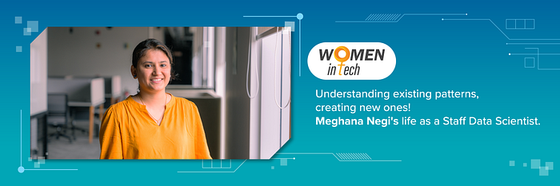

# Digging through data: Meet Swiggy’s Staff Data Scientist Meghana Negi

**If there was anyone who loves data and finding patterns it has to be Meghana Negi. Here’s how she has been bringing about change for **[**women in the tech**](https://blog.swiggy.com/category/life-at-swiggy/women-in-tech/)** space.**

When you first meet Meghana Negi, Staff Data Scientist at Swiggy, you can’t help but notice how soft-spoken and unassuming she is. But make no mistake, for this introvert lets her work and accolades speak for themselves.

She has been making space for women in male-dominated fields since her childhood — having played cricket and Kho Kho — currently she’s breaking barriers in the tech space.

Here’s all we know about Meghana, who is riding the wave of data and change at Swiggy.

**Always leading**

Having been raised in a “middle class household” where education and work were a priority, Meghana focuses on getting the job done first and then thinking about accolades that come her way.

“We were like any other family. My dad is an engineer and we had our fair share of ups and downs. Which is why our parents always insisted on us getting a proper education and made sure that whatever happens, their two daughters have good jobs,” says Meghana who credits her parents for helping her become the independent woman that she is.

Currently, she is one of the few women in leading roles in Data Science. But breaking barriers and making space for herself isn’t something new to Meghana. “Growing up, I loved to play cricket and I was also one of the youngest national-level Kho Kho players. Back then cricket or any other sport wasn’t popular when it came to women. But I love sports and that lack of visibility never stopped me from playing,” says Meghana, who also won the ‘Best Chaser’ award from Haryana.

From sports to the tech field today, she is well-versed with how hard it is for women to shine, but that has only pushed her to do better.

**All things data**

For Meghana, the options for her undergraduate were limited. “My parents wanted me to pick either engineering or medicine and I opted for the former because I didn’t like biology much,” she says.

After completing engineering in Computer Science, Meghana went on to do her masters from IIIT Allahabad. So how did she go from engineering to data science? “Through my on-campus recruitment I landed a computer science job, but a friend of mine told me that there was this up and coming field called data science and that I would like it. As things would go, I got a job in a company called CouponDunia. I was the first data scientist there and it was good learning. That was the beginning of my journey with data science,” she says.

After a few years of working, Meghana wanted to explore the startup field. “There were plenty of options in Bangalore and back then there was a lot of buzz surrounding Swiggy. Initially, a majority of research in data science only catered to developed countries. But in an Indian setting there are very unique problem statements that need to be solved. Swiggy had great potential in that field and that pushed me to join the company,” says Meghana who has been with Swiggy for five years now.

When she initially joined the company, Meghana was handling ads and recommendations. “I currently lead the trust & safety and CMS/Supply charters. In TnS we work on fraud detection both from delivery partners and customers. In the supply section, we work on enriching the catalogue systems at Swiggy, so that it helps restaurants and other upstream systems. We have also developed systems like understanding abusive IGCC behaviour, changing the cash on delivery limits based on the customer. Basically, we try to decrease instances of fraud,” she explains.

**Always learning and growing**

Having been in this field for long, Meghana recognises the challenges that come along. So what’s her advice to women who want to make it big in this field? “There are a lot of things happening in this field and there’s an abundance of data, but you should take it up only if you love patterns. Because a majority of the time we are analysing and understanding patterns, so you have to be very mindful about that.

“The second piece of advice is that this is a fast developing industry and you need to be constantly learning. If you want to grow here, you need to spend ample time understanding how things work,” she says.

Meghana is a multi-tasker and despite the amount of time she loves to invest in her career and in learning, she makes time for her hobbies as well. And she believes that this has been possible due to the [Future of Work Mandates at Swiggy](https://blog.swiggy.com/2022/03/25/what-work-looks-like-at-swiggy/). “I am an avid board-game person, I love to play badminton, travel and I dance too. The future of work mandate has given me the chance to pursue these interests. That said, the fact that we go to the office for the [quarterly Jamboree](https://www.youtube.com/watch?v=JHJQ7j3_S6M) is a great way to bond with our teams. So this has been working really well for me,” she says.

For someone who is all about analysing data and seeing how best she can use it to bring change at Swiggy, it doesn’t come as a surprise that her favourite [Swiggy value is “Move Fast, Break Barriers and Deliver Results](https://blog.swiggy.com/2022/12/21/here-are-swiggys-values/)”. “We are in a hyper-growth phase and there are a lot of unknowns with respect to the change that we are trying to bring. Because of that, I believe that we need to move fast and experiment more to deepen the immediate on-ground impact. This will help us gauge what needs to be done to be successful and without doubt is my favourite value and one that I swear by,” she says.

Meghana has come a long way, but she believes that she has miles to go. It’s obvious that one doesn’t get called the ‘Best Chaser’ without good reason, because even now after achieving her goals, Meghana is always setting and chasing new ones.

---
**Tags:** Women In Tech · Careers · Tech Leadership · Employee Spotlight · Swiggy Life
