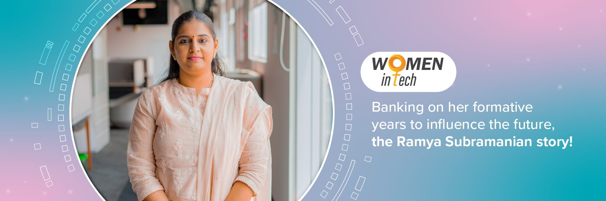
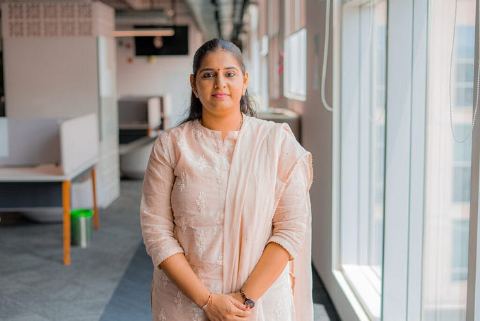

# Donning Several Hats with Finesse -Meet Swiggy’s Senior Engineering Manager

**This is the story of Ramya Subramanian, a Swiggster who embodies Swiggy’s value “act like an owner” and takes charge in every aspect of her life.**

Ramya Subramanian, senior engineering manager at [Swiggy](https://www.swiggy.com/app), understands the importance of having female mentors, especially those who break barriers. After all, having a mother who was a banker at a time when working women were few and far between, teaches you some pretty important life lessons.

This avid baker who loves to spend time with her two children, carries forward what she learnt in her childhood and wants women to know that their “career is not an option”.

Here’s how she’s making changes at Swiggy and how the company is growing with her.

**Back to the start**

Growing up in Tirunelveli, a city in Tamil Nadu, to parents who insisted on women having financial freedom, Ramya was raised to value work. “My mother was a banker who worked in the interiors of Tamil Nadu. Back then she didn’t have the luxury of child care and so she would manage work and home. Experiencing her work ethic and personal life shaped me into the woman I am today,” says Ramya.

Another life lesson she picked up from her mother was prioritising things. “That really helps me even today. You have to know when to prioritise family and work. That has been of great use to me when it comes to walking that fine line between both worlds,” she says.

**All about tech**

When Ramya started working, all she focused on was learning and following her passion. ”I started my career with Juniper Networks. There I worked with physical switches and routers, plug in and plug out cables. As tech evolved, I did too. I went from physical routers to the cloud industry, when I worked with Paypal.This is how I started my career and ended up in [Swiggy](https://www.swiggy.com/app) with the passion to evolve along with technology,” she says.

It’s been a little over a year since she joined Swiggy and Ramya is enjoying the ride. Ask her why she joined the company and she says. “I’ve always wanted to work in a startup ecosystem and wanted to see an end-to-end picture of what I was doing and the impact that I was creating. Swiggy gave me the chance to do both. Often, I get to see the impact of my work the very next day. That is an unmatched feeling.”

At Swiggy, Ramya’s team handles the customer checkout experience. She also manages a platform team that is working on building an order management system that provides unified checkout experience across different business lines . “We are responsible for the customer’s digital checkout experience. We do all the things that are necessary for a smooth, seamless checkout for our customers from a tech standpoint. One of our highlights was introducing autopay, where we worked on rescuing payment failure, reducing the cash loss and converting it to digital payments. We also worked on the ‘time around cart’, where we nudge users when a restaurant is going to close in the next few minutes. This helps them place their order better,” explains Ramya who handles a team of 25 and is mentoring a couple of SDE3s.

[**Leading in the tech space**](https://blog.swiggy.com/category/life-at-swiggy/women-in-tech/)

For Ramya, her family comes first, but she is not one to give up on her career. “I absolutely love my family, but my parents helped us understand the importance of a working woman. I am so proud of my mother for the example she set for me and I want my children to be proud of me for working so hard,” she says.

So how has her experience of being a leader in the tech space been? “Leadership in general isn’t an easy responsibility, I don’t think it is gender. People in these roles have the power to inspire and influence others and that is not something you take lightly.I feel anyone who is passionate and puts in the hard work can grow,” says Ramya who thanks her leaders at Swiggy for helping her grow and work on projects she is passionate about.

As a mother of “two naughty kids”, Ramya has her hands full at home and work. Speaking about what worked for her, she says, What worked for me is asking for help both at the family and work front. I have been lucky enough to have a supportive family and colleagues, so my advice is to ask for help. Don’t shy away, seek guidance from your leaders if you are stuck and create a support system.

“My other advice would be to never treat your career as an option. Far too many women give up on their career after they get married or have babies. If they have the opportunity to, they should continue working. Being financially independent has its own benefits and sets a great example for your children.”

As someone who has grown tremendously in the tech industry, Ramya is no stranger to how the industry has evolved. “Many companies are keen on leveling the playing field for women and men. They now provide better maternity leaves and day care facilities as well, these are helpful for mothers who are struggling to find that balance. Look at Swiggy’s Learning Wallet benefit that helps employees grow professionally and personally. So take advantage of what the companies are offering,” she adds.

One of the many things that Ramya loves about [Swiggy is the flexibility to work from home](https://blog.swiggy.com/2022/03/25/what-work-looks-like-at-swiggy/). As someone who is part of Swiggy’s remote work mandate, she says, “I am so thankful for this. If it wasn’t for the ways of working I would not be able to continue here without shifting my entire family to Bangalore. Now I can work from home and yet, come to the office to meet my colleagues and team once every quarter during the Jamboree. This entire setup works so well and helps me grow!”

[Which Swiggy Value does she resonate most with](https://blog.swiggy.com/2022/12/21/here-are-swiggys-values/)? “Act like an Owner is my favourite value. Swiggy gives you the space to grow and work on projects that are not just limited to your team. I can pick any project with any team. This is another point that I love at Swiggy, everything is set up for us to learn and grow more,” she says.

Despite a busy schedule, Ramya is not all work. Speaking about all things sweet, she says, “I absolutely love to bake! I started baking for my children a while ago and did not stop. One of my dreams is to start a small baking business, and hopefully I can work towards that!”

---
**Tags:** Swiggy Life · Women In Tech · Engineering Manager · Swiggy Engineering · Women Leaders
