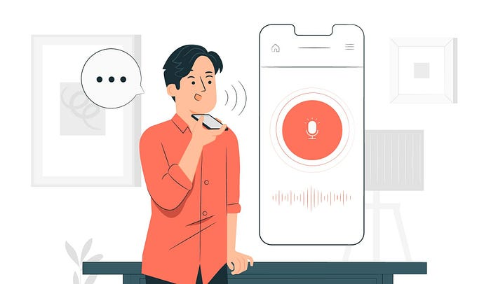
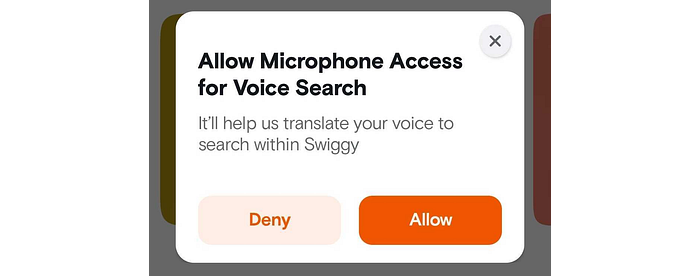

# Elevating the Swiggy Experience with Voice Search on Android

> Find what you’re craving with just your voice on the go!



With Swiggy being the king of convenience in the hyperlocal space, another feature that has made the food ordering experience even more convenient is Voice Search. It allows users to search for their favorite restaurants and dishes using their voice.

In this blog post, we will discuss some best practices for implementing voice search as well as the benefits of adding voice search functionality to our app. Whether you’re a developer looking to improve your app’s user experience or a user interested in the latest trends in mobile technology, this post will provide valuable insights and information. So, let’s dive in and learn more about how voice search is transforming the world of Android app development!

A few months back, we received a requirement from the product manager to add the capability of using voice search in our app. Our developers quickly tried out a proof of concept (POC) using [SpeechRecognizer](https://developer.android.com/reference/android/speech/SpeechRecognizer) to convert speech to text. Once the POC was completed and the results were promising, we decided to proceed with the actual implementation of the feature. Our developers completed the feature in less than two weeks and it was ready for release.

Here are the steps we followed that enabled us to integrate the feature in the app and get it release-ready within two weeks.

**1. Utilizing Jetpack Compose framework   
**We have explored Jetpack Compose for this requirement because it has a declarative UI model, which greatly simplifies the construction and updating of user interfaces for each recognizer callback state.  
We used these UI states: _SPEECH_BEGINNING_, _SPEECH_LISTENING_, _SPEECH_RECOGNIZED_, and _SPEECH_UNRECOGNIZED_, which are transformed into composable code with the help of a state owner.

**2. Speech-to-text recognition  
**We used the SpeechRecognizer library from Google to convert speech to text within the app. The implementation of this API streams audio to remote servers to perform speech recognition.   
SpeechRecognizer provides us with a bunch of intents that help us customize the model based on our needs.

```
fun initSpeechIntent() {
        speechRecognizer = SpeechRecognizer.createSpeechRecognizer(context)
        speechRecognizerIntent.putExtra(
            RecognizerIntent.EXTRA_LANGUAGE_MODEL,
            RecognizerIntent.LANGUAGE_MODEL_FREE_FORM
        )
        speechRecognizerIntent.putExtra(RecognizerIntent.EXTRA_PARTIAL_RESULTS, true)
}
```

_LANGUAGE_MODEL_FREE_FORM _— We used a free-form speech model as the user is more likely to speak in an unstructured or unorganized way.  
_EXTRA_PARTIAL_RESULTS — _This is used to pick up intermediate speech terms and convert them to an array of strings.

```
speechRecognizer.setRecognitionListener(object : RecognitionListener {
            override fun onReadyForSpeech(params: Bundle?) {
                performingSpeechSetup = false
            }

            @Synchronized
            override fun onError(error: Int) {
                val duration = System.currentTimeMillis() - mSpeechRecognizerStartListeningTime
                if (performingSpeechSetup && duration < 500) {
                    return
                }
                updateErrorEvent(screenLaunchSource)
            }

            override fun onResults(bundle: Bundle) {
                val data = bundle.getStringArrayList(SpeechRecognizer.RESULTS_RECOGNITION)
                val result = data?.safeGet(0)
                listenTextLiveData.value = if (result != null) {
                    launchSearch(result)
                    result
                } else {
                    "No results found"
                }
                updateScreenState(VoiceSearchStates.VOICE_COMPLETE)
            }

            override fun onPartialResults(bundle: Bundle) {
                val data: ArrayList<String> =
                    bundle.getStringArrayList(SpeechRecognizer.RESULTS_RECOGNITION) as ArrayList<String>
                if (data.size > 0) {
                    val runningText = data.joinToString(" ")
                    if (runningText.isNotBlank()) {
                        partialTextLiveData.value = runningText
                    }
                }
            }
        })
```

**3. Microphone Permission handling   
**Since microphone permission is relatively sensitive, we need to inform the user about our use case before asking for permission.


*Microphone permission popup*

To simplify the complexity of handling microphone permission in the app, we used [RxPermissions](https://github.com/tbruyelle/RxPermissions). It uses RxJava2 to handle all permission requests and user actions, and it smoothly handles different SDK versions.

```
    private fun hasRecordAudioPermission() =
        RxPermissions.getInstance(activity.applicationContext)
            .isGranted(Manifest.permission.RECORD_AUDIO)

    fun getRecordAudioPermission(recordAudioPermissionSuccess: (Boolean) -> Unit) {
        RxPermissions.getInstance(activity)
            .request(Manifest.permission.RECORD_AUDIO)
            .observeOn(AndroidSchedulers.mainThread())
            .subscribe({ granted ->
                if (granted) {
                    if (hasRecordAudioPermission()) {
                        recordAudioPermissionSuccess.invoke(true)
                    } else {
                        recordAudioPermissionSuccess.invoke(false)
                    }
                } else {
                    recordAudioPermissionSuccess.invoke(false)
                }
            }) { e -> Logger.logException(TAG, e) }
    }
```

**4. Accessibility support  
**To make the app truly accessible for all, we have made it mandatory to add accessibility support with each and every feature we ship.

While a user speaks on the speech recognition screen (with the speech conversion SDK active), A11y talk back is disabled. To resolve this issue, we added a delay of approximately 10 seconds for only accessible user sessions.

_Enhancement/Active Exploration_ —We are working on finding a solution where, immediately after the talkback voice on the speech recognition screen ends, we can get a callback and start listening for the voice.

### Final Product


### Order conversion metrics

Based on the latest data, we are receiving around 45,000 daily requests for voice search. Of these requests, approximately 35% of the users go to the menu page, 17% add items to their cart and go to the cart page, and roughly 5.5% go ahead and place an order, resulting in approximately 2.5K incremental orders per day.

### Final Thoughts

Overall, the adoption is likely to continue to grow in the coming months and the successful implementation of voice search in our app has greatly improved the user experience and provided additional value to users.

> This couldn’t have been possible without the help and support of [Farhan Rasheed](https://medium.com/@farhanrd), [Manoj Sudarshan](https://medium.com/@manoj.s1), [Shivansh Prakash](https://medium.com/@helloshivanshprakash), [Raj Gohil](https://medium.com/@rajgohil044) , and [Tushar Tayal](https://medium.com/@tushar.tayal_43056).

---
**Tags:** Android App Development · Voice Search · Swiggy Mobile · Mobile App Development · Speech Recognition
