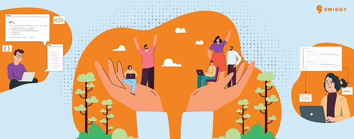
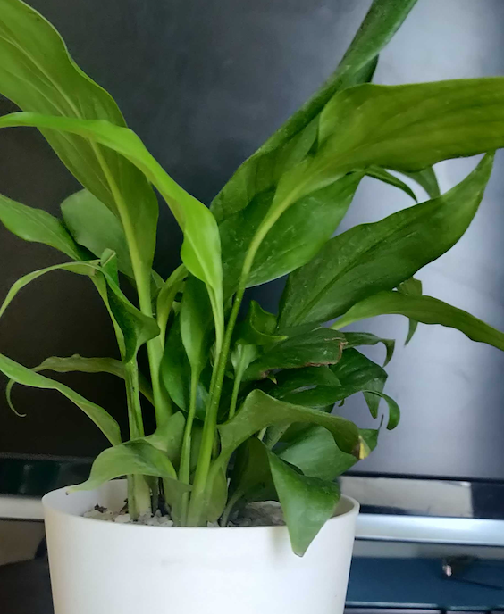

# Enabling an environment for Engineers to grow

From the past many years, Swiggy is growing — not only in terms of scale but in complexity. And as we scale up and solve challenging engineering problems, we need best in class Engineering talent to build and sustain the Swiggy that we see. The IC (individual contributor) engineers at Swiggy strive towards building stable and scalable systems, solve for some of the most interesting, yet challenging problem statements contributing towards the Engineering excellence.

At Swiggy, we believe in giving opportunities to internal talent to figure out their passion, grow and succeed! One of the initiatives that we have been running for the past 8–9 months now is the “Technical Advisory Program’’ (TAP). The TAP seeks to provide **_holistic _**and **_targeted _**technical** **advisory for the employees, by the employees, to help them **grow in their professional career**. This replaces the technical assessments that were run for Senior IC Engineers (SDE3 and above) before the performance cycles, for the ones who were nominated for promotion. This is a continuous assessment and actioning process over a period of time.** Through TAP we have enabled a system of ongoing guidance, feedback and assessment. The engineers gain by receiving the right technical feedback at the right time so that action can be taken in real time (rather than waiting for the end of performance cycle assessments).**

## What is Technical Advisory Program (TAP)?

TAP is a program where continuous technical advisory is provided to an IC Engineer (currently for SDE3 and above) who is ready to grow in the organization, by an advisor who is again a Senior IC Engineer at least 1 level above the advisee and has domain familiarity. In TAP, advisors are paired with advisee who engage with each other on a regular basis to progress towards specific goals. These goals are arrived at through a three way conversation between advisee-advisor-manager where the body of work of advisee is discussed, spikes at the next level and areas where current body of work isn’t enough to assess. Throughout the journey the 3 stakeholders closely work with each other to help advisee move ahead in the action plan, unblock wherever necessary and create opportunities (via manager) wherever needed.

These milestones are being program managed by a TAP-core team with [Vijay Seshadri](https://medium.com/u/8d6e25f79da5?source=post_page---user_mention--c7413a6ad806---------------------------------------) and [Pradnya Karbhari](https://medium.com/u/90d61f79ed89?source=post_page---user_mention--c7413a6ad806---------------------------------------) shepherding the program. There is sufficient focus and bandwidth that goes to enabling Advisors review and give evidence based feedback to the Advisees.

> One of the managers, Saurabh Narain, Director-Engg, says that the process helped filter out many early promotion cases which were not really ready. Since the TAP advisor works with candidates for 6 months it gives ample time to the candidate to work on the area of focus and the final decision of promotion, especially when it is a no, is much more acceptable and reliable.

### Our role, as a program team, becomes extremely important as we are directly impacting careers by providing an ecosystem to be assessed, course correct and grow.

> Avantika Tewari, SDE4 who was part of TAP in the last cycle, mentions that dedicated support from Advisor for reviewing the body of work and providing constant feedback helped her in her TAP journey as an advisee. There was a good connect between advisor and manager where feedback from the Advisor was immediately addressed by the Manager and the loop being closed benefitted them in this relationship.

## What’s in it for Advisors?

At Swiggy Tech we strongly believe in each other’s growth and it is reflected in our Advisor’s commitment to the program and to each Advisee they are tagged to. Apart from being able to make a difference in an Advisee’s career, our Advisors get to deeply understand the work that is happening in other parts of the organization. Overall it gives a learning experience to advisors as well.

> One of the advisors, Fasihullah Askiri, Sr Principal Engineer, acknowledges that he got a good experience with genuine mentoring & deeper understanding of work done across teams.

To enable Advisors we -

- We conduct sessions to sharpen the understanding of our Levelling guidelines (expectations from each role)
- We have regular **Learning Circles** to enable them with tools that would help them in their Advisor-Advisee relationship and also build an Advisor community to learn from each other. Also serves as check-in with advisors.

_The first learning circle focussed on_

- _Structuring the first advisee- advisor conversation_
- _Introducing a framework (5-My) to understand their advisee better and craft actionable goals for the relationship._
- _Defining the elements of their advisee advisor relationship._
- _Sensing if they are building a good relationship in your conversation with their advisee._

_The second learning circle acted as a check-in and sharing of experiences of advisors. They were also introduced to the concept of wheel of balance, highlighting skills needed to be good at advisory_

_The third learning circle, on Drivers, (after sufficient time had passed in the journey) was to help Advisors reflect insights on how their beliefs impact their inte_rpersonal skills and advisory style.

- There’s sufficient effort and time that goes to Coaching the Advisors on giving evidence based feedback to advisee, unblock them in helping advisees and managers in enabling certain org wide projects (if there’s a need), acting as a source of reflection for them to ask questions, and on specific problems that they might be facing.

> Our advisor Atul Kumar, SDE4, shares feedback that the last session on Drivers helped him in understanding personality and how he can use that to his advantage in providing feedback to the advisee. Also, helped remove certain biases which are inherent in personality types, providing a structural way to identify the drivers and deal with them, which will be useful not just with TAP but with other aspects of the professional life. He also mentioned that the 5 Mys framework was helpful in identifying strengths and areas of improvements and connect better with the advisee, which was also useful outside of TAP for senior ICs.

As a token of appreciation and encouragement, we also shared a symbolic gift with the advisors, as they are going beyond their current responsibilities to help Engineers grow :)

## What’s in it for managers?

This gives an opportunity for managers to get Technical feedback on their team members almost in real time, so that next steps can be planned accordingly. They get a cross team view as well, to understand what their team members are doing vs what is expected, and what opportunities can be tapped on.

> Satish Kumar, AVP-Engg, mentions that as the assessor spent multiple hours over a few months, the assessment was well rounded. This also allowed the assessor to provide concrete feedback which helped in development of the candidate.

We had tons of learnings throughout this journey, and we are trying to incorporate the feedback as continuously as possible. Jotting down few -

- This was the first time we were doing a program like this, hence it required us to keep making changes and responding to feedback that came in from stakeholders or the ones that we observed on the go.
- Keep reminding owners of the milestones! It is easy to get engrossed in other priorities in a workplace that is moving at a crazy pace.
- It’s extremely important to have the key stakeholders (here — Manager, Advisee, Advisor) on the same page.

## This is only the start to a continuous feedback and assessment culture, which eventually will lead to growing internal talent more than before.

Intent is to invest in growth of employees under the TAP umbrella beyond the current scope. We see the goodness spreading in other parts of the organization to focus on creating a supportive environment where our employees grow, find interesting challenges that engage and inspire them at Swiggy!

---
**Tags:** Career Development · Technology · Careers · Swiggy Engineering · Swiggy Life
