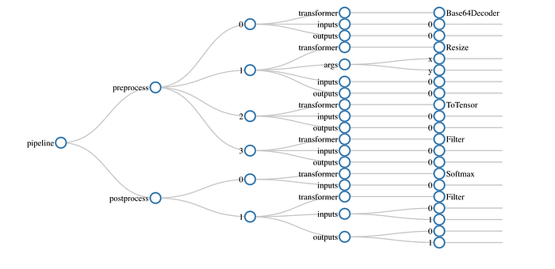
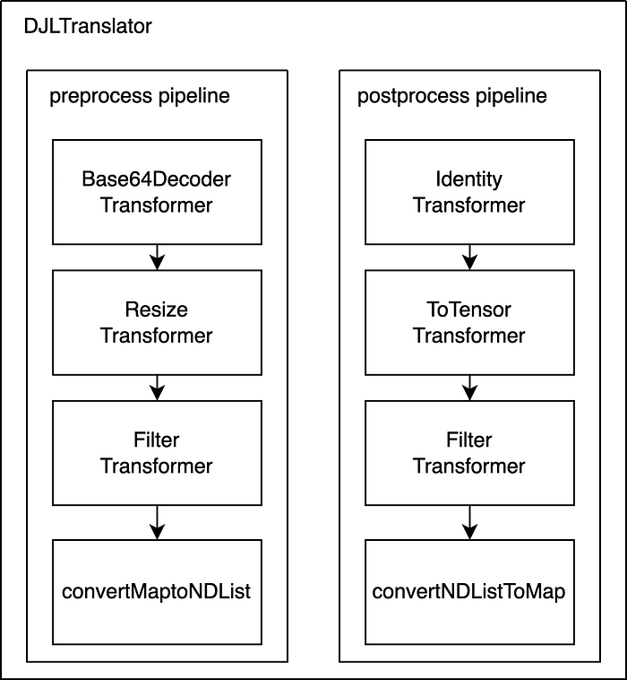
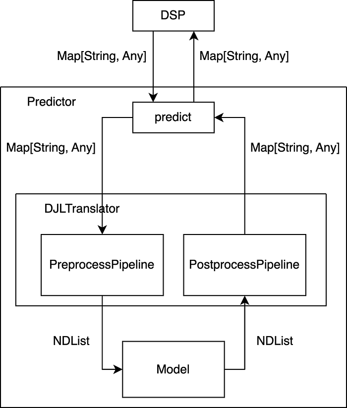
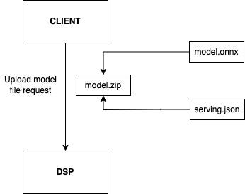
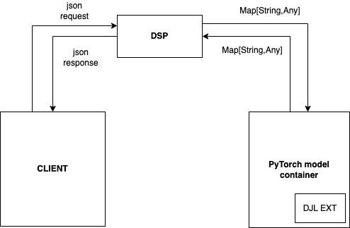

# Enabling large-scale PyTorch model inference at Swiggy

_Authors: _[_Abhishek Bose_](https://www.linkedin.com/in/abhishekbose550/)_, _[_Chaitanya Basava_](https://www.linkedin.com/in/basava-sai-naga-viswa-chaitanya-665083172/)

Swiggy’s internal serving platform, the **_Data Science Platform_** or **_DSP_**, has evolved over the last few years by providing support for different inference frameworks, including MLEAP and Tensorflow. The platform has undergone several development iterations in order to allow models to serve millions of requests per second at latencies as low as 15 ms.

With the progress in the field of AI and with more complex models being experimented with, we noticed a shift in the research preference from **_Tensorflow_** models to **_PyTorch_** models in our teams. A lot of state-of-the-art research papers being released also had their experiments being conducted in PyTorch. As a result of this, we noticed the Data Scientists’ dependency on PyTorch to a large extent for testing out these SOTA models, especially deep learning-based models.

Currently, there are quite a few PyTorch models being developed by the DS team for different use cases. Converting these models to Tensorflow and then deploying them comes with extensive development overhead.

Until now, all deployment of PyTorch models could only be done through the following options:

1. **_Model as a service on Kubernetes using custom Docker containers: _**Convert model into deployable format (jit, ONNX) Package a Python web application (created using FAST API framework) in a container. Run the model as a standalone application **_AWS EKS_** using Swiggy’s internal deployment wrapper called ROCK.
2. **_Deploy on DSP using the Tensorflow route: _**Convert the model into a TensorFlow model. Using open-source conversion techniques.Or by retraining the model from scratch using TensorFlow

There are a couple of shortcomings and limitations when following these two approaches.

In the first option given above, there is an overhead of creating a web application every time by the Data Scientist. No proper **_separation of responsibility_** between the serving and inference layers. Non-unified way of monitoring and logging. Operational overhead of maintenance and updates

When it comes to the second option, we see that a lot of models cannot be converted to TensorFlow easily without taking the retraining route. Retraining might take days, consequently resulting in redundant resource expense for the same model. Certain models are easier to develop in PyTorch. Many new developers are also well-versed in PyTorch. There is also an option of converting models to ONNX which provides runtime acceleration as well. Although off-the-shelf, widely available models can be converted to ONNX, sometimes it becomes difficult to export certain custom operations to the ONNX format.

As more and more use cases started coming from different teams, we decided to move forward with the option of first-class PyTorch support on DSP.

The specific requirements from our PyTorch support release on DSP include the following.

- Deployment of PyTorch models should be easy for Data scientists.
- The platform should be capable of supporting native PyTorch models (which are generally _jit _models) and also **_ONNX_** models for added runtime acceleration.
- Data transformations on the input and output can be easily configured
- **_JVM_** support since our platform is built on **_Scala_**

## Framework

*ref: https://docs.djl.ai/*

In our exploration for a framework which complies with all the requirements mentioned above, we came across [**Deep Java Library**](https://djl.ai/). DJL is a Java-based model inference plus training library developed by Amazon for serving models belonging to any framework (PyTorch, Tensorflow, MXNET, Sklearn, ONNX) in the Java runtime itself. DJL also supports training deep learning models in Java natively.

In order to make DJL work seamlessly with our Scala-based model serving runtime engine, we decided to write our own Scala wrapper on top of **DJL** and called it the **_DJL-extension_** library.

Let’s go over the primary components of the **_DJL-extension_** library.

## DJL pipeline

We onboard every model to DJL extension using an overarching concept of a model pipeline. The DJL pipeline abstracts out the complexities of defining model preprocessing and postprocessing steps using a configuration file.

The pipeline class expects a JSON configuration file, containing details about the different stages of the model inference pipeline and the transformations to be applied to the inputs and outputs of each stage.

*Fig 1: JSON configuration file graph*

Every DJL model pipeline consists of a **_preprocess_** object and a **_postprocess_** object. The image given above (Fig 1) shows the pipeline for a certain image classification task. Since there can be multiple pre-processing and post-processing steps for a certain model, the **preprocess **object inside the pipeline allows the user to specify a list of input, output and transformer combinations.

The same applies to the **_postprocess_** block as well.

In this example, we have a base64 encoded image string going as an input to the pipeline. This is moved through the **_Base64Decoder_**, **_Resize_**, **_ToTensor_** and **_Filter_** transformers before reaching the inference step.

Once the inference is done, the pipeline class automatically applies the **_postprocess_** block to the predicted output. In this case, **_Softmax_** will be applied to the model output followed by a filter step where the client expected output is returned.

Let’s look at a few DJL extension transformers in the next section.

## DJL Transformers

Transformers in the DJL extension library allow a user to apply certain transformations and modifications to model inputs and outputs.

For the image classification example given above, the **_Base64Decoder _**transformer takes a base64 encoded string and converts it into an NDArray which can be consumed by the model.

Similarly, the **_Resize_** transformer , as the name suggests, resizes an NDArray to a designated shape.

Another special transformer which is very specific to NLP models is the tokenizer transformer, which allows a user to tokenize strings to tokens which are input to models such as Bert, Roberta etc.

The list of transformers, which are supported by our first release of the DJL extension library is as follows:

- **_Base64DecoderTransformer_**
- **_FilterTransformer_**
- **_IdentityTransformer_**
- **_ResizeTransformer_**
- **_SoftmaxTransformer_**
- **_TokenizerTransformer_**
- **_ToTensorTransformer_**

## DJL Translator

Every model deployed using the DJL framework needs to use a class called the [**_Translator_**](https://docs.djl.ai/docs/demos/malicious-url-detector/docs/translators.html) class. The translator provides an easy way of combining the pre-process, inference and post-process steps into one class. It also allows efficient memory management of NDArray objects which are expected as inputs by the model in DJL. The custom translator implemented for facilitating the model inferencing on DSP takes care of aggregating all the necessary transformers for the model being inferred and applies all the objects as specified in the JSON configuration file.

It implements two methods, each for executing the preprocessing and postprocessing pipelines respectively. All the transformer objects are preloaded at the time of model deployment both at the pre and post-processing levels. The implemented translator supports fixed input and output types, so as to seamlessly integrate with the DSP ecosystem. But since we have models of different kinds that expect different input and output types, we implemented standard converter methods that take care of converting to and fro from DSP formats to NDArray types. The following image (Fig 2) summarizes the internals of the DJLTranslator.

*Fig 2: A DJL translator example with custom pre-process and post-process steps*

## DJL Predictor

Predictors in DJL are a combination of the translator and model objects. Models take an [**_NDList_**](https://javadoc.io/static/ai.djl/api/0.21.0/ai/djl/ndarray/NDList.html) as an input, which is nothing but an aggregation of [**_NDArray_**](https://javadoc.io/static/ai.djl/api/0.21.0/ai/djl/ndarray/NDArray.html) objects. When calling the predict method of the predictor object it executes the following steps to finally return an inference output that can be served to the client.

1. The preprocessor method of the implemented translator takes in the DSP inputs and  
– applies the pipeline of transformers  
– converts those outputs into an NDList  
– passes it to the model
2. The model then executes the forward pass and returns back an **NDList**
3. This is then inputted into the **postprocessor** method of the translator, which takes care of  
– executing the post-processing pipeline transformers  
– conversion of the outputs to DSP-supported types
4. The final output is then sent back to the client by DSP.

The following image (Fig 3) summarises the inference flow when using DJL.

*Fig 3: Inference flow for any DJL pipeline*

## DEPLOYMENT

*Fig 4: Model file upload to DSP*

The figure (Fig 4) above shows the components of the model file upload step

In order to deploy a PyTorch model onto DSP, the client first needs to upload a model zip file to DSP. This zip file should contain the actual model file (.jit or ONNX version) along with a configuration file with the name _serving.json_. The serving.json file would contain the details of the pre-processing and post-processing steps.

The data flow is defined below:

- The model is registered onto DSP  
– When DSP finds that the type of the model is PyTorch, a DJL model. serving container is created which loads the model onto memory.
- The client hits DSP with a JSON request
- DSP converts the request into a Map consisting of String type Key and Any type value
- This Map input is then forwarded into the DJL model predictor  
– Internally this value from the Map is converted into the required input type for the model using a bunch of transformers which we added to the DJL extension library.
- Once the prediction is done, the output is returned back to DSP as a Map which is returned to the client in the form of a JSON response

The image below (Fig 5) shows the request flow from the client to DSP and back.

*Fig 5: Request flow from DSP to the DJL extension and back*

The current release of DJL extension has been tested with various models which include the likes of transformer-based models such as Roberta, CNN models such as ResNets as well as Gradient boosting models which were converted into the ONNX format.

Since the DJL extension sits within the DSP runtime as a library, it directly borrows the scaling and throughput capabilities of the runtime engine during inference.

## Future scope

In the next release of the DJL extension library, we plan to add more complex transformers which will allow developers to perform lookups from certain files, enhancing the model pre-processing and post-processing capabilities. We are also planning to experiment with standard SKLEARN-based models which are supported by DJL as well.

## Acknowledgements

We would like to express our gratitude to [Kaushik P](https://www.linkedin.com/in/kaushik-sarathy57/) from DSP for providing the guidance required in order to build the library. Special thanks to [Soumya Simanta](https://www.linkedin.com/in/soumyasimanta/), [Jairaj Sathyanarayana, ](https://www.linkedin.com/in/jairajs/)and [Aniruddha Mukherjee](https://www.linkedin.com/in/anirudha-mukerjee-bb897415/) for their input.

---
**Tags:** Pytorch · Mlops · Deep Learning · Deep Java Library · Swiggy Data Science
