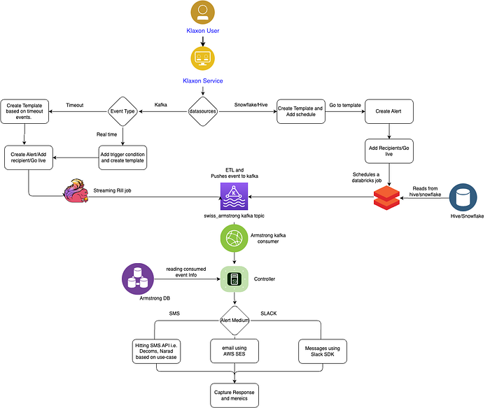
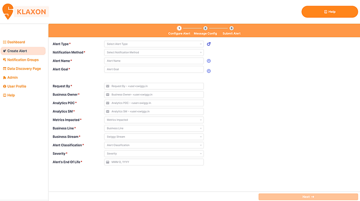
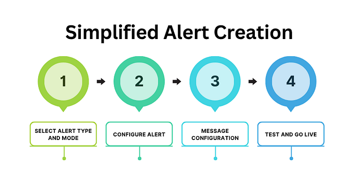
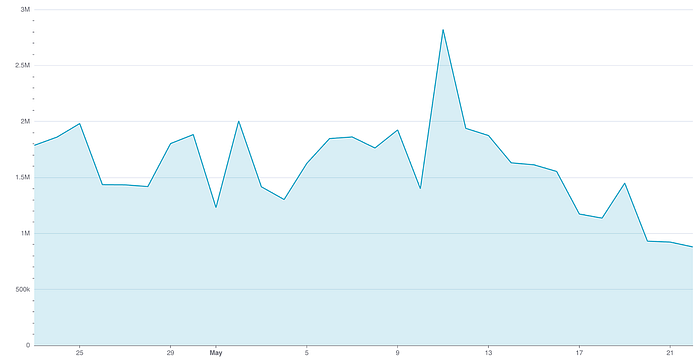

# Enabling Real-Time Business Monitoring with Klaxon

Co-authored with [Sundaram Dubey](https://medium.com/u/1fa45a4d386b?source=post_page---user_mention--668fa14c5e38---------------------------------------)

Imagine it’s a Friday night, the peak of demand in cities across the country. Kitchens across the city are buzzing, orders are skyrocketing, and delivery partners are navigating through bustling streets to ensure timely deliveries. Amidst this orchestrated chaos, our system acts as the vigilant eyes and ears of Swiggy, constantly scanning for any anomalies or disruptions in the order-to-delivery process. For instance, if there’s an unexpected surge in orders from a particular area, or if a key restaurant partner suddenly goes offline, our system instantly flags these issues. This isn’t just about detecting problems; it’s about enabling immediate action.

At Swiggy, we understand that the key to maintaining its edge lies in the power of real-time insights and proactive problem-solving. This is where the pivotal role of Klaxon, in-house business monitoring and alerting system comes into play. It allows users to set up custom alerts based on their specific business needs, helping them stay on top of critical metrics and take action in real-time. Klaxon has seen significant adoption across the organization, with over 300+ alerts currently live on the platform. On a regular day, Klaxon sends out more than 1.5 million alerts, playing a critical role in keeping teams informed of important metrics and potential issues in real-time.

Let’s dive into how Klaxon has evolved to become the backbone of Swiggy’s alerting ecosystem.

## Vision:

Our vision is to embrace a customer-backward approach, providing businesses with a powerful and flexible platform that enables them to seamlessly monitor and analyze critical metrics. By centering on their customers’ needs, businesses can make informed decisions and take timely actions to enhance operations and deliver exceptional value to their customers.

## Mission:

To enable the Org to identify meaningful incidents

- **Actionable**: The incident requires action to prevent some level of business impact.
- **Comprehensive**: You have all causal and symptomatic alerts that stem from the root cause.
- **Contextualised**: Information to diagnose and remediate the incident is provided across teams and topologies, including diagnostic indicators and documentation.

## Introducing Klaxon Alerting Platform

Klaxon is an alerting system designed to monitor real-time events across Swiggy’s operations. It helps track key business activities like customer orders, operational changes, and vendor partner serviceability. Built around complex event processing (CEP), Klaxon analyzes data from multiple sources to detect patterns that require immediate action. Whether it’s a spike in customer grievances or a dip in order completion rates, Klaxon enables teams to quickly respond to emerging issues and maintain smooth operations.

*Klaxon Architecture*

The Klaxon alerting system is designed to automate the creation and delivery of alerts based on specific business events. Here’s an overview of how the system works:

1. **User Interaction: **The process begins when a Klaxon user defines a trigger condition and creates an alert based on predefined timeout events or real-time events.
2. **Klaxon Service: **When an event occurs, the Klaxon Service captures the event details and pushes the data to a Kafka event stream. The system integrates with various data sources like Hive/Snowflake to schedule and trigger data-driven alerts. The alert template, once created and recipients added, is scheduled for execution.
3. **Real-Time Streaming Job: **A real-time streaming job listens for these event triggers, converts them into actionable alerts, and then publishes the event data to the _swiss_armstrong_ Kafka topic.
4. **Event Processing: **The _swiss_armstrong _Kafka topic is consumed by the Armstrong Kafka consumer, which reads the event information and stores it in the Armstrong database. This forms the basis for further alert actions.
5. **Alert Mediums and Notification Delivery: **Based on the user preferences and configurations, alerts are delivered via multiple mediums such as: SMS (Leveraging internal SMS APIs like Decom and Narad), Email (Using AWS SES to send email notifications) and Slack (Messaging via the Slack SDK for internal team communication).
6. **Response and Metrics:** The system captures responses from the recipients and tracks metrics on alert performance to measure its effectiveness and allow further optimization.
7. **Technologies Used: **Apache Kafka, Apache Flink (Internally called as Rill), Databricks, Snowflake, Hive, AWS SES, Slack SDK, and SMS APIs.

*Klaxon Platform*

## Key Capabilities of Klaxon:

## UX Capabilities:

1. **Multi-Channel Alert Delivery**: Klaxon supports a variety of alerting channels including email (for all internal users), Slack (DMs and channels for collaborative visibility), SMS (targeting external stakeholders like DEs and restaurant partners), push notifications (real-time updates for DEs via the app), and automatic FreshDesk ticket creation (for Customer Care agents to take swift action).
2. **Flexible Alert Types & Personalization**: Offers both real-time alerts (via Kafka) and batched alerts (via Hive/Snowflake). Users can personalize alert content with dynamic elements like names and metric values to ensure messages are relevant and engaging.
3. **End-to-End Testing Capabilities**: Users can test alerts thoroughly — both real-time and batched — before going live. This helps catch issues early, reduces platform team debugging efforts, and ensures smoother launches.
4. **Improved Visibility & Performance Tracking**: Each alert comes with a performance dashboard showing key metrics like success and open rates. Users can view logic, edit, or clone alerts instantly to adapt to changing needs.
5. **Dedicated User Profile & Engagement Insights**: A new profile section gives users a consolidated view of all their alerts. Email alerts now support acknowledgement tracking, providing open and click-through rates to measure effectiveness.

*Alert creation steps*

## Technical Improvements

1. **Simplified Operations:** We’ve made Klaxon more efficient by reducing the complexity of our deployment infrastructure. By deprecating two redundant deployment units (Swiss-klaxon-ui and swiss-klaxon-preprod-ui), we’ve streamlined operations, leading to faster development cycles and a more maintainable platform.
2. **Enhanced UI Efficiency:** Our user interface is now optimized, using fewer resources while delivering the same robust functionality. This improvement not only reduces bandwidth requirements but also ensures a smoother experience for developers and users alike.
3. **Lowered On-Call Dependencies: **We’ve significantly reduced the need for on-call interventions, particularly when it comes to managing dynamic notification groups. Updates to group creation are now automated, minimizing manual work and bug fixes, particularly those carried over from Klaxon V1.

## Cost Optimization

1. **Streamlined Real-Time Alerts: **We’ve consolidated our alerting mechanisms, cutting down on operational costs by 50–60%. By reducing the number of Kafka jobs from 30 to 8, we’ve made alert management more efficient without compromising performance.
2. **More Cost-Effective Batch Alerts: **We’ve optimized batch alert costs by transitioning to a leaner, single-node setup for Databricks with an on-demand instance. This change alone has cut Databricks unit costs for new batch alerts by 50%, bringing significant savings.

## Klaxon usage, adoption and Impact:

Klaxon has seen strong adoption across the organization, with a growing number of active alerts being managed on the platform. On a daily basis, Klaxon sends a substantial volume of alerts, playing a vital role in ensuring teams stay updated on key metrics and potential issues in real time. This widespread usage showcases Klaxon’s effectiveness as a reliable, scalable alerting system, supporting the complex operational needs of the organization.

*Daily Klaxon Alerts*

**Impact Stories: How Smart Alerts Are Powering Smarter Decisions**

Klaxon’s intelligent alerting system isn’t just about sending messages — it’s about making the right people act at the right time. Here’s how our alerting capabilities are creating tangible impact across teams, roles, and customer touchpoints:

**For Delivery Executives: Improving On-Ground Execution**

- **Push Notifications for DEs** — Real-time push alerts, now rolled out nationwide, have reduced damages to fragile items. DEs receive contextual cues during delivery, improving care and accuracy mid-route.
- **SMS Alerts for Cake Deliveries** — To address spillage and packaging issues in cake orders, DEs now get SMS alerts just in time. This has notably reduced complaints and improved handling quality.

**For Operations Teams: Enhancing Speed & Reliability**

- **InstaMart Delay Alerts** — Real-time alerts on delays helped reduce late deliveries and improved fulfillment SLAs. This has directly impacted customer satisfaction and operational throughput.
- **Food Order Delay Escalation** — Klaxon flags delays at various stages of the order lifecycle. This allows teams to reassign DEs or take immediate action, boosting on-time deliveries city by city.

**For Customer Support: Responding Proactively**

- **Poor Ratings on Premium Orders** — When high-value customers rate orders poorly, instant alerts allow CC teams to reach out proactively. This has improved retention and increased orders per customer.
- **Social Media Escalation Alerts** — Klaxon monitors chats for social keywords and reroutes them to specialist agents. Result? Fewer escalations, faster response times, and better brand control.

**Looking Ahead: Smarter, Simpler, More Impactful**

As we continue to evolve Klaxon, our focus remains on enhancing usability, performance, and value across the board. We’re working towards simplifying the backend architecture by unifying environments for greater efficiency and ease of maintenance. Additionally, we plan to introduce lightweight mechanisms to surface the impact of alerts, helping teams better understand their effectiveness. To further optimize alert relevance, we also aim to flag low-utility alerts, allowing teams to fine-tune their focus where it truly matters.

**Acknowledgements:**

Shout out to the Klaxon team: [Sundaram Dubey](mailto:sundaram.dubey@swiggy.in), [Ishita Dutta](mailto:ishita.dutta@swiggy.in), [Sakshi Rai](mailto:sakshi.rai1_int@external.swiggy.in), [Ravi Kumar](mailto:ravi.kumar12@swiggy.in) and [Vikash Singh](mailto:vikash.s@swiggy.in) for their hard work in making Klaxon a reality!

Special thanks to [Jairaj Sathyanarayana](mailto:jairaj.s@swiggy.in), [Goda Doreswamy Ramkumar](mailto:goda.doreswamy@swiggy.in) and [Amaresh Marripudi](mailto:amaresh.marripudi@swiggy.in) for their unwavering support throughout the process.

---
**Tags:** Monitoring · Alerting · Business Metrics · Observability · Data Platforms
