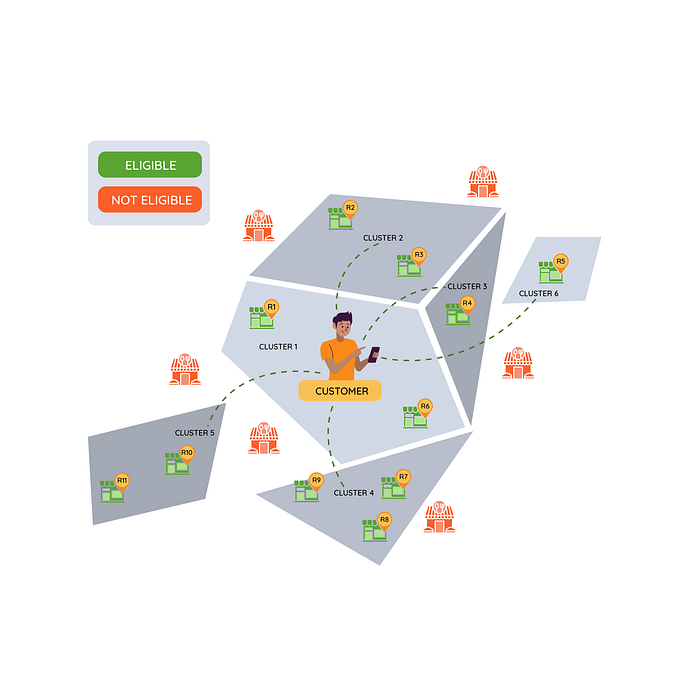
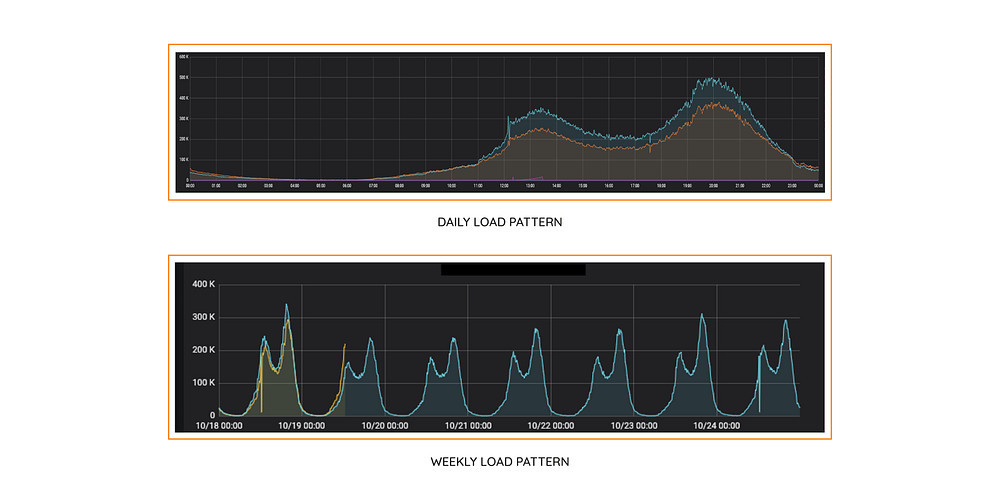
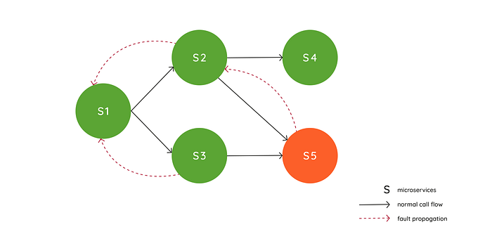
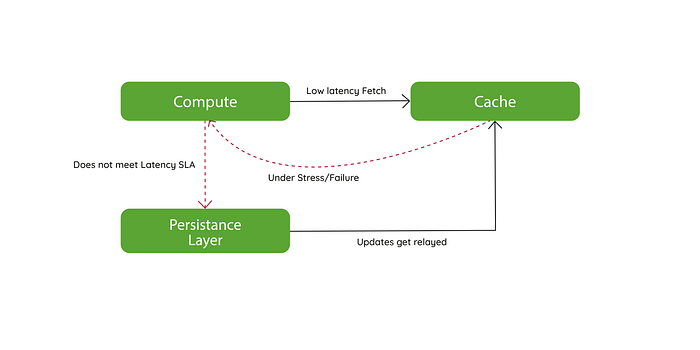
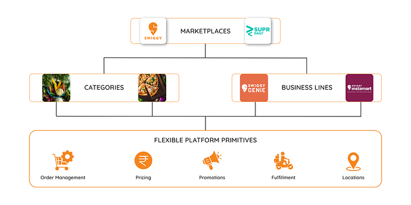

# A brief introduction to Engineering challenges at Swiggy

Over the course of the last six years, Swiggy has rapidly grown from a food delivery service, catering to a small neighbourhood in Bangalore, to a nationwide ‘convenience-as-a-service’ provider. One that millions of customers have come to depend on as a reliable and trustworthy platform. But the journey was no walk in the park. During the course of these developments, we encountered several, diverse technical challenges, and along the way developed best practices and solutions that we would like to share through a series of blogs.

To kick it off, I wanted this blog to provide a broader perspective on Swiggy’s backend requirements and technical challenges organized into three core themes. In the series that follows this post, we will deep-dive on specific problems to provide a more in-depth understanding and solutions we have explored.

## Problem Statement 1:

**Computational Complexity at Scale**

When a customer opens the app, Swiggy performs a set of computations to deduce a set of available and serviceable restaurants. ‘Serviceable’’ in this context means that the customer’s location and the restaurant location are ‘nearby’ and that there is enough delivery capacity ‘around’ the restaurant location to be able to service a particular order. As you can imagine, figuring out ‘nearby’ restaurants is not as simple as a radial distance from a customer’s location. We need to factor in aspects such as road accessibility, traffic conditions, travel time, etc. For a deeper overview of serviceability, please read [this](./what-serviceability-means-at-swiggy-c94c1aad352a.md) blog. Adding to these intricacies, we also need to evaluate an ETA for each restaurant that is displayed to the customer, along with personalized (specific to customers, restaurants, etc) promotions, ranking of the restaurants based on various criteria, and organize them based on collections that are most relevant for a given customer, location, time slot combination. Hence, we are performing a whole bunch of computations on a per <Customer ID, Restaurant ID> combination. In a densely populated city like Bangalore, there could be over 1000 restaurants that are serviceable from a given location and if 1000 customers open the app, at the same time (say during dinner peak), we need to be able to perform over 1 million computations per second. Even so, this needs to be performed within a latency period of a few hundred ms as all of this computation is holding up the home page load for the customer.

Given this context, it is extremely intriguing to look at our load patterns, which highlight daily and weekly variations. If you look at the daily load pattern graph for _one_ of our storefront services, you will notice that we have to scale from practically 100K rpm to 300K rpm to serve customers during lunch time. You will notice a similar, but elevated (around 500K rpm) pattern for dinner traffic.

The weekly camel hump pattern is also interesting where you will notice a slightly higher load during weekends. Hence, we have probably 4–6 hours peak traffic and practically no traffic for 6–8 hours a day. Since it is not cost-effective to scale for peak, we will need to autoscale compute and storage capacity to follow the demand graph as closely as possible.

## Problem Statement 2:

**Availability and Fault Tolerance**

At Swiggy, we have adopted a microservices architecture where hundreds of services participate in the order fulfilment process. Further, to reduce the page load latency for the customer, we perform several operations in parallel, causing a high fanout factor for a given microservice. In such an environment, it is very important to ensure that failures are localised and we take _systematic_ steps to limit the blast radius in the event of a failure. Consider, for example, the following call graph where a customer-facing service S1 calls two dependent services S2 and S3 (in parallel). Further, S2 and S3 call S5 creating a diamond-shaped call graph pattern and increased load on S5 (or in general for any tail service). If S5 begins to a brownout, it is important to localise the fault within its upstream services (S2 and S3) and prevent it from impacting S1.

Additionally, with an average fan-out factor 3–5x, in order to render a page in a few hundred ms latencies, several services end up with a latency budget of ~50 ms at P99. In this situation, it is legitimate to use a caching layer to reduce API latencies. We use several different strategies (watch for a future blog article on this) to keep the cache coherent with the persistence layer. However, in the event of a cache failure (or large scale cache miss), the persistence layer will be unable to service the call within the latency budget, potentially causing a cascading failure.

## Problem Statement 3:

**Multi-Tenancy and Agility**

Swiggy has evolved from a just food delivery to a multi-category marketplace where we provide our customers with unparalleled convenience as a service. Other services include Swiggy Instamart for ordering daily essentials and Swiggy Genie which allows customers to pick and drop anything within an urban area. This could be picking up medicines from a local pharmacy, getting books delivered from your child’s school, etc. In fact, this service was immensely helpful for our customers, especially during Covid time.

From an architectural perspective, this means that divergent customer experiences need to be supported with an underlying set of shared hyperlocal eCommerce primitives. We need multi-tenant systems across order management, promotions, pricing, delivery logistics, driver experience, vendor management, etc that can support variations in use cases. As an example, for a food order, there is a specific menu item and price in a catalog that customers pay for before an order is placed. Contrast this with a genie order where a task is going to be performed for which the final price is only known during the execution of the task. Further, the fulfilment workflows also vary for store items (fixed inventory) versus food delivery.

Hence, building siloed systems for each business line or category will not help create an agile platform that can adapt to ever-changing business conditions. Lastly, given the microservices architecture, it is important to ensure that individual use cases for different business lines can be developed, tested and deployed in a federated manner to maximise the speed of execution.

In a series of upcoming blogs, we will deep dive into the specific problem statements and provide an overview of solutions and best practices to address the above-mentioned engineering challenges.

---
**Tags:** Swiggy Engineering · Scaling · Growth · Microservices · Multitenancy
