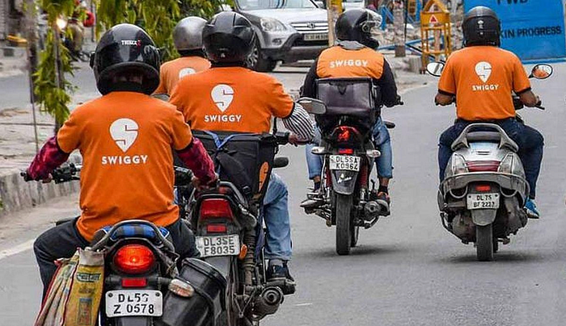
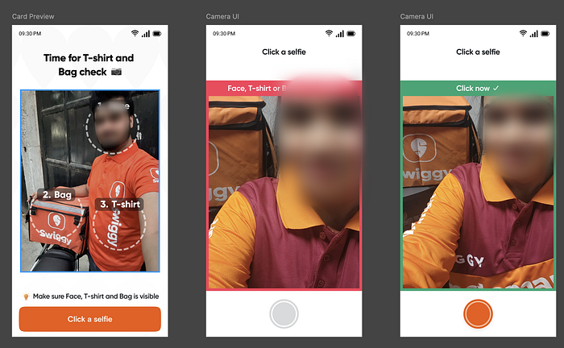
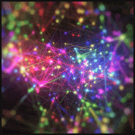
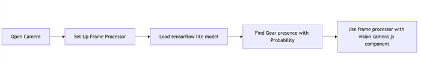
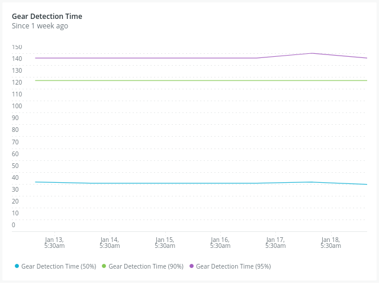

# Enhancing Brand Visibility and Trust with On device ML models: A Journey at Swiggy

Authors: [Ishaan Kakkar](https://medium.com/u/6a7b3e99845e?source=post_page---user_mention--e3e626f96c52---------------------------------------), [Utkarsh Kumar](https://medium.com/u/83e85c60d4d6?source=post_page---user_mention--e3e626f96c52---------------------------------------)



At Swiggy, we believe that trust is the cornerstone of customer loyalty and brand success. A strong, unwavering foundation of trust fosters meaningful connections with our users, ensuring they return time and again. But trust isn’t just about delivering food/groceries/parcels, it’s about creating a seamless, reliable experience at every step of the process — from discovering great meals to placing an order and finally receiving it.

One key element that plays a vital role in building this trust is **brand visibility**. As customers engage with the platform, it’s important that Swiggy’s presence is consistent, especially during the delivery process. This is why we focused on an often overlooked aspect: how our delivery executives partners (DEs) represent the brand in the real world.

To enhance our visibility and communicate professionalism, we embarked on a mission to ensure our delivery partners wear Swiggy-branded uniforms, including T-shirts, jackets, raincoats, and carry branded delivery bags and other gear. It’s a small but powerful way to reinforce the Swiggy brand and convey a sense of reliability to our customers.

In this blog, we’ll take you through the journey of how we tackled this challenge using cutting-edge **on-device machine learning (ML) models**. We’ll dive into the hurdles we faced, the technical approach we employed, and the valuable lessons we learned from deploying ML models on low-end devices at scale. Let’s explore how we used technology to seamlessly boost brand visibility and strengthen trust with every delivery.


---

## The Problem: Detecting Swiggy Gear on Delivery Executives

Our challenge was straightforward yet crucial: we needed a reliable way to detect whether our delivery executives (DEs) were using the required Swiggy-branded gear during their deliveries. This gear includes custom-made items like T-shirts, jackets, raincoats, and bags — all designed to improve visibility and ensure comfort for our DEs while representing the brand.

Over the years, we’ve continuously refined these kits, balancing both comfort and visibility to better support our delivery partners in various conditions. But, to make sure our visibility efforts were effective, we needed a robust system to **automatically identify whether our DEs were using these branded items** in real-time.The real challenge wasn’t just detecting the gear but doing so **accurately**. We had to minimize the risk of false negatives — situations where the system fails to recognize the gear even if it’s present. A false negative could not only compromise the visibility of the Swiggy brand but also undermine the trust we work so hard to build with our customers.


*Screenshots of image capture flow where we check for Swiggy bag & t-shirt*


---

## Challenges of API-Based Solutions: Why Server-Side Isn’t Enough

Running image classification on the server side is a common approach, often leveraging platforms like Google Cloud or AWS. However, this setup poses significant challenges:

1. **High Latency**: Delivery executives (DEs) often operate in areas with unreliable or fluctuating internet connectivity. Relying on a server-side solution means that the image data has to be sent over the network for processing, which can introduce delays. These delays — even if brief — can have a significant impact on the user experience, particularly in time-sensitive operations like food deliveries. When a delivery executive is out on the road, any lag in processing can lead to frustration, slow response times, and ultimately a negative impact on the service.

2. **Real-Time Constraints**: Delivery is fast-paced. Drivers are constantly on the move, navigating through busy streets, managing traffic, and making quick stops. This means the system must provide **instantaneous feedback** to the DE’s, ideally without any dependency on an internet connection. In a real-time environment like this, waiting for a server to process and return results is simply not feasible.

Given these limitations, relying on API-based, server-side solutions wasn’t a viable option for our use case. That’s when we turned our focus to **on-device solutions**, a shift that would help us overcome latency issues and ensure our system could provide real-time feedback to DEs, regardless of their network conditions.


---

## Brainstorming On-Device Solutions

### Initial Approach: Color Detection

Our first approach was to implement a simple color detector on photos captured by DEs. While this method was fast and lightweight, it didn’t scale well in real-world scenarios due to:

- Color Variations in Swiggy’s gear and shirt colors over the years.
- External obstructions like helmets and jackets worn by DEs.

### Pivot to Edge ML Models: A Smarter, Scalable Solution

To overcome these challenges, we decided to leverage on-device ML models. The goal was to create a lightweight, efficient model capable of detecting whether a delivery executive (DE) was wearing Swiggy-branded gear — all while running directly on the device without relying on a server.

After exploring various options, we discovered **TensorFlow Lite Model Maker**, a powerful tool designed to simplify the training of custom models for edge devices. With this, we could take a more scalable, flexible approach to solving our problem. Here’s how we made it work:

- **Training a MobileNet Model**: We began by using a base **MobileNet** model, which is known for its efficiency in resource-constrained environments. This model was trained on a dataset of DE photos, which included various scenarios and gear types to ensure robustness.
- **Optimizing for Edge Devices**: Since edge devices like smartphones and tablets have limited computing power, we focused on optimizing the model for **low-latency inference**. This ensured the model would run efficiently on devices with less processing capacity, while still delivering the accuracy needed for real-time gear detection.


*(simulation of neural nets solving complex problems)*


---

## Training the Model

### Dataset

We curated a dataset of 20,000 photos where DEs were wearing Swiggy gear and 3,000 photos where they weren’t. Each image was resized to 224x224 pixels to meet the input requirements of the MobileNet model. To ensure robust model training, we followed a default rule of splitting the data into 90% for training and 10% for testing. This allowed us to validate the model’s performance and fine-tune it for optimal results.


### Training

Using TensorFlow Lite Model Maker, we trained the model on Google Colab. The training process was straightforward:

```
# sample snippet of training a custom image classification
# using tflite model-maker
from tflite_model_maker import image_classifier
from tflite_model_maker.image_classifier import DataLoader

# Load input data specific to an on-device ML app.
data = DataLoader.from_folder('driver_photos/')
train_data, test_data = data.split(0.9)

# Customize the TensorFlow model.
model = image_classifier.create(train_data)

# Evaluate the model.
loss, accuracy = model.evaluate(test_data)

# Export to TensorFlow Lite model and label file with quantized format.
converter = tf.lite.TFLiteConverter.from_keras_model(model)
converter.optimizations = [tf.lite.Optimize.DEFAULT]
quantized_model = converter.convert()
with open('/tmp/model_quantized.tflite', 'wb') as f:
    f.write(quantized_model)
```

Within a few minutes, we had a working model trained to an **accuracy of 90+%** based on our dataset. The model size was just 3.4MB. We integrated this model into our React Native-based app. Using Vision Camera’s custom frame processor, we processed live image frames from the camera feed and ran the classification model seamlessly.



```
// vision camera custom frame processor
// read more at: https://react-native-vision-camera.com/docs/guides/frame-processors
const frameProcessor = useFrameProcessor((frame) => {
  'worklet'
  
  /* gearResult = { 
      hasGear: true,
      probability: "0.91",
      timeTaken: 117
    } 
  */
  const gearResult = detectSwiggyGear(frame, {})
  // ...
}, [])
```

## Early Insights

**Low Latency **: The model inference time was around **150ms** on low-end Android devices, proving its efficiency even on hardware with limited processing power.

**Seamless Integration **: We achieved smooth integration by using **TensorFlow Lite** combined with the **Vision Camera** library, enabling real-time processing of live camera feeds directly on the device.

## Optimizations

To provide a seamless experience while minimizing battery and CPU utilization, we implemented the following optimizations:

- **Selective Frame Processing**: Instead of processing all frames, we randomly selected a small percentage of frames for model inference. This helped us reduce our memory consumption
- **Battery & Memory Monitoring**: Our app health check keeps on detecting critical aspects like low battery or memory scenarios and paused model inference to conserve resources.

## Production Rollout

We implemented a system where DEs were **randomly prompted** during their shifts to capture photos for compliance checks, ensuring **real-time validation** without interrupting their workflow.To refine the model, we initially rolled out the feature in a few cities, gathering data on **latency across various devices** before expanding it nationwide.

## Impact

- **Low Latency & Battery Efficiency**: The model achieved a **150ms latency (p95)** and consumed less than **0.25% of daily battery usage**.
- **Stability**: Thanks to proactive optimization, we experienced **zero additional crashes**, ensuring a smooth and reliable experience for DEs.
- **Widespread Adoption**: As a result, over **95% of DEs** now actively use the latest Swiggy gear, with 6+ **millions monthly inferences** happening seamlessly on edge devices.



## Learnings: Key Takeaways

- **Edge ML Powers Real-Time Solutions — **On-device ML is ideal for dynamic, real-time use cases like ours, eliminating latency and connectivity issues for faster, more responsive feedback.
- **Expanding Use Cases — **We’ve extended edge ML to include **blur and darkness detection** to ensure image quality, improving the accuracy and reliability of our system.
- **Advances in Compute Power — **With increased processing power on modern devices, on-device models are running faster than ever. Google’s recent **Gemini Nano** model shows just how much potential exists for real-time applications.
- **Optimization Enhances Performance — **While edge ML models are often plug-and-play, adding layers of optimization — like model compression and hardware acceleration — can significantly improve both speed and accuracy.


---

## Conclusion: A Seamless Solution for Brand Visibility

Integrating on-device machine learning models has been a challenging yet rewarding journey for us at Swiggy. By adopting lightweight, optimized models, we’ve been able to overcome the hurdles of network dependence, high latency, and real-time constraints, ensuring a smoother experience for our delivery executives (DEs) and customers alike.

This approach has not only enhanced the **visibility of our Swiggy-branded gear** but also reinforced the professionalism and reliability of our service, building trust with our users. Our solution now enables us to automatically detect branded gear in real-time, even in challenging environments, all while keeping the process seamless for our DEs.

---
**Tags:** React Native · Tensorflow Lite · AI · Edge Computing · Computer Vision
