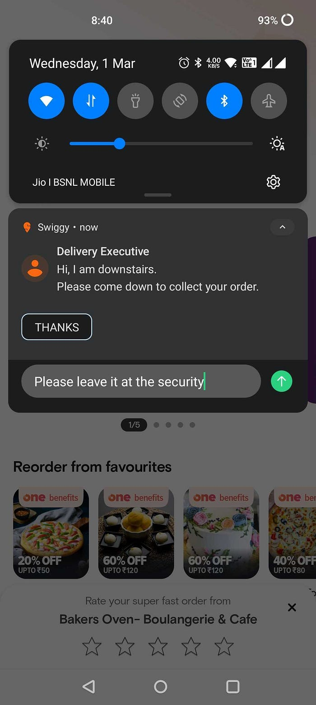
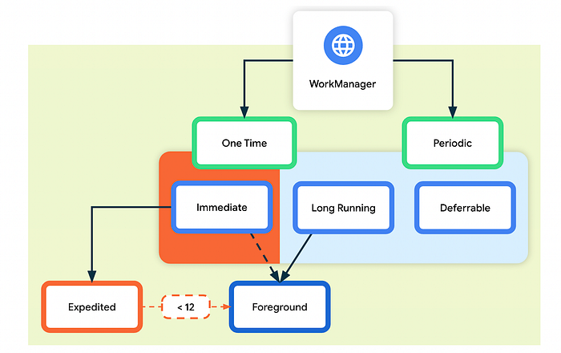
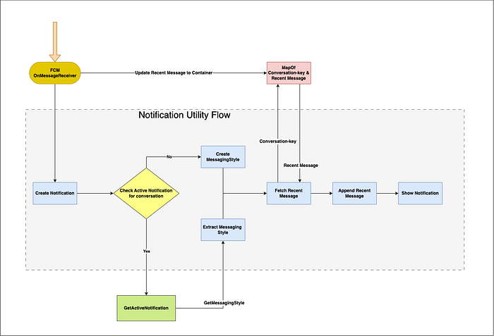
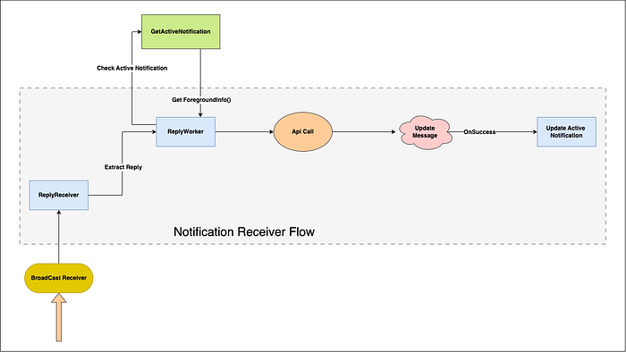
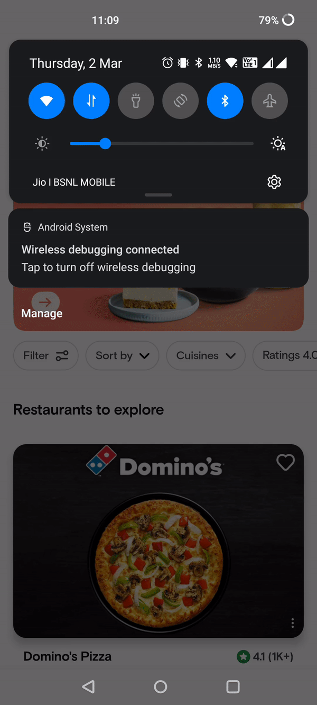

# Enhancing delivery UX through Direct Reply Notification

> Making deliveries on Swiggy even faster and smoother

At Swiggy, our customer’s smooth and hassle-free service is our top priority. Keeping our goal in mind, we initiated this project with the objective of enhancing customer and delivery executive’s communication and to facilitate a more seamless delivery experience.

In this article, we will delve into Swiggy Delivery Chat Notification project, key features, benefits and the technology behind it.

### Advantages of Direct Reply Action Notification

- Enhanced Communication - It can help the customers and delivery personnel communicate effectively.
- Improved User Experience - Without having to open the app, direct reply action makes it easier and faster for the customer to reply to any query from delivery executive.

### Requirement

Our requirement is to inform the customer about the message received from the delivery executive, and once the customer replies to it, the notification has to be removed and the delivery executive should be notified about the reply received from the customer.

### Limitations we had

To support a responsive replies system, most chat applications use **xmpp** or **web socket** implementation or a **duplex network bridge.** However, in our instance, a backend service is present, that is utilised to update the cross communication. This backend service receives the message along with timestamp from the API call initiated by the app.

Also, we were bound to hit the API either when the application is closed or while it is running in the background. According to android development documentation, using work manager or job scheduler for API calls is only advisable for deferrable tasks, nevertheless, in our case, the response of the API call must be immediate so that the delivery executive is informed about the reply received from the customer.

The final limitation we encountered is storing communication messages locally and managing them for multiple ongoing orders that are still in progress. Since, we do not have any usage of the received replies, storing them locally will only contribute to increasing the storage usage of the app.

### Solution

- For making immediate API call and informing the response to the backend service, we used a work manager with long-running service. FYI — According to the android documentation, for any long-running service, we must call [**setForeground()**](https://developer.android.com/reference/kotlin/androidx/work/CoroutineWorker#setForeground(androidx.work.ForegroundInfo)) and provide a [**ForegroundInfo()**](https://developer.android.com/reference/androidx/work/ForegroundInfo).** **  
We leveraged the current active chat notification and provided the **ForegroundInfo** of the same notification to the **Work Manager Instance**. This way, the work was executed immediately for all the use cases.

*https://developer.android.com/topic/libraries/architecture/workmanager*

- For handling an active conversation on notification, rather than storing the message locally, we leveraged the [**MessagingStyle**](https://developer.android.com/reference/androidx/core/app/NotificationCompat.MessagingStyle#MessagingStyle(androidx.core.app.Person)) of android notification. We extracted the messaging style from the current active notification and appended the new message on the same messaging style and publish the notification by setting the MessagingStyle to the notification builder.

## Deep Dive

*Show Notification After Receiving From Firebase*

### Notification Utility

Class responsible for handling notification after receiving it. We define **_CHAT_NOTIFICATION_ID_**_ _for direct reply action notifications and **conversationId** for each order where a conversation is initiated between the customer and the delivery executive.

- Create a data class responsible for the recent message that is received, and map it against the conversationId. MessageStyle requires [**Person class**](https://developer.android.com/reference/android/app/Person) to add message. Hence ChatMessage data class is created that will have all info required to update a MessagingStyle.

- Store the message received in Map ChatMessageContainer. This container will be used during the update of the notification when a new message comes from the delivery executive or the customer reply to that notification. Mapping the ChatMessage class against conversationId will help in segregating two different in-progress orders and both delivery executives have initiated a conversation.

- To show a notification with [**Direct Reply Action**](https://developer.android.com/develop/ui/views/notifications/build-notification#reply-action), App requires [**RemoteInput**](https://developer.android.com/reference/android/app/RemoteInput)** **(User Input Capture), an [**Intent**](https://developer.android.com/reference/android/content/Intent), [**PendingIntent**](https://developer.android.com/reference/android/app/PendingIntent)** **for user input and [**Action**](https://developer.android.com/reference/android/app/Notification.Action)** **for encapsulating remoteInput.

- Before creating a notification, check if there is an active notification for that particular _CHAT_NOTIFICATION_ID. _If available, return notification object else return null.

- Based on the active notification for that particular conversationId, Either append the message to existing Notification by extracting MessagingStyle from that notification or create a new MessagingStyle. Add that message to the MessagingStyle and set notification style in notification builder.

- Create a notification channel and display notification after receiving the notification style for notification with all of the messages.

Till now, we have handled showing the notification to the user with push notification extras having conversationId and reply action with remote input **_KEY_REPLY_**_. _Now, we’ll dive into handling the reply provided by the user.

*Handle Reply from User*

### Notification Reply Receiver

Class responsible for handling reply received from Customer. Extract the reply from **RemoteInput** and start [**Worker**](https://developer.android.com/jetpack/androidx/releases/work).

- Extract Reply from RemoteInput and pass the reply to start the worker.

- Create work manager request along with constraints and enqueue work request(FYI — you can define your own constraints for your work manager, in our case it has be a one time task where network connection should be there). Here, set it as an expedited work request for android version ≥ 12 and It will execute as a long-running task for other versions.

> [https://developer.android.com/guide/background/persistent/getting-started/define-work](https://developer.android.com/guide/background/persistent/getting-started/define-work)

- Use a [**CoroutineWorker**](https://developer.android.com/reference/kotlin/androidx/work/CoroutineWorker)** **for network calls, network call itself will be a suspend work. Overriding **doWork()** function and providing **foregroundInfo()** to it will execute it as an expedited work in case of android ≥ 12 and as a long-running task for android <12.

- Here, Function **getForegroundInfo()** will fetch the current active notification from ChatNotificationUtil by calling the **getActiveNotification() **function and will create a foregroundInfo required for the work manager.

### Final Result 🚀

_FYI, This notification will be removed once the work manager executes the task of making an api call, If you want to show the notification again then use the same notification object and notify the notification manager._

### Conclusion

We have been striving to enhance the speed of our deliveries, and the direct reply option gives customers a quick and easy method to reply to messages from delivery executive.   
Based on the success metrics gathered, we saw a rise in customer’s response to delivery executive queries from 3% to 11%. Along with this, There was a significant decrease in delivery executive calling the customers.

> _Credits : _[Raj Gohil](https://medium.com/@rajgohil044) _for his support._

### Reference

- [https://android-developers.googleblog.com/2018/12/effective-foreground-services-on-android_11.html?m=1](https://android-developers.googleblog.com/2018/12/effective-foreground-services-on-android_11.html?m=1)
- [https://developer.android.com/guide/background](https://developer.android.com/guide/background)
- [https://developer.android.com/topic/libraries/architecture/workmanager](https://developer.android.com/topic/libraries/architecture/workmanager)
- [https://developer.android.com/develop/ui/views/notifications/build-notification](https://developer.android.com/develop/ui/views/notifications/build-notification)
- [https://itnext.io/android-messagingstyle-notification-as-clear-as-possible-1847f809ad59](https://itnext.io/android-messagingstyle-notification-as-clear-as-possible-1847f809ad59)

---
**Tags:** Swiggy Engineering · Swiggy Mobile · Chat · User Experience · Customer Obsession
