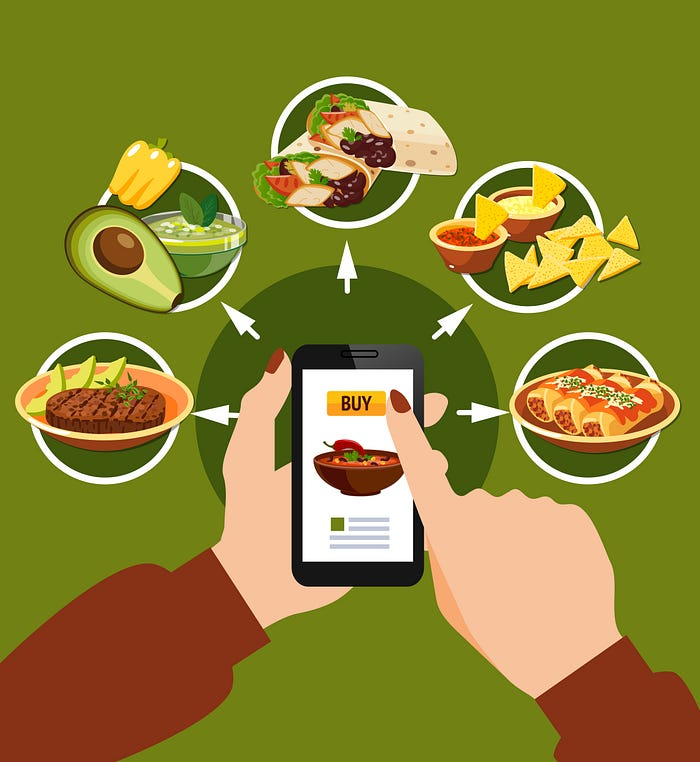
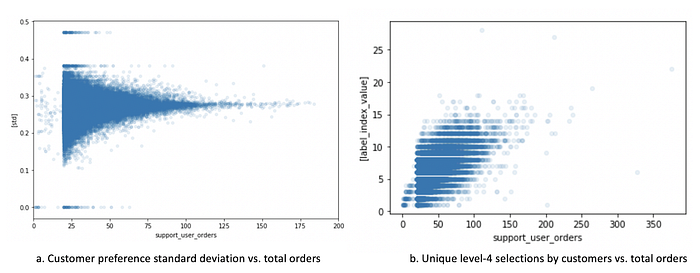
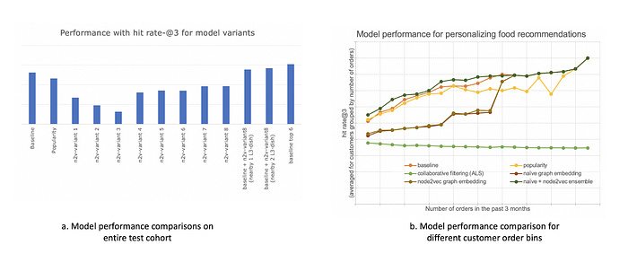

# Enhancing Food Recommendations using Graph Methods — Part 1

Swiggy has been developing Food Intelligence (FI) to better understand our catalog, relevant to our consumers. In continuation of an [earlier blog](./decoding-food-intelligence-at-swiggy-5011e21dbc86.md), we present a series of 2 articles on using FI for recommending food to customers. In this first installment, the problem is explained, and using random walk based graph embedding methods is presented.

*Food vector created by macrovector — www.freepik.com*

## Personalizing Food Recommendation

Food discovery, ordering, and delivery is a complex ecosystem considering the high intent and immediacy of the customer demand — her food. How machine learning methods enhance the customer experience define today’s business models. Associating food with its distinctive characteristics helps to personalize for a user with idiosyncratic taste preferences.

Item recommendations are inherently different in the food domain when compared to familiar instances like movie or book recommendations. Customers having watched and rated a movie or book are rarely interested in seeing the same item recommendation again. With food, however, it is observed that many customers prefer sticking to items they previously ordered and liked. They are at the same time also open to suggestions on similar items. Based on prior ordering history, a user profile can be created to glean what items the user orders. As an obvious approach, the most preferred items can be suggested (our baseline). An improvement over this will be when items similar to these can then be suggested. A pertinent question following this line of thinking then is, how many orders before a user preference is evident? What is the confidence level when a user is new to the platform and has only a few orders to learn from?

One proposed way to understand consumer behavior is as follows. Consider a 3-month ordering window. Based on the customer orders we can quantify the number of times the customer ordered an item (say, _customer A_ ordered _paneer biryani_ 25 times). Based on this support of every item, a percentile score can be assigned as a proxy to the customer’s preference for this item. A higher score suggests a strong preference by the customer for this item. A strong separation (higher deviation) means higher confidence in using this score (the higher percentile scored item) as a proxy for preference. But if the customer prefers many items equally (say, _customer B_ with a sweet tooth, likes _chocolate sundae_ and _chocolate fudge_ and ordered these 12 times each), these scores will be closer leading to a lower deviation. Customer behavior however differs depending on the total orders. This inference is difficult in the item domain, and so we leverage FI classification to the level-3 of the [food taxonomy](./decoding-food-intelligence-at-swiggy-5011e21dbc86.md) where customer behavior is more deterministic. A representative plot is shown below. Here on the x-axis we have customer orders in the 3-month ordering window and the y-axis for _figure a_ is the standard deviation of preference scores and for _figure b_ it is the unique level-4 selections made by customers. What we can infer from these figures is that customers who order a lot (say 50 orders) prefer between 5 & 10 level-3 items and their score variation is tighter than customers who order less (say 20 orders). The deviation itself varies and if considering the low ordering customer bin, there are many customers who explore a variety of items (and hence lower _std_ score), but there also exist many customers who prefer a particular item (and hence higher _std _score).

Such consumer behavior essentially makes establishing preferences a difficult task — especially for the segment that does not order frequently. This is also corroborated by the fact that Swiggy’s listing algorithms’ AUC (a feature-driven GBDT) trends linearly with ordering quantity. In this backdrop, approaches that can be used for personalizing food recommendations are discussed in the coming sections

The problem is formalized as follows. We’ll use the ordering history of the customers in the food taxonomy level-3 (L3) space within a 3-month window as our training set to establish the top-k L3 preferences. Then for a 2-week observation window, we’ll measure the percentage of customers who ordered at least once from their L3 preferences. The endeavor is to understand how graph methods perform for such personalization.

## The Baseline Model

A simple solution is a frequentist one — to identify the L3 dishes that the user would’ve ordered the most and create a user taste profile of, say, the top k dishes. This is a heavy exploit approach as we identify preferences based on the user’s ordering history. This is done for both the train window and test window. Since we’re using an offline evaluation, the frequentist profile for the test window is assumed to be the ground truth and all approaches are measured against it. The main performance metric is the percentage of users in the 2-week test window who ordered from the train window preferences. To ascertain whether the user has indeed ordered, we check for the intersection of the top-k train preferences and top-k test preferences. This is referred to as the hit-rate@k metric.

## Graph Approaches

Considering the above problem formulation, we can probe a different line of thinking whereby we move away from exploiting the customer orders and take a broader view of all the transactions with items on the app in totality. Three main approaches that typically help solve this are collaborative filtering (CF), content-based filtering, and the hybrid method. The hybrid method overcomes the limitations of the other two methods when recommending. This is done using content information about the users and items in the CF-based setup. What content to use is then all about feature engineering. Knowledge graphs also provide a way to generate such content information. At the scale of the problem we’re considering we’ll probe graph methods. The network structure of the ordering ecosystem is evident here. A user U orders an item I. Many other users may also be ordering this item I. These other users may also have ordered from a different set of restaurants and possibly our user U may like those items Ik. But there could be another group of restaurants that serve similar items but none of these users (connected by the thread of item I) ever ordered it. Our user U may still explore such items. Graph methods offer an intuitive capability to model such behaviors at scale.

Published literature on many approaches to work with graphs exists. A good survey of these is available in [Cai et. al.](https://arxiv.org/abs/1709.07604) and [Goyal et. al](https://arxiv.org/abs/1705.02801). These specifically talk about graph embeddings as a way to encode and preserve the structure of the graph in a low dimension. The network described in the food domain above is essentially a heterogeneous graph with nodes and entities of different kinds coexisting. The challenge when embedding the nodes in heterogeneous graphs is how to preserve the global consistency between different types of objects. Should nodes showing similarity of connectivity structure within the same type of node object be embedded together or can different node types be embedded closer than homogenous nodes? Deep learning methods have been proven to be robust and effective and hence widely used for node embeddings — albeit for homogenous graphs.

To start with then, we make assumptions for our heterogeneous directed graph to be treated as a homogenous undirected graph. Our graph has precisely 2 node types: customer and L3-dish. The edge type is directed: a user [orders] an L3-dish. However, we’ll assume the nodes to be of the same type; and the connection to be undirected. This has implications in the fact that only the structure of the graph is preserved. Other ‘behavior’ of having different types of nodes, and directionality of the edge, and/or other properties (like the price of the order, etc.) are ignored. This is the simplest formulation, we start with embedding using random walks as input to a deep learning model. The following section elaborates on different such approaches.

### Naive Graph Embedding

For a graph, a _naive_ random walk starts at any node, then uses any connected edge (at random) to move to the next node and then steps further till we decide to stop. Thus a random walk starts at a node and has specified steps. A highly connected node can feature in many such walks. Pertaining to our food graph, if the customer nodes to be denoted C and L3-dish nodes to be denoted F, a random walk of say 6 steps of these kinds mostly exists: C1-F1-C1-F2-C2-F3-C3. Analogous to learning word embeddings in a [word2vec](https://arxiv.org/abs/1301.3781) formulation, these random walks can be considered as documents to learn from. With a big random walk corpus of 1 MM walks and then tokenizing the nodes, a word2vec model was used to train a 100 dimension vector.

Unlike with learning word embeddings, here there is not much semantics to the embeddings learned — at least nothing that is tractable. These embeddings can be used in various ways to establish customer preference. The nearest cosine-distance L3 nodes could be 1 way. The approach that worked best though was to transfer preferences in the user space. This is done as follows. We define a high-bin as a user group with 3-month orders >= some order threshold. Say we pick 80 orders. Then the high-bin is a set of all users who ordered more than 80 orders. Now, for every test user, the closest user in the high bin is identified. The approximate nearest neighbor methods are good to use for this scale. The baseline L3-dish preference of this closest high bin user is used as the L3-dish preference for the test user. The rationale to do this is twofold. Firstly, finding nearest nodes in the common space does not inject the explore behavior (because we’re learning embeddings on data for items that the user already ordered and those will be placed closer in the word2vec embedding space). Secondly, the frequentist baseline preference is better performant for the high bin.

### node2vec Embedding

From literature in other domains, we know that [node2vec](https://arxiv.org/abs/1607.00653) outperforms other approaches especially in the node classification tasks on many different datasets. Node2vec approach creates a corpus of random walks on a graph by internalizing the flexibility for Depth First Search or Breadth First Search for random walks using 2 hyperparameters — the p & q parameters. Setting these parameters appropriately will help encode the local or global structures of the graph. Node2vec generates a smartly sampled corpus which is then used as inputs for a word2vec model to learn embeddings.

## Performance comparisons

This section shows a few comparisons of the above approaches.

_Figure a_ shows a comparison of the hit-rate@3 metric for the 2-week customer cohort for various variants. Along with the baseline, a popularity model is also included. Here the top 3 ordered L3-dishes across users in the train set are considered as the suggestion for each user. Other models include variations of the node2vec around hyperparameters like walk-length (16, 32, 64), train epochs (10, 20, 30), and word2vec context (5, 10, 50). The p and q parameters for node2vec were fixed at the default of 1. It is observed that the performance is dependent on the hyperparameter optimization of node2vec parameters but none of the variants beat the baseline. This is possibly due to the inability of node2vec to suggest exploit options. To test this hypothesis we include 3 more comparisons (the last 3 bars in the figure) where we compare hit rate@6. In two of these variants, we use the 3 baseline L3 suggestions as seed and find in the L3-dish embedding space from the best node2vec variant, the nearby 1 or 2 L3-dish and use those for recommendations. Though this still does not beat the baseline, it narrows the difference. _Figure b _shows the performance of the models in different customer bins. The naive and node2vec models perform similar to each other but on complementary user groups. Hence here an ensemble of the best node2vec variant and the naive embedding model can outperform the baseline.

## Conclusion

To summarize the discussion till now, we argue that an ensemble of graph embedding models can potentially give better customer food preferences. This would require a better trained node2vec model (hyperparameter optimized) and/or seed preferences from the frequentist approach and/or a better random walk generator (possibly not a fixed p & q parameter for the entire graph as in node2vec). Also, the random walk based training for embeddings is in no way connected to the end task of recommending an L3-dish, so another idea could be to train for a task-relevant loss (something that Graph Neural Networks offer). We continue exploring some of these ideas in our next part.

_Authored by Aditya Bhakta  
Thanks to Krishna Medikonda, Mohammed Safique, and Jairaj Sathyanarayana for inputs._

---
**Tags:** Graph Algorithms · Machine Learning · Data Science · Recommender Systems · Swiggy Data Science
