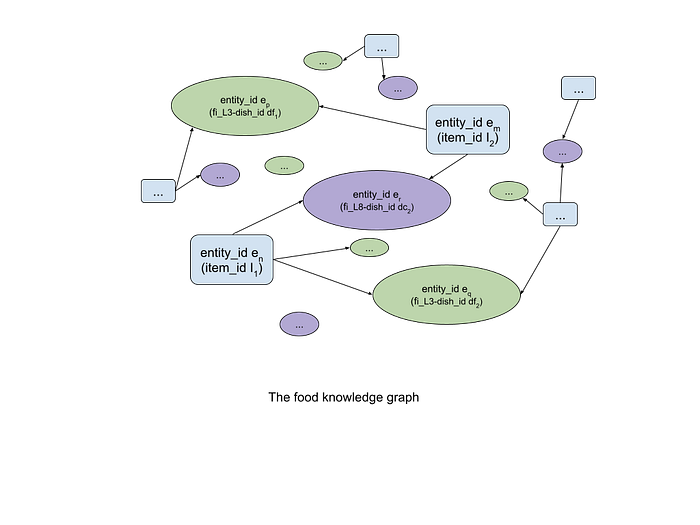
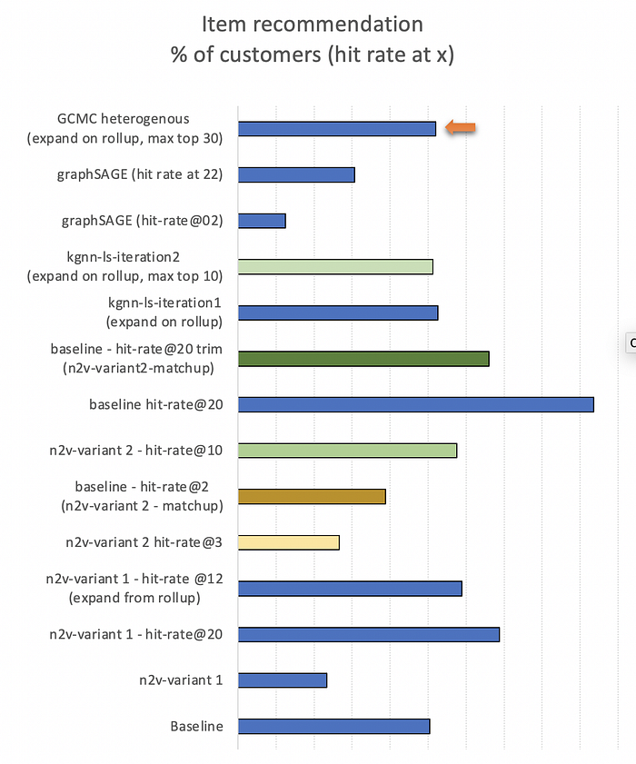

# Enhancing Food Recommendations using Graph Methods — Part 2

As part of the 2 part series on using graphs for food recommendations, this article picks up the discussion from the first part published [here](./enhancing-food-recommendations-using-graph-methods-part-1-344dd489b74d.md). In particular, we’ll discuss using heterogeneous graph embeddings.

*Food vector created by macrovector — www.freepik.com*

## Random Walk based Embeddings

We observed that random walk based embedding techniques (naive and node2vec) offer a way to improve food recommendations to customers. But there are a few limitations. Primarily, these are embeddings for a static graph. To learn embeddings for new nodes of the graph, the models need to be retrained. For new interactions (customers ordering from new restaurants in the following weeks/months) also, relearning needs to happen. Else, content-based similarity has to be used to infer for new nodes of the graph. This however is less accurate and requires content information that may not always be available (for example non-signed-in new users). Another challenge is scaling these 2 methods for a million scale graph.

For these aspects, we next examined non-random walk based approaches that scale to larger graphs. We also explored a method to leverage information from the food graph. Next, we moved to explore inductive methods, namely Graph Neural Networks, to end the effort with learning embeddings for heterogeneous graphs with node metadata. We compare these methods for predicting preferences at the item levels (instead of the L3-dish food graph level) which translates to a larger and more sparse graph.

## Non-Random Walk based Embeddings

The Structural Deep Network Embedding ([SDNE](https://dl.acm.org/doi/10.1145/2939672.2939753)) method was one of the first Deep Learning approaches (not using random walks and word2vec construct) to learn embeddings. The paper argues that, if embeddings are learned to preserve both 1st and 2nd order proximities of a node, the embedding quality is better. The authors also demonstrate that SDNE outperforms DeepWalk (and other methods) consistently on varied graphs. The **SDNE learns embeddings so as to minimize 3 components of the loss function. In comparison to the earlier random walk methods — here we have a specific task to optimize and learn embeddings towards it. The first component is the unsupervised component and this has an encoder-decoder network architecture, which reconstructs the input signal. This reconstruction apparently preserves the 2nd order proximity of a network because the input to it is an adjacency matrix — so inputs for say 2 vertices i and j carry information about their common neighbors. The supervised component is the 2nd component of the loss function and this will preserve the 1st order proximity of the graph. The 3rd and final component is a regularization term. Similar to the random walk approaches, this model does not provide embeddings for new nodes but it scales well for large graphs** as it leverages the standard deep learning libraries. There are many hyperparameters in the architecture and the authors present the case for optimizing these for arriving at the best model and this also is our experience. Again, we made the homogeneity assumption here, and in essence, the embeddings that we learned encoded the 1st order proximity (user prefers an item) and the 2nd order proximity (two users are similar for choosing the same item). Overall, like for random-walks methods, what the embeddings learn (either semantics or user behavior-based similarity) is not properly understood.

The next approach that was explored is [KGNN-LS](https://arxiv.org/abs/1905.04413) (Knowledge-aware Graph Neural Networks with Label-Smoothness regularization). A few reasons to explore this were that this is task-specific and developed for recommender systems. When compared to more sophisticated GNN methods that are designed for homogeneous bipartite graphs or user/item-similarity graphs, here the authors investigate GNNs for heterogeneous KGs. The main attractiveness of this algorithm for us was that it offered a way to integrate a knowledge graph for item-level recommendations. As explained in the paper, the objective of this algorithm is that given an interaction matrix in the user-item domain AND a knowledge graph, predict if a user u will have an interest in an item v with which he/she did not interact earlier. To summarize the approach in short: as a first step, the adjacency matrix of the knowledge graph is updated for every user using a GNN like feed-forward approach to give item embeddings. And in the second step, the user embeddings and item embeddings from the first step are combined to get the predicted user-item engagement probability. To implement this algorithm we used the FI (food intelligence) attributes of L3-dish and L8-dish to construct the food knowledge graph for the item entities. Starting with the 3-month training window the_ user → (number of orders) → item_ information formed our ratings data. The knowledge graph had 2 relations. First (relation 0) is item_id → fi_L3-dish_id and the second (relation 1) is item_id → fi_L8-dish_id. A schematic of this graph is shown below.

## GNN based Inductive Embeddings

The first inductive model we tried for our use case was GraphSage. Up until now, the models tried and explained in the sections above did not offer any way to generate embeddings for new nodes in an evolving graph without requiring retraining — and this in our case was a shortcoming. The [GraphSAGE](http://papers.nips.cc/paper/6703-inductive-representation-learning-on-large-graphs.pdf) algorithm was proposed to address these. The authors, however, do not explicitly suggest if GraphSage can be used for a heterogeneous graph. But since this model can be applied even to graphs that do not have node features, we could extend its use within the homogeneity assumption as explained earlier. The main idea is to transfer the features of neighborhood nodes (like in a Graph Convolution Network) using a stack of layers. For implementation the pytorch model provided within [DGL](https://docs.dgl.ai/) was used. So the first step is to translate neighborhood node information which is done via a fully connected deep learning layer with activation and then the next step is to aggregate these transformed features. We can stack more such layers to capture n-hop neighbors. The problem was posed as a link prediction formulation. Once the stacked layers gave features for each node, we minimized the loss to learn the network parameters such that positive samples (connected nodes) were closer in the embedding space and negative samples were further apart in the embedding space. Here node features were not used as they do not make sense under the homogeneity assumption — i.e. the customer and item features are not the same unless any common feature like say FI attributes can be used. Hence we mimic the input features for nodes using an embedding layer with Xavier initialization, whose parameters are also learned along with the other model parameters. The objective function used is such that during training, the embeddings for nodes from positive samples are placed closer and the nodes from negative samples are placed further apart. Negative samples are sampled as node connections that do not exist in the original graph and the negative sample size (size of negative samples per node to consider) was a hyperparameter. This model scales well to large graphs due to sampling during minibatch training.

The final model included for comparison was the Graph Convolutional Matrix Completion ([GCMC](https://arxiv.org/abs/1706.02263)) algorithm — which is a true heterogeneous graph embedding model that also uses node metadata as features when building the inductive model. In this algorithm, we learn embeddings of the same dimensional size for the users and items, i.e. in a common space — and the preference of a user to an item can be computed as the dot product between user and item embeddings. More specifically, for each user, we can assign a learnable vector **𝑢𝑖**, and for each item, we can assign another learnable vector **𝑣𝑗**. Additionally, we also learn a bias for each user 𝛽𝑖 and each item 𝛾𝑗, representing the baseline rating of each user and item. Preference prediction is expressed as:

𝑟̂ 𝑖,𝑗 = 𝑢⊤𝑖𝑣𝑗 + 𝛽𝑖 + 𝛾𝑗

For explicit feedback datasets, which is the case when we’re considering the orders data, we try to minimize the difference between prediction and ground truth 𝑟𝑖,𝑗 for all user-item interactions:

min𝑢,𝑣 ∑(𝑖,𝑗)∈D (𝑟̂𝑖,𝑗 − 𝑟𝑖,𝑗)2

This is set up via the GNN formulation of stacked graph convolutional layers to compute the embeddings. For applying GCMC to our food domain, 2 aspects were important. First, the node features were transformed in the usual way — i.e. categorical variables were one-hot encoded and continuous variables were normalized. Here, the cardinality of the input features needs to be carefully considered when one-hot encoding as these will influence the batch-size and epochs during training. Secondly, the orders data were considered as an implicit signal for customer preference. That is, the items that a user did not order in the training window did not necessarily constitute the set that the user disliked. Likewise for the items that the user did order — probably the customer only tried out that dish. Hence, we trained the model to consider positive and negative edges in the customer x item graph. This offered a way to predict the ‘likeness’ (or ‘dislikeness’) of an item. This formulation in DGL requires defining a minibatch sampler. For each user-item pair (𝑖,𝑗) that appeared as an interaction (called positive example), we corrupted the item with a randomly-sampled item 𝑗′ (called negative example). The model was trained to distinguish whether the user-item pair was positive or negative using a hinge loss. T

## Performance Comparisons

For demonstration, this section presents a comparison of all the approaches discussed thus far, for one city-wide graph for recommending items to a customer. The need to use this subgraph was because node2vec did not scale well for a larger domain. The metrics comparison in a chart is as shown in the image below. A good way to compare different variants is to look at bars belonging to the same color space (i.e. compare all blues, or compare the greens, etc.)

For item predictions, the baseline suggests that performance can increase if a larger set of options (say 20 vs 3) are provided. But, a longer list can be available only if the customer has a rich order history. Using the embeddings-based approach then helps generate an expanded set and this is indicative of the possibilities to explore. When compared to L3-dish performances used earlier, the node2vec performance is closer to baseline. The KGNN-LS requires expanding on previous order items and is seen to marginally beat the baseline. When tested with the approach used for node2vec (to find a high bin user and use that user’s preference), the KGNN-LS model is not useful — similar to SDNE. This was because non-random walk based embedding methods gave pure explore options. Hence for these, we used item node embeddings to find similar items for baseline suggestions and expand the prediction list. Our observation with these sets of experiments is that the KGNN-LS model is the most scalable. The graphSAGE and GCMC models are scalable as well, and compared to others they offer better suggestions. The GNN based inductive models have an enhanced capability to also generate suggestions for new nodes. As an estimate, there are around 15 to 20% new nodes on a week-on-week basis, and the GNN methods help increase recommendation coverage to this cohort.

To conclude, as highlighted in this series of blogs, graph embedding methods present a valuable approach for food recommendation with an explore capability, and their performance levels are close to current models for revisiting customers. The GNN based inductive embeddings also allow for recommending when no prior ordering history is available. We continue to experiment with graph methods for various use cases like search and listing with encouraging results.

_Authored by _[_Aditya Bhakta_](https://www.linkedin.com/in/adityabhakta/)_  
Thanks to Krishna Medikonda, Mohammed Safique, and Jairaj Sathyanarayana for inputs._

---
**Tags:** Graph Algorithms · Recommender Systems · Swiggy Data Science · Deep Learning
