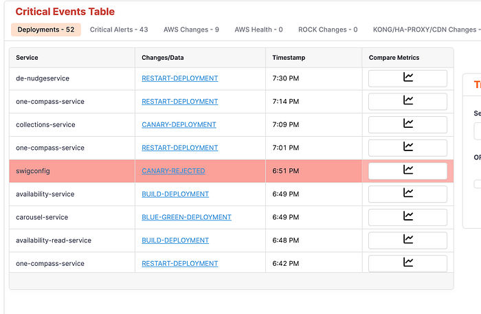
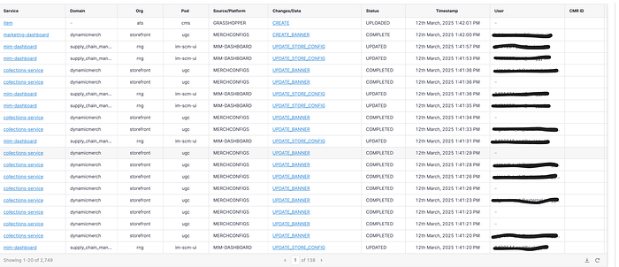

# A Unified View of Production Changes: Enhancing Reliability at Swiggy

## Introduction

At Swiggy, maintaining platform reliability in the fast-paced world of quick commerce is crucial. We are committed to minimising downtime and swiftly addressing any issues that arise by reducing Mean Time to Detect (MTTD) and Mean Time to Resolve (MTTR) incidents. To achieve this, we have developed the **Timeline Tool** — a centralised system for managing all production changes.

## Real-Time Data Integration

Our Timeline Tool provides a comprehensive view of all production changes, whether they involve infrastructure tweaks, configuration updates, deployments, or ML model updates. Here’s how it works:

- **Automatic Data Ingestion:**  
An API allows services and clients across Swiggy to automatically push change data into the timeline in real time.
- **Fast Data Storage & Search:**  
Data is stored in Elastic Search, enabling rapid search capabilities across all events.
- **Diverse Data Sources:**  
We onboard multiple data sources, including:

> **Deployments & Restarts:** All service deployments, restarts, and storage deployments.**Configuration Changes:** Both dynamic configuration updates and automated changes via Terraform git-ops flows.**Database Operations:** Logging any queries or scripts run on production databases.**DS Model Updates:** Tracking model deployments, job runs, and feature changes.**Business Dashboard Updates:** Auditing changes in dashboards (e.g., offers, coupons) to ensure business-related modifications are monitored.**External AWS Health Events:** Monitoring AWS health events alongside internal events to quickly identify any issues.**GateGuard Auditing:** We have developed a tool **GateGuard **which enables direct calls to production endpoints (used for testing canary or slow rollout releases), those are also captured and audited in the timeline.

## Categorisation and Detailed Logging

Every change is meticulously categorised to enable quick filtering and troubleshooting:

- **Change Types:**  
Each event is labeled based on its nature — be it infrastructure, configuration, deployment, or a business dashboard update.
- **Source Identification:**  
Each change is associated with its origin (e.g., an AWS account, a dashboard, or an automated deployment pipeline). These sources are pre-registered with a brief description, allowing for immediate identification.
- **Service & Domain Impact:**  
Changes are tagged with the affected service and business domain. For instance, if there is an issue with food orders, engineers can quickly filter all recent changes in the food domain.
- **High-Impact Changes:**  
Critical changes — such as those affecting CDN or load balancers — are prominently displayed, further reducing the time needed to detect major issues.

_Timeline View (Critical Events)_

_Timeline View (Master Table)_

## Enhancing Search Capabilities with GenAI

One of the standout features of our Timeline Tool is its advanced natural language search capability:

- **Natural Language Queries:**  
Engineers can enter queries like, “Can you give me all changes in the offers domain?” and receive semantically filtered results.
- **Embedding Models & Vector Database:**  
We leverage an embedding model to generate semantic embeddings for each event, which are stored in a vector database. This setup enables highly effective semantic searches.
- **LLM Integration:**  
Language models pre-process user queries to prune irrelevant results, ensuring that the final output is both precise and actionable.

## On-Demand Monitoring

The tool also provides on-demand monitoring capabilities, allowing engineers to run monitoring for specific services and compare key metrics against SDLW to quickly pinpoint the root cause of the issue_._

## Conclusion

The Timeline Tool is a cornerstone of Swiggy’s strategy to maintain and improve the reliability of our platform. By centralising all production changes, providing real-time visibility, and enabling advanced search capabilities, the tool has drastically reduced both the time to detect and resolve incidents. As we continue to refine and enhance this system, we are confident that it will remain a vital asset in our ongoing efforts to optimize operational efficiency.

---
**Tags:** Software Engineering · Mttr · Platform Engineering
