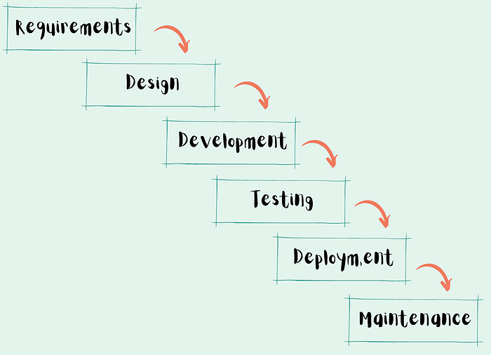
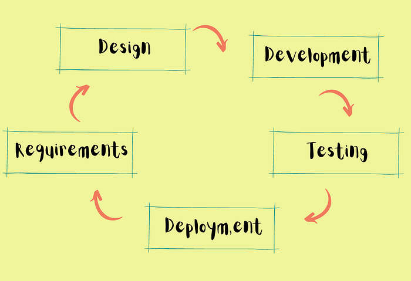
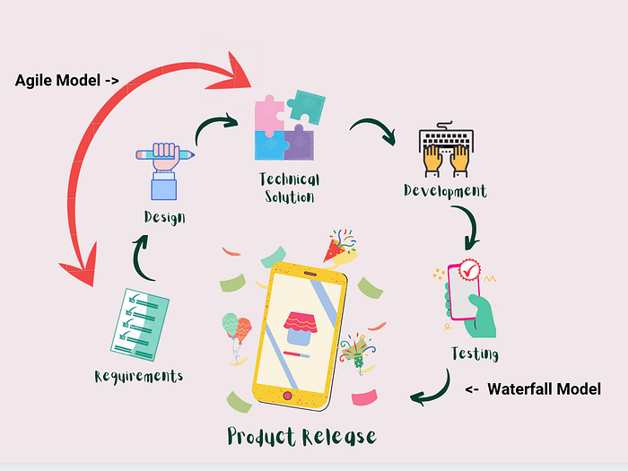
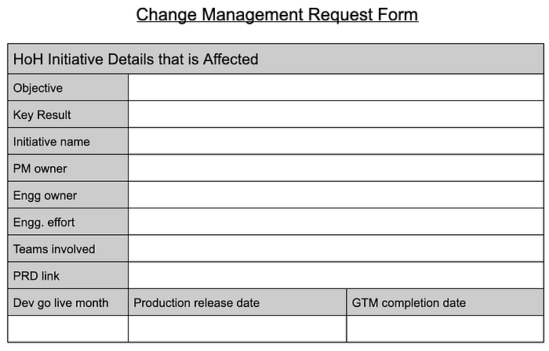
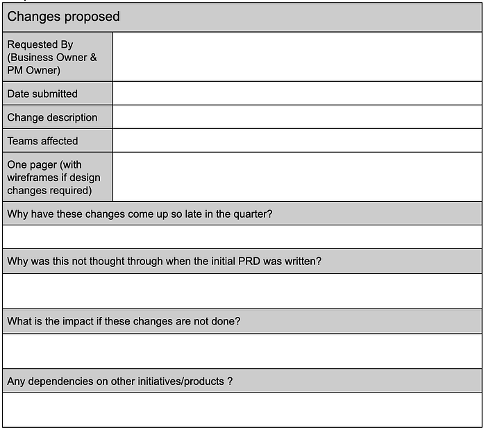
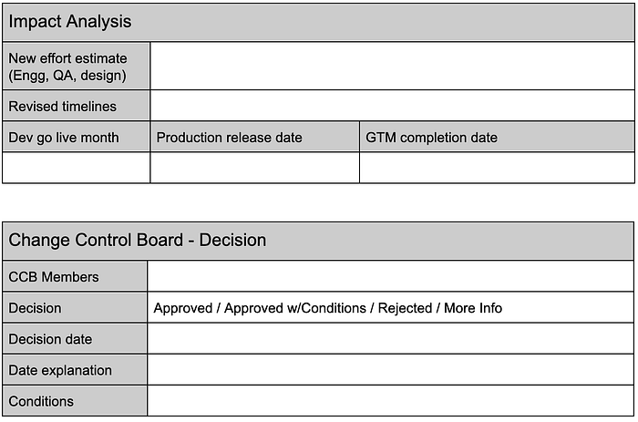

# Ever heard of Swiggy’s AgileFall model?

_Gone are the days of Waterfall and Agile. Here’s how a hybrid process model is enabling efficient project management and changing the game at Swiggy._

_To use Waterfall or to use Agile… that’s the question! _When it comes to project management sometimes it becomes extremely challenging to stick to one methodology. We always plan for outcomes that align with customer expectations, but what if expectations change in the journey? Keeping up with change is always a challenge. And for that you either change or you don’t, or you come up with a fresh path that marries the best of both worlds — I’d like to call it AgileFall.

**Introduction to Waterfall and Agile Methodology**

Customer needs change all the time and it is important for software development to be flexible so that it can adapt or adopt enough to ship thoughtful and relevant products.

The complexity of the product increases because there may be many teams involved — engineering, business, product, and third-party vendors. Everyone has their plans, timelines, and metrics that they hope to achieve. Trying to get all this aligned and then executed is indeed challenging.

In software development, there are two prominent models Waterfall and Agile.

- _What is the Waterfall Model?_

Traditionally it is a breakdown of sequential project activities. These activities can also be in phases, but these phases come one after the other. Each phase can start only when the previous phase has been completed.

- _What is the Agile?_

This methodology is based on iteration, wherein requirements, solutions, and execution go through a cycle of collaborative development between cross-functional self-organizing teams and the customer or end-user.

**How the Waterfall Model cascades?**

Had the e-commerce space been definitive, it would be easy to apply the Waterfall Model. But this becomes a challenge within a highly dynamic ecosystem such as ours. While we do deliver products within months of its ideation, seeing that it remains relevant at the time of release is what counts.

Here are a few examples where we use the Waterfall Model:

1. Product Managers and business minds ideate, share the PR-FAQ and PRD.
2. Designs are finalized and frozen so that iterations can be avoided.
3. Engineering teams decode a technical solution. They give the work breakdown of tasks and timelines.
4. At the end of this exercise, the PRD is frozen, the technical solution is finalized and approved. The engineering team is now ready to start development.
5. In parallel, the GTM plan gets finalized so that it is ready for the product launch.

**Accelerating processes with the Agile Model**

In an e-commerce space, customer-centricity is important. Your customer can be the restauranteur who is confirming your order or the delivery executive who marks that the food is picked up/delivered or the customer who orders the food. Every app is highly customized to the requirements both in design and practicality.

It is a continuous cycle of learning, and improvements are made based on the needs of the customer. This is where we can reiterate, prioritize and execute. There are various places where we apply Agile,

1. Design finalization — The design team goes through various iterations of surveys, feedbacks, and prototyping. This cycle goes on till the final design is achieved as per customer and product expectations.
2. Development of the product — The user stories are prioritized based on dependency or urgency. It goes through various rounds of discussions before the technical solution is finalized between all dependant teams, and then it is taken up for development.

**AgileFall (A Hybrid model**) **= Waterfall + Agile**

Traditionally Waterfall models consume time, and by the time the process is completed, it may not be relevant, so we made an effective cocktail with both models.

Some areas where a hybrid model works,

1. The Product Manager reviews the technical solution to see if the timelines can meet the release timelines. If it is not then they reduce scope or phase out releases to meet planned deadlines.
2. The technical solution is also reviewed to see if there is an easier, faster way to do things with lesser effort, leverage existing features, or build from scratch.

This can go on for a couple of iterations till the desired outcome is achieved. Although the development and testing are time-bound, the product requirements, design, and technical solution may not be necessarily timebound.

**Why a hybrid model?**

There are many instances wherein there is a lot of rework involved if you do not freeze requirements and this may cause a delay in delivering the project on said timelines. Some examples are as follows,

1. There are design changes during execution and so it forces the engineering team to rework the technical solution which may or may not affect timelines.
2. During QA bugs are identified that may cause the engineering team or the product team to take a call on whether it needs to be fixed on priority or not.
3. You can always phase out releases of a product to get to the market faster, get feedback, and then rework if required.

**So how does a Program Manager gets things done at Swiggy?**

Amidst all this complexity we Program Managers need to manage and deliver. In one of my programs, the PRDs were constantly changing, even when development had started, because of this we decided to freeze the PRDs before execution can continue. In addition, we now require PRDs to contain the final designs and not mock-ups. This way the technical solution, effort estimation, and task breakdown will be far more accurate.

We also have the change management process that includes changes that redefine the scope, affect timelines or impact quality. It must be rightly evaluated to see if it should be considered. The stakeholders involved in taking the decision should understand the implications and agree on any impact it may have on the scope, timelines, or quality.

A change management request can be raised at any time of the project life cycle. During technical solution, execution, or even after seeing the demo of the product.

**Key takeaways:**

It is not about what model you use; it is about how you use it. Having a hybrid model gives flexibility in managing a project or a program. You can always choose what you want to use and where. This also depends on the team you have and their suitability or expertise in the area.

No matter what you choose at the end of the day, you need to deliver a relevant product otherwise the product will fail and the expected goodness will not be achieved. That is one of the reasons why products are discontinued even though you may think it was excellent.

**Abbreviations**

_PR FAQs _— Press Release (PR) Frequently Asked Questions (FAQ) is a document that describes the product to the customer. It talks about the vision for the product and how it can be helpful to the customer and the reasons it was envisioned.

_PRD — _Product Requirements Document describes the product requirements, the design of the product, the process of development, and the user acceptance criteria.

**Templates for Reference**

1. Change management request — This format helps capture the changes and evaluate them for the feasibility of implementation.

---
**Tags:** Agile Methodology · Project Management · Waterfall Methodologies · Software Development · Swiggy Life
