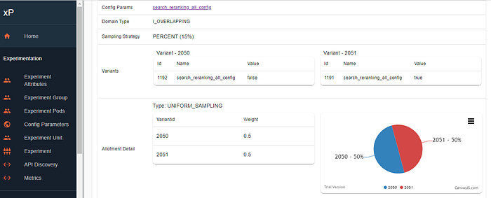
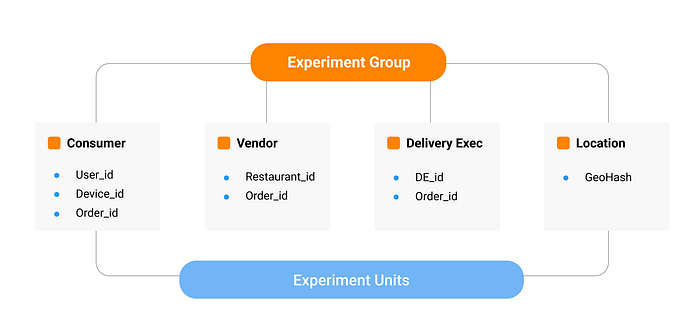
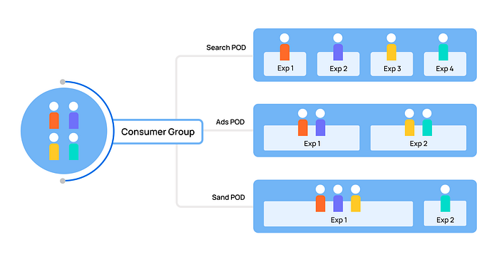

# Experimentation Platform (XP) at Swiggy — Part 1

Experimentation is at the heart of how Swiggy drives rapid innovation and product development to deliver an amazing customer experience. At any given time, a lot of experiments are running to evaluate new ideas, product features, promotions, and various machine learning models. Yes, whether it is the super personalized experience of seeing your favourite restaurants as soon as you launch the app or finding the most exciting deals in the offers section, all of them were put through rigorous A/B tests.

All A/B tests on the Swiggy platform are powered by our in-house central **Experimentation Platform, XP**. XP enables rapid experimentation by making it easy to set up and measure experiments, iterate over variants and eventually scale features that are successful. The XP team also acts as a center of excellence for guiding various teams across Swiggy on best practices, standardization of experiment design and improving the overall quality of experimentation.

## Why did we build XP?

As Swiggy grew from 10 cities in 2017 to more than 500 cities in 2020 — clocking millions of orders and venturing into multiple business lines — the volume, complexity and customization needs of experiments also increased. This nudged us to build a central platform that would empower anyone in the company to quickly test out a hypothesis without spending many hours of manual effort to create the experiment design, experiment configs, ad-hoc measurement frameworks, and dashboards. **With multiple experiments running in parallel, it was also important to ensure that these do not conflict with each other**.

A sneak peek of an experiment instance on our XP!

*Figure-1*

Our vision for XP was to build a platform that would support the following goals:

1. **Increase volume and velocity of experiments:**

Before XP, there wasn’t a central view for people to understand which experiments were running at any given time, how much population was available to them and what was the right time to launch their experiment. It took many days or sometimes weeks of effort from the XP team to configure and allocate population to an experiment. The key features that helped us solve these challenges are:

a. Integration of XP with multiple engineering systems and services

b. Automated and randomized population allotment engine

c. A plug-n-play repository for experiment configurations and metrics which can be readily attached to any experiment

d. A scalable architecture consisting of layers and domains (described later in the article) that now allows us to avoid inter-experiment interference

**2. Ensure accurate measurement of experiments:**

Setting up an experiment is a job only half done. This should be followed up with testing, tracking and concluding the experiments. The key features that enable users to keep track of and accurately conclude their experiments are:

a. Feature to check for Sample Ratio Mismatch

b. Automated metric computation pipeline to keep track of key metrics, compute statistical significance and conduct deep dives

**3. Democratize experimentation (enable anyone at Swiggy to run an experiment):**

We wanted that anyone at Swiggy should be able to translate a hypothesis into an experiment without the technical know-how of experimentation and the engineering systems, which was mostly restricted to Product Managers and Engineers. To achieve this, we created the following features in XP:

a. A standardized and easy-to-use experiment onboarding process

b. A self serve UI for creating, ramping up/down and stopping experiments

c. Tools to automate the inputs of an experiment including the required sample size, and duration of an experiment

d. Analytical dashboards for viewing experiment results

To support the above goals, we have not only built a self-serve platform but also formalized a team of experimentation experts, called the “XP Council” which does experiment reviews, advises teams on the right experiment design including the metrics that will help in accurately testing the hypothesis, and measurement frameworks that will help draw correct inferences.

## What are the building blocks of XP?

1. **Experiment Groups and Experimental Units**:

Experiment Group is the entity or the population on which the user wants to launch an experiment. There are four main experiment groups at Swiggy, which reflect the marketplace structure of the core food business — Consumer, Vendor (i.e. Restaurants), Delivery Executive and Location.

Each Experiment Group can have one or many identifiers (called Experiment Units) for the population it represents. For instance, Consumer has USER ID, DEVICE ID and SESSION ID as Experiment Units, any of which can be used to run an experiment.

*Figure-2*

**2. Configuration Parameters (Config Param):**

It is the output variable from XP which would be a part of every experiment integration. Every such configuration would also have values that would help us identify the different variants (test/control) of the A/B test.

Let’s say we want to test two versions of the logic that defines restaurant listing rank on the Swiggy app. One version is based on the relevance of the restaurant to the visitor and another version is based on the popularity of the restaurant in the visitor’s area. In this case, the variable that decides which logic is shown to a visitor (let’s call it Listing Logic) is called the configuration parameter and the two values in the configuration would be, a. Relevance and b. Popularity which would decide the variant of the A/B test.

Multiple experiments can use/edit the value of the same Configuration Parameter, but XP will make sure that these two experiments run on a disjoint population through our layering and domain approach.

**3. Layers and Domains**:

Taking a leaf from Google’s Domains & Layers approach, conflicting Config Params would be put together in the same _layer _which we call a ‘Pod’. Pods are created to avoid inter-experiment interference, i.e. the same population being subjected to multiple experiments aimed at improving similar metric(s). For example, Ads Pod would contain all the experiments running on ads and Search Pod would contain all the experiments aimed at improving search in Swiggy

We also created _domains _to ensure that populations for non-conflicting experiments can still be reused, which is one of the most important features that enable us to conduct a large number of simultaneous experiments. Domain for an experiment can be a) Exclusive (population is exclusively assigned to the experiment b) Conservative (population can only be shared with other pods) or c) Overlapping (population can be shared within the same pod or with other pods)

Below is an illustration of how the population distribution works in the Pods and Domains framework:

*Figure-3*

XP provides a way to run multiple parallel experiments through the following set up as shown in the figure above:

- **Population to Pods**: All users are shared across the pods and within pods are allocated to different experiments thereby maintaining the sanctity of the experiments
- For example, if there are 4 users in the Consumers experiment group all the 4 users would be available equally across all the pods like Search, Ads and Sand
- **Population within the Pods: **Within the pods each experiment is allocated population based on the requirement and availability.
- Because of the layered approach XP allows to reuse the users across different pods i.e a user can be part of multiple pods but in only one experiment in a one pod

**4. Allotment Strategies**:

Multiple allotment strategies are required to help users achieve the right population distribution amongst A/B variants. Currently, XP supports four allotment strategies:

- Uniform Sampling — sample divided equally between variants
- Weighted Sampling — sample split between variants based on weights
- Time Sliced Randomized — Switchback experiments when the sequence of test and control is completely random
- Time Sliced Deterministic — Switchback experiments when the sequence of test and control is fixed

The availability of a robust, easy to use, self-serve experimentation platform has fostered a culture of innovation and experimentation within the organization. With XP in its current form, we believe that we have just started on our experimentation journey at Swiggy. In our upcoming posts, we will talk more about the experiment lifecycle and other capabilities that we plan to build on the XP platform.

Till then, happy experimenting!

Read our Part-2 [here](https://medium.com/swiggy-bytes/experimentation-platform-xp-at-swiggy-part-2-90f4c3953b08) where we discussed more on the experiment lifecycle and other capabilities that we plan to build on the XP platform.

Shout out to: Mukul Gupta, Niranjan Kumar, Damini Chandra, Bhavishya Jain, Siddhant from the XP team for making this happen!

---
**Tags:** A B Testing · Probability · Data Science · Experimentation Platform · Swiggy Analytics
