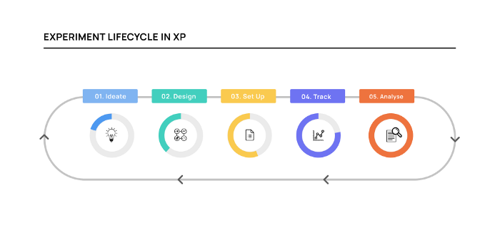
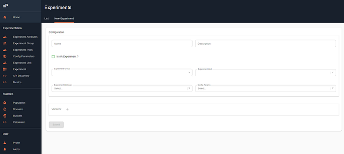

# Experimentation Platform (XP) at Swiggy — Part 2

This is the second post in the introduction series of our in-house Experimentation Platform (XP) at Swiggy. Read part-1 [here ](./experimentation-platform-xp-at-swiggy-part-1-e50b7dbdc773.md)on how XP enables rapid experimentation by making it easy to set up and measure experiments, iterate over variants and eventually scale successful features.

In this second part of the series, we will talk more about the experiment lifecycle and other capabilities that we plan to build on the XP platform.

**The life cycle of an experiment!**

Experimentation is an iterative process with a set of very interesting steps put together to prove or disprove a hypothesis. Here’s how the life cycle of a typical experiment in Swiggy looks like:

*Figure-1*

Let’s take a look at each of these stages in detail, starting with the Ideation phase.

**Stage 1- Ideate**: In this stage, the experimenter comes up with a hypothesis that has either evolved from some quantitative or qualitative analysis. Alternatively, the experimenter can also back up a hypothesis with the analysis post the idea is generated.

A strong hypothesis is a bold and clear statement reflecting the outcome expected from an experiment and generally the foundation of any experiment. A hypothesis consists of generally three important components,

1. **What **— The variable/s that would be impacted because of the experiment  
Eg: _The conversion rate on the homepage can be the variable/metric of importance in the experiments on the homepage_
2. **How **— The expected outcome from the experiment on the selected variable  
Eg: _For the same experiment on the homepage we expect the conversion rate to increase by 5%_
3. **Why **— The reason/rationale for the expected outcome in the variable  
Eg: _The 5% increase in conversion rate on the homepage is expected because of the new design which reduces a lot of clutter from the existing page_

_The final hypothesis would look something like this, “If we were to launch the new design of the homepage which is a _**_lot more decluttered_**_ compared to the existing design, we expect a _**_5% improvement _**_in terms of the _**_homepage conversion_**_.”_

At Swiggy, we strongly advise setting up an experiment with a good hypothesis but we let our users start one even in the absence of a strong hypothesis.

**Stage 2 — Design**: Experiment design is a very tricky part of an experiment where the experimenter needs to convert the hypothesis into an actual experiment with all parameters. There are a lot of moving parts and they need to be tightly coupled together for a good experiment design. At the same time when we are running at a scale of Swiggy, we will have scores of different experiments with different needs across teams. How do you handle all these incoming experiments?

To streamline and standardize experiment design for all the XP users at Swiggy we have created an experiment design template. The purpose of this design template is twofold:

1. **New user onboarding**: The design template comes with a clear set of instructions and information to help new XP users create their experiments with minimal help. The design template also serves as a checklist for users to design their experiments without missing any major inputs.
2. **Standardizing experiments**: The design template helps us in creating a uniform design of experiments through its plug-n-play construct which can be leveraged by all the XP users. Users can add the details of their experiments and seek help from the XP Council (the group of experiment champions) while designing their experiments by sharing their design documents.

Use of the XP design template makes sure that every experiment has the following key parameters selected and added to the experiment:

- **Meaningful Metrics**: The impact metrics, including both success and check metrics, should be a part of the experiment design. The experimenter should be able to add their metrics, their baseline values, and the expected movement in the metrics based on their hypothesis. **XP provides users a metric pipeline to select the metrics of their choice from a preloaded list of popular metrics across the company with an option to onboard any new metric if needed.**
- **Sample size and duration**: Calculating the minimum number of observations required for the experiment based on the inputs and estimating the duration of the experiment. XP has in-built tools that help users in calculating the sample size and duration of their experiments through a simple UI. Users need no statistical knowledge to leverage the tools and can also play around with the inputs to get a satisfactory output. Eg:_ A Product Manager (PM) can use the Sample Size Calculator (SSC) and Instance Duration Calculator (IDC) to identify that she/he needs to run the experiment for 30 days based on the inputs. If 30 days is too many days to run an experiment, the tools show the levers that the PM can use to reduce the duration of the experiment to say, 15 days._
- **Audience selection: **Experiments, in general, are targeted at a certain section of the audience and the treatment (change) would be curated accordingly. XP as a platform allows users to select their audience based on multiple criteria including geographies, customer preferences, and restaurant selections, etc.  
Eg: _An experiment can be done only on 10% of Bangalore users based on the popular restaurants which are local to the city._

The design template also allows experiment owners to share their experiment design with the rest of the stakeholders of the experiment, including Engineering, Analytics, and Data Science counterparts. This would help in bringing an alignment between multiple stakeholders of an experiment and taking inputs from all of them.

**Stage 3 — Setting up the Experiment**: Once the experiment design is closed, users proceed to set up their experiment on XP using the design document as the source of truth. XP allows its users to set up their experiments on the platform through a clean and simple UI that does not require any coding. As XP caters to a wide range of experiments we made sure that the platform is generic enough to accommodate any experiment and at the same time maintain uniformity across the experiments.

Here’s a sneak peek into how the experiment setup page looks like:

*Figure-2*

We have already discussed the key elements of an experiment set up in part-1 [here ](./experimentation-platform-xp-at-swiggy-part-1-e50b7dbdc773.md)including the Experiment Group, Experiment Unit, and Configuration Parameters, Experiment Pod, and Audience of the experiment.

Along with those inputs, XP also lets users add the name and description of their experiments which would be logged and available in the database for downstream usage.

- **Staging Environment and QA**: XP also allows users to set up their experiments on a staging environment (testing environment) which allows them to test their configuration without actually running it on a live audience.
- XP users also get an option to test their changes on a few static devices of their choice to make sure the changes reflect in their experiment design. Especially in experiments involving UI/UX changes, users can add their own devices first to see if the new UI/UX reflects in the experiment design.
- **Starting and Ramping up: **Once the experiment is set, tested, and validated, users, go live with their experiment with a sample audience, say 5% of their audience, to begin with. Users can ramp up their experiments using the XP UI to a larger audience, without any engineering bandwidth involved, as they gain confidence that all the parameters are holding.

**Stage 4 — Tracking the Experiment**: Experiments generally start with a definite timeline based on the expected outcomes which would be a part of the experiment design. Although XP lets its users run their experiments on auto-pilot mode with minimal interaction, there are few use cases that users would like to keep a tab on during the experiment.

- **Allocation Distribution: **As discussed in part-1 [here](./experimentation-platform-xp-at-swiggy-part-1-e50b7dbdc773.md), users can choose their sampling strategy i.e distribution of the audience across variants. Uniform sampling gives a 50–50 distribution between their Test and Control whereas a weighted sampling allows users to choose a ratio of their choice. XP’s instrumentation allows users to keep a tab on variant-wise allocation distribution.
- **Metric movement: **These are the metrics of importance selected in the experiment design stage that users would like to keep track of. XP allows users to add the metrics of choice from its metric pipeline which consists of all the popular metrics at Swiggy. These selected metrics would be refreshed and daily displayed on a dashboard for ease of tracking.
- **Alerting Mechanism**: We are building an alerting mechanism feature on XP which allows users to set up alerts based on their requirements. For example, users can easily set up manual alerts based on conditions like setting thresholds for check metric or high difference in the metric value for test & control.
- **Ramping down and stopping the experiment: **XP allows users to ramp down (reduce the experiment audience size from say 50% to 5%) or stop the experiment once they have enough samples to call out the significance of the results.

All these actions taken during the experiment were logged, instrumented, and would be available on the analytics database for the users to analyze the experiment.

**Stage 5 — Analysing the Experiment**: The final and most important step in any experiment is to analyze and understand the results of an experiment. This generally involves the analytics PoC of the experiment going through the data and running their scripts to understand the significance of the results.

There are a few key things that XP does to make the analysis seamless and easy for the users:

- **Data Logging**: All the allocations of the experiment were logged in an analytics database that is available to all the users. XP logs multiple events of an experiment at various levels including at the granular level of every allocation of an experiment to aggregated tables to show summary statistics of the experiment.
- **XP’s Analytics Platform: **We are in the process of building an analytics platform on XP which allows users to standardize our experimentation analysis processes and results, and makes the data accessible to all stakeholders. In the current process, analysts analyze their experiments in their local environment using SQL queries or ad-hoc scripts.

This process was time-consuming and error-prone. It also lacked standardization, as everyone used different methods for analysis, which can affect the quality and accuracy of the results. Lacking a centralized platform, experiment results were scattered in the form of documents or emails.

To address the above problems, we decided to build the analysis platform to enjoy all the benefits of automated analysis.

The primary components of the platform are stated below:

- **Statistical Significance Computation**: This feature is designed to standardize our experiment analysis processes, including A/B tests, Switchback tests, and Diff-in-Diff analysis. This platform will help us make data-driven decisions based on the analysis results by validating the statistical significance (p-value) and treatment effects on metrics of interest.
- **Sample Ratio Mismatch Check**: We are adding a new feature to XP where we check every experiment for possible inherent biases including [sample ratio mismatch](https://www.microsoft.com/en-us/research/group/experimentation-platform-exp/articles/diagnosing-sample-ratio-mismatch-in-a-b-testing/). Sample Ratio Mismatch (SRM) is a statistically significant discrepancy between the target sample ratios between test groups and their observed sample ratios
- **Flickering or contamination Check**: XP is also coming up with a new feature to showcase if there’s any contamination or flickering in the experiments. Flickers refer to users that have switched between control and treatment groups affecting the sanctity of the experiment.

Post building the analytics platform, the entire lifecycle of the experiment is done via XP seamlessly without any engineering or analytics bandwidth required thereby making it a self-serve tool. The analysis platform would also provide a centralized tool that would showcase experiment results and also make it easy to share the results across the company.

**Iteration of experiments: **Experimentation is often an iterative process where an experiment would result in creating a new experiment with a new hypothesis. The best of the experiments are the ones that open up avenues for new experiments with new ideas.

XP makes it very easy for users to run a series of similar experiments by creating a new instance of the same experiment. The instance would retain the original theme of the experiment and at the same time allow users to customize the instance based on the revised inputs. For example, the home page team might want to run one experiment per month by making certain design changes, they can keep creating new instances every month under the same experiment thereby saving a lot of time and effort.

**Conclusion:**

XP currently serves Swiggy as the one-stop platform for all its experimentation needs but we are still a long way from becoming truly self-serve. Currently, we are working on converting the existing platform into a more robust and stable platform with features such as an Analytics Platform, results visualization, and advanced statistical tools. We hope XP becomes the catalyst for driving the culture of experimentation at Swiggy and we adopt a true experimentation first philosophy as we evolve as a company driven by data and backed by results!

Shout out to our new team members on XP: Ankit Baheti, Kshitiz Agrawal,   
Shubhita Khare and Hardik Chugh

---
**Tags:** A B Testing · Swiggy Analytics · Data Science · Experimentation · Probability
