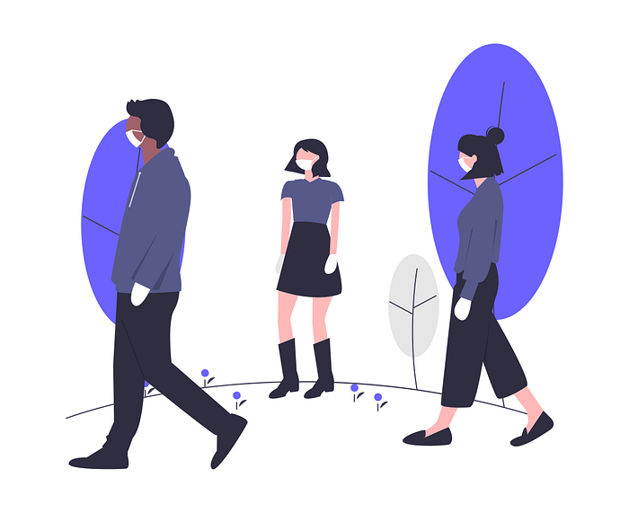
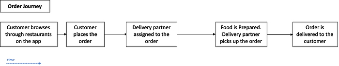
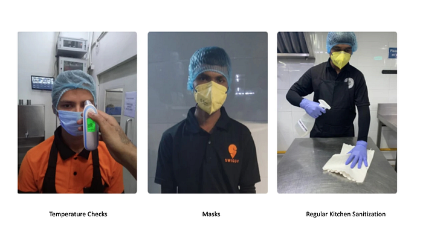
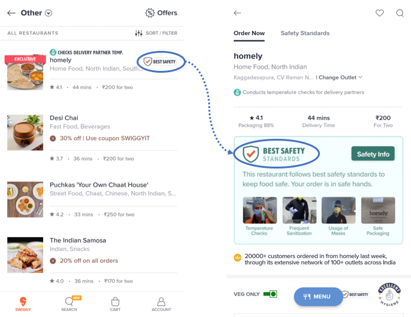
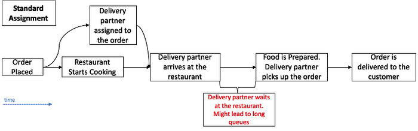
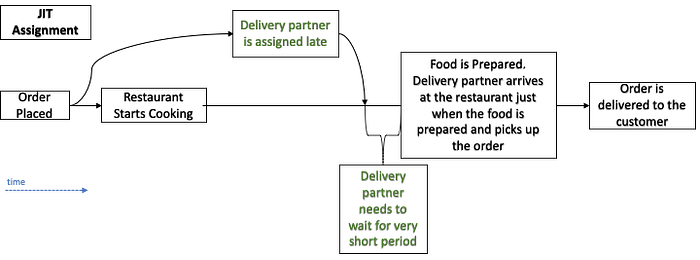
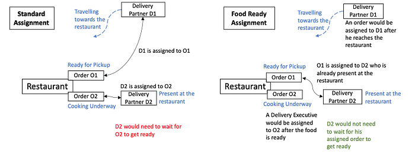
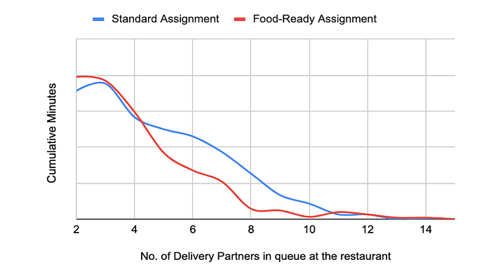
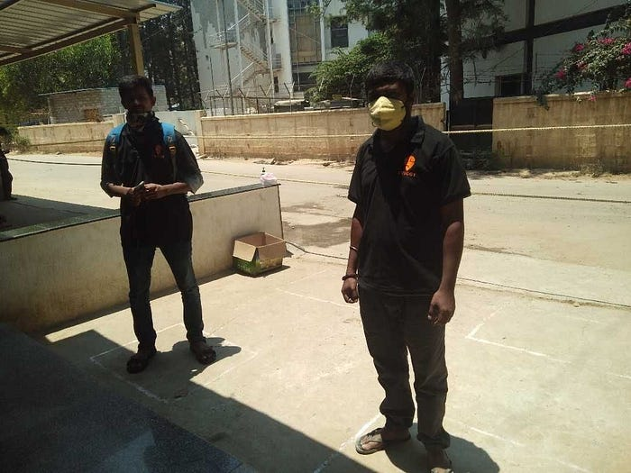
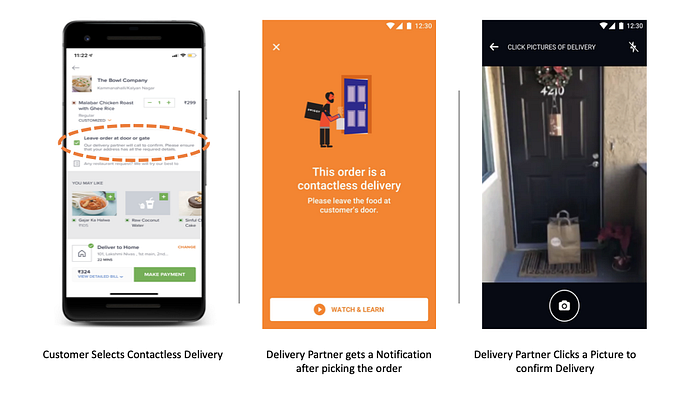

# Facing up to a Pandemic — A look at Swiggy’s efforts to counter the COVID-19 threat

_Co-Authored with _[_Sunil Rathee_](https://medium.com/u/7eb9236fe3b9?source=post_page---user_mention--7b9ec0bd7e5f---------------------------------------)_ and special thanks to Saket Ahuja, Jose Mathew and Kranthi Mitra_

**Introduction**

With the onslaught of COVID-19 pandemic, the way we continue life and cater to our consumers, delivery partners and restaurant partners has taken a drastic shift. The most pressing concern has been to continuously ensure the safety of these entities in our ecosystem. We have launched several tech-led initiatives to meet this objective.

These initiatives are geared towards maximizing the safety at each step of the order-delivery process. A typical order-journey looks as follows:

### Before the Order is Placed by the customer

> Ensuring that restaurant staff remain healthy

Restaurant partners check the temperatures of their entire staff every day. Anyone with a temperature above 99.1 F is advised to rest at home. Similarly, any staff member who feels ill or exhibits symptoms associated with COVID-19 is advised to stay at home until cleared from a doctor or after testing negative post the mandated quarantine period.

> Ensuring high levels of hygiene within the restaurant premises

High levels of hygiene are promoted at restaurants. Restaurants conduct a complete scrub-down of every possible touchpoint — chairs, tables, doorknobs, countertops and sinks — every 4 hours. All personnel involved in food preparation are provided 3-ply face masks. Hand Wash stations are maintained at pickup points to allow delivery partners to practice safe hand hygiene. All orders are packed in an additional bag, so that the food container does not come in direct contact with anyone during the transit.

Restaurants which adhere to all of these guidelines are promoted as having ‘Best Safety Standards’ on the app.

> Sensitizing delivery partners about social distancing

Sensitizing the delivery partners is especially important as they usually come in close physical proximity with different individuals, including customers, restaurants and other delivery partners. Constant communication in form of gifs and videos like the one below is maintained with all the delivery partners:

> Deep Learning Algorithm to ensure that delivery partners wear masks

A Deep-learning-based algorithm was built to ensure that the delivery partners wear masks on a regular basis. Every delivery partner is required to click a selfie and post it on their app when they log-in to the system and start receiving orders. The algorithm checks if the delivery partner is wearing a mask and does not allow partners without masks to log-in. This tool helps us ensure that our delivery partners follow the required mask-safety guidelines.

### When a delivery partner is assigned to an order

The Swiggy delivery algorithm typically assigns a delivery partner, a few minutes after the order is placed. This delivery partner then travels to the restaurant, waits until the food is prepared and then picks up and delivers the order to the customer. This algorithm has been at the core of what has allowed Swiggy to provide lightning-fast deliveries to our customers.

This algorithm, however, requires the delivery partner to wait at the restaurant for a significant amount of time till the food is prepared. At restaurants with high order volumes, this could lead to crowding of delivery partners in times of high demand (like dinner). This might make it difficult to ensure social distancing.

> Just in Time delivery partner Arrival

Just in Time (JIT) ensures that the delivery partner assigned to a particular order arrives at the restaurant right when the food is about to be ready. This reduces the wait-time and hence the long queues at restaurants.

This is achieved by the use of two machine learning algorithms — an algorithm to predict the time taken to prepare food for order and an algorithm that predicts the time taken for a delivery partner to travel to the restaurant. Based on these two predictions, we pick the right time to assign a delivery partner to order such that he reaches the restaurant just when the food is ready. JIT assignment leads to about 25% reduction in average wait time for delivery partners.

> Food-Ready — delivery partner Assignment

As discussed above, the Swiggy assignment algorithm assigns a delivery partner to each order. For some orders, the delivery partner arrives before the food is ready and has to wait at the restaurant. For some orders, the partner arrives after the food is ready. This leads to a scenario where there are some prepared orders at the restaurant whose assigned delivery partners have not yet arrived, while there are some other partners waiting at the restaurant whose orders haven’t been prepared yet.

Food-Ready delivery partner Assignment tweaks the assignment algorithm to reduce these scenarios. Delivery partners are assigned to restaurants instead of specific orders. As soon as the food is ready for a particular order, it is assigned to a delivery partner who is already present at the restaurant. Assignment thus happens in a FIFO manner. This ensures that the wait time of the delivery partner for his order is significantly reduced.

The following graph captures the impact of this initiative on the crowding of delivery partners at restaurants. The graph captures the total number of minutes (y-axis) at different levels of delivery partner-Crowding (x-axis). For instance, this shows that the number of minutes with 8 delivery partners present at the restaurant was cut to one-third by Food-Ready Assignment as compared to the standard assignment. Food-Ready Assignment also leads to lesser instances of a large number of delivery partners waiting at the restaurant as compared to standard assignment.

### When the order is picked-up

> Standard Demarcation Queues

Another initiative that promoted increased physical distance between the delivery partners was standard demarcation queues at pick-up points. This was a widespread concept mandated by the government in several regions. Delivery partners were asked to stand in designated spots or markers while in a queue to pick up the food. Accurate guidelines on how to create these markers were shared with the restaurants.

> Designated Packers at Stores

Swiggy has been ramping up the supply of groceries over the COVID-19 period. Grocery orders typically comprise several items which need to be searched and assembled before being shipped to the customer. A major problem in sending delivery partners to grocery stores was that they often had to spend a long time at the store while the items were assembled. To reduce this wait-time, some Swiggy agents are stationed in stores as packers. These agents start putting the contents of the order together and then send a notification when the order is packed and ready to be shipped. A delivery partner is assigned to the order only after this signal comes through. This drastically cuts down the time the partner has to spend at the store.

### When the order is delivered to the customer — Contactless Deliveries

Contactless Deliveries are geared towards maximizing the distance between the delivery partner and the customer. The delivery partner delivers food outside the customer’s doorstep and then leaves. The customer gets a notification on the app saying that their food has been delivered. Fewer the number of customers a delivery partner interacted with, smaller the chance of him contracting an infection, and smaller still the chance of him transmitting it to any other customer or restaurant executive. To ensure that orders are delivered accurately, the delivery partner submits a picture of the delivery every time he delivers a contactless order.

In the upcoming articles, we will take a look at various other efforts taken by Swiggy to improve safety. Efforts like the delivery partner COVID-19 fund and delivery partner-tipping allow us to ensure that our delivery partners do not suffer financially. AI algorithms are being used to detect if the delivery partners are complying with mask-safety standards. Swiggy has also partnered with governmental organizations to provide large numbers of meals to the destitute.

With these initiatives, Swiggy is trying to soften the blow dealt by coronavirus by ensuring safety, convenience and comfort. The team is working on many other initiatives to that end. We will keep you updated about these efforts in the future as well.

Stay Home. Stay Safe. And when hunger strikes or when you run low on groceries, fire up that orange app!

---
**Tags:** Data Science · Swiggy · Food Delivery · Covid-19 · Swiggy Data Science
