# Fan(s)tastic: Search for blazing-fast results

> The story on how we improved search screen performance

Over the last two years, Swiggy worked extensively on improving the Swiggy app size to increase app installs [[Swiggy app on diet!](https://bytes.swiggy.com/swiggy-app-on-diet-a364fec20081)], and on reducing the app launch time [[Improved app Cold start](https://bytes.swiggy.com/how-we-improved-our-android-app-cold-start-time-by-53-6ef96a1b92cd)].

In this article, we will share how we rewrote the complete search module and used the power of the Presentation layer to drive the app UI. In our new search, we introduced a few new changes, which include, using Profobuf for API response, breaking down monolith ViewModel into multiple smaller and reusable ViewModels, Widgetization of the search list items, building a presentation layer for search and more. We will be going through each new change, one-by-one, and understand how it helped in improving the search feature, and in the end, we will show you the results and performance gain we got because of these new changes that we introduced in the new search. So let’s get started.


*Source: https://undraw.co*

## Why did we decide to Rewrite?

The first question everyone was asking is why to rewrite when we have our existing search codes that are working fine. Below are the problems which we were facing with the old search code.

The legacy search feature had several shortcomings:

1. Monolith Viewmodels (with over 2K LOC).
2. Monolith XML Files.
3. Had many unused old search features.
4. Difficult to maintain and Reuse.
5. Frequent change in analytics events.
6. Lots of unremoved feature flags and A/B testing code.
7. Unable to drive UI through the backend.


---

## New Search

Below are the architectural level and code-level changes that we introduced with the new search rewrite that helped us in gaining performance improvements and also much cleaner code.

**BackEnd Driven UI (Presentation Layer)**

UI on both home and search screens are driven using the backend. Through backend, we can control in which position each widget needs to be rendered. Each item is a Widget. This approach gives us more flexibility to use the same widget on multiple screens. For this, we have created a new PresentationLayer which talks to the underlying systems and converts into widgets and gives the result to the clients(Android, IOS, Web).

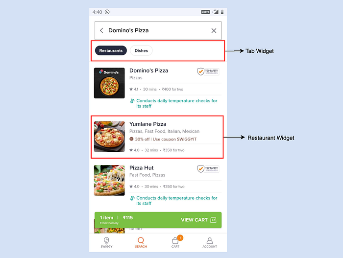

**StateManager**

In the New search flow, we used state managers to handle multiple different screens (states) instead of handling states using booleans. We used the Stack data structure for state management, where we can push and pop the view models, which helped us in writing cleaner code. Each ViewModel extends BaseStackViewModel which has basic operations like refreshing dataset when ViewModel is on peek of the stack, canceling API call on poping the ViewModel, caching dataset.

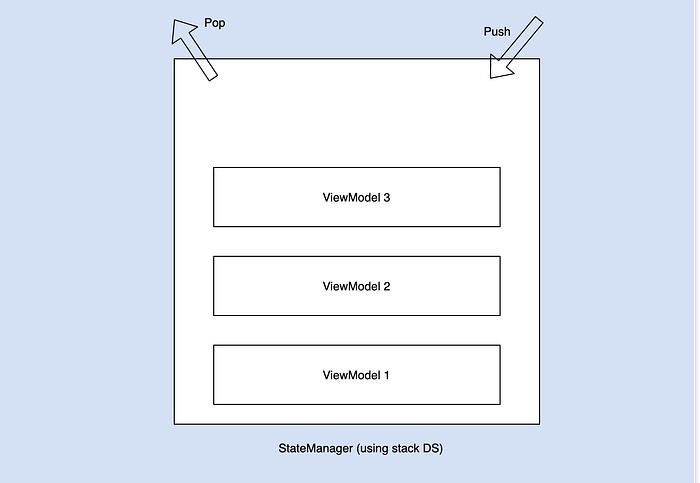
*StackManager*

**Reusing ViewModels**

Brokedown monolith Search ViewModel into multiple smaller view models that can be reused at different screens as well.

Same RestaurantItemViewModel is reused in both home screen and search screen. Homescreen restaurant item is built on the [litho](https://fblitho.com/) component and search restaurant item is built on native component

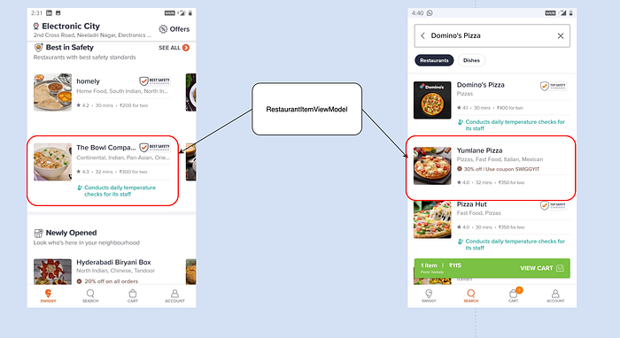
*Reusing ViewModel across the app.*

Each component in the restaurant item cell is further broken into a smaller piece (each containing XML and a ViewModel). In this way, each smaller component can be reused individually on other screens.

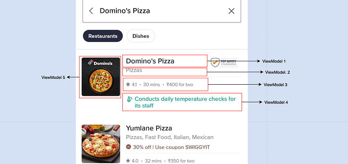

**UT Coverage**

We use the [DiffCover](https://github.com/Bachmann1234/diff_cover) plugin, which runs UT coverage on the new PR and gives us the coverage report for each PR. It also has support for the minimum UT coverage percentage. Build Pipeline will fail, if the UT coverage is lesser than the Minimum UT percentage.

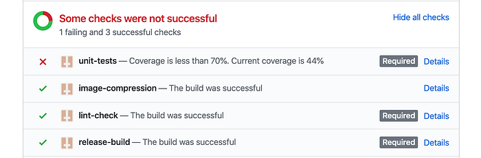
*UT pipeline failed because of less coverage.*

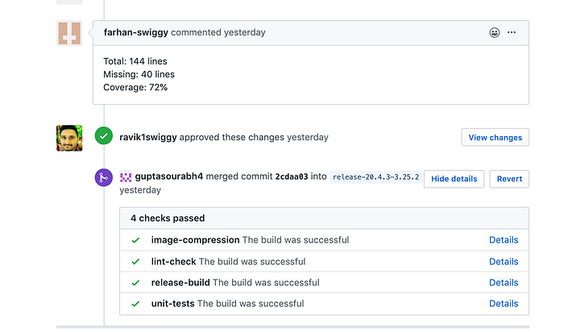
*Pull Request UT coverage report with Percentage.*

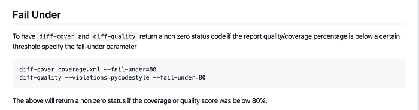

**Protobuf**

[Protobuf](https://developers.google.com/protocol-buffers) is a binary encoding format that allows you to specify a _schema_ for your data using a specification language, like so:

```
message Person {
  required int32 id = 1;
  required string name = 2;
  optional string email = 3;
}
```

We used Protobuf instead of JSON, which gained us in response size. As a result, we got around **11.85%** reduction in response size.

**Driving Analytics through Backend**

We were getting frequent requirement changes to update analytics events in each sprint, especially for the newly released feature. We wanted to solve this issue without releasing a new app version. So, we decided to drive analytics events also through the backend. We made small changes in the contract by adding a new analytics block to each list item, we added all the necessary fields to that block. This helped us in fixing analytics issues without a need to release a new app.

```
analytics : {
   name : "name_of_the_event",
   source: "context",
   ...
}
```


---

## Result


### 1. GPU Overdraw

Overdraw occurs when your app draws the same pixel more than once within the same frame. So this visualization shows where your app might be doing more rendering work than necessary, which can be a performance problem due to extra GPU effort to render pixels that won’t be visible to the user. So, you should [fix overdraw events](https://developer.android.com/topic/performance/rendering/overdraw#fixing) whenever possible.

> We achieved the performance improvements in **GPU Overdraw and Profile GPU Rendering **by breaking down single monolith custom view into smaller XML layouts. Since custom view had more complex logic, it took more time to render in the view. Breaking down the XML, also helped us in reusing the same XML layout in other part of the app as well.

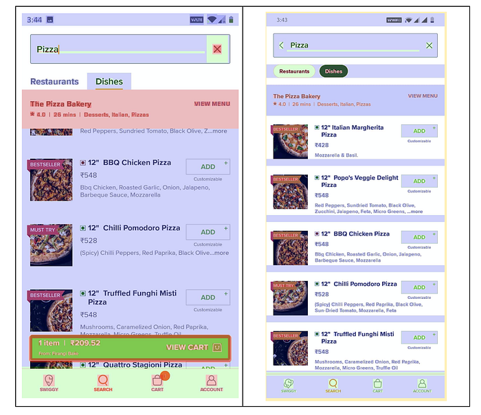
*GPU Overdraw Improvement between Old Search (Left) and New Search (Right)*

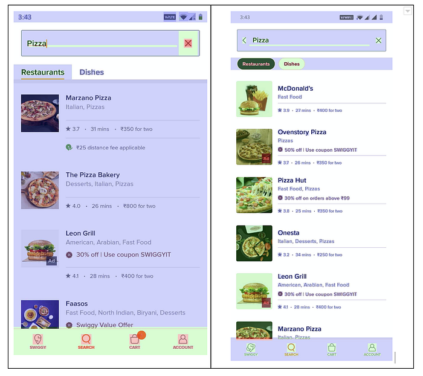
*GPU Overdraw Improvement between Old Search (Left) and New Search (Right)*

### 2. Profile GPU Rendering

The Profile GPU Rendering tool displays, as a scrolling histogram, a visual representation of how much time it takes to render the frames of a UI window relative to a benchmark of 16ms per frame.

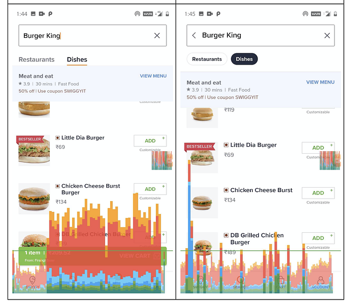
*Profile GPU Rendering Improvement between Old Search (Left) and New Search (Right)*

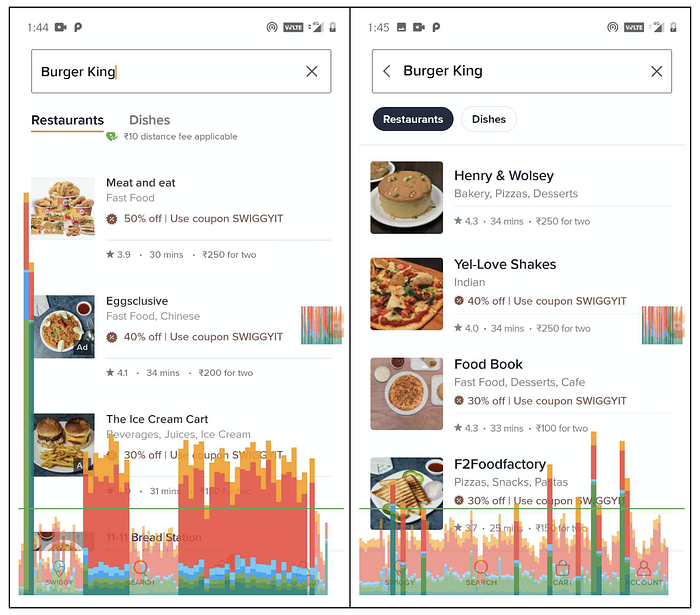
*Profile GPU Rendering Improvement between Old Search (Left) and New Search (Right)*

### 3. Protobuf

We have opted for Protobuf for serializing the data on the wire for a couple of reasons

1. Reduced size of the response resulting in improvement in reduced loading times for the user

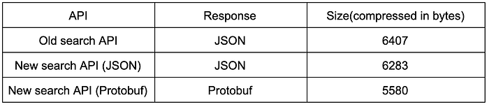
*Response size comparison between the two APIs*

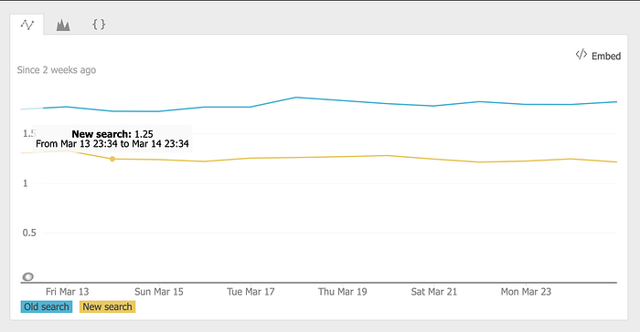
*95 percentile response time comparison for users between the old JSON API and the new Protobuf API*

2. Strict contracts between backend and clients with a single repository containing data models shared between the backend and multiple clients (Android, iOS, and Web)

### 4. Memory Allocation

**_Old Search_**  
Layout count — Linear(41), Frame(24), Relative(20)  
Widget count — ImageView(25), TextView(72)  
Bitmap count — 34

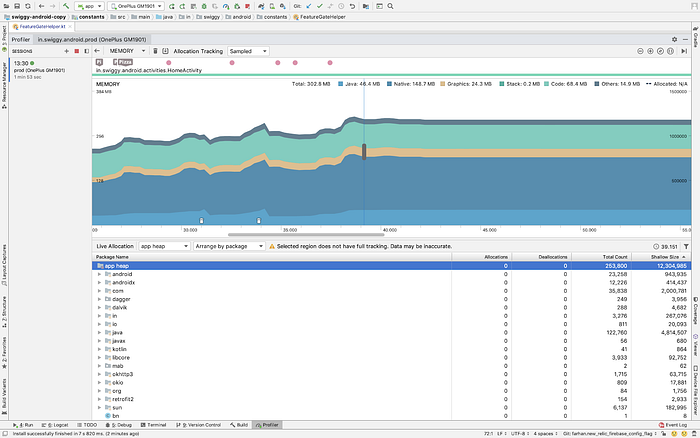
*Memory allocation analysis after a cold start*

**_New Search_**  
Layout count — Linear(21), Frame(16), Relative(8)  
Widget count — ImageView(6), TextView(56)  
Bitmap count — 19

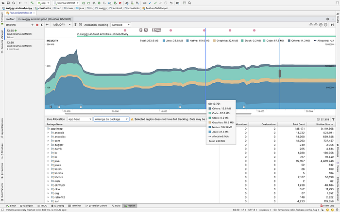
*Memory allocation analysis after a cold start*

### 5. View Population

Tracking the aggregated fill operation of the Layout Manager to visualize the improvements of the refactor

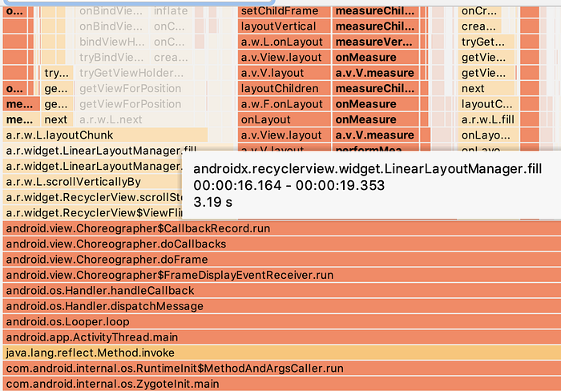
*Aggregated time taken by the fill operation of Linear Layout Manager in the old search flows*

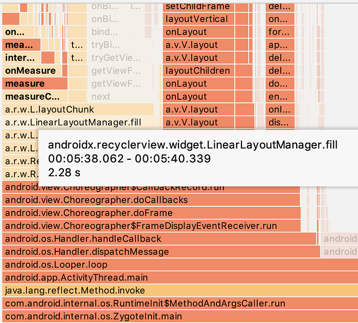
*Aggregated time taken by the fill operation of Linear Layout Manager in the new search flows*

## Summary

Above are the new changes we considered while rewriting the feature from scratch, and it helped us in gaining app performance and this also opens up building new pages in Swiggy app where we can reuse the same page construct on other pages and make sure we can scale to different pages easily with this architecture.

Hope this article was useful. Feel free to give any suggestions or feedback.

## Reference


---

## Acknowledgments

> _I am Viswanathan from Android Mobile team at Swiggy, I would like to thank my colleagues _[Sourabh Gupta](https://medium.com/@sourabhgupta_63169), [Manjunath Chandrashekar](https://bytes.swiggy.com/@manjunath.c23), Farhan Rasheed, Manu Narsaria and Madhu Karudeth for helping me in finishing this blog.

---
**Tags:** Swiggy Engineering · Swiggy Mobile · Swiggy Android · Swiggy Tech
