# Find My Food: Semantic Embeddings for Food Search Using Siamese Networks

Co-authored with [Anurag Mishra](https://www.linkedin.com/in/anuragmishracse/), [Srinivas Nagamalla](https://www.linkedin.com/in/srinivas-n-54a6b98/) and [Jairaj Sathyanarayana](https://www.linkedin.com/in/jairajs/)

**Introduction**

On Swiggy, a significant portion of discovery happens through search. Our current search system consists of an ElasticSearch backend that returns restaurants and dishes in response to a query using fuzzy text matching and geo-location filtering. While such a system is fast and efficient, there are a few shortcomings.

Indian dish names do not have a definitive spelling in English text. But since most customers type in English, the resulting spelling variations are impossible to be handled completely by most text matching algorithms. For example, we’ve seen _‘biryani’_ spelled as_ ‘biriyani’, ‘biriani’, ‘beriani’, ‘briyani’, ‘breyani’, ‘briani’, ‘birani’_, just to name a few. Obviously the customer expectation would be to see _‘biryani’_ dishes. With text match, these can lead to no results being returned even when the user intent is fairly clear, causing dissonance (see Figure 1a). The first challenge is hence, to have an embedding model that is resistant to spelling variations. The second concern is the implicit method through which text matching works — the algorithm matches words together as well as separately. This means, for example, _‘cheese margherita’_ and _‘cheese nachos’_ may both be returned for a query _‘cheese pizza’_ (see Figure 1b for a variant of this where a rice with chicken is ranked higher than a vegetarian rice for the query _‘veg rice’_). The final problem with text matching in a hyperlocal setting is that, if a certain dish the user searched for, is not available in that location, no results are returned if no text matches are found. We would instead want to return relevant results that are _semantically_ _similar_ to the dish that is searched for (see Figure 1c).

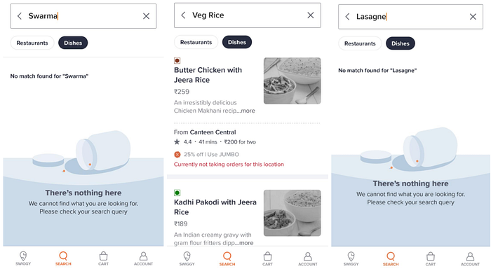
*Figure 1 (from left to right) a. Misspelled search query b. Misranked Results for an unambiguous query c. Search query of a dish that’s unavailable and failed to return any other dish semantically similar to the queried dish*

In this post we go over a solution that is currently in production and helps power re-ranking of dish search results. We will describe self-supervised and supervised neural network methods to generate embeddings using large-scale search logs. We show that embeddings from our Siamese network with a custom trigram tokenizer improve upon baselines that are based on Word2Vec and FastText. In addition to handling out-of-vocabulary (OOV) and misspelled/alternate-spelling queries, the embeddings are able to capture food-specific semantic information leading to better query understanding. We show the semantic relatedness of results from Siamese models using a combination of DB index (quantitative) and t-SNE (qualitative), evaluated on our in-house Food Taxonomy.

**Methodology**

Our problem statements necessitate semantic embeddings for search queries as well as dish names. Our primary data source is the search log containing queries and corresponding dishes ordered in a session. For training, we use roughly 2 million <query, ordered_dish> tuples spanning 2 months from our search logs. **Tuples are lightly preprocessed by lowercasing and stripping out non-alphanumeric characters.**

For evaluation, we use search-log data from one large city in India. Additionally, we have an in-house Food Taxonomy where each of the dishes in our catalog is mapped to one of the 300+ dish families and 6 dish categories. A Dish Family is a collective entity for similar types of dishes — for example, all different types of pizza belong to the _‘pizza’_ dish family. A Dish Category corresponds to a much broader information about the dish. Current categories include _‘main course’, ‘beverages’, ‘desserts’, ‘extras’, ‘snacks’ and ‘starters’_. The taxonomy is developed and curated by in-house food experts while the mapping of a given dish to taxonomy nodes is done via deep learning models built on hand-labeled data from the taxonomy. We use this dish-to-taxonomy mapping to evaluate semantic goodness of our models. We use DB Index to quantify the goodness of separation achieved in clustering. We also visualise t-SNE plots for qualitative evaluation.

**_Baseline_**

For baselining, we experimented with two of the most widely used word embedding techniques, W2V and FastText. The context for a query is the dish ordered for that particular query. Both W2V and FastText models were trained using the skip-gram approach, to generate 64-dimensional embeddings. A batch size of 1000 was used with linearly-annealing learning-rate from 0.025 to 0.0001. W2V model’s vocabulary is limited to the queries and dishes that it has seen during training. Due to this, W2V could not generate embeddings for about 32% of the dishes available in the test city and for about 5% of search queries. FastText on the other hand, was able to generate embeddings for all the dishes when the minimum length of n-gram was set to 3. We consider FastText as the baseline for comparing with our other proposed models.

**_Generating Negative Samples_**

In the following approaches, we use Siamese networks for generating query and dish embeddings. We treat dishes ordered for a particular query as positive samples. For generating negative samples, a possible approach is randomly sampling from the catalog. This method, however, is likely to pair a positive example with a negative example with no notion of semantic relatedness leading to noise in the training data (for example, _‘pasta penne’ _is arguably a better negative for the positive example_ ‘macaroni’ _compared to, say, _‘sushi’_). We address this by sampling negative dishes from among the dishes that are less than a pre-set threshold ‘_away_’ from the positive sample. We use the embeddings from our FastText baseline and cosine similarity to accomplish this. We set the threshold to 3 standard deviations away from the mean cosine similarity between the query and positive dish pairs. By doing this we observed the loss convergence to be about 20% faster and up to a 4% boost in Recall@k.

**_Siamese Transformer Network (STN)_**

In Sentence-Bert, the authors use pre-trained BERT as sentence encoders. However, since our domain-specific data is a considerably different vocabulary, we trained a multi-headed self-attention encoder from scratch with word-piece tokenization.

We omit the step with positional encoding as most queries and dish names are 2–5 words in length and the sequence of words usually does not matter in food search. Each of the 2 identical encoders consists of 4 self-attention layers with 8 heads in each layer and generates a fixed size embedding of 64 dimensions. These embeddings are concatenated to the vector of absolute difference between the two. This layer is passed through a single dense hidden layer of 32 dimensions, and a final output layer for classification, as shown in Figure 2. This network is trained to optimize the categorical cross-entropy loss using a constant learning rate of 2e-3 with a batch size of 16.

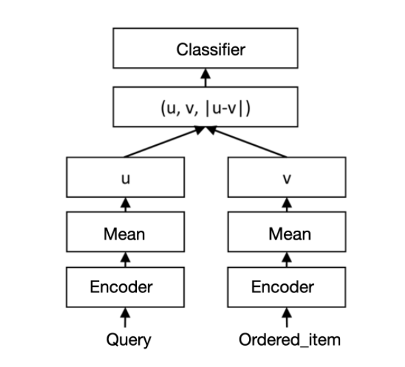
*Figure 2. Architecture for Siamese Transformer network (referred from Sentence-BERT)*

While this approach produced superior results vs. baseline in terms of both retrieval-ranking and semantic quality, as shown in the results section, both training and inference times are several magnitudes larger than the baseline, which makes deployment and updating infeasible for us.

We also note that word-piece tokenization suffers at the task of text-matching when the query is misspelled and is not present in the tokenizer vocabulary, which results in splitting the word, and the final embeddings of the misspelled query might vary substantially from it’s closest dish match by spelling. Contrastingly, an n-gram tokenization technique similar to the one used in FastText deals with OOV words by returning a token id for all n-grams. This ensures that minor spelling errors are handled better since there will be a significant overlap between the correctly-spelled word’s n-grams and the misspelled word’s n-grams. An example of the tokenization of word-piece compared with custom trigram is shown in Table 1.

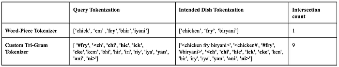
*Table 1. Tokenization for a misspelled query ‘chickem fry bhiriyani’, where the intended spelling would be ‘chicken fry biryani’*

**_Siamese fully-connected network with trigram tokenization (Siamese FCN-T)_**

To address the shortfalls of transformer-based encoders, we propose an encoder network using custom trigram tokenization (example shown in Table 1), with a single dense hidden layer that generates embeddings for all tokens and averages them to form a single vector representation. L2 normalization is applied to the final averaged embedding. The tokenizer breaks the original text into its space-separated word split in addition to all the trigrams that exist in the original vocabulary. To train this encoder network, we use the same Siamese setup as shown in Figure 3 and train with cross-entropy categorical loss using a linearly-annealing learning rate from 0.005 to 0.0002 with a batch size of 16. Inference time for the Siamese FCN-T is over 6X faster than the STN.

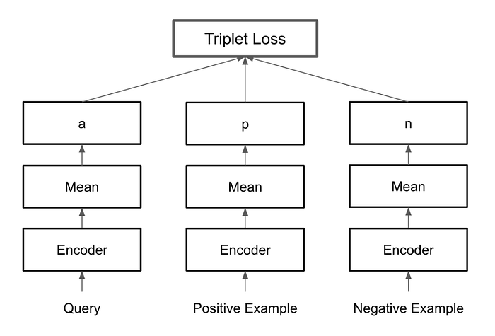
*Figure 3. Architecture for Siamese FCN-T (Triplet Loss)*

Since we have a scalable way to mine negative examples, we also trained the FCN-T with triplet loss. Naturally this uses 3 identical encoders, one each for query, positive_ordered_dish and negative_ordered_dish. The loss function is shown in Equation 1.

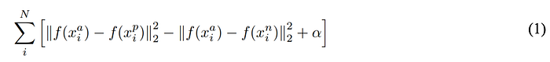

Here _x^a_ is the query, which is the _‘anchor_’, _x^p _is the positive example and _x^n _is the negative example, the function _f_ represents the encoding layer, and α is the margin. Through our experiments, setting a margin of 0.4 achieved the best results in terms of the evaluation criteria.

**Evaluation**

We evaluate the performance of our models on two separate tracks, namely, retrieval ranking and semantic relatedness.

**_Evaluating retrieval ranking_**

We compare the retrieval ranking performance of Siamese models with the FastText baseline using search logs in an offline setting. Our validation set, V1, consists of 35,000 pairs of <query, clicked_dish>. We use MRR and Recall@100 on V1 to quantify models’ performance in ranking and retrieval respectively.

Additionally, we also evaluate models by adding misspellings to queries in V1. We did this using a manually curated data set consisting of root words and their most common spelling variations. We use this to create a dictionary and change every word in our validation search queries to a randomly sampled misspelling of that word from the dictionary. This resulted in a validation set, V2, of 26,000 pairs. We evaluate MRR and Recall@100 again but now, exclusively on misspelled queries. A text-matching algorithm will return an empty set for these queries if similar misspellings do not occur in the dish names as well.

**_Evaluating semantic relatedness_**

To assess the semantic quality of the embeddings, we make use of our in-house Food Taxonomy data where every dish in the catalog is mapped to a Dish Family. A ‘_good_’ embedding model should generate closer embeddings for dishes belonging to same dish families.

To quantitatively estimate this, we pick 10 ‘_head_’ dish families whose dishes receive a lot of orders on the platform. The chosen dish families are the following, _‘curry’, ‘biryani’, ‘pizza’, ‘cake’, ‘sandwich’, ‘noodles’, ‘pasta’, ‘dry starters’, ‘salad’ and ‘shakes’_. We then randomly pick 250 unique dishes from each dish family. Vectors are generated for the sampled dishes and all dishes belonging to a dish family are regarded as one cluster. We use the DB index, as shown in Equation 2, to evaluate our clusters.

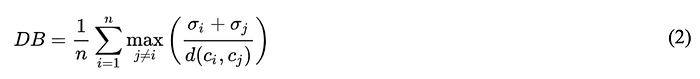

Here _n_ is the number of clusters, _cx_ is the centroid of cluster _x_, _σx_ is the average distance of all elements in cluster _x_ to centroid _cx_, and _d(ci,cj) _is the distance between centroids _ci_ and _cj_.   
The embeddings model which produces a collection of clusters with the lowest DB Index is considered to be the most well-separated clustering.

We also evaluated the results returned by our model for queries that were correctly spelled but the dishes themselves were not available at the user’s location resulting in no results being shown. We use the Dish Category mapping from our Food Taxonomy and evaluate the proportion of the top-10 returned results belonging to the same dish category as the searched-for dish. A higher mean proportion indicates better semantic retrieval. We do this evaluation on 2,000 historical queries (at their corresponding geolocation) that resulted in an empty result set from text matching.

**Results**

We first compare the performance of our models in terms of MRR and Recall@100.

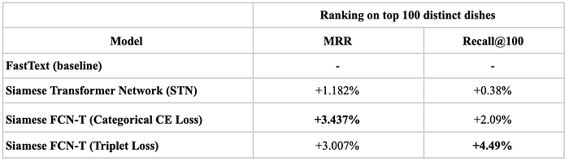
*Table 2. Relative improvements in MRR and Recall@100 over the FastText baseline*

On our validation set V1, Siamese FCN-T (Triplet Loss) has better performance both in terms of MRR and Recall@100 as presented in Table 2. The results on our misspellings validation dataset, V2, are summarised in Table 3. Here again, Siamese FCN-T (Triplet Loss) outperforms every other model. The STN model performs poorly because of the lack of overlap between the tokens as illustrated in Table 3.

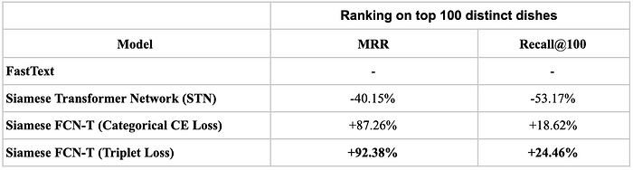
*Table 3. Relative improvements in MRR and Recall@100 on cases with misspelled queries*

We compare the semantic quality of embeddings using the DB index from clustering on in-house Food Taxonomy data and semantic retrieval of unavailable dish queries. The results are summarised in Table 4 and Table 5.

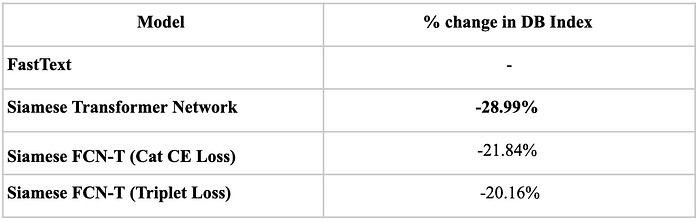
*Table 4. Semantic evaluation using relative change in DB Index vs. baseline (more negative the better)*

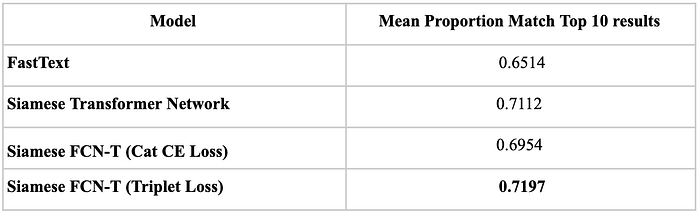
*Table 5. Semantic evaluation using mean proportion of top-10 returned results belonging to the same dish category as the query dish*

All of the Siamese models perform significantly better than the FastText baseline. We also visualised the t-SNE plots of the embeddings as shown in Figure 4.

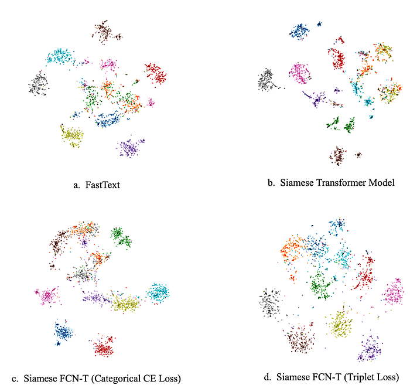
*Figure 4. t-SNE plots of the embeddings of our candidate models*

From the t-SNE plots, we observe that Siamese models are able to learn to separate dish families into clusters.

The Siamese FCN-T (Triplet Loss) model achieves 3% and 4.49% improvement over baseline (as measured on V1) in MRR and Recall@100 respectively. On the more challenging V2 data set, the improvements are 93% and 25%. While Siamese FCN-T (Triplet Loss) outperforms the baseline in terms of semantic relatedness, it trails the other Siamese variants. However, considering the gains we see in retrieval ranking as well as 3X faster training time and over 6X faster inference time, we choose Siamese FCN-T (Triplet Loss) as our best performing model.

To drive this home further, we show a few examples of the results from using the encoder trained through Siamese FCN-T (Triplet loss) in comparison to those from the current text-matching algorithm at the same geographical location in Table 6. The first query is a spelling error but our model is able to fetch relevant results. The second query is for an unavailable dish at that particular location, our model is able to fetch results semantically similar to ‘_lasagne_’ by retrieving dishes belonging to the same cuisine (Italian). Training our models in this manner also enables the encoders to capture interesting semantic relations, as a side-effect of being able to semantically cluster dishes, illustrated through the last 2 examples.

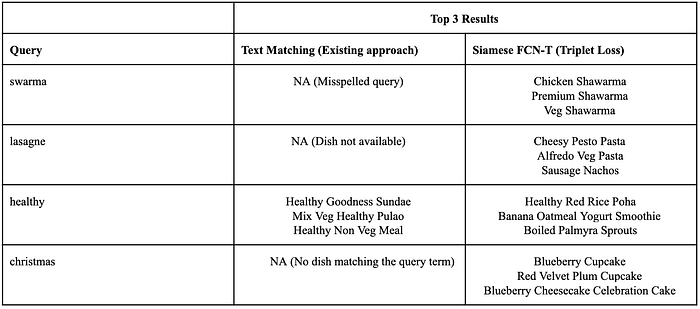
*Table 6. Sample queries and comparison of results between text matching algorithm and our encoder trained through Siamese FCN-T (Triplet Loss)*

**Productionization for Use in Re-ranking**

Once we have a trained model that can generate embeddings for any given item, we use this model to generate embeddings for all items in our catalog and store those offline. We also deploy this model online to generate embeddings for every query the user makes, in real time. The model was trained using Tensorflow and deployed as a Tensorflow estimator. These embeddings are matched with candidate items’ embeddings to generate a cosine similarity score, which feeds as a feature in our LTR model as shown in figure 5. This is one of the top features in the model.

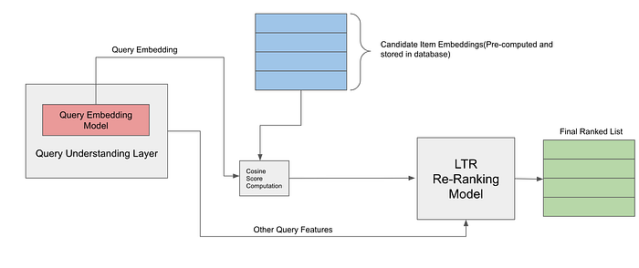
*Figure 5. Working flow of query embeddings for re-ranking*

Our real-time query embedding model can consistently generate embeddings with low latency of about 2 ms (99th percentile) per request for our throughput number of requests.

**Next Steps**

Using these embeddings for _retrieval_ is in our backlog and we plan to experiment with this once we move to ElasticSearch 7.6 which supports embeddings. We are also extending the Siamese model to better handle both lexical and semantic queries. For example, Microsoft’s 2017 DUET paper proposes a model to address this. We take inspiration from this paper and are experimenting with augmenting the Siamese model with a CNN based lexical _‘trunk’_. Early results show promise.

---
**Tags:** Search · Semantics · Deep Learning · Embedding · Swiggy Data Science
