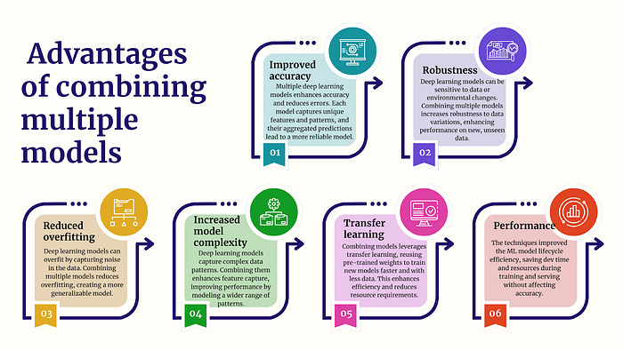
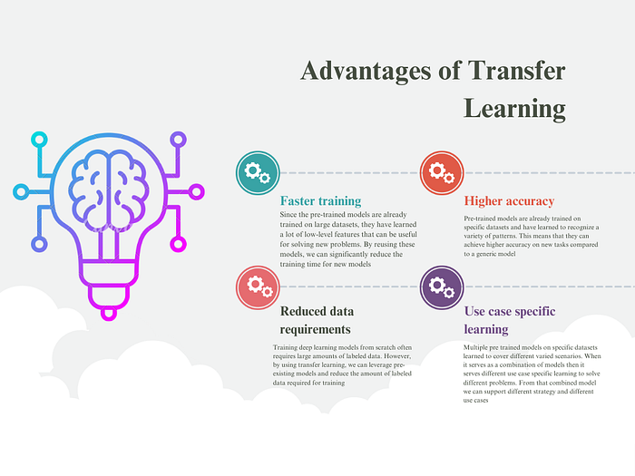

# Food for Thought: Swiggy’s Deep Learning Journey!

Co-Authored with [Smarak Pradhan](mailto:smarak.pradhan@swiggy.in) and special thanks to [Sunil Rathee](mailto:sunil.rathee@swiggy.in) & [Goda Doreswamy Ramkumar](mailto:goda.doreswamy@swiggy.in)

Swiggy is dedicated to offering people the utmost convenience in their daily lives. This focus stems from our team’s passion for making life easier for everyone. To make these ideas a reality, Swiggy’s data science team is hard at work, applying their skills and knowledge to ensure these innovative projects succeed. In this blog post, we’ll dive into our experiments with different deep learning (DL) architectures and techniques that are customized to fit our unique requirements. Logistics is a core focus for Swiggy’s business and our team is working tirelessly to make the system more efficient. In addition being a Customer first company we also invest heavily to set the right user expectation.

By leveraging DL architectures such as Multi Input Multi Output Neural Networks (MIMO), Transfer Learning, Combining multiple models. We aim to optimize our [supply chain](./assignment-routing-optimization-for-swiggy-instamart-delivery-part-i-2e8fb3115463.md), reduce delivery times, [set correct user expectations](./predicting-food-delivery-time-at-cart-cda23a84ba63.md) and ultimately improve overall customer satisfaction. Furthermore, we will also be sharing some best practices for effectively developing models in real-world scenarios with optimal resources. We invite you to join us as we explore the exciting world of DL architecture and its applications in the realm of quick commerce.

We found following advantages of combining multiple models through architecture or serving



## MIMO Architecture

At Swiggy, our top priority is to provide our customers with unparalleled convenience. Each step of the delivery process needs to be predicted accurately. This is important because each part of the journey affects the next, and their predictions need to work together smoothly. To achieve this, we use a MIMO (Multiple-Input Multiple-Output) architecture, which combines several deep learning models. This results in more accurate predictions for subsequent legs of the delivery process, which leads to a seamless and efficient delivery experience for our customers.

When designing the network to address this issue, we approached it by treating the delivery process as a single problem statement, rather than considering each leg separately. We developed model features around the entire delivery state and trained the model to predict for all legs based on the provided features. This approach allowed us to provide more accurate predictions for the delivery process as a whole, rather than treating each leg as an individual problem. For detailed insight you can refer to [psla blog.](./predicting-food-delivery-time-at-cart-cda23a84ba63.md)

Overall, MIMO architecture can lead to more accurate, efficient, and flexible deep learning models that are well-suited for a wide range of real-world applications.

## Transfer Learning

At Swiggy, we cater to different regions and restaurants, each with their unique characteristics and service standards. For instance, the traffic patterns in tier 1 cities during office hours differ from other cities, and the food preparation time for a restaurant may differ from that of a confectionery. Therefore, we cannot train a generic model that can capture the nuances of each of these scenarios. To address this, we developed specialized models for each case, and then froze their weights and transferred them to a combined model for prediction. While our models internally cover specific cases, they are combined and used as one through transfer learning during serving, ensuring the highest level of precision for our customers.

We train these models separately, then freeze the weights of each layer. Then create a combined network. We don’t train this combined network, instead we transfer weights of previously trained networks to this combined network. In this way the newly combined network will learn from each of the loaded models and can cover multiple specific cases gracefully. For examples and implementations you can refer to this [keras manpage](https://keras.io/guides/transfer_learning/).

### Advantages of Transfer Learning



### Combining Models

In some scenarios, it may be necessary to combine multiple models into one. This could involve feeding one model’s prediction to another or passing the predictions of multiple models into a single [Kafka topic](https://kafka.apache.org/documentation/) for the simplification of the engineering system. In such cases, transfer learning could have been one of the solutions. However, to keep things simple, we chose to use concatenation. We accomplished this by overriding the call method of the [model class](https://www.tensorflow.org/api_docs/python/tf/keras/Model) to call multiple independently trained models with a single inference call. This method helps to serialize the model without complicating the training procedure.

## Implementation

```
class combined_Model(tf.keras.Model):
   def __init__(self, model1, model2):
       """
       Initialize the combined model with two pre-trained models.
      
       Parameters:
       - model1: The first Keras deep learning model.
       - model2: The second Keras deep learning model.
      
       The predictions from model1 will be used as inputs to model2.
       """
       super().__init__()


       # Set model1 and model2 as attributes of the combined model
       self.model1 = model1
       self.model1.trainable = False  # Freeze model1 to prevent further training


       self.model2 = model2
       self.model2.trainable = False  # Freeze model2 to prevent further training


   def call(self, model_inputs):
       """
       Generate combined predictions using model1 a`nd model2.
      
       Parameters:
       - model_inputs: The input tensor for generating predictions.
      
       Returns:
       - output: A dictionary containing predictions from both models.
       """


       # Get predictions from model1
       model1_pred = self.model1(model_inputs)


       output = {}
       predictions = {}


       # Store the first prediction from model1 in the output dictionary
       output["prediction1_model1"] = tf.cast(
           tf.reshape(model1_pred[0], [-1]), dtype=tf.float64
       )


       # Store the second prediction from model1 in the output dictionary
       output["prediction2_model1"] = tf.cast(
           tf.reshape(model1_pred[1], [-1]), dtype=tf.float64
       )


       # Use the first prediction from model1 as input to model2
       feed_prediction = tf.cast(
           tf.reshape(output["prediction1_model1"], [-1]), dtype=tf.float64
       )


       # Prepare inputs for model2 by copying the original inputs and adding the feed_prediction
       model_input_2 = model_inputs.copy()
       model_input_2["feed_prediction"] = feed_prediction


       # Get the final prediction from model2
       model2_pred = self.model2(model_input_2)


       # Store the prediction from model2 in the output dictionary
       output["prediction_model2"] = model2_pred


       return output


# Create an instance of the combined model using model1 and model2
concatenated_model = combined_Model(model1, model2)
```

Using this simple implementation we achieved a serialized model, capable of calling multiple models independently.

### Advantages of Concatenation

- **Simplification:** Instead of maintaining separate complex models for related operational decisions, we integrate them into a streamlined system where predictions flow between models, mimicking actual operational relationships. For example, when predicting delivery times, the order preparation time prediction feeds directly into the delivery promise calculation, creating a more accurate representation of real-world dependencies while reducing complexity and cost. This connected approach better captures how one operational factor (like order preparation) naturally influences another (like delivery time), resulting in more reliable predictions for critical decision-making.
- **Effortless development:** This concatenation process actually helps to develop multiple models independently, as we are just concatenating models in the serving. It makes the model developments faster and parallel. This is one of the essential requirements in today’s rapidly evolving and fast-paced world.
- **Expanding possibilities:** This process expands the range of possibilities for developing modes across multiple use cases. It has unlocked numerous opportunities for cross-domain applications and will enhance our ability to provide customers with superior selection, service promise, and optimal experiences. This capability allows us to explore and develop hyperlocal or more granular models, enabling precise implementation. Considering variations in traffic conditions and the adaptability required for online e-commerce and dine-in experiences, we can observe significant differences between tier 1 and tier 2 cities. Therefore, relying solely on a single model may not be sufficient. In such cases, deploying hyperlocal models helps us gain insights into patterns across the country, leading to improved business metrics.

## Overall Impact

Our experiments on model architecture and combination have led to significant improvements in the performance of multiple models. These improvements include a 4 pp increase in the bi-directional compliance (indicating the percentage of predictions with an absolute error of a margin or less) of our food order psla model, a 4.2% increase in the bi-directional compliance of our prep psla model, and the deprecation of multiple models that were adding an average annual cost of around $3.5k.

Except for these immediate impacts we also were able to expand our capabilities in different interdependent domains in a more structural manner.

## Conclusion

In conclusion, the experimentation of deep learning networks at Swiggy has led to significant improvements in the performance of multiple models. By using the MIMO architecture and concatenating multiple models, Swiggy is able to ensure that every step of the delivery process is executed with precision and efficiency, providing customers with the highest level of convenience. Additionally, the use of transfer learning allows Swiggy to specialize models to different regions and restaurants, leading to even better performance. By continuously experimenting and improving their deep learning networks, Swiggy is able to stay ahead of the competition and provide the best possible service to their customers.

## References

- [Tensorflow Guide](https://www.tensorflow.org/guide)
- Wang, DingDing, Karl Weiss, and Taghi M. Khoshgoftaar. 2016. “A survey of transfer learning — Journal of Big Data.” Journal of Big Data. [https://journalofbigdata.springeropen.com/articles/10.1186/s40537-016-0043-6](https://journalofbigdata.springeropen.com/articles/10.1186/s40537-016-0043-6).
- [https://bytes.swiggy.com/predicting-food-delivery-time-at-cart-cda23a84ba63](./predicting-food-delivery-time-at-cart-cda23a84ba63.md)

**Authors**

[Soumyajyoti Banerjee](mailto:soumyajyoti.banerjee@swiggy.in) [Smarak Pradhan](mailto:smarak.pradhan@swiggy.in)

**Guide**

[Sunil Rathee](mailto:sunil.rathee@swiggy.in) [Goda Doreswamy Ramkumar](mailto:goda.doreswamy@swiggy.in)
