# FoodNet: Simplifying Online Food Ordering with Contextual Food Combos

_Co-authored with _[_Deepesh Bhageria_](http://linkedin.com/in/deepesh-bhageria-0409b3172/)_ (ex-intern), _[_Ashay Tamhane_](https://www.linkedin.com/in/ashaytamhane/)_, _[_Mithun T M_](https://www.linkedin.com/in/mithuntm/)_ and _[_Jairaj Sathyanarayana_](https://www.linkedin.com/in/jairajs/)

## Introduction

Online food ordering platforms are commonplace globally. The diversity of customers makes personalization on such platforms a challenge. For instance, the food flavors and preparation styles vary over relatively short distances. Similarly, customers’ taste, dietary and affordability preferences also vary widely. For a given individual, the dietary preferences may be occasion-specific. Health-conscious individuals may stick to a low-calorie diet over weekdays and yet indulge in ice creams or pizzas over the weekends. Amidst such diverse individual preferences, it is challenging yet important to personalize customer experience on our platform that offers thousands of restaurants with millions of dishes. For example, in a 60-day A/B experiment on our platform, we observed a 3% drop in orders per device and a 2% increase in searches in the non-personalized, popularity variant vs. the personalized variant. Despite food ordering being a high-intent activity, personalization can still make a significant difference at our scale.

Customers typically first select a restaurant and then find complementary dishes on the menu to create a meal (for example, Curry and Rice) on our platform. Further, it may take multiple restaurant menu visits to lock in on a meal (henceforth referred to as a combo). Given this non-linear customer journey, simply personalizing the restaurant listings is not enough. Traditional cross-selling approaches cannot work either, because most of them require the customer to explicitly provide context by first finding a relevant restaurant and then selecting at least one dish. Recommending bundles (combos of dishes in our case) can simplify the ordering journey. Pre-existing combos form <10% of all dishes on our platform. These combos are typically hand curated by restaurants based on popular dishes and personalising them to customer tastes is not scalable. For example, while Curry and Rice are popular and frequently ordered together, a customer may prefer a Garlic Naan and Curry from a given restaurant.

In this paper, we propose FoodNet, an attention-based deep learning architecture to recommend personalized two-item combos from different restaurants. While we infer customer context from their recent order history, we also show that capturing the diversity of orders (hence encoding exploratory behavior) is important. For instance, a customer who explores new dishes in every order cannot be shown combos only based on their order history. To solve this, we add a monotonically decreasing constraint of diversity to the user history, while also using dish and restaurant features in conjunction. **To train this model, we use the set of combos from millions of past orders (we use carts and orders interchangeably). For inference, the candidate list is a set of a) pre-curated combos and other two-items-only carts historically ordered by the customers, and b) two-item combos created by arbitrarily combining dishes from larger carts. **Our main task therefore is to rank this extended candidate list personalized to the customer context. Note that for the scope of this paper, we only consider repeat customers since the scope for and ROI from personalization is the highest in this group.

As an illustrative output from FoodNet, Figure 1 shows the top combo (Pizza and Garlic Bread) recommended to a customer given the recent sequence of their orders (timestep t-1 being the most recent). Since FoodNet has an attention unit, we can explain which parts of the user history the model gave higher weights to. The thickness of the solid lines indicates attention weights for the various orders in user history. We observe that the user had ordered Pizza and Garlic Bread individually before, and the same dish families (or dish categories) also happen to be the top-selling ones for the given restaurant. Note that the suggested combo was never actually built or ordered by the user before, but was chosen from several candidate combos ranked across different restaurants.

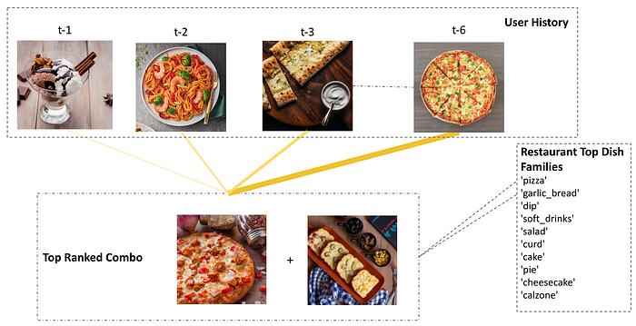
*Figure 1 Top-ranked combo for a user based on their recent history*

Our contributions are as follows. First, we show that FoodNet not only significantly beats the traditional Apriori baseline but also improves upon Siamese network and Transformer based approaches. Second, we present an ablative study where we show the impact of adding various feature heads, attention unit and monotonic constraints on the NDCG of the ranked list of combos. Third, we show qualitative inferences from analyzing the recommended combos by inspecting historical orders and visualizing the attention scores.

## Training and Evaluation Data

Customers on our platform generate millions of carts, where a given cart represents a list of dishes. Before we can explain the pre-processing steps, we briefly explain a few nuances around our data. In this paper, we are mainly concerned with ranking combos consisting of exactly two dishes, since two-dish combos are the most popular on our platform. However, a significant percentage of historical carts in our dataset do contain more than two dishes. Since our model scores dishes in a pairwise fashion, we generate training data by creating multiple combinations of two-dish pairs from the original carts. Secondly, multiple dishes may belong to the same dish category. For example, a single restaurant may offer different kinds of pasta. However, the exact dish name may vary. We rely on our in-house food taxonomy to provide a way to categorize the dishes. We call such a category the ‘Dish family’. For instance, both white-sauce pasta and red-sauce pasta will map to a dish family ‘Pasta’. Similarly, the carts typically also contain dishes from multiple dish families. Since we are explicitly solving for meal combos, we prune carts based on the dish family. That is, we explicitly filter out carts where both the dishes map to the same dish family. The remainder of the two-dish carts acts as positive samples (labeled 1). We obtain negative samples by replacing any one dish in the cart with a random dish belonging to the same restaurant (labeled 0) for a given customer. Using randomly sampled carts from other users as negative samples, was another approach we tried and discarded. Our intuition is that this approach introduces more noise and does not help learning. After pruning and negative sampling, we further sample about 2 million data points for training.

We use multiple features across customers, restaurants, and dishes as input to our model. For each training sample, we collect names and dish families of each of the dishes added to the cart. We also collect the user’s history (history before the specific training sample to avoid data leakage) as an array of previously created carts. Each historical cart in itself corresponds to an array of dish family categories. All the dish families belonging to a cart are encoded as 1, and the rest as 0. Such a feature encoding allows our model to take into account the sequence in which the carts have been created by the user, and also encode each created cart in the sequence as a fixed length embedding. Each restaurant has its specialty of dishes, and capturing this information is vital to learning about the restaurant. Hence, we add the top 10 most popular dish families ordered from the restaurant over a 2 month period, as features.

We use the carts created and dishes ordered from a dense geographical area within a large city in India as our evaluation dataset. We then generate a set of all possible two-dish combos using the same pruning strategy used to construct the training set. Our total evaluation set consists of about 200 million <dish pairs, user history, restaurant features> triplets. For each sample in this set, there is a target label (0/1) that indicates whether the given dish pair was added to cart by the user.

## FoodNet

In this section, we discuss multiple baseline approaches and compare them with the proposed FoodNet architecture.

### Baselines and Feature Heads

**_Straw-man Approach_ **Apriori is an algorithm for frequent item-set mining and association rule learning over transactions. Confidence score is one way to measure association. We pre-calculated the confidence score for different item pairs using our training dataset. During evaluation, for each cart, we use this confidence score and rank the item pairs in decreasing order of their scores.

**_Siamese Dish Pair_ **Siamese networks are effective in identifying complementary items. To embed dish pairs, we use a subword tokenizer to convert dish names to unique numerical representations and feed this to a common embedding layer. That is, both dish names are embedded by shared weights. For each dish name item 1 and item 2, we take the average of the embeddings of all tokens of each dish to get final representations i1_r and i2_r respectively. We then concatenate the two embeddings while also augmenting by taking the absolute difference and element-wise product of the two. This combined representation helps the model converge faster as complementary behavior between embeddings can be captured more efficiently by pre-computing these operations. We then pass this combined representation through a dense layer followed by a final output softmax layer as shown in Figure 2.

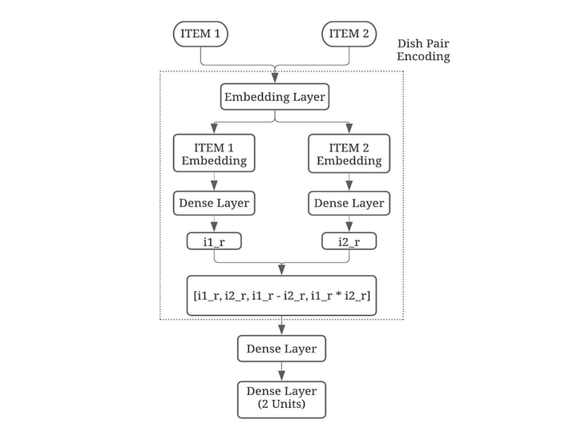
*Figure 2. Architecture diagram for the Siamese Dish Pair head*

We visualize the embeddings of a few dishes, learned from the dish names alone, using a tSNE plot as shown in Figure 3. This plot is colored based on the dish family the dish belongs to. We can see that the learned representations are such that similar dishes are clustered together in this space. The _Pizza_ cluster circled in orange consists of dishes like cheese-burst pizza and margarita pizza while the _Shake_ cluster circled in red consists of dishes like chocolate thick shake, strawberry milkshake, etc. We can see that the dishes in these two clusters are closely spaced and the clusters are well separated. Complementary behavior is likely captured in the dense layers after concatenation of the dish embeddings. However, there are errors in some clusters, likely because dish names alone are not sufficient to discern their differences.

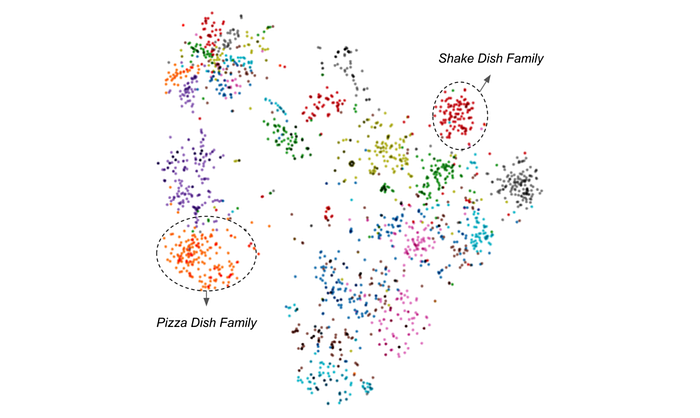
*Figure 3. Dish Embeddings tSNE plot*

**_User History Head_** Although the Siamese model is tuned to capture complementary behavior, it is not personalized. In order to add personalisation, we aim to capture user’s ordering patterns by using their cart history. Bi-LSTMs are effective as they model sequences in both forward and backward directions. Our objective is to model user preferences through this encoding of sequences.

In order to validate the efficacy of this head, we experiment with training a sequence model with the user history in terms of the dish family added to the cart. We encode each user cart as a fixed length array where all dish families added to cart are ones and the rest are zeros. We also experiment with encoding each dish family as a separate embedding and take the mean of all to represent the cart. We train this head to predict the next dish family that the user will add to the cart given the user’s historical record of the carts’ dish families. We trim this record to about 104 most frequently ordered dish families at the output node and train the model with the architecture as shown in figure 4. As shown in the figure, we finally use the one hot encoding of dish families instead of using an embedding layer and averaging, as the former approach gives us marginally better results with a lesser number of training parameters. We use a stacked two-layer Bi-Directional LSTM with 256 hidden units, and a final output head with 104 neurons and softmax activation.

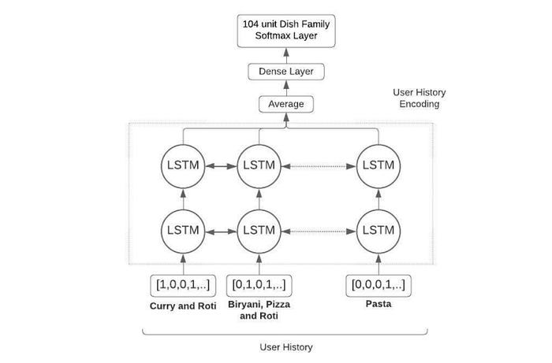
*Figure 4. User History Encoding Model*

This model achieves nearly 60% improvement in accuracy on an unseen validation set when compared to the baseline of the user’s “most preferred” dish family from historical sessions. This verifies our hypothesis that a sequential model such as this can understand the user’s preferences for a certain dish family(s) given the user’s history.

**_Restaurant Features Head_ **In our data, we also observe that users’ ordering patterns are also dependent on the restaurant’s features, primarily, ‘what dishes does the restaurant serve well?’. Hence, the final user preferences are a combination of what the user likes and what the restaurant serves well. We capture this by using the restaurant’s top 10 dish families by order volume as measured over a 2 month period. These features are encoded into a 128-dimension vector using a single dense layer with ReLu activation. From our experiments we verify that a single dense layer is sufficient because restaurant features are cross-sectional in nature and a shallow NN is easily able to encode this information.

### Composite architectures

We propose a few composite architectures based on the feature heads described so far. First, we collect results using the Siamese architecture taking dish pairs as input. As shown previously, this _Siamese Dish Pair _model learns representations that encode complementarity of dishes. Second, we use the user history features as encoded using Bi-LSTMs in Figure 4, along with the _Siamese Dish Pair_ model to add personalization. We refer to this architecture as _Siamese_ _Dish pair+UH(Bi-LSTM)_. Finally, we add the restaurant features and use all features together to create the _Siamese Dish pair+UH+RF _model. In addition to this, we also experiment with an attention based transformer instead of Bi-LSTM to encode user sequences, we refer to this model as _Siamese_ _Dish pair+UH(Transformer)_. We show in Section 5 that this transformer based user history encoding performed poorly in comparison to Bi-LSTM in terms of NDCG and MRR. We hypothesise that Bi-LSTM works well for our use-case as the length of user’s history is at most 20 while the transformer based networks are shown to work better than LSTMs primarily for longer range interactions. Hence, for our final model architecture (FoodNet) we evaluate and show results with Bi-LSTMs for encoding user history.

### FoodNet

We propose two key additions to the _Siamese Dish pair+UH+RF _model. We note that in the** **_Siamese_** **_Dish pair+UH+RF _model, the user history representation would give equal weightage to the hidden states of each timestep in user history, since it takes a simple average over all hidden states. However, if the user history representation was cognizant of dish pairs and restaurant features, it could potentially have assigned different weights to individual timesteps. To model this, we add an attention unit to the _Siamese Dish pair+UH+RF _model.

Here, a concatenated representation of unweighted user history, dish pair representation, and restaurant feature embeddings are used to generate attention scores that are then multiplied element-wise with the user history to weigh each timestep. The updated user history representation is now a weighted average of each timestep. These attention values can be visualized and add a layer of explainability to our model.

While the attention scores capture the differential importance of time steps in user’s history, they don’t quite capture the aspect of diversity (or entropy) in user behavior. That is, a section of users predominantly explore instead of mostly repeating what they have ordered before. Essentially, this means that the user’s historical order behavior carries less information when the user’s order diversity is high. To model this, we add ‘_diversity factor’_ as a feature. Diversity factor is defined as the ratio of the number of unique dish families ordered and the total number of orders. Higher diversity factor indicates that the model must pay lesser attention to the user’s history and vice versa. We add this feature as input to the Tensorflow Lattice layer and set the constraint to be monotonically decreasing. This ensures that an appropriate decreasing function is learned, as shown in Figure 5, instead of manually defining a suboptimal scaling factor. We call this final architecture FoodNet, as shown in Figure 6.

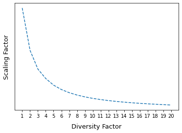
*Figure 5. Variation of scaling factor of user history against diversity through learnt lattice constraint*

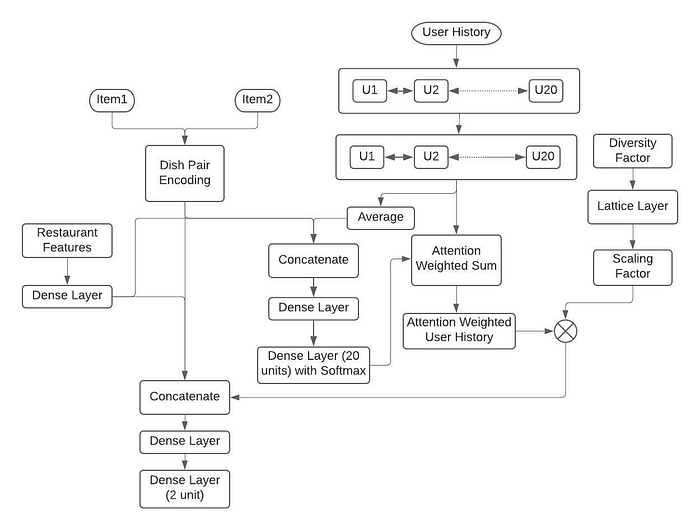
*Figure 6. FoodNet model architecture*

### Training and Inference

Our dataset of 2M samples is split in a 80–20 ratio for training and validation. All the architectures were trained and optimized for offline metrics of AUC and PR-AUC and experimented with various regularization techniques and parameters. A dropout rate of 0.5 was added to all the dense layers. All weight matrices were randomly initialized using Xavier initialization and an Adam optimizer with a learning rate of 2e-4 was used to train the model with softmax cross-entropy loss. The loss convergence plots are as shown in Figure 6.

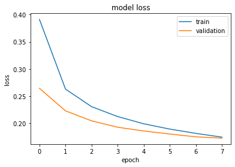
*Figure 7: Convergence Plot for final architecture*

For inference, as mentioned earlier, we create the candidate set of dish pairs from a dense geographical area. In order to control the cardinality of possible combos, we apply pruning based on the rules discussed in section 3. We also further filter on combos that have been ordered at least n times in the last 1 month’s time, for final candidate generation. These candidate samples are ranked by the proposed models and this ranked list of combos is then used for evaluating the models as discussed in Section 5. Training and inference flow is as summarized in Figure 8.

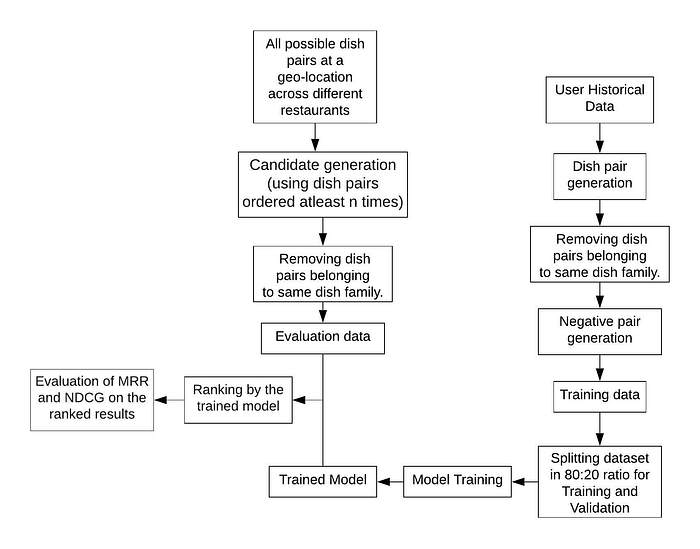
*Figure 8. Training and Inference Flow Chart*

## Evaluation And Results

We rank the candidate combos based on the probability scores as inferred by the various architectures described. Popularity-based ranking is our _naive_ baseline while the Apriori is a more credible baseline. The goal is to compare the ranked lists generated by each of these architectures in terms of relevance to the user. We evaluate the rankings at a session-level since the user history changes over time. For every session, we know the actual cart created by the user. We mark possible combos from all such carts as relevant for the corresponding sessions, for the given customer. Correspondingly, we calculate the position of these relevant carts in each of the ranked lists to obtain the MRR and NDCG metrics.

Table 1 shows results when the model was trained from scratch (randomly initialized) across the different architectures described in Section 4. We note that the additional context information of user history and restaurant features improve the performance of the model, reaffirming that personalization helps in the overall ranking for combo suggestions. We also note that FoodNet is the best performing model overall in terms of both NDCG and MRR. It also has the highest AUC and PR-AUC. We can also see that the attention unit and diversity scaling in FoodNet has not only helped us add explainability to the model but also in improving NDCG over the Siamese _Dish pair+UH+RF _model. In comparison to the _Siamese Dish Pair_ baseline model, FoodNet achieves a lift of 13.6% in NDCG.

For high-diversity users, (i.e., diversity factor >=4), we see a 1.1% lift in NDCG with FoodNet vs. the _Siamese Dish Pair+UH+RF _model. This is likely due to the constraints enforced by the diversity scaling. We show some qualitative samples in the next section.

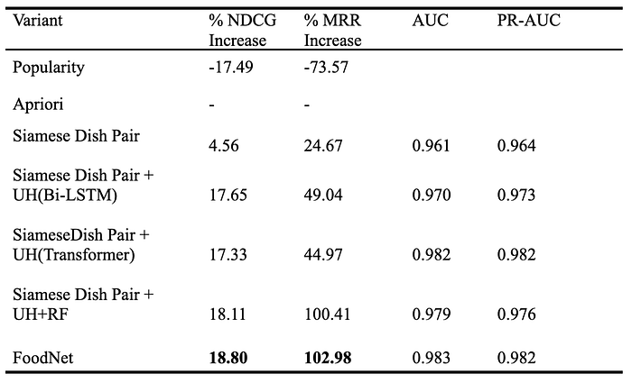
*Table 1. Percentage growth compared to apriori baseline*

We also observe that the length of the available user history impacts the model performance. Figure 9 and Figure 10 show percentage growth in MRR and NDCG compared to the _Siamese_ _Dish Pair_ model as a function of bucketed user history sequence length. Both NDCG and MRR improve as the number of orders in the user history increases. At the highest point (15–20), we see over 11% lift in NDCG and nearly 100% lift in MRR as compared to the Siamese Dish Pair model that doesn’t take any user history as input.

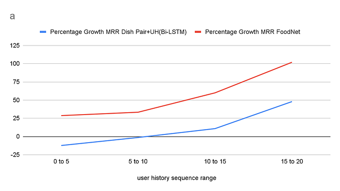
*Figure 7. Percentage growth in MRR for Siamese Dish Pair+UH(Bi-LSTM) and FoodNet model vs. the Siamese Dish Pair Model*

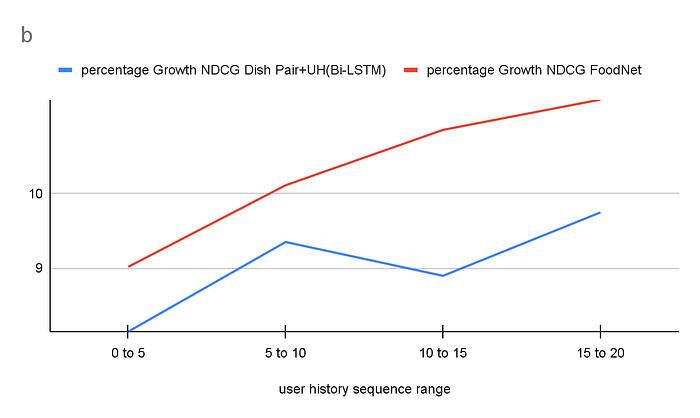
*Figure 8. Percentage growth in NDCG for Siamese Dish Pair+UH(Bi-LSTM) and FoodNet vs. the Siamese Dish Pair Model*

**Qualitative Analysis**

We look at a few top-ranked combos from FoodNet and qualitatively analyze them. As can be observed from Table 2, the top-ranked combos intuitively make sense given the user history as well as the restaurant’s top 10 dish families. The last two highlighted combos show up as top recommendations for the same user. For this user, FoodNet highly ranked two widely different combos. One of them is a Pizza and 7Up combo, which likely stems from the fact that pizza is popular for that restaurant and it was ordered by the user recently (t-2). The second combo is a Biryani and an apt chicken starter for this dish, Chicken 65. This is likely due to the fact that the user’s recent history contains Biryani and the restaurant’s top dish families are Biryani and dry starters.

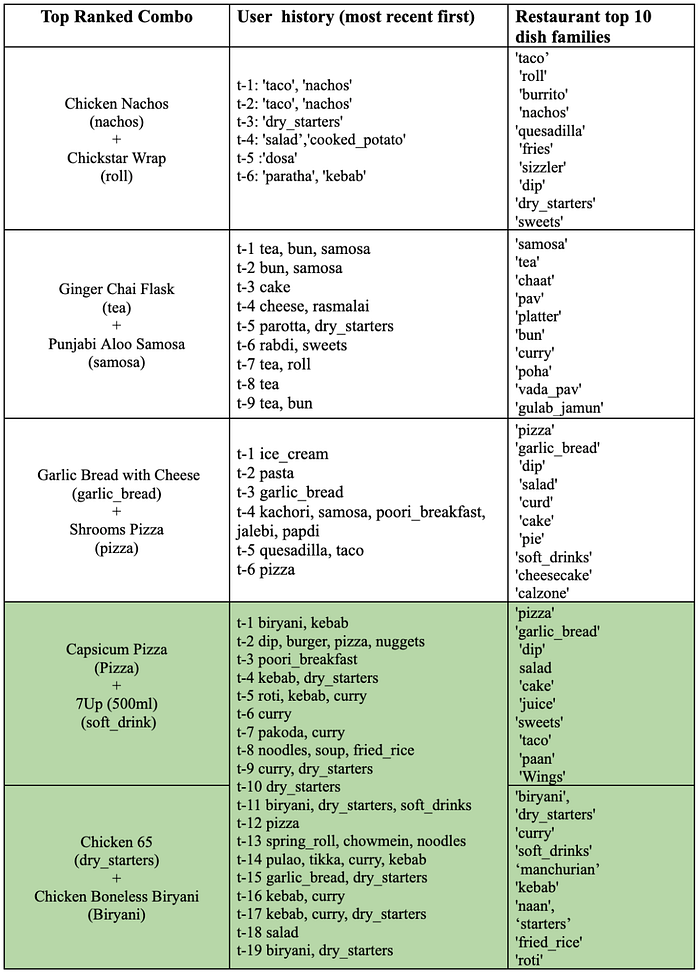
*Table 2. Qualitative results from FoodNet*

As discussed in Section 1, we can visualize the user history weights using the attention score to understand which parts of the user history the model pays more attention to. In Figure 11, we show the attention weights from the last two examples and visualize how the attention scores vary for the same user depending on context. The red bar represents the attention scores for each historical timestamp for the _pizza-softdrink_ combo and the green bar represents the same for the _biryani-starter_ combo. We can see that for the _biryani-starter _combo, the model paid high attention to orders that contained biryani and other starter items. Correspondingly, for the _pizza — softdrink_ combo, the model had high attention weights for pizza. This confirms our hypothesis that the model weighs user history based on the combo it’s scoring for. We can also see that there are relatively high peaks for history consisting of curry in red and salad in green, even though these dish families don’t exist in the combo. This is likely because these dish families are top dish families for the restaurants of their corresponding sessions. This shows that both the user history and restaurant features are weighed while computing attention values.

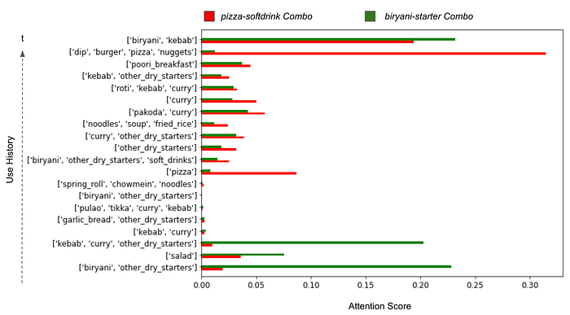
*Figure 11. Attention scores for each timestep in user history for two top-ranked combos for the same user*

We also show some contrasting ranking samples from FoodNet vs. the _Siamese_ _Dish Pair + UH + RF_ model for users with high diversity.

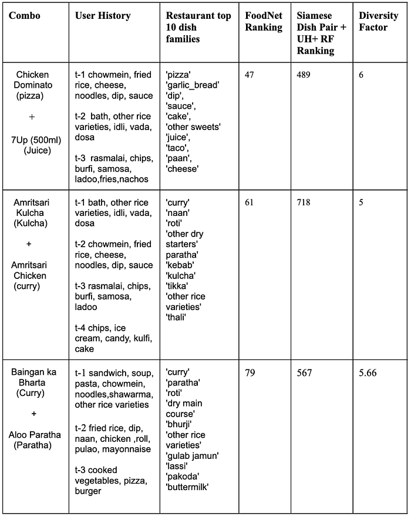
*Table 3. FoodNet vs Siamese Dish Pair+UH+ RF*

As shown in Table 3, for all these users, order history was widely diverse. FoodNet ranks the valid sample (which was actually ordered) much higher compared to the _Siamese_ _Dish Pair+UH+RF_ model because the contribution of user history was scaled down owing to the high diversity in them.

## Conclusion

In this work, we discussed the problem of personalized food combo recommendation. We introduced FoodNet, a deep learning model that recommends two-item combos from across different restaurants.. To the best of our knowledge, our approach of coupling attention with a monotonic constraint of diversity to encode exploratory behaviour is novel for food combo recommendation, as well as for the general task of bundle recommendation. We experimented with several architectures and showed that FoodNet outperforms Siamese and Transformer baselines, apart from the traditional Apriori approach. We discussed how the proposed approach not only performs better, but also adds a layer of explainability using attention. Finally, we show a few qualitative examples to drive home the effectiveness of FoodNet for ranking personalized combos.

In future, we plan to extend FoodNet to more than two dish combos. This would involve generating positive and negative three dish combos from user carts and adding a third input layer.This new architecture could essentially supersede the current FoodNet model when the third input is padded for two dish samples and trained with an approach similar to the one described in this paper. We also plan to compare the current discriminative architecture with a generative approach using architectures like GANs. Further, we plan to leverage FoodNet for recommending complementary dishes when an explicit context has been provided by the customer. Since the current architecture supports scoring pairs of dishes, use cases like cross-sell can easily employ the same architecture.

---
**Tags:** Data Science · Swiggy Data Science · Deep Learning · Foodtech · Machine Learning
