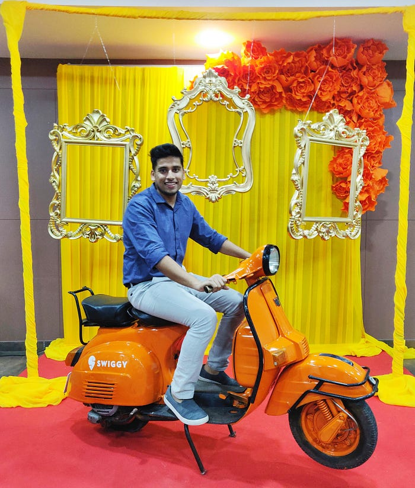
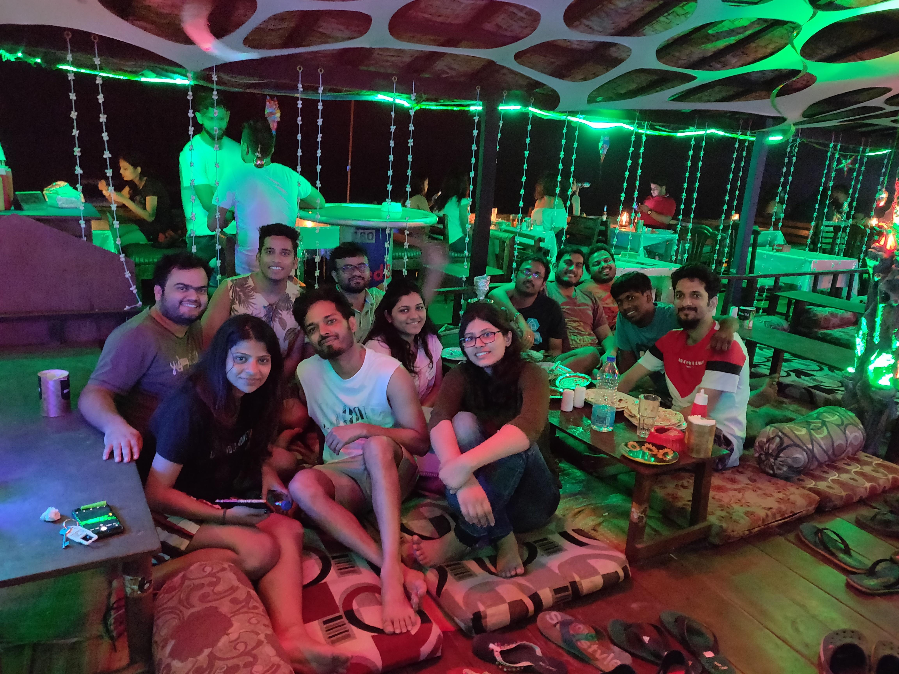
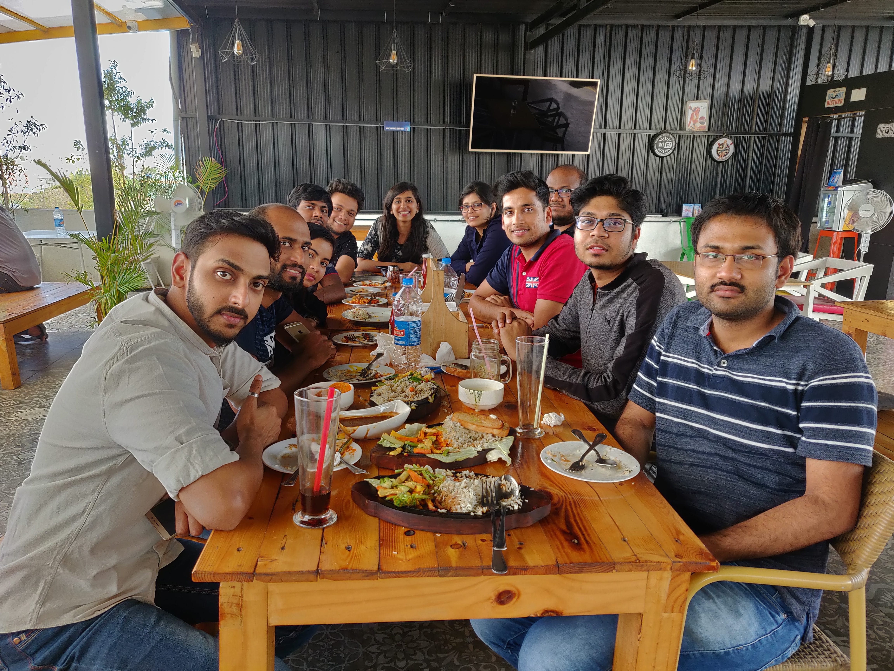
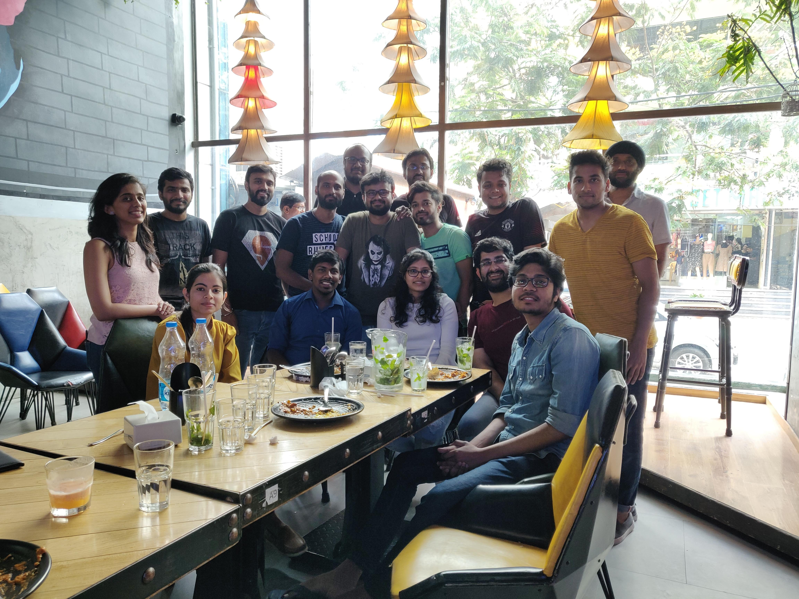
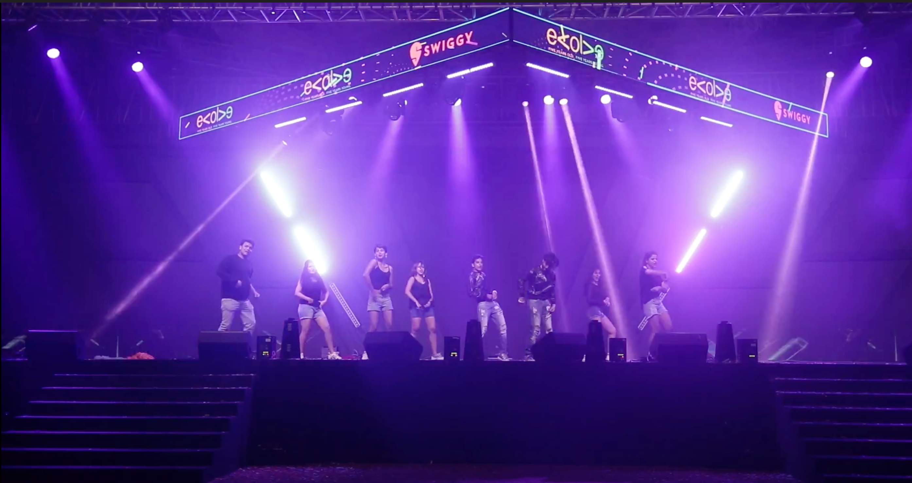

# Forever Learning: Here’s one software engineer’s journey that grew phenomenally along with Swiggy

From the time he landed his first internship in 2013 to the time he joined Swiggy as a level 2 software engineer and got promoted to level 3, for **Yash Khandelwal**, the learning has never stopped. Currently juggling his Masters in AI along with his career, Yash might be working on a tight schedule, but he’s enjoying the ride and the view.

He talks to us about his role, what makes Swiggy an “amazing” place to work at, how he’s seen his team grow from 20 engineers when he first started to 100 today. Here’s a sneak peek into the life of an SDE3 at Swiggy.

**1. Let’s go back to the start. Tell us a bit about what you studied and where your career journey began.**

It all began in the summer of 2013. I was immersed in my projects, exams while pursuing BTech in Computer Science and Engineering at MNNIT, Allahabad. Fortunately, I landed an internship opportunity with Qualcomm in Hyderabad. That was my first exposure to the corporate world. I was part of the Multimedia team, where I learnt how to render media on smartphones, analyse media crashing reports, and best coding practices. I also got an opportunity to experience the whole software development life cycle from the project inception to its planning, development and production rollout. I still remember the exhilaration I felt after my first code push into production. Over the course of two months I became aware of the kind of professional life I would be stepping into down the line.

**2. You did a few interesting things in the time between your first jobs and joining Swiggy. Tell us about it.**

After completing my graduation, I joined Oracle as a software engineer in the new cloud team developing PaaS platform. Since a new platform was being developed, I got to experience first hand what goes into the development of a new product. Understanding the legacy code and building new functionality gave me the opportunity to work with senior engineers and learn from them.

Then came a turning point after 1.5 years, I joined a startup — Sprinklr, which turned out to be an altogether different experience. It was nothing like what I had experienced so far. In the very first week I was sailing against the high tide dealing with complex problems in a pacey environment. Late nights at the office and working weekends was a regular affair. Ultimately, it proved to be a solid foundation for my career, there I was able to build a strong base, learnt not only technical skills but also got a good grasp of the startup culture, and a true agile way of working. I was equipped to take on even bigger challenges. One fine day I got a call from Swiggy and here I was after a month.

**3. Tell us about your journey at Swiggy, you’ve been here for close to four years, how did it start and how is it going**?

I joined Swiggy as a software engineer in the delivery team, which had just about 20 odd people. As the company was gearing towards achieving 300k orders per day we were tasked with scaling up our delivery services, optimising database latencies and monitoring the system closely.

Now 300k may seem trivial, but back then it was a big deal and we achieved that much ahead of the targeted timeline. Then I moved to a new team that was carved out within the delivery pod to develop and enhance our serviceability logic. I worked on developing an ETA prediction service providing more accurate ETA to our customers. Working on something that has a direct bearing on providing better customer service is always fulfilling.

As business increased, the team grew and now we have about 100 engineers in our pod. Currently, I am part of the delivery platform team which is a logistics platform that handles delivery of food, groceries, meat, alcohol and other Swiggy services. Our aim is to enhance the capability for multi-fleet availability for all kinds of services Swiggy provides.

After all these years of working as a coder, I now like to get involved in formulating product requirements. It’s important to bring in an engineer’s perspective to the table to deliver a product which is efficient, scalable and flexible to onboard new requirements.

**4. Tell us a little about your team and your overall experience through this period.**

One can only go so far without the support of their mentors, managers and peers. I got a chance to work with some of the most amazing folks at Swiggy.

One of the best parts of working here is that you can state your opinion without any fear of being looked down upon. I got to own and lead projects while working as a team with my peers. Working in a remote setting is not always straightforward without the support of your teammates. Everyone is willing to help out if you are stuck with an issue. We wouldn’t be able to deliver such complex projects if we didn’t have a healthy work environment.

*Snapshots from Yash’s journey at Swiggy*

**5. Give us all the details of an SDE3’s life and of course, the Swiggster life in general.**

Overall, It’s been a deeply gratifying experience of four years of working in Swiggy. I have seen the company grow from 100k orders per day when I first joined to today where that number has grown massively. When I look at my own journey I see a similar trajectory of growth. As an SDE3, I have had the opportunity to lead and deliver some of the most complex and highly visible projects. Working with a talented team of engineers, product and program managers has been a rewarding experience. This journey would not have been so fruitful without the support of my managers and leaders.

Work meetings, team outings, and countless _chai-pe-charcha _are some of the best moments I have had in the last few years and I have established some good relationships.

To top it all, for the first time in my life I even danced on stage at the Swiggy annual fest. The best aspect of being a Swiggster is that you are encouraged to learn, grow, and participate in any area of your choice. Swiggy has provided me with the opportunity to pursue a Masters degree majoring in AI from IISC Bangalore to further my career growth. So you can see the investment Swiggy is willing to make.

**6. Any projects or experiences that are especially close to your heart?**

I would choose the DE assistance project that enables our delivery partners with better capabilities for any kind of assistance they need while delivering orders. It started as a tech initiative by me with inputs from the product side and the proposed changes completely revamped any DEs experience for assistance.

Technically, it is one of the most complex projects I have worked on in Swiggy. Not only from a coding and designing perspective but analysing the feature from a product lens, finding a solution for long term use cases, figuring out all the cross-team dependencies and working with them to deliver it within tight deadlines.

I had invested a lot of time and effort in it. But most importantly, it was gratifying for me as it directly impacts lakhs of delivery executives making their job easier so they can provide better services to our customers.

**7. What’s a lesson (or more than one) that you think would help aspiring engineers?**

I can’t emphasise enough to keep your fundamentals strong. You have to know algorithms, data structures and more, to provide a solid basis for solving new problems. The second thing is to find your calling — figure out what you enjoy working on and seek mastery of it, so much so that you become the go-to person for anything related to that topic. Also keep an eye out for the latest happenings in the tech world.

**8. What advice would you give someone who wants to join Swiggy at an SDE3 level and in general? What are the key things they need to know?**

Getting through the initial months after joining can be a bit overwhelming, with new requirements coming in and meeting deadlines. But the key is to focus and most importantly ask questions. Swiggy is your oyster and the avenues for learning and growing here are plenty. Being an SDE3 is not just about writing code, it’s about connecting pieces of a jigsaw puzzle. A large amount of time is spent on discussing projects, evaluating designs , solutioning, scoping out and mentoring your juniors.

There have been several occasions when I had to work closely with other teams and even work on their codebase adding to my growth at an org level. Other important points that don’t get enough attention are acquiring good communication skills, being able to sell your ideas and solutions can be a big part of your success as an SDE3. And not just about speech, it helps in documenting your solutions better.

---
**Tags:** Swiggy Life · Employee Experience · Software Engineer Life · Stories And Culture · Interview
