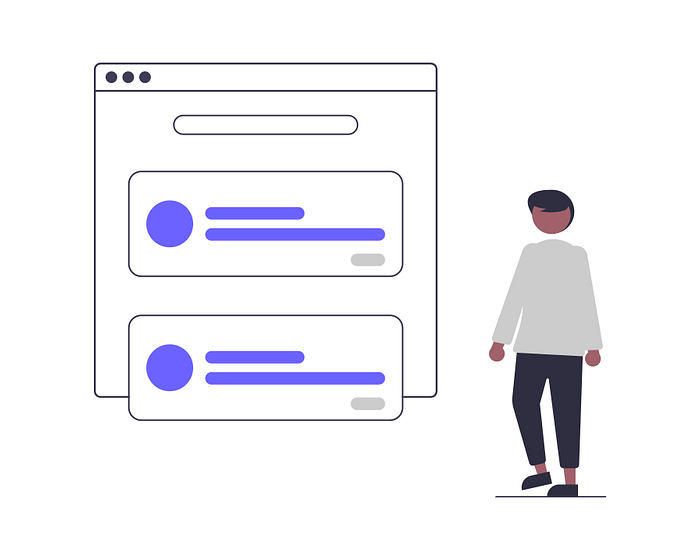
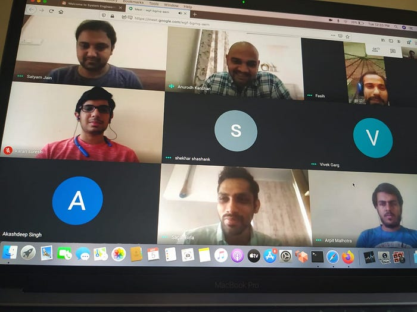

# From an event to an internship — My journey with the Swiggy Tech Team.

*Source :- undraw.co*

Back in 2018, I attended an event in which the CTO of Swiggy was a presenter. He spoke about the brand’s tech journey from **a wordpress website to an AI-first company**. It was on that day that I was inspired to join and work at Swiggy. I immediately went to LinkedIn, sent multiple connection requests to Swiggsters, in the hope that they would become my colleagues some day.

Two years later, in January 2020, I managed to get a referral via a Swiggster (employees as we know them at Swiggy). Within a week, I got a call from the Human Resources team, and here is my experience from there on…

**Navigating Through The Interview**

I was first scheduled for a telephonic interview round. As with most folks during interviews, I was extremely nervous, and ended up sharing completely incorrect answers to what was thrown at me. But sensing my nervousness, the interviewer calmed me down. In my head, and throughout the interview I was hoping for two things:  
1. I get selected for this internship  
2. I get to work with the interviewer

> The Goddess of Fortune was kind to me, and soon enough, both my wishes were granted. Within a week, I got my offer letter. I was all set to join my dream organization from the month of May.

*Onboarding*

**Getting onboard the Swiggy tech wagon**

The world was still warming up to the new, remote, pandemic-induced work culture, but the HR team did a great job in providing a seamless onboarding experience. We had week-long bootcamp initiation sessions where we could interact with the tech leadership team of Swiggy. We were given an overview of each domain within Swiggy, and that was, personally, super exciting. It was also a great opportunity for me to touch base and interact with other interns who joined with me.

**The internship saga**

I was assigned to the System Engineering Team at Swiggy. The focus area for this team is cloud computing, security and implementation of the devops methodology. We** **build platforms and services that provide a secure, scalable and simplified process for deployment of a service developed by any product team of Swiggy.

*First Interaction with the System Engineering Team*

While working with this team I was not only able to expand my developer skill set, but also identify my strengths as a problem solver and apply them to create a product that could make a real difference.

At Swiggy, each intern is also assigned a mentor, who supports them through their stint. I worked under some stellar mentors who gave me clear direction at every step of the way, helping me understand the best practices and nuances in coding and architectural patterns. The mentors will help you identify the right opportunity for you and sometimes even create one.

I gained a good proficiency on cutting edge technologies like cloud computing. I got a deep understanding of how CI/CD works. My key takeaway from the interaction with the mentors and leaders at Swiggy is their commitment to quality and customer experience.

> Aristotle once said, “Quality is not an act it is a habit”.Thanks to this internship I was able to imbibe the habit of writing quality (architecturally correct) code.

---
**Tags:** Internship · System Engineering · Tech · Swiggy Life · Employee Experience
