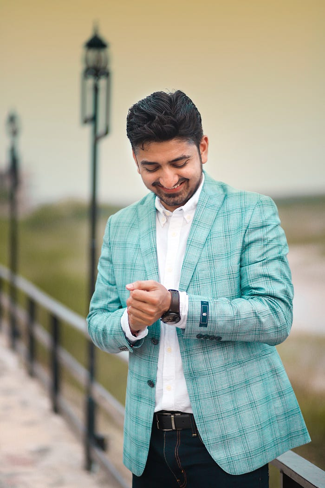
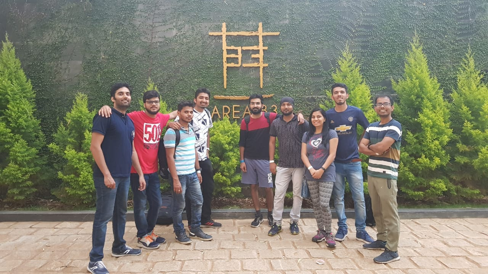
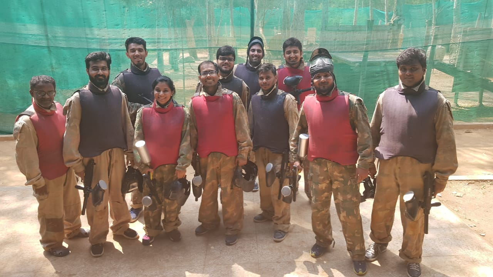
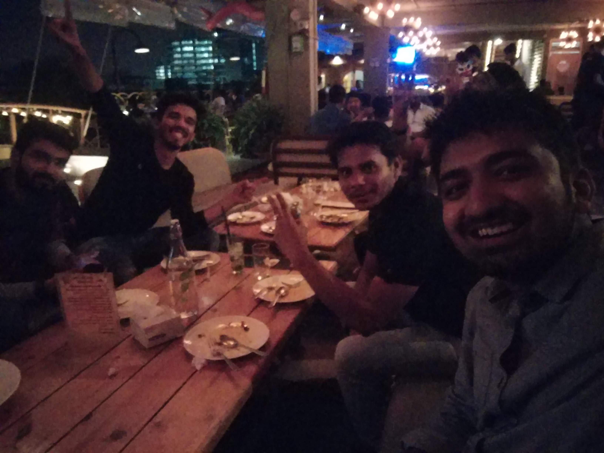
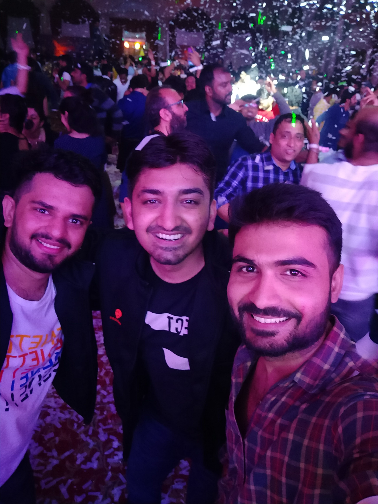
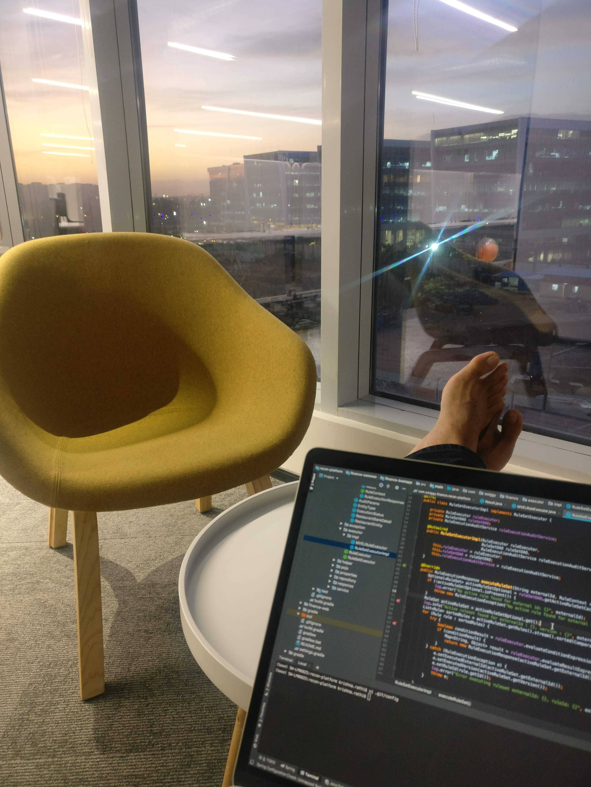
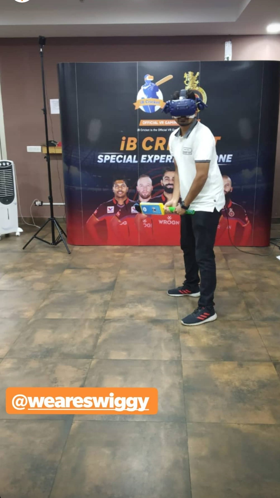
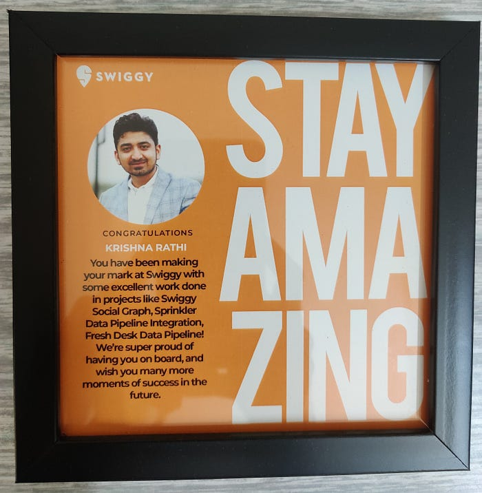

# From SDE1 to SDE3: An interesting rollercoaster ride at Swiggy

Krishna Rathi, an engineer at Swiggy, believes in creating his own path, because following crowds is not for him. That clearly reflects in his work and attitude towards life. From an SDE1 in 2019 to where he is today, Krishna has come a long way. But that isn’t enough, read on to find out how he strives to do better than what he already did and continues to make strides in every project he steps into. Here is his journey -

1. **Let’s go back to the start. Tell us a bit about what you studied and where your career journey began.**

I graduated from Birla Institute of Technology, Mesra, Ranchi in 2017 with a BE in Information Technology. Over the course of my four years of engineering, I made it a point to explore as much as I could by taking part in debates, symposiums, dramatics, college _nukkad_ and co-organising national level literary festivals. Getting to be a part of the college placement cell and a full-hearted but unsuccessful attempt to form the Finance and Economics Society at my alma mater are some of the experiences that will stay with me forever. I’m lucky to have been conferred the prestigious Paramahansa Yogananda Scholarship in my second year at college which sowed the seeds of creating one’s own path.

My first real world exposure into the world of computer science came with my summer internships at IIT Patna and Amazon in my sophomore and junior year respectively. The successful pursuit of Chartered Financial Analyst (CFA) Level 1 Examinations in my last semester instead of pursuing a six month software engineering internship was one of the calculated risks I took which paid off. It provided me with a head start to my finance journey starting in 2016 and made me more aware of what finance professionals do.

**2. You did a few interesting things in the time between your first job and joining Swiggy. Tell us about it.**

*“Smile on the face. Aspirations in the mind. Courage to persevere. Hope in the heart. Such is the SACH of my life.”*

Post my graduation, I started my journey as a software engineer with Societe Generale which is a French investment bank. I was part of the technology team of the Finance and Risk Management (FRM) charter which brought me to the intersection of finance and technology and proved to be a great learning experience. Listening to leaders from France and getting to know the French working culture diversified my perspective in several ways.

Working with a team of new joiners and getting a podium finish in one of the hackathons in the very first week was a confidence booster. I was able to make a mark by taking part in many such events during the course of my stay there. In addition to that, I signed up for a number of finance based learning sessions which fueled my interest in the domain.

Understanding the tech stack and doing my first release to add critical functionality on one of the dashboards made way for handling timelines independently and owning the development to deployment journey eventually. Interacting with colleagues in Paris and Toronto to discuss the requirements and getting things done gave me the kind of exposure I wanted from a global bank.

**3. Tell us about your journey at Swiggy, you’ve been here for close to three years, how did it start and how is it going**?

It was 22nd October, 2018. I vividly remember my onsite interview with Swiggy at IBC Knowledge Park. The moment I entered the premises on the 9th level, I could feel the energy and the enthusiasm on the floor and within the folks out there. Calling the energy infectious would not be an overstatement. And, as luck would have it, the interviews went well and I finally got the chance to join the organisation. I even gave other company interviews a miss once I received my offer from Swiggy.

When I joined, I got to know that I would be part of a new team. Within the first week, I was exposed to the tech stack here and was already interacting with multiple teams and business owners to understand the requirements. I even got an MVP Award (Most Valuable Player) for delivering the feature in my first month which was the icing on the cake.

I had realised that people here are always willing to help and that effective communication is a key enabler. Now, as I near my three year stint here, I feel that this is the one thing that continues to thrive and shape Swiggy’s culture as it evolves. From the ceremony at the office celebrating 100 cities in March 2019 to serving 500+ cities now and the launch of new business lines like Swiggy Genie, Swiggy Instamart, the acquisition of Supr Daily all happened within the last 2.5 years and I have been a witness to it.

From SDE1 to SDE3, the journey for me has been a roller coaster ride with a steep learning curve and a culture that encourages individuals at each step.

There is a strong sense of ownership, there is learning, there is bias for action, there is an enabling atmosphere, there is growth and, last but not the least, an unadulterated desire to make an impact.

**4. Tell us a little about your team and your overall experience through this period.**

I am a founding member of the Trust and Safety (TNS) team which is responsible for preventing abuse on the platform. As the name suggests, the team aims to uphold trust of genuine users on the platform by identifying the entities that engage in abusive transactions.

The team builds systems that directly influence what capabilities are available and to whom based on the past behavior of the entity e.g. availability of a payment instrument or eligibility for refund and cancellation. If you see, there is a lot of responsibility in terms of being accurate in our decisions. As part of the TnS charter, we also provide platforms to the relevant stakeholders and create an end to end pipeline for the analysis of transactions and subsequent actioning. The team started with two members and has now scaled to 16 which in itself is a 8x growth. The beauty of the team is that experimentation is now in our DNA and we strive to build systems as new modus operandi emerge and take action accordingly by not only relying on a set of business rules but by leveraging machine learning models and graphs to serve our use case.

I have been fortunate to have some amazing managers, resourceful mentors and peers along the way who have influenced me in terms of their thought process and tech skills. Being a part of the TNS team has been a zero to one experience for me where I have been able to learn and grow as an individual.

A developer is the one who moves the needle as they are the closest to the actual implementation. It is imperative for them to be as close to the end user to understand the requirements first hand. I have been lucky enough to be a part of various tech lead projects which gave me a chance to act as a product manager, an analyst and had the opportunity to work with multiple teams at once to drive projects forward. This in itself speaks volumes about the nurturing culture here.

*A glimpse from some of the LIT evenings with teammates*

**5. Give us all the details of an SDE3’s life and of course, the Swiggster life in general from your point of view.**

Swiggy has definitely been leading the way in being a technology-first company and the problems that we solve here as engineers are at par with the western tech giants. At Swiggy, I draw inspiration from Harsha and Dale for the leaders they are and the kind of values they promote in the org which ultimately reflects on every individual here. The open environment and the focus on growth really helps you in being the best version of yourself and with no dearth of talent, you get to learn so much from the team members and the leadership team. The only thing needed is the curiosity to explore new things.

**6. Any projects or experiences that are especially close to your heart?**

This has to be the planning, conceptualisation and implementation of the Swiggy Social Graph. Here we were able to connect different entities in Swiggy, including customers, restaurants and delivery executives with the help of common attributes and form clusters which was a game changer and helped Swiggy save a yearly amount north of $1m.

The beauty of the project was that it was completely tech led and there was ample conviction in the team to take this forward and derive value for Swiggy on an ongoing basis. Being a part of the project from ideation to writing the design documents to productionising it was a profoundly satisfying experience. It planted the seeds of technology even deeper in my thought process by providing an insight about solving ambiguous and open-ended problems and how we can all come together to make a vision a success.

*Moments of leisure at IBC office and ETV campus*

**7. What’s a lesson (or more than one) that you think would help aspiring engineers?**

From my internship at Amazon where I was standing at the altars of the corporate world to having spent over four years in it now, I feel the number of variables we are all exposed to at a point of time are immense. I have learnt that it is in our best interest to only focus on the things we can control and stop wasting energy on the things we can’t.

An unwavering focus on getting the fundamentals right builds a strong foundation. Being practical and flexible by donning multiple hats and learning new skills is also a significant trait to have as we should not lose track of the end goal. A curious mindset is also one attribute that we should start developing at an early stage. Also, communication — both written and verbal is one of the most underrated skills one can have and it is never late to build up on that.

**8. What advice would you give someone who wants to join Swiggy at an SDE3 level and in general? What are the key things they need to know?**

*Always a great feeling to be recognised for the impact I could create.*

At an SDE3 level, we are expected to lead design and development for the team and mentor our juniors to enable them on technical aspects. Championing the operation excellence cause is also part of the job. A solid foundation of data structures and distributed systems with a willingness to learn more about design and architecture is what sets one up for this role. From gathering requirements to solutioning and evaluating the design to delivering the project and taking ownership of the process by getting the job done for the team is what the journey looks like. Understanding the complete scope of a problem and calling out issues when required is certainly a key skill to have. Also, it is crucial to understand the value addition that happens from the changes we make rather than being in a rush to write code.

---
**Tags:** Employee Stories · Software Engineer Life · Career Paths · Swiggy Life · Startups In India
